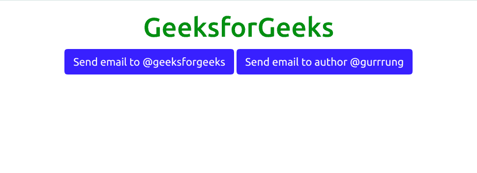

# 自举 5 模态

> 原文:[https://www.geeksforgeeks.org/bootstrap-5-modal/](https://www.geeksforgeeks.org/bootstrap-5-modal/)

Bootstrap 5 是 Bootstrap 的最新主要版本，在该版本中，他们修改了用户界面并进行各种更改。Modals 用于向您的站点添加对话框，用于灯箱、用户通知或完全自定义的内容。模态是用 HTML、CSS 和 JavaScript 构建的。它们位于文档中的所有内容之上，并从中移除滚动，以便模态内容改为滚动。

**语法:**

```html
<div class="modal"> Contents... <div>
```

**示例:**该示例用于显示 Bootstrap 5 中一个模态的工作情况。

```html
<!DOCTYPE html>
<html>
    <head>
        <!-- Load Bootstrap -->
        <link rel="stylesheet" 
              href=
"https://stackpath.bootstrapcdn.com/bootstrap/5.0.0-alpha1/css/bootstrap.min.css"
              integrity=
"sha384-r4NyP46KrjDleawBgD5tp8Y7UzmLA05oM1iAEQ17CSuDqnUK2+k9luXQOfXJCJ4I"
              crossorigin="anonymous" />
        <script src=
"https://cdn.jsdelivr.net/npm/popper.js@1.16.0/dist/umd/popper.min.js" 
                integrity=
"sha384-Q6E9RHvbIyZFJoft+2mJbHaEWldlvI9IOYy5n3zV9zzTtmI3UksdQRVvoxMfooAo" 
                crossorigin="anonymous"></script>
        <script src=
"https://stackpath.bootstrapcdn.com/bootstrap/5.0.0-alpha1/js/bootstrap.min.js"
                integrity=
"sha384-oesi62hOLfzrys4LxRF63OJCXdXDipiYWBnvTl9Y9/TRlw5xlKIEHpNyvvDShgf/" 
                crossorigin="anonymous"></script>
    </head>
    <body style="text-align: center;">
        <div class="container mt-3" 
             style="width: 700px;">
            <h1 style="color: green;">
                GeeksforGeeks
            </h1>
            <!-- Button trigger modal -->
            <button type="button" 
                    class="btn btn-primary" 
                    data-toggle="modal" 
                    data-target="#exampleModal">
                Launch demo modal
            </button>

            <!-- Modal -->
            <div class="modal fade"
                 id="exampleModal">
                <div class="modal-dialog">
                    <div class="modal-content">
                        <div class="modal-header">
                            <h5 class="modal-title">
                              Modal title</h5>
                            <button type="button" 
                                    class="close" 
                                    data-dismiss="modal" 
                                    aria-label="Close">
                                <span aria-hidden="true">
                                  ×</span>
                            </button>
                        </div>
                        <div class="modal-body">
                            GeeksforGeeks
                        </div>
                        <div class="modal-footer">
                            <button type="button"
                                    class="btn btn-secondary" 
                                    data-dismiss="modal">
                              Close</button>
                            <button type="button" 
                                    class="btn btn-primary">
                              Save changes</button>
                        </div>
                    </div>
                </div>
            </div>
        </div>
    </body>
</html>
```

**触发模式前输出:**


**触发模态后输出:**


**工具提示:**可以添加到模态内部。当模态关闭时，内的工具提示也会自动消失。
T3】例:

```html
<!DOCTYPE html>
<html>
    <head>
        <!-- Load Bootstrap -->
        <link rel="stylesheet" 
              href=
"https://stackpath.bootstrapcdn.com/bootstrap/5.0.0-alpha1/css/bootstrap.min.css" 
              integrity=
"sha384-r4NyP46KrjDleawBgD5tp8Y7UzmLA05oM1iAEQ17CSuDqnUK2+k9luXQOfXJCJ4I" 
              crossorigin="anonymous" />
        <script src=
"https://cdn.jsdelivr.net/npm/popper.js@1.16.0/dist/umd/popper.min.js"
                integrity=
"sha384-Q6E9RHvbIyZFJoft+2mJbHaEWldlvI9IOYy5n3zV9zzTtmI3UksdQRVvoxMfooAo" 
                crossorigin="anonymous"></script>
        <script src=
"https://stackpath.bootstrapcdn.com/bootstrap/5.0.0-alpha1/js/bootstrap.min.js"
                integrity=
"sha384-oesi62hOLfzrys4LxRF63OJCXdXDipiYWBnvTl9Y9/TRlw5xlKIEHpNyvvDShgf/"
                crossorigin="anonymous"></script>
    </head>

    <body style="text-align: center;">
        <div class="container mt-3"
             style="width: 700px;">
            <h1 style="color: green;">
                GeeksforGeeks
            </h1>
            <!-- Button trigger modal -->
            <button type="button" 
                    class="btn btn-primary"
                    data-toggle="modal"
                    data-target="#exampleModal">
                Launch demo modal
            </button>

            <!-- Modal -->
            <div class="modal fade" 
                 id="exampleModal">
                <div class="modal-dialog">
                    <div class="modal-content">
                        <div class="modal-header">
                            <h5 class="modal-title">Modal title</h5>
                            <button type="button" 
                                    class="close" 
                                    data-dismiss="modal" 
                                    aria-label="Close">
                                <span aria-hidden="true">
                                  ×</span>
                            </button>
                        </div>
                        <div class="modal-body">
                            <h5>Tooltips in a modal</h5>
                            <a href="#" 
                               data-toggle="tooltip" 
                               title="GeeksforGeeks" 
                               data-placement="right">
                              Hover over me</a>
                        </div>
                        <div class="modal-footer">
                            <button type="button" 
                                    class="btn btn-secondary"
                                    data-dismiss="modal">
                              Close</button>
                            <button type="button"
                                    class="btn btn-primary">
                              Save changes
                          </button>
                        </div>
                    </div>
                </div>
            </div>
        </div>
        <script>
            // Enable tooltips
            var tooltipTriggerList = 
[].slice.call(
  document.querySelectorAll('[data-toggle="tooltip"]'));
            var tooltipList = 
          tooltipTriggerList.map(function (tooltipTriggerEl) {
                return new bootstrap.Tooltip(tooltipTriggerEl);
            });
        </script>
    </body>
</html>
```

**输出:**


**Popovers:** 可以加在情态里面。当模态关闭时，内的波波头也会自动消失。
T3】例:

```html
<!DOCTYPE html>
<html>
    <head>
        <!-- Load Bootstrap -->
        <link rel="stylesheet" 
              href=
"https://stackpath.bootstrapcdn.com/bootstrap/5.0.0-alpha1/css/bootstrap.min.css" 
              integrity=
"sha384-r4NyP46KrjDleawBgD5tp8Y7UzmLA05oM1iAEQ17CSuDqnUK2+k9luXQOfXJCJ4I" 
              crossorigin="anonymous" />
        <script src=
"https://cdn.jsdelivr.net/npm/popper.js@1.16.0/dist/umd/popper.min.js" 
                integrity=
"sha384-Q6E9RHvbIyZFJoft+2mJbHaEWldlvI9IOYy5n3zV9zzTtmI3UksdQRVvoxMfooAo" 
                crossorigin="anonymous"></script>
        <script src=
"https://stackpath.bootstrapcdn.com/bootstrap/5.0.0-alpha1/js/bootstrap.min.js" 
                integrity=
"sha384-oesi62hOLfzrys4LxRF63OJCXdXDipiYWBnvTl9Y9/TRlw5xlKIEHpNyvvDShgf/" 
                crossorigin="anonymous"></script>
    </head>

    <body style="text-align: center;">
        <div class="container mt-3"
             style="width: 700px;">
            <h1 style="color: green;">
                GeeksforGeeks
            </h1>
            <!-- Button trigger modal -->
            <button type="button" 
                    class="btn btn-primary" 
                    data-toggle="modal" 
                    data-target="#exampleModal">
                Launch demo modal
            </button>

            <!-- Modal -->
            <div class="modal fade"
                 id="exampleModal">
                <div class="modal-dialog">
                    <div class="modal-content">
                        <div class="modal-header">
                            <h5 class="modal-title">
                              Modal title</h5>
                            <button type="button" 
                                    class="close" 
                                    data-dismiss="modal"
                                    aria-label="Close">
                                <span aria-hidden="true">
                                  ×</span>
                            </button>
                        </div>
                        <div class="modal-body">
                            <h5>Popover in a modal</h5>
                            <a href="#" 
                               data-toggle="popover" 
                               title="This is GeeksforGeeks" 
                               data-content=
                               "Portal for CS Geeks">
                              Toggle popover</a>
                        </div>
                        <div class="modal-footer">
                            <button type="button" 
                                    class="btn btn-secondary"
                                    data-dismiss="modal">
                              Close</button>
                            <button type="button" 
                                    class="btn btn-primary">
                              Save changes</button>
                        </div>
                    </div>
                </div>
            </div>
        </div>
        <script>
            // Enable popovers
            var popoverTriggerList = 
     [].slice.call(
       document.querySelectorAll('[data-toggle="popover"]'));

            var popoverList =
      popoverTriggerList.map(function (popoverTriggerEl) {
                return new bootstrap.Popover(popoverTriggerEl);
            });
        </script>
    </body>
</html>
```

**输出:**


**使用网格:**我们可以通过嵌套*在一个模型中使用 Bootstrap 网格系统。*内的容器-流体*。模体*。然后，像在其他地方一样使用普通的网格系统类。
**例:**

```html
<!DOCTYPE html>
<html>
    <head>
        <!-- Load Bootstrap -->
        <link rel="stylesheet"
              href=
"https://stackpath.bootstrapcdn.com/bootstrap/5.0.0-alpha1/css/bootstrap.min.css" 
              integrity=
"sha384-r4NyP46KrjDleawBgD5tp8Y7UzmLA05oM1iAEQ17CSuDqnUK2+k9luXQOfXJCJ4I" 
              crossorigin="anonymous" />
        <script src=
"https://cdn.jsdelivr.net/npm/popper.js@1.16.0/dist/umd/popper.min.js" 
                integrity=
"sha384-Q6E9RHvbIyZFJoft+2mJbHaEWldlvI9IOYy5n3zV9zzTtmI3UksdQRVvoxMfooAo"
                crossorigin="anonymous"></script>
        <script src=
"https://stackpath.bootstrapcdn.com/bootstrap/5.0.0-alpha1/js/bootstrap.min.js" 
                integrity=
"sha384-oesi62hOLfzrys4LxRF63OJCXdXDipiYWBnvTl9Y9/TRlw5xlKIEHpNyvvDShgf/" 
                crossorigin="anonymous"></script>
    </head>

    <body style="text-align: center;">
        <div class="container mt-3" 
             style="width: 700px;">
            <h1 style="color: green;">
                GeeksforGeeks
            </h1>
            <!-- Button trigger modal -->
            <button type="button" 
                    class="btn btn-primary" 
                    data-toggle="modal" 
                    data-target="#exampleModal">
                Launch demo modal
            </button>

            <!-- Modal -->
            <div class="modal fade" 
                 id="exampleModal">
                <div class="modal-dialog">
                    <div class="modal-content">
                        <div class="modal-header">
                            <h5 class="modal-title">Modal title</h5>
                            <button type="button" 
                                    class="close" 
                                    data-dismiss="modal" 
                                    aria-label="Close">
                                <span aria-hidden="true">
                                  ×</span>
                            </button>
                        </div>
                        <div class="modal-body">
                            <div class="container-fluid">
                                <div class="row">
                                    <div class="col-md-4" 
                                         style="background: red; 
                                                color: white;">
                                      This is 4 grids</div>
                                    <div class="col-md-8" 
                                         style="background: green;
                                                color: white;">
                                      This is 8 grids</div>
                                </div>
                                <div class="row">
                                    <div class="col-md-12" 
                                         style="background: blue;
                                                color: white;">
                                      This is 12 grids</div>
                                </div>
                            </div>
                        </div>
                        <div class="modal-footer">
                            <button type="button" 
                                    class="btn btn-secondary" 
                                    data-dismiss="modal">
                              Close</button>
                            <button type="button" 
                                    class="btn btn-primary">
                              Save changes</button>
                        </div>
                    </div>
                </div>
            </div>
        </div>
    </body>
</html>
```

**输出:**


**变化的模态内容:**我们可以用下面给出的不同数据触发相同的模态。
T3】例:

```html
<!DOCTYPE html>
<html>
    <head>
        <!-- Load Bootstrap -->
        <link rel="stylesheet"
              href=
"https://stackpath.bootstrapcdn.com/bootstrap/5.0.0-alpha1/css/bootstrap.min.css" 
              integrity=
"sha384-r4NyP46KrjDleawBgD5tp8Y7UzmLA05oM1iAEQ17CSuDqnUK2+k9luXQOfXJCJ4I" 
              crossorigin="anonymous" />
        <script src=
"https://cdn.jsdelivr.net/npm/popper.js@1.16.0/dist/umd/popper.min.js" 
                integrity=
"sha384-Q6E9RHvbIyZFJoft+2mJbHaEWldlvI9IOYy5n3zV9zzTtmI3UksdQRVvoxMfooAo" 
                crossorigin="anonymous"></script>
        <script src=
"https://stackpath.bootstrapcdn.com/bootstrap/5.0.0-alpha1/js/bootstrap.min.js"
                integrity=
"sha384-oesi62hOLfzrys4LxRF63OJCXdXDipiYWBnvTl9Y9/TRlw5xlKIEHpNyvvDShgf/" 
                crossorigin="anonymous"></script>
    </head>

    <body style="text-align: center;">
        <div class="container mt-3" 
             style="width: 700px;">
            <h1 style="color: green;">
                GeeksforGeeks
            </h1>
            <!-- Button trigger modal -->
            <button type="button" 
                    class="btn btn-primary" 
                    data-toggle="modal" 
                    data-target="#exampleModal"
                    data-whatever="@geeksforgeeks">
              Send email to @geeksforgeeks</button>
            <button type="button" 
                    class="btn btn-primary" 
                    data-toggle="modal" 
                    data-target="#exampleModal"
                    data-whatever="@gurrrung">
              Send email to author @gurrrung</button>

            <!-- Modal -->
            <div class="modal fade" id="exampleModal">
                <div class="modal-dialog">
                    <div class="modal-content">
                        <div class="modal-header">
                            <h5 class="modal-title">
                              New message</h5>
                            <button type="button" 
                                    class="close" 
                                    data-dismiss="modal"
                                    aria-label="Close">
                                <span aria-hidden="true">
                                  ×</span>
                            </button>
                        </div>
                        <div class="modal-body">
                            <form>
                                <div class="mb-3">
                                    <label for="recipient-name" 
                                           class="col-form-label">
                                      Recipient:</label>
                                    <input type="text" 
                                           class="form-control"
                                           id="recipient-name" />
                                </div>
                                <div class="mb-3">
                                    <label for="message-text" 
                                           class="col-form-label">
                                      Message:</label>
                                    <textarea class="form-control" 
                                              id="message-text">
                                  </textarea>
                                </div>
                            </form>
                        </div>
                        <div class="modal-footer">
                            <button type="button"
                                    class="btn btn-secondary"
                                    data-dismiss="modal">
                              Close</button>
                            <button type="button" 
                                    class="btn btn-primary">
                              Send message</button>
                        </div>
                    </div>
                </div>
            </div>
        </div>

        <script>
            var exampleModal = 
                document.getElementById("exampleModal");

            exampleModal.addEventListener(
              "show.bs.modal", function (event) {
                // Button that triggered the modal
                var button = event.relatedTarget;
                // Extract info from data-* attributes
                var recipient = 
                    button.getAttribute("data-whatever");

                // Update the modal's content.
                var modalTitle =
         exampleModal.querySelector(".modal-title");
                var modalBodyInput = 
         exampleModal.querySelector(".modal-body input");

                modalTitle.textContent = 
                  "New message to " + recipient;

                modalBodyInput.value = recipient;
            });
        </script>
    </body>
</html>
```

**输出不触发任何模态:**

**输出为点击*发送邮件至@ geeks forgeeks*:**

**输出为点击*发送邮件至作者@ gurrung*:**


**可选尺寸**引导模式的默认最大宽度为 500 像素。Bootstrap 提供了通过使用如下所述的特定类来自定义模式大小的选项:

*   modal-xl
*   模态 lg
*   模态-sm

**模态-xl:** 这提供了最大的模态尺寸，最大宽度为 1140px。
T3】例:

```html
<!DOCTYPE html>
<html>
    <head>
        <!-- Load Bootstrap -->
        <link rel="stylesheet"
              href=
"https://stackpath.bootstrapcdn.com/bootstrap/5.0.0-alpha1/css/bootstrap.min.css" 
              integrity=
"sha384-r4NyP46KrjDleawBgD5tp8Y7UzmLA05oM1iAEQ17CSuDqnUK2+k9luXQOfXJCJ4I" 
              crossorigin="anonymous" />
        <script src=
"https://cdn.jsdelivr.net/npm/popper.js@1.16.0/dist/umd/popper.min.js" 
                integrity=
"sha384-Q6E9RHvbIyZFJoft+2mJbHaEWldlvI9IOYy5n3zV9zzTtmI3UksdQRVvoxMfooAo" 
                crossorigin="anonymous"></script>
        <script src=
"https://stackpath.bootstrapcdn.com/bootstrap/5.0.0-alpha1/js/bootstrap.min.js" 
                integrity=
"sha384-oesi62hOLfzrys4LxRF63OJCXdXDipiYWBnvTl9Y9/TRlw5xlKIEHpNyvvDShgf/" 
                crossorigin="anonymous"></script>
    </head>

    <body style="text-align: center;">
        <div class="container mt-3"
             style="width: 700px;">
            <h1 style="color: green;">
                GeeksforGeeks
            </h1>
            <!-- Button trigger modal -->
            <button type="button" 
                    class="btn btn-primary" 
                    data-toggle="modal"
                    data-target="#exampleModal">
                Launch demo modal
            </button>

            <!-- Modal -->
            <div class="modal fade" 
                 id="exampleModal">
                <div class="modal-dialog modal-xl">
                    <div class="modal-content">
                        <div class="modal-header">
                            <h5 class="modal-title">
                              Modal title</h5>
                            <button type="button"
                                    class="close" 
                                    data-dismiss="modal" 
                                    aria-label="Close">
                                <span aria-hidden="true">
                                  ×</span>
                            </button>
                        </div>
                        <div class="modal-body">
                            GeeksforGeeks
                        </div>
                        <div class="modal-footer">
                            <button type="button" 
                                    class="btn btn-secondary" 
                                    data-dismiss="modal">
                              Close</button>
                            <button type="button" 
                                    class="btn btn-primary">
                              Save changes</button>
                        </div>
                    </div>
                </div>
            </div>
        </div>
    </body>
</html>
```

**输出:**


**模态-lg:** 这提供了最大宽度为 800px 的大模态尺寸。
T3】例:

```html
<!DOCTYPE html>
<html>
    <head>
        <!-- Load Bootstrap -->
        <link rel="stylesheet" 
              href=
"https://stackpath.bootstrapcdn.com/bootstrap/5.0.0-alpha1/css/bootstrap.min.css"
              integrity=
"sha384-r4NyP46KrjDleawBgD5tp8Y7UzmLA05oM1iAEQ17CSuDqnUK2+k9luXQOfXJCJ4I"
              crossorigin="anonymous" />
        <script src=
"https://cdn.jsdelivr.net/npm/popper.js@1.16.0/dist/umd/popper.min.js" 
                integrity=
"sha384-Q6E9RHvbIyZFJoft+2mJbHaEWldlvI9IOYy5n3zV9zzTtmI3UksdQRVvoxMfooAo"
                crossorigin="anonymous"></script>
        <script src=
"https://stackpath.bootstrapcdn.com/bootstrap/5.0.0-alpha1/js/bootstrap.min.js" 
                integrity=
"sha384-oesi62hOLfzrys4LxRF63OJCXdXDipiYWBnvTl9Y9/TRlw5xlKIEHpNyvvDShgf/"
                crossorigin="anonymous"></script>
    </head>

    <body style="text-align: center;">
        <div class="container mt-3" 
             style="width: 700px;">
            <h1 style="color: green;">
                GeeksforGeeks
            </h1>
            <!-- Button trigger modal -->
            <button type="button"
                    class="btn btn-primary" 
                    data-toggle="modal" 
                    data-target="#exampleModal">
                Launch demo modal
            </button>

            <!-- Modal -->
            <div class="modal fade"
                 id="exampleModal">
                <div class="modal-dialog modal-lg">
                    <div class="modal-content">
                        <div class="modal-header">
                            <h5 class="modal-title">
                              Modal title</h5>
                            <button type="button" 
                                    class="close" 
                                    data-dismiss="modal"
                                    aria-label="Close">
                                <span aria-hidden="true">
                                  ×</span>
                            </button>
                        </div>
                        <div class="modal-body">
                            GeeksforGeeks
                        </div>
                        <div class="modal-footer">
                            <button type="button" 
                                    class="btn btn-secondary"
                                    data-dismiss="modal">
                              Close</button>
                            <button type="button" 
                                    class="btn btn-primary">
                              Save changes</button>
                        </div>
                    </div>
                </div>
            </div>
        </div>
    </body>
</html>
```

**输出:**


**模态 sm:** 这提供了最大的模态尺寸，最大宽度为 300px。
T3】例:

```html
<!DOCTYPE html>
<html>
    <head>
        <!-- Load Bootstrap -->
        <link rel="stylesheet"
              href=
"https://stackpath.bootstrapcdn.com/bootstrap/5.0.0-alpha1/css/bootstrap.min.css" 
              integrity=
"sha384-r4NyP46KrjDleawBgD5tp8Y7UzmLA05oM1iAEQ17CSuDqnUK2+k9luXQOfXJCJ4I" 
              crossorigin="anonymous" />
        <script src=
"https://cdn.jsdelivr.net/npm/popper.js@1.16.0/dist/umd/popper.min.js" 
                integrity=
"sha384-Q6E9RHvbIyZFJoft+2mJbHaEWldlvI9IOYy5n3zV9zzTtmI3UksdQRVvoxMfooAo" 
                crossorigin="anonymous"></script>
        <script src=
"https://stackpath.bootstrapcdn.com/bootstrap/5.0.0-alpha1/js/bootstrap.min.js"
                integrity=
"sha384-oesi62hOLfzrys4LxRF63OJCXdXDipiYWBnvTl9Y9/TRlw5xlKIEHpNyvvDShgf/" 
                crossorigin="anonymous"></script>
    </head>

    <body style="text-align: center;">
        <div class="container mt-3" 
             style="width: 700px;">
            <h1 style="color: green;">
                GeeksforGeeks
            </h1>
            <!-- Button trigger modal -->
            <button type="button" 
                    class="btn btn-primary" 
                    data-toggle="modal" 
                    data-target="#exampleModal">
                Launch demo modal
            </button>

            <!-- Modal -->
            <div class="modal fade" 
                 id="exampleModal">
                <div class="modal-dialog modal-sm">
                    <div class="modal-content">
                        <div class="modal-header">
                            <h5 class="modal-title">
                              Modal title</h5>
                            <button type="button"
                                    class="close" 
                                    data-dismiss="modal" 
                                    aria-label="Close">
                                <span aria-hidden="true">
                                  ×</span>
                            </button>
                        </div>
                        <div class="modal-body">
                            GeeksforGeeks
                        </div>
                        <div class="modal-footer">
                            <button type="button"
                                    class="btn btn-secondary"
                                    data-dismiss="modal">
                              Close</button>
                            <button type="button" 
                                    class="btn btn-primary">
                              Save changes</button>
                        </div>
                    </div>
                </div>
            </div>
        </div>
    </body>
</html>
```

**输出:**
