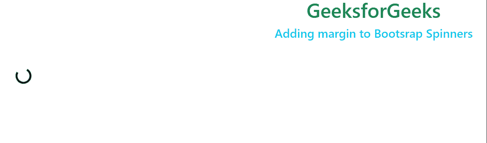
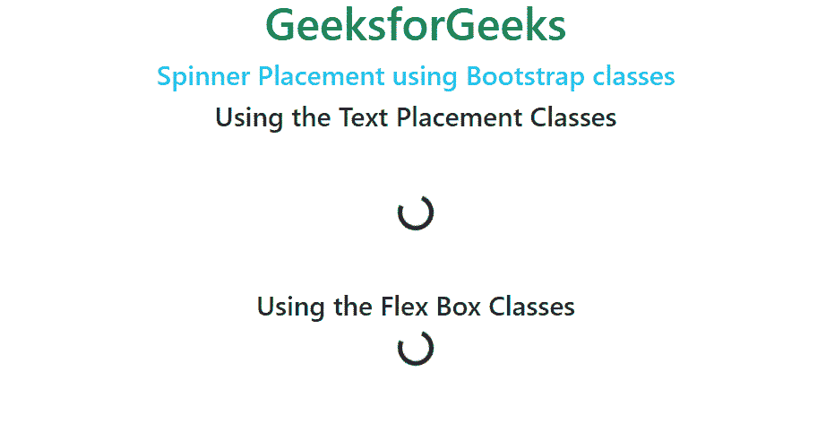
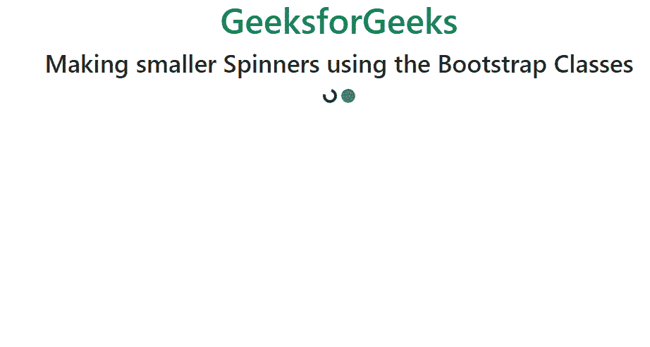
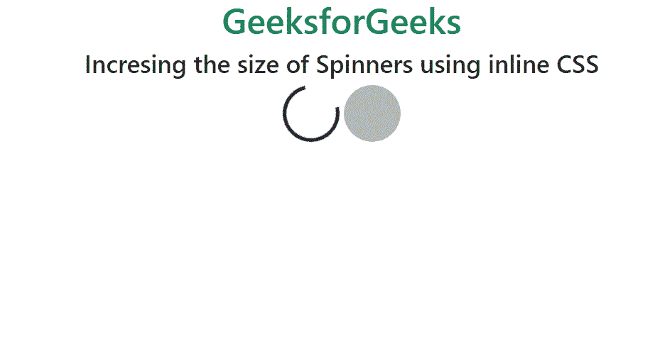

# 自举 5 个旋转器

> 原文:[https://www.geeksforgeeks.org/bootstrap-5-spinners/](https://www.geeksforgeeks.org/bootstrap-5-spinners/)

在本文中，我们将使用 Bootstrap 在网站中实现 spinners &还将通过示例看到不同类型的 spinners 的实现。微调器用于指定组件或网页的加载状态。Bootstrap 通过修改外观、大小和位置，为创建不同风格的微调器提供了便利。

**语法:**

*   对于**微调器-边框:**

```html
<div class="spinner-border" role="status"></div>
```

*   对于**微调器-生长:**

```html
<div class="spinner-grow" role="status"></div>
```

**方法:**我们将为微调器使用 div 元素&在 div 部分中声明名为**微调器边界**和**微调器增长**的引导类，以便使用微调器。****旋转器边框**类用于旋转旋转器，**旋转器生长**用于生长旋转器。它们用于显示某些内容正在加载。**

****示例 1:** 此示例说明了 Bootstrap 中的微调器边框。**

## **超文本标记语言**

```html
<!DOCTYPE html>
<html>

<head>
    <meta charset="utf-8">
    <meta name="viewport" content=
        "width=device-width">

    <link href=
"https://cdn.jsdelivr.net/npm/bootstrap@5.1.3/dist/css/bootstrap.min.css"
        rel="stylesheet">
</head>

<body>
    <h1 class="text-success text-center">
        GeeksforGeeks
    </h1>

    <h4 class="text-info text-center">
        Bootstrap Spinner Border
    </h4>

    <div class="d-flex justify-content-center">
        <div class="spinner-border text-secondary"
            role="status">
        </div>

        <span>Please Wait </span>
    </div>
</body>

</html>
```

****输出:****

**

旋转边框** 

****示例 2:** 本示例描述了 Bootstrap 中的微调器增长。**

## **超文本标记语言**

```html
<!DOCTYPE html>
<html>

<head>
    <meta charset="utf-8">
    <meta name="viewport"
        content="width=device-width">

    <link href=
"https://cdn.jsdelivr.net/npm/bootstrap@5.1.3/dist/css/bootstrap.min.css"
        rel="stylesheet">
</head>

<body>
    <h1 class="text-success text-center">
        GeeksforGeeks
    </h1>

    <h4 class="text-info text-center">
        Bootstrap Spinner Grow
    </h4>

    <div class="d-flex justify-content-center">
        <span>
            <h5>Processing</h5>
        </span>
        <div class="spinner-grow text-primary"
            role="status">
        </div>
    </div>
</body>

</html>
```

****输出:****

**

旋转生长** 

**现在我们将学习如何根据我们的需要在网页中对齐微调器。**

## **对齐**

#### **边缘**

**我们可以使用 Bootstrap 中的边距实用程序类在 Bootstrap 中为微调器添加边距。下面是一个例子:**

## **超文本标记语言**

```html
<!DOCTYPE html>
<html>

<head>
    <meta charset="utf-8">
    <meta name="viewport" content="width=device-width">

    <link href="https://cdn.jsdelivr.net/npm/bootstrap@5.1.3/dist/css/bootstrap.min.css" rel="stylesheet">
</head>

<body>
    <h1 class="text-success text-center">
        GeeksforGeeks
    </h1>

    <h4 class="text-info text-center">
        Adding margin to Bootstrap Spinners
    </h4>

    <div class="spinner-border m-5" role="status">

    </div>
</body>

</html>
```

#### **输出:**

**

给引导微调器添加边距** 

### **安置**

**我们可以使用文本放置或伸缩框类将微调器放置在不同的位置，如中心、结束或开始。下面是我们使用弹性框和文本放置类的例子:**

#### **代码:**

## **超文本标记语言**

```html
<!DOCTYPE html>
<html>

<head>
    <meta charset="utf-8">
    <meta name="viewport" content="width=device-width">

    <link href="https://cdn.jsdelivr.net/npm/bootstrap@5.1.3/dist/css/bootstrap.min.css" rel="stylesheet">
</head>

<body>
    <h1 class="text-success text-center">
        GeeksforGeeks
    </h1>

    <h4 class="text-info text-center">
        Spinner Placement using Bootstrap classes
    </h4>
    <h4 class=" text-center">
        Using the Text Placement Classes
    </h4>

    <div class="text-center">
        <div class="spinner-border m-5 " role="status">
        </div>

    </div>
    <h4 class="text-center">
        Using the Flex Box Classes
    </h4>
    <div class="d-flex justify-content-center">
        <div class="spinner-border" role="status">
        </div>
    </div>
</body>

</html>
```

#### **输出:**

**

使用引导类放置微调器** 

## **大小**

**我们还可以使用 Bootstrap 类或使用内嵌 CSS 样式，根据我们的需要调整微调器的大小。**

**我们可以添加。微调-边框-sm 和。spinner-grow-sm 类来制作更小的旋转器，可以适合不同的组件。这里有一个例子:**

## **超文本标记语言**

```html
<!DOCTYPE html>
<html>

<head>
    <meta charset="utf-8">
    <meta name="viewport" content="width=device-width">

    <link href="https://cdn.jsdelivr.net/npm/bootstrap@5.1.3/dist/css/bootstrap.min.css" rel="stylesheet">
</head>

<body>
    <h1 class="text-success text-center">
        GeeksforGeeks
    </h1>

    <div class="text-center">
        <h3>Making smaller Spinners using the Bootstrap Classes</h3>
        <div class="spinner-border spinner-border-sm" role="status">
            <span class="visually-hidden">Loading...</span>
        </div>
        <div class="spinner-grow spinner-grow-sm" role="status">
            <span class="visually-hidden">Loading...</span>
        </div>

    </div>
</body>

</html>
```

#### **输出:**

**

减小自举旋转器的尺寸** 

**我们还可以通过定义宽度和高度属性，使用内嵌 CSS 样式来增加或减少微调器的大小。这里有一个例子，我们使用内嵌 CSS 样式增加了微调器的大小:**

#### **代码:**

## **超文本标记语言**

```html
<!DOCTYPE html>
<html>
<head>
<title>Page Title</title>
</head>
<body>
<h2>Welcome To GFG</h2>

<p>Default code has been loaded into the Editor.</p>

</body>
</html>
a<!DOCTYPE html>
<html>

<head>
    <meta charset="utf-8">
    <meta name="viewport" content="width=device-width">

    <link href="https://cdn.jsdelivr.net/npm/bootstrap@5.1.3/dist/css/bootstrap.min.css" rel="stylesheet">
</head>

<body>
    <h1 class="text-success text-center">
        GeeksforGeeks
    </h1>

    <div class="text-center">
        <h3>Increasing the size of Spinners using inline CSS</h3>
        <div class="spinner-border" style="width: 4rem; height: 4rem;" role="status">
            <span class="visually-hidden">Loading...</span>
          </div>
          <div class="spinner-grow" style="width: 4rem; height: 4rem;" role="status">
            <span class="visually-hidden">Loading...</span>
          </div>

    </div>
</body>

</html>
```

#### **输出:**

**

使用内嵌 CSS 增加引导微调器的大小** 

****支持的浏览器:****

*   **谷歌 Chrome**
*   **微软边缘**
*   **火狐浏览器**
*   **歌剧**
*   **旅行队**