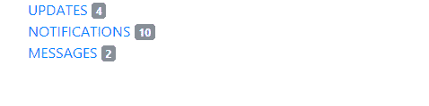

# 引导|徽章和面包屑

> 原文:[https://www . geesforgeks . org/bootstrap-徽章和面包屑/](https://www.geeksforgeeks.org/bootstrap-badges-and-breadcrumbs/)

**徽章**

徽章是与链接相关联的数字，用于指示与链接相关联的项目数量。登录到特定网站时看到的通知号，该网站通过单击来告知要查看的新闻或通知的数量。
**例:**

## 超文本标记语言

```
<!DOCTYPE html>

<head>
<title>badge example</title>
<meta charset="utf-8">
<meta name="viewport" content="width=device-width, initial-scale=1">
<link rel="stylesheet" href="https://maxcdn.bootstrapcdn.com/bootstrap/3.3.7/css/bootstrap.min.css">
<script src="https://ajax.googleapis.com/ajax/libs/jquery/3.3.1/jquery.min.js"></script>
<script src="https://maxcdn.bootstrapcdn.com/bootstrap/3.3.7/js/bootstrap.min.js"></script>
<style>
    .container {
        font-size:20px;
    }
</style>
</head>
<body>
<div class="container">
    <a href="#">UPDATES<span class="badge badge-secondart"> 4 </span></a><br>
    <a href="#">NOTIFICATIONS<span class="badge badge-secondart"> 10 </span></a><br>
    <a href="#">MESSAGES<span class="badge badge-secondart"> 4 </span></a><br>
</body>
</html>
```

**输出:**



**上下文变化:**徽章可以作为链接或按钮的一部分来提供计数器。根据他们的使用方式，徽章一定会让用户感到困惑，为此，使用了不同颜色的变体，以便用户不会感到困惑。
**例:**

## 超文本标记语言

```
<!DOCTYPE html>

<head>
<title>badge example</title>
<meta charset="utf-8">
  <meta name="viewport" content="width=device-width, initial-scale=1">
  <link rel="stylesheet" href="https://maxcdn.bootstrapcdn.com/bootstrap/4.1.0/css/bootstrap.min.css">
  <script src="https://ajax.googleapis.com/ajax/libs/jquery/3.3.1/jquery.min.js"></script>
  <script src="https://cdnjs.cloudflare.com/ajax/libs/popper.js/1.14.0/umd/popper.min.js"></script>
  <script src="https://maxcdn.bootstrapcdn.com/bootstrap/4.1.0/js/bootstrap.min.js"></script>
<style>
    .container {
        font-size:20px;
        margin-top:30px;
    }
</style>
</head>
<body>
<div class="container">
    <button type="button" class="btn btn-primary">
        NOTIFICATIONS <span class="badge badge-light">2</span>
    </button><br><br>
    <button type="button" class="btn btn-default">
        MESSAGES <span class="badge badge-warning">2</span>
    </button><br><br>
    <button type="button" class="btn btn-info">
        UPDATES <span class="badge badge-danger">2</span>
    </button><br><br>
    <button type="button" class="btn btn-light">
        NEWS <span class="badge badge-success">2</span>
    </button>
</body>
</html>
```

**输出:**


**药丸徽章:**使用 class =“徽章-药丸”使边角更加圆润的徽章。
**例:**

## 超文本标记语言

```
<!DOCTYPE html>

<head>
<title>badge example</title>
<meta charset="utf-8">
  <meta name="viewport" content="width=device-width, initial-scale=1">
  <link rel="stylesheet" href="https://maxcdn.bootstrapcdn.com/bootstrap/4.1.0/css/bootstrap.min.css">
  <script src="https://ajax.googleapis.com/ajax/libs/jquery/3.3.1/jquery.min.js"></script>
  <script src="https://cdnjs.cloudflare.com/ajax/libs/popper.js/1.14.0/umd/popper.min.js"></script>
  <script src="https://maxcdn.bootstrapcdn.com/bootstrap/4.1.0/js/bootstrap.min.js"></script>
<style>
    .container {
        font-size:20px;
        margin-top:30px;
    }
</style>
</head>
<body>
<div class="container">
    <button type="button" class="btn btn-primary">
        NOTIFICATIONS <span class="badge badge-pill badge-light">2</span>
    </button><br><br>
    <button type="button" class="btn btn-default">
        MESSAGES <span class="badge badge-pill badge-warning">2</span>
    </button><br><br>
    <button type="button" class="btn btn-info">
        UPDATES <span class="badge badge-pill badge-danger">2</span>
    </button><br><br>
    <button type="button" class="btn btn-light">
        NEWS <span class="badge badge-pill badge-success">2</span>
    </button>
</body>
</html>
```

**输出:**


**徽章作为链接:**徽章也可以作为新页面的直接链接。
**例:**

## 超文本标记语言

```
<!DOCTYPE html>

<head>
<title>badge example</title>
<meta charset="utf-8">
  <meta name="viewport" content="width=device-width, initial-scale=1">
  <link rel="stylesheet" href="https://maxcdn.bootstrapcdn.com/bootstrap/4.1.0/css/bootstrap.min.css">
  <script src="https://ajax.googleapis.com/ajax/libs/jquery/3.3.1/jquery.min.js"></script>
  <script src="https://cdnjs.cloudflare.com/ajax/libs/popper.js/1.14.0/umd/popper.min.js"></script>
  <script src="https://maxcdn.bootstrapcdn.com/bootstrap/4.1.0/js/bootstrap.min.js"></script>
<style>
    .container {
        font-size:20px;
        margin-top:30px;
    }
</style>
</head>
<body>
<div class="container">
    <a href="#"><button type="button" class="btn btn-primary">
        NOTIFICATIONS <span class="badge badge-pill badge-light">2</span>
    </button></a><br><br>
    <a href="#"><button type="button" class="btn btn-default">
        MESSAGES <span class="badge badge-pill badge-warning">2</span>
    </button></a><br><br>
    <a href="#"><button type="button" class="btn btn-info">
        UPDATES <span class="badge badge-pill badge-danger">2</span>
    </button></a><br><br>
    <a href="#"><button type="button" class="btn btn-light">
        NEWS <span class="badge badge-pill badge-success">2</span>
    </button></a>
</body>
</html>
```

**输出:**


**面包屑**

它用于通过导航层次结构指示当前页面位置。它使用 CSS 自动添加分隔符。它提供了用户导航通过的每个上一页的反向链接。
**例 1:**

## 超文本标记语言

```
<!DOCTYPE html>

<head>
<title>badge example</title>
<meta name="viewport" content="width=device-width, initial-scale=1">
<link rel="stylesheet" href="https://maxcdn.bootstrapcdn.com/bootstrap/3.3.7/css/bootstrap.min.css">
<script src="https://ajax.googleapis.com/ajax/libs/jquery/3.3.1/jquery.min.js"></script>
<script src="https://maxcdn.bootstrapcdn.com/bootstrap/3.3.7/js/bootstrap.min.js"></script>
</head>
<body>
<div class="container">
    <nav aria-label="breadcrumb" role="navigation">
        <ol class="breadcrumb">
            <li class="breadcrumb-item active" aria-current="page">GeeksforGeeks</li>
        </ol> 
    </nav>
</div>
</body>
</html>
```

**输出:**


**例 2:**

## 超文本标记语言

```
<!DOCTYPE html>

<head>
<title>badge example</title>
<meta name="viewport" content="width=device-width, initial-scale=1">
<link rel="stylesheet" href="https://maxcdn.bootstrapcdn.com/bootstrap/3.3.7/css/bootstrap.min.css">
<script src="https://ajax.googleapis.com/ajax/libs/jquery/3.3.1/jquery.min.js"></script>
<script src="https://maxcdn.bootstrapcdn.com/bootstrap/3.3.7/js/bootstrap.min.js"></script>
</head>
<body>
<div class="container">
    <nav aria-label="breadcrumb" role="navigation">
        <ol class="breadcrumb">
            <li class="breadcrumb-item"><a href="#">GeeksforGeeks</a></li>
            <li class="breadcrumb-item active" aria-current="page">Library</li>
        </ol> 
    </nav>
</div>
</body>
</html>
```

**输出:**


**例 3:**

## 超文本标记语言

```
<!DOCTYPE html>

<head>
<title>badge example</title>
<meta name="viewport" content="width=device-width, initial-scale=1">
<link rel="stylesheet" href="https://maxcdn.bootstrapcdn.com/bootstrap/3.3.7/css/bootstrap.min.css">
<script src="https://ajax.googleapis.com/ajax/libs/jquery/3.3.1/jquery.min.js"></script>
<script src="https://maxcdn.bootstrapcdn.com/bootstrap/3.3.7/js/bootstrap.min.js"></script>
</head>
<body>
<div class="container">
    <nav aria-label="breadcrumb" role="navigation">
        <ol class="breadcrumb">
            <li class="breadcrumb-item"><a href="#">GeeksforGeeks</a></li>
            <li class="breadcrumb-item"><a href="#">Library</a></li>
            <li class="breadcrumb-item"><a href="#">Books</a></li>
            <li class="breadcrumb-item"><a href="#">Subject</a></li>
            <li class="breadcrumb-item active" aria-current="page">Computer Science</li>
        </ol> 
    </nav>
</div>
</body>
</html>
```

**输出:**


**支持的浏览器:**

*   谷歌 Chrome
*   微软边缘
*   火狐浏览器
*   歌剧
*   旅行队