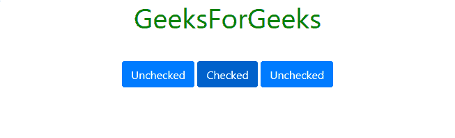

# 带示例的引导按钮

> 原文:[https://www . geesforgeks . org/bootstrap-button-with-examples/](https://www.geeksforgeeks.org/bootstrap-buttons-with-examples/)

Bootstrap 为我们提供了不同的类，可以使用不同的标签，如 **<按钮>、< a >、<输入>、**和**标签<标签>T3】来应用自定义按钮样式。Bootstrap 还提供了可用于更改按钮状态和大小的类，还提供了应用切换、复选框和单选按钮等效果的类。
**实心按钮** : Bootstrap 为我们提供了一系列对应不同实心按钮样式的类。这些类如下所列:** 

<figure class="table">**T28】BTN-light**

| BTN 小学 | BTN 中学 | BTN-成功 |
| BTN-危险 | BTN 警告 | BTN 信息 |
| BTN-暗 | BTN |

</figure>

**注意:**我们必须使用额外的 **btn** 类以及上面提到的和后面的类。
**例:**

## 超文本标记语言

```html
<!DOCTYPE html>
<html lang="en">
  <head>

    <!-- Bootstrap CSS -->
    <link rel="stylesheet" href="https://stackpath.bootstrapcdn.com/bootstrap/4.2.1/css/bootstrap.min.css" integrity="sha384-GJzZqFGwb1QTTN6wy59ffF1BuGJpLSa9DkKMp0DgiMDm4iYMj70gZWKYbI706tWS" crossorigin="anonymous">

    <title>Hello, world!</title>
    <!-- Custom CSS -->
    <style>
      h1{
        color: green;
        text-align: center;
      }
      div.one{
        margin-top: 40px;
        text-align: center;
      }
      button{
        margin-top: 10px;
      }
    </style>
  </head>
  <body>
    <div class="container">
      <h1>GeeksForGeeks</h1>

      <!-- Bootstrap Button Classes -->     
      <div class="one">
        <button type="button" class="btn btn-primary">Primary</button>
        <button type="button" class="btn btn-secondary">Secondary</button>
        <button type="button" class="btn btn-success">Success</button>
        <button type="button" class="btn btn-danger">Danger</button>
        <button type="button" class="btn btn-warning">Warning</button>
        <button type="button" class="btn btn-info">Info</button>
        <button type="button" class="btn btn-light">Light</button>
        <button type="button" class="btn btn-dark">Dark</button>
        <button type="button" class="btn btn-link">Link</button>
      </div>

    </div>
    <!-- Optional JavaScript -->
    <!-- jQuery first, then Popper.js, then Bootstrap JS -->
    <script src="https://code.jquery.com/jquery-3.3.1.slim.min.js" integrity="sha384-q8i/X+965DzO0rT7abK41JStQIAqVgRVzpbzo5smXKp4YfRvH+8abtTE1Pi6jizo" crossorigin="anonymous"></script>
    <script src="https://cdnjs.cloudflare.com/ajax/libs/popper.js/1.14.6/umd/popper.min.js" integrity="sha384-wHAiFfRlMFy6i5SRaxvfOCifBUQy1xHdJ/yoi7FRNXMRBu5WHdZYu1hA6ZOblgut" crossorigin="anonymous"></script>
    <script src="https://stackpath.bootstrapcdn.com/bootstrap/4.2.1/js/bootstrap.min.js" integrity="sha384-B0UglyR+jN6CkvvICOB2joaf5I4l3gm9GU6Hc1og6Ls7i6U/mkkaduKaBhlAXv9k" crossorigin="anonymous"></script>
  </body>
</html>
```

**输出:**


**轮廓按钮**
Bootstrap 为我们提供了一系列类，当我们需要在项目中使用轮廓样式的按钮时，可以使用这些类，也就是没有背景色的按钮。大纲按钮类删除应用于按钮的任何背景颜色或背景图像样式。这些类别如下所示:

<figure class="table">

| BTN-大纲-主要 | BTN-大纲-二级 | BTN-大纲-成功 |
| BTN-大纲-危险 | BTN-轮廓-警告 | BTN-大纲-信息 |
| BTN-轮廓灯 | BTN-轮廓-深色 |   |

</figure>

**例:**

## 超文本标记语言

```html
<!DOCTYPE html>
<html>
  <head>

    <!-- Bootstrap CSS -->
    <link rel="stylesheet" href="https://stackpath.bootstrapcdn.com/bootstrap/4.2.1/css/bootstrap.min.css" integrity="sha384-GJzZqFGwb1QTTN6wy59ffF1BuGJpLSa9DkKMp0DgiMDm4iYMj70gZWKYbI706tWS" crossorigin="anonymous">

    <title>Hello, world!</title>
    <!-- Custom CSS -->
    <style>
      h1{
        color: green;
        text-align: center;
      }
      div.one{
        margin-top: 40px;
        text-align: center;
      }
      button{
        margin-top: 10px;
      }
    </style>
  </head>
  <body>
    <div class="container">
      <h1>GeeksForGeeks</h1>

      <!-- Bootstrap Button Classes -->     
      <div class="one">
          <button type="button" class="btn btn-outline-primary">Primary</button>
          <button type="button" class="btn btn-outline-secondary">Secondary</button>
          <button type="button" class="btn btn-outline-success">Success</button>
          <button type="button" class="btn btn-outline-danger">Danger</button>
          <button type="button" class="btn btn-outline-warning">Warning</button>
          <button type="button" class="btn btn-outline-info">Info</button>
          <button type="button" class="btn btn-outline-light">Light</button>
          <button type="button" class="btn btn-outline-dark">Dark</button>
      </div>

    </div>
    <!-- Optional JavaScript -->
    <!-- jQuery first, then Popper.js, then Bootstrap JS -->
    <script src="https://code.jquery.com/jquery-3.3.1.slim.min.js" integrity="sha384-q8i/X+965DzO0rT7abK41JStQIAqVgRVzpbzo5smXKp4YfRvH+8abtTE1Pi6jizo" crossorigin="anonymous"></script>
    <script src="https://cdnjs.cloudflare.com/ajax/libs/popper.js/1.14.6/umd/popper.min.js" integrity="sha384-wHAiFfRlMFy6i5SRaxvfOCifBUQy1xHdJ/yoi7FRNXMRBu5WHdZYu1hA6ZOblgut" crossorigin="anonymous"></script>
    <script src="https://stackpath.bootstrapcdn.com/bootstrap/4.2.1/js/bootstrap.min.js" integrity="sha384-B0UglyR+jN6CkvvICOB2joaf5I4l3gm9GU6Hc1og6Ls7i6U/mkkaduKaBhlAXv9k" crossorigin="anonymous"></script>
  </body>
</html>
```

**输出:**


**改变大小**
Bootstrap 为我们提供了不同的类，允许改变按钮的大小。这些类别如下所示:

*   **btn-lg:** 该类用于制作大尺寸的按钮。
    **例:**

## 超文本标记语言

```html
<!DOCTYPE html>
<html>
  <head>

    <!-- Bootstrap CSS -->
    <link rel="stylesheet" href="https://stackpath.bootstrapcdn.com/bootstrap/4.2.1/css/bootstrap.min.css" integrity="sha384-GJzZqFGwb1QTTN6wy59ffF1BuGJpLSa9DkKMp0DgiMDm4iYMj70gZWKYbI706tWS" crossorigin="anonymous">

    <title>Hello, world!</title>
    <!-- Custom CSS -->
    <style>
      h1{
        color: green;
        text-align: center;
      }
      div.one{
        margin-top: 40px;
        text-align: center;
      }
      button{
        margin-top: 10px;
      }
    </style>
  </head>
  <body>
    <div class="container">
      <h1>GeeksForGeeks</h1>

      <!-- Bootstrap Button Classes -->     
      <div class="one">
          <button type="button" class="btn btn-primary btn-lg">Primary</button>
          <button type="button" class="btn btn-outline-secondary btn-lg">Secondary</button>
          <button type="button" class="btn btn-success btn-lg">Success</button>

      </div>

    </div>
    <!-- Optional JavaScript -->
    <!-- jQuery first, then Popper.js, then Bootstrap JS -->
    <script src="https://code.jquery.com/jquery-3.3.1.slim.min.js" integrity="sha384-q8i/X+965DzO0rT7abK41JStQIAqVgRVzpbzo5smXKp4YfRvH+8abtTE1Pi6jizo" crossorigin="anonymous"></script>
    <script src="https://cdnjs.cloudflare.com/ajax/libs/popper.js/1.14.6/umd/popper.min.js" integrity="sha384-wHAiFfRlMFy6i5SRaxvfOCifBUQy1xHdJ/yoi7FRNXMRBu5WHdZYu1hA6ZOblgut" crossorigin="anonymous"></script>
    <script src="https://stackpath.bootstrapcdn.com/bootstrap/4.2.1/js/bootstrap.min.js" integrity="sha384-B0UglyR+jN6CkvvICOB2joaf5I4l3gm9GU6Hc1og6Ls7i6U/mkkaduKaBhlAXv9k" crossorigin="anonymous"></script>
  </body>
</html>
```

*   **输出:**


*   **btn-sm:** 该类用于使按钮变小。
    **例:**

## 超文本标记语言

```html
<!DOCTYPE html>
<html>
  <head>

    <!-- Bootstrap CSS -->
    <link rel="stylesheet" href="https://stackpath.bootstrapcdn.com/bootstrap/4.2.1/css/bootstrap.min.css" integrity="sha384-GJzZqFGwb1QTTN6wy59ffF1BuGJpLSa9DkKMp0DgiMDm4iYMj70gZWKYbI706tWS" crossorigin="anonymous">

    <title>Hello, world!</title>
    <!-- Custom CSS -->
    <style>
      h1{
        color: green;
        text-align: center;
      }
      div.one{
        margin-top: 40px;
        text-align: center;
      }
      button{
        margin-top: 10px;
      }
    </style>
  </head>
  <body>
    <div class="container">
      <h1>GeeksForGeeks</h1>

      <!-- Bootstrap Button Classes -->     
      <div class="one">
          <button type="button" class="btn btn-primary btn-sm">Primary</button>
          <button type="button" class="btn btn-outline-secondary btn-sm">Secondary</button>
          <button type="button" class="btn btn-success btn-sm">Success</button>

      </div>

    </div>
    <!-- Optional JavaScript -->
    <!-- jQuery first, then Popper.js, then Bootstrap JS -->
    <script src="https://code.jquery.com/jquery-3.3.1.slim.min.js" integrity="sha384-q8i/X+965DzO0rT7abK41JStQIAqVgRVzpbzo5smXKp4YfRvH+8abtTE1Pi6jizo" crossorigin="anonymous"></script>
    <script src="https://cdnjs.cloudflare.com/ajax/libs/popper.js/1.14.6/umd/popper.min.js" integrity="sha384-wHAiFfRlMFy6i5SRaxvfOCifBUQy1xHdJ/yoi7FRNXMRBu5WHdZYu1hA6ZOblgut" crossorigin="anonymous"></script>
    <script src="https://stackpath.bootstrapcdn.com/bootstrap/4.2.1/js/bootstrap.min.js" integrity="sha384-B0UglyR+jN6CkvvICOB2joaf5I4l3gm9GU6Hc1og6Ls7i6U/mkkaduKaBhlAXv9k" crossorigin="anonymous"></script>
  </body>
</html>
```

*   **输出:**


*   **btn-block:** 该类用于使按钮占据其父元素的整个宽度。

## 超文本标记语言

```html
<!DOCTYPE html>
<html>
  <head>

    <!-- Bootstrap CSS -->
    <link rel="stylesheet" href="https://stackpath.bootstrapcdn.com/bootstrap/4.2.1/css/bootstrap.min.css" integrity="sha384-GJzZqFGwb1QTTN6wy59ffF1BuGJpLSa9DkKMp0DgiMDm4iYMj70gZWKYbI706tWS" crossorigin="anonymous">

    <title>Hello, world!</title>
    <!-- Custom CSS -->
    <style>
      h1{
        color: green;
        text-align: center;
      }
      div.one{
        margin-top: 40px;
        text-align: center;
      }
      button{
        margin-top: 10px;
      }
    </style>
  </head>
  <body>
    <div class="container">
      <h1>GeeksForGeeks</h1>

      <!-- Bootstrap Button Classes -->     
      <div class="one">
          <button type="button" class="btn btn-primary btn-block">Primary</button>
          <button type="button" class="btn btn-outline-secondary btn-block">Secondary</button>
          <button type="button" class="btn btn-success btn-block">Success</button>

      </div>

    </div>
    <!-- Optional JavaScript -->
    <!-- jQuery first, then Popper.js, then Bootstrap JS -->
    <script src="https://code.jquery.com/jquery-3.3.1.slim.min.js" integrity="sha384-q8i/X+965DzO0rT7abK41JStQIAqVgRVzpbzo5smXKp4YfRvH+8abtTE1Pi6jizo" crossorigin="anonymous"></script>
    <script src="https://cdnjs.cloudflare.com/ajax/libs/popper.js/1.14.6/umd/popper.min.js" integrity="sha384-wHAiFfRlMFy6i5SRaxvfOCifBUQy1xHdJ/yoi7FRNXMRBu5WHdZYu1hA6ZOblgut" crossorigin="anonymous"></script>
    <script src="https://stackpath.bootstrapcdn.com/bootstrap/4.2.1/js/bootstrap.min.js" integrity="sha384-B0UglyR+jN6CkvvICOB2joaf5I4l3gm9GU6Hc1og6Ls7i6U/mkkaduKaBhlAXv9k" crossorigin="anonymous"></script>
  </body>
</html>
```

*   **输出:**


**改变状态**
Bootstrap 为我们提供了“激活”和“禁用”类来改变按钮的状态。

*   **激活:**这个类用来让按钮和链接在激活状态下出现，即有深色背景，深色边框，有内嵌阴影。
    **例:**

## 超文本标记语言

```html
<!DOCTYPE html>
<html>
  <head>

    <!-- Bootstrap CSS -->
    <link rel="stylesheet" href="https://stackpath.bootstrapcdn.com/bootstrap/4.2.1/css/bootstrap.min.css" integrity="sha384-GJzZqFGwb1QTTN6wy59ffF1BuGJpLSa9DkKMp0DgiMDm4iYMj70gZWKYbI706tWS" crossorigin="anonymous">

    <title>Hello, world!</title>
    <!-- Custom CSS -->
    <style>
      h1{
        color: green;
        text-align: center;
      }
      div.one{
        margin-top: 40px;
        text-align: center;
      }
      a, button{
        margin-top: 10px;
      }
    </style>
  </head>
  <body>
    <div class="container">
      <h1>GeeksForGeeks</h1>

      <!-- Bootstrap Button Classes -->     
      <div class="one">
          <button type="button" class="btn btn-primary active">Primary Button</button>
          <a href="#" class="btn btn-warning active" role="button" aria-pressed="true">Warning Link</a>
          <button type="button" class="btn btn-success active">Success Button</button>
      </div>

    </div>
    <!-- Optional JavaScript -->
    <!-- jQuery first, then Popper.js, then Bootstrap JS -->
    <script src="https://code.jquery.com/jquery-3.3.1.slim.min.js" integrity="sha384-q8i/X+965DzO0rT7abK41JStQIAqVgRVzpbzo5smXKp4YfRvH+8abtTE1Pi6jizo" crossorigin="anonymous"></script>
    <script src="https://cdnjs.cloudflare.com/ajax/libs/popper.js/1.14.6/umd/popper.min.js" integrity="sha384-wHAiFfRlMFy6i5SRaxvfOCifBUQy1xHdJ/yoi7FRNXMRBu5WHdZYu1hA6ZOblgut" crossorigin="anonymous"></script>
    <script src="https://stackpath.bootstrapcdn.com/bootstrap/4.2.1/js/bootstrap.min.js" integrity="sha384-B0UglyR+jN6CkvvICOB2joaf5I4l3gm9GU6Hc1og6Ls7i6U/mkkaduKaBhlAXv9k" crossorigin="anonymous"></script>
  </body>
</html>
```

*   **注意:**当使用< a >标签时，我们应该在标签内插入 role =“button”属性值对，如果 button 是活动的，那么，我们在< a >标签内使用 aria-pressed =“true”属性值对，并将 class 值设置为 active(class =“active”)。
    **输出:**


*   **禁用:**此类用于使按钮和链接在禁用状态下出现，即背景颜色较浅，开始外观较亮。
    **例:**

## 超文本标记语言

```html
<!DOCTYPE html>
<html>
  <head>

    <!-- Bootstrap CSS -->
    <link rel="stylesheet" href="https://stackpath.bootstrapcdn.com/bootstrap/4.2.1/css/bootstrap.min.css" integrity="sha384-GJzZqFGwb1QTTN6wy59ffF1BuGJpLSa9DkKMp0DgiMDm4iYMj70gZWKYbI706tWS" crossorigin="anonymous">

    <title>Hello, world!</title>
    <!-- Custom CSS -->
    <style>
      h1{
        color: green;
        text-align: center;
      }
      div.one{
        margin-top: 40px;
        text-align: center;
      }
      a, button{
        margin-top: 10px;
      }
    </style>
  </head>
  <body>
    <div class="container">
      <h1>GeeksForGeeks</h1>

      <!-- Bootstrap Button Classes -->     
      <div class="one">
          <button type="button" class="btn btn-primary disabled">Primary Button</button>
          <a href="#" class="btn btn-warning disabled" role="button" aria-disabled="true" tabindex="-1">Warning Link</a>
          <button type="button" class="btn btn-success disabled">Success Button</button>
      </div>

    </div>

    <!-- Optional JavaScript -->
    <!-- jQuery first, then Popper.js, then Bootstrap JS -->
    <script src="https://code.jquery.com/jquery-3.3.1.slim.min.js" integrity="sha384-q8i/X+965DzO0rT7abK41JStQIAqVgRVzpbzo5smXKp4YfRvH+8abtTE1Pi6jizo" crossorigin="anonymous"></script>
    <script src="https://cdnjs.cloudflare.com/ajax/libs/popper.js/1.14.6/umd/popper.min.js" integrity="sha384-wHAiFfRlMFy6i5SRaxvfOCifBUQy1xHdJ/yoi7FRNXMRBu5WHdZYu1hA6ZOblgut" crossorigin="anonymous"></script>
    <script src="https://stackpath.bootstrapcdn.com/bootstrap/4.2.1/js/bootstrap.min.js" integrity="sha384-B0UglyR+jN6CkvvICOB2joaf5I4l3gm9GU6Hc1og6Ls7i6U/mkkaduKaBhlAXv9k" crossorigin="anonymous"></script>
  </body>
</html>
```

*   **注意:**当<使用一个>标记时，我们应该在标记中插入 role =“button”属性值对。当使用带有< a >标签的“disabled”类时，我们应该在< a >标签中插入 aria-disabled =“true”和 tabindex =“-1”属性值对。此外，我们可以通过在<按钮>标签中添加“禁用”属性来禁用<按钮>，而无需使用 Bootstrap 的“禁用”类。
    **输出:**


**切换状态**
我们可以通过在<按钮>标签中添加 data-Toggle =“button”属性值对来使按钮切换其状态。我们还可以通过向<按钮>标签添加“活动”类和 aria-prested =“true”属性值对来将按钮的切换状态预设为活动。
**例:**

## 超文本标记语言

```html
<!DOCTYPE html>
<html>
  <head>

    <!-- Bootstrap CSS -->
    <link rel="stylesheet" href="https://stackpath.bootstrapcdn.com/bootstrap/4.2.1/css/bootstrap.min.css" integrity="sha384-GJzZqFGwb1QTTN6wy59ffF1BuGJpLSa9DkKMp0DgiMDm4iYMj70gZWKYbI706tWS" crossorigin="anonymous">

    <title>Hello, world!</title>
    <!-- Custom CSS -->
    <style>
      h1{
        color: green;
        text-align: center;
      }
      div.one{
        margin-top: 40px;
        text-align: center;
      }
      a, button{
        margin-top: 10px;
      }
    </style>
  </head>

  <body>
    <div class="container">
      <h1>GeeksForGeeks</h1>

      <!-- Bootstrap Button Classes -->     
      <div class="one">
          <button type="button" data-toggle="button" class="btn btn-primary" aria-pressed="false">Primary Button</button>
          <button type="button" data-toggle="button" class="btn btn-success" aria-pressed="false">Success Button</button>
          <button type="button" data-toggle="button" class="btn btn-primary active" aria-pressed="true" >Primary Button</button>
      </div>

    </div>

    <!-- Optional JavaScript -->
    <!-- jQuery first, then Popper.js, then Bootstrap JS -->
    <script src="https://code.jquery.com/jquery-3.3.1.slim.min.js" integrity="sha384-q8i/X+965DzO0rT7abK41JStQIAqVgRVzpbzo5smXKp4YfRvH+8abtTE1Pi6jizo" crossorigin="anonymous"></script>
    <script src="https://cdnjs.cloudflare.com/ajax/libs/popper.js/1.14.6/umd/popper.min.js" integrity="sha384-wHAiFfRlMFy6i5SRaxvfOCifBUQy1xHdJ/yoi7FRNXMRBu5WHdZYu1hA6ZOblgut" crossorigin="anonymous"></script>
    <script src="https://stackpath.bootstrapcdn.com/bootstrap/4.2.1/js/bootstrap.min.js" integrity="sha384-B0UglyR+jN6CkvvICOB2joaf5I4l3gm9GU6Hc1og6Ls7i6U/mkkaduKaBhlAXv9k" crossorigin="anonymous"></script>
  </body>
</html>
```

**注意:**第三个按钮预设为激活。
**输出:**


**复选框样式按钮**
要获得复选框样式按钮，我们需要使用<输入带有 type="checkbox "属性值对的>标签，该标签由类值设置为“btn”的<标签和上述实体或轮廓按钮类中的一个类包围。<标签>标签依次被< div >标签包围，类别值设置为“BTN-group-toggle”(class =“BTN-group-toggle”)，在< div >标签内还需要数据-toggle =“buttons”属性对。以下示例将清除程序:
**示例:**

## 超文本标记语言

```html
<!DOCTYPE html>
<html>
  <head>

    <!-- Bootstrap CSS -->
    <link rel="stylesheet" href="https://stackpath.bootstrapcdn.com/bootstrap/4.2.1/css/bootstrap.min.css" integrity="sha384-GJzZqFGwb1QTTN6wy59ffF1BuGJpLSa9DkKMp0DgiMDm4iYMj70gZWKYbI706tWS" crossorigin="anonymous">

    <title>Hello, world!</title>
    <!-- Custom CSS -->
    <style>
      h1{
        color: green;
        text-align: center;
      }
      div.one{
        margin-top: 40px;
        text-align: center;
      }
      a, button{
        margin-top: 10px;
      }
    </style>
  </head>
  <body>
    <div class="container">
      <h1>GeeksForGeeks</h1>

      <!-- Bootstrap Button Classes -->     
      <div class="one">
        <div class="btn-group-toggle" data-toggle="buttons">
            <label class="btn btn-primary">
                <input type="checkbox" autocomplete="off"> Unchecked
            </label>
            <label class="btn btn-primary active">
                <input type="checkbox" checked autocomplete="off"> Checked
            </label>
            <label class="btn btn-primary">
                <input type="checkbox" autocomplete="off"> Unchecked
            </label>

        </div>
      </div>

    </div>

    <!-- Optional JavaScript -->
    <!-- jQuery first, then Popper.js, then Bootstrap JS -->
    <script src="https://code.jquery.com/jquery-3.3.1.slim.min.js" integrity="sha384-q8i/X+965DzO0rT7abK41JStQIAqVgRVzpbzo5smXKp4YfRvH+8abtTE1Pi6jizo" crossorigin="anonymous"></script>
    <script src="https://cdnjs.cloudflare.com/ajax/libs/popper.js/1.14.6/umd/popper.min.js" integrity="sha384-wHAiFfRlMFy6i5SRaxvfOCifBUQy1xHdJ/yoi7FRNXMRBu5WHdZYu1hA6ZOblgut" crossorigin="anonymous"></script>
    <script src="https://stackpath.bootstrapcdn.com/bootstrap/4.2.1/js/bootstrap.min.js" integrity="sha384-B0UglyR+jN6CkvvICOB2joaf5I4l3gm9GU6Hc1og6Ls7i6U/mkkaduKaBhlAXv9k" crossorigin="anonymous"></script>
  </body>
</html>
```

**注意:**要使按钮默认勾选，我们需要在输入控件的<标签>标签内添加“活动”类，同时在<输入>标签内放置“已勾选”属性。
**输出:**



**单选按钮**
要获得单选按钮，我们需要像往常一样使用<输入带有 type="radio "属性值对的>标签和其他必要的属性值组合来操作单选按钮。<输入的>标签又被<标签>标签包围，该标签的类值设置为“btn”，并且是上述实体或轮廓按钮类中的一个类。<标签>标签依次被< div >标签包围，类别值设置为“BTN-group BTN-group-toggle”(class =“BTN-group BTN-group-toggle”)，在< div >标签内还需要数据-toggle =“buttons”属性对。以下示例将清除程序:
**示例:**

## 超文本标记语言

```html
<!DOCTYPE html>
<html>
  <head>

    <!-- Bootstrap CSS -->
    <link rel="stylesheet" href="https://stackpath.bootstrapcdn.com/bootstrap/4.2.1/css/bootstrap.min.css" integrity="sha384-GJzZqFGwb1QTTN6wy59ffF1BuGJpLSa9DkKMp0DgiMDm4iYMj70gZWKYbI706tWS" crossorigin="anonymous">

    <title>Hello, world!</title>
    <!-- Custom CSS -->
    <style>
      h1{
        color: green;
        text-align: center;
      }
      div.one{
        margin-top: 40px;
        text-align: center;
      }
      a, button{
        margin-top: 10px;
      }
    </style>
  </head>
  <body>
    <div class="container">
      <h1>GeeksForGeeks</h1>

      <!-- Bootstrap Button Classes -->     
      <div class="one">
        <div class="btn-group btn-group-toggle" data-toggle="buttons">
            <label class="btn btn-primary">
              <input type="radio" name="options" id="option1" autocomplete="off"> Radio Button
            </label>
            <label class="btn btn-primary active">
              <input type="radio" name="options" id="option2" autocomplete="off" checked> Active Radio Button
            </label>
            <label class="btn btn-primary">
              <input type="radio" name="options" id="option3" autocomplete="off"> Radio Button
            </label>
        </div>
      </div>

    </div>

    <!-- Optional JavaScript -->
    <!-- jQuery first, then Popper.js, then Bootstrap JS -->
    <script src="https://code.jquery.com/jquery-3.3.1.slim.min.js" integrity="sha384-q8i/X+965DzO0rT7abK41JStQIAqVgRVzpbzo5smXKp4YfRvH+8abtTE1Pi6jizo" crossorigin="anonymous"></script>
    <script src="https://cdnjs.cloudflare.com/ajax/libs/popper.js/1.14.6/umd/popper.min.js" integrity="sha384-wHAiFfRlMFy6i5SRaxvfOCifBUQy1xHdJ/yoi7FRNXMRBu5WHdZYu1hA6ZOblgut" crossorigin="anonymous"></script>
    <script src="https://stackpath.bootstrapcdn.com/bootstrap/4.2.1/js/bootstrap.min.js" integrity="sha384-B0UglyR+jN6CkvvICOB2joaf5I4l3gm9GU6Hc1og6Ls7i6U/mkkaduKaBhlAXv9k" crossorigin="anonymous"></script>
  </body>
</html>
```

**注意:**要使按钮默认勾选，我们需要在输入控件的<标签>标签内添加“活动”类，同时在<输入>标签内放置“已勾选”属性。
**输出:**


**支持的浏览器:**

*   谷歌 Chrome
*   微软公司出品的 web 浏览器
*   火狐浏览器
*   歌剧
*   旅行队