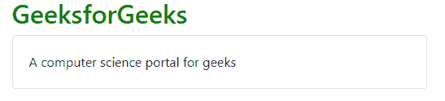
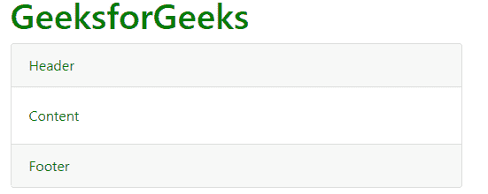
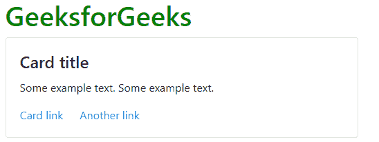
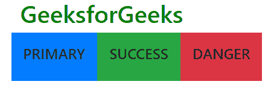
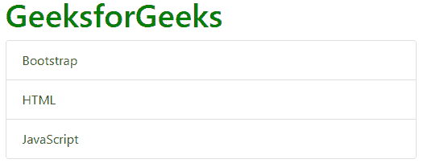
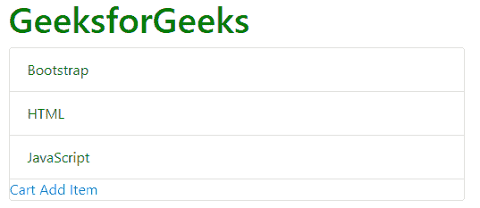
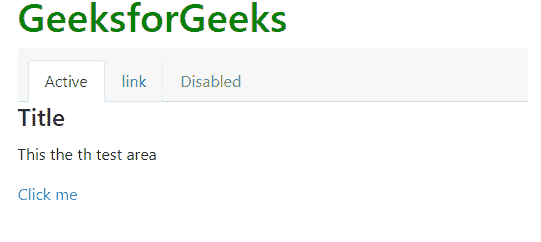
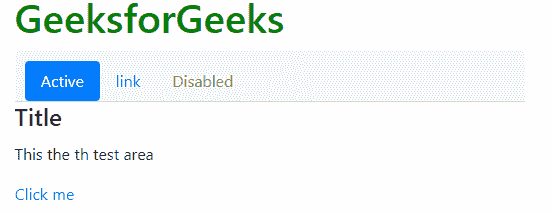

# 自举|卡片

> 原文:[https://www.geeksforgeeks.org/bootstrap-cards/](https://www.geeksforgeeks.org/bootstrap-cards/)

A **卡**是一个灵活可扩展的内容容器。它包括页眉和页脚选项、各种各样的内容、上下文背景颜色和强大的显示选项。

它取代了使用面板，水井和缩略图。因为所有这些都可以在一个名为**卡**的容器中使用。

*   **基本牌:**一张牌的积木是**牌体**和带有**牌的**。
    **例:**

## 超文本标记语言

```
<!DOCTYPE html>
<html lang="en">
<head>
    <title>Bootstrap Card</title>
    <meta charset="utf-8">
    <meta name="viewport"
content="width=device-width, initial-scale=1">
    <link rel="stylesheet"
href="https://maxcdn.bootstrapcdn.com/bootstrap/4.3.1/css/bootstrap.min.css">
    <script src=
"https://ajax.googleapis.com/ajax/libs/jquery/3.4.1/jquery.min.js">
    </script>
    <script src=
"https://cdnjs.cloudflare.com/ajax/libs/popper.js/1.14.7/umd/popper.min.js">
    </script>
    <script src=
"https://maxcdn.bootstrapcdn.com/bootstrap/4.3.1/js/bootstrap.min.js">
    </script>
</head>
<body>
    <div class="container">
        <h2 style="color:green;">GeeksforGeeks</h2>
        <div class="card">
            <div class="card-body">A computer science portal for geeks
            </div>
        </div>
    </div>
</body>
</html>
```

**输出:**



*   **页眉和页脚:****卡片页眉**为卡片提供页眉，**卡片页脚**为卡片提供页脚。
    **例:**

## 超文本标记语言

```
<!DOCTYPE html>
<html lang="en">
<head>
  <title>Bootstrap Card</title>
  <meta charset="utf-8">
  <meta name="viewport" content="width=device-width, initial-scale=1">
  <link rel="stylesheet" href="https://maxcdn.bootstrapcdn.com/bootstrap/4.3.1/css/bootstrap.min.css">
  <script src="https://ajax.googleapis.com/ajax/libs/jquery/3.4.1/jquery.min.js"></script>
  <script src="https://cdnjs.cloudflare.com/ajax/libs/popper.js/1.14.7/umd/popper.min.js"></script>
  <script src="https://maxcdn.bootstrapcdn.com/bootstrap/4.3.1/js/bootstrap.min.js"></script>
</head>
<body>
<div class="container">
  <h1 style="color:green">GeeksforGeeks</h1>
  <div class="card">
    <div class="card-header">Header</div>
    <div class="card-body">Content</div>
    <div class="card-footer">Footer</div>
  </div>
</div>
</body>
</html>
```

**输出:**



*   **卡片标题和链接:****卡片标题**用于给卡片一个标题，**卡片链接**用于在卡片需要时提供卡片链接。
    **例:**

## 超文本标记语言

```
<!DOCTYPE html>
<html lang="en">
<head>
  <title>Bootstrap Card</title>
  <meta charset="utf-8">
  <meta name="viewport"
content="width=device-width, initial-scale=1">
  <link rel="stylesheet"
href="https://maxcdn.bootstrapcdn.com/bootstrap/4.3.1/css/bootstrap.min.css">
  <script src=
"https://ajax.googleapis.com/ajax/libs/jquery/3.4.1/jquery.min.js"></script>
  <script src=
"https://cdnjs.cloudflare.com/ajax/libs/popper.js/1.14.7/umd/popper.min.js"></script>
  <script src=
"https://maxcdn.bootstrapcdn.com/bootstrap/4.3.1/js/bootstrap.min.js"></script>
</head>
<body>
<div class="container">
  <h1 style="color:green">GeeksforGeeks</h1>
  <div class="card">
    <div class="card-body">
      <h4 class="card-title">Card title</h4>
      <p class="card-text">Some example text. Some example text.</p>

      <a href="#" class="card-link">Card link</a>
      <a href="#" class="card-link">Another link</a>
    </div>
  </div>
</div>
</body>
</html>
```

**输出:**



*   **卡片图像:**卡片上的图像插入**卡片-img-top** 和**卡片-img-bottom** 在这两者的帮助下，使用 **img** 标签输入图像。
    **示例:**

## 超文本标记语言

```
<!DOCTYPE html>
<html lang="en">
<head>
  <title>Bootstrap Card</title>
  <meta charset="utf-8">
  <meta name="viewport"
content="width=device-width, initial-scale=1">
  <link rel="stylesheet"
href="https://maxcdn.bootstrapcdn.com/bootstrap/4.3.1/css/bootstrap.min.css">
  <script src=
"https://ajax.googleapis.com/ajax/libs/jquery/3.4.1/jquery.min.js"></script>
  <script src=
"https://cdnjs.cloudflare.com/ajax/libs/popper.js/1.14.7/umd/popper.min.js"></script>
  <script src=
"https://maxcdn.bootstrapcdn.com/bootstrap/4.3.1/js/bootstrap.min.js"></script>
</head>
<body>

<div class="container">
  <h1 style="color:green">GeeksforGeeks</h1>
  <div class="card" style="width:200px">
    
    <div class="card-body">
      <h4 class="card-title">Developer Guy</h4>
      <p class="card-text">Developer Guy love to develope front-end and back-end </p>

      <a href="#" class="btn btn-primary">See Profile</a>
    </div>
  </div>
</div>

</body>
</html>
```

**输出:**


*   **底部图像示例:**
    **示例:**

## 超文本标记语言

```
<!DOCTYPE html>
<html lang="en">
<head>
  <title>Bootstrap Card</title>
  <meta charset="utf-8">
  <meta name="viewport"
content="width=device-width, initial-scale=1">
  <link rel="stylesheet"
href="https://maxcdn.bootstrapcdn.com/bootstrap/4.3.1/css/bootstrap.min.css">
  <script src=
"https://ajax.googleapis.com/ajax/libs/jquery/3.4.1/jquery.min.js"></script>
  <script src=
"https://cdnjs.cloudflare.com/ajax/libs/popper.js/1.14.7/umd/popper.min.js"></script>
  <script src=
"https://maxcdn.bootstrapcdn.com/bootstrap/4.3.1/js/bootstrap.min.js"></script>
</head>
<body>
<div class="container">
  <h1 style="color:green">GeeksforGeeks</h1>
  <div class="card" style="width:200px">
    <div class="card-body">
      <h4 class="card-title">Developer Guy</h4>
      <p class="card-text">Developer Guy love to develope front-end and back-end </p>

      <a href="#" class="btn btn-primary">See Profile</a>
    </div>
    
  </div>
</div>

</body>
</html>
```

**输出:**


*   **图像叠加:**在这种情况下，我们只需要在您用于卡片图像的同一行代码中使用一个额外的类来调用**卡片-img-叠加**。
    **例:**

## 超文本标记语言

```
<!DOCTYPE html>
<html lang="en">
<head>
  <title>Bootstrap Card</title>
  <meta charset="utf-8">
  <meta name="viewport"
content="width=device-width, initial-scale=1">
  <link rel="stylesheet"
href="https://maxcdn.bootstrapcdn.com/bootstrap/4.3.1/css/bootstrap.min.css">
  <script src=
"https://ajax.googleapis.com/ajax/libs/jquery/3.4.1/jquery.min.js"></script>
  <script src=
"https://cdnjs.cloudflare.com/ajax/libs/popper.js/1.14.7/umd/popper.min.js"></script>
  <script src=
"https://maxcdn.bootstrapcdn.com/bootstrap/4.3.1/js/bootstrap.min.js"></script>
</head>
<body>

<div class="container">
  <h1 style="color:green">GeeksforGeeks</h1>
  <div class="card" style="width:300px">
    
    <div class="card-img-overlay">
    <div class="card-body">
      <h4 class="card-title">Developer Guy</h4>
      <p class="card-text" style="color:red;">Developer Guy love to develope front-end and
        back-end </p>

      <a href="#" class="btn btn-primary">See Profile</a>
    </div>
    </div>
  </div>
</div>

</body>
</html>
```

**输出:**


*   **卡组示例:**
    **示例:**

## 超文本标记语言

```
<!DOCTYPE html>
<html lang="en">
<head>
  <title>Bootstrap Card</title>
  <meta charset="utf-8">
  <meta name="viewport"
content="width=device-width, initial-scale=1">
  <link rel="stylesheet"
href="https://maxcdn.bootstrapcdn.com/bootstrap/4.3.1/css/bootstrap.min.css">
  <script src=
"https://ajax.googleapis.com/ajax/libs/jquery/3.4.1/jquery.min.js"></script>
  <script src=
"https://cdnjs.cloudflare.com/ajax/libs/popper.js/1.14.7/umd/popper.min.js"></script>
  <script src=
"https://maxcdn.bootstrapcdn.com/bootstrap/4.3.1/js/bootstrap.min.js"></script>
</head>
<body>

<div class="container">
  <h1 style="color:green">GeeksforGeeks</h1>
  <div class="card-deck">
      <div class="card-text-white bg-primary">
          <div class="card-body">
              <h4 class="card-title">PRIMARY</h4>
          </div>
      </div>

      <div class="card-text-white bg-success">
          <div class="card-body">
              <h4 class="card-title">SUCCESS</h4>
          </div>
      </div>
      <div class="card-text-white bg-danger">
          <div class="card-body">
              <h4 class="card-title">DANGER</h4>
          </div>
      </div>
  </div>
</div>

</body>
</html>
```

**输出:**



*   **列表组:**它在卡片中创建一个内容列表。
    T3】例:

## 超文本标记语言

```
<html lang="en">
<head>
  <title>Bootstrap Card</title>
  <meta charset="utf-8">
  <meta name="viewport"
content="width=device-width, initial-scale=1">
  <link rel="stylesheet"
href="https://maxcdn.bootstrapcdn.com/bootstrap/4.3.1/css/bootstrap.min.css">
  <script src=
"https://ajax.googleapis.com/ajax/libs/jquery/3.4.1/jquery.min.js"></script>
  <script src=
"https://cdnjs.cloudflare.com/ajax/libs/popper.js/1.14.7/umd/popper.min.js"></script>
  <script src=
"https://maxcdn.bootstrapcdn.com/bootstrap/4.3.1/js/bootstrap.min.js"></script>
</head>
<body>

<div class="container">
  <h1 style="color:green">GeeksforGeeks</h1>
  <div class="card">
<ul class="list-group list-group-flush">
  <li class="list-group-item">Bootstrap</li>
  <li class="list-group-item">HTML</li>
  <li class="list-group-item">JavaScript</li>
</ul>

  </div>
</div>

</body>
</html>
```

**输出:**



*   **厨房水槽:**它是由包含所有东西的卡片类型命名的，它是多种内容的混合和匹配，以制作您想要的卡片
    **示例:**

## 超文本标记语言

```
<html lang="en">
<head>
  <title>Bootstrap Card</title>
  <meta charset="utf-8">
  <meta name="viewport"
content="width=device-width, initial-scale=1">
  <link rel="stylesheet"
href="https://maxcdn.bootstrapcdn.com/bootstrap/4.3.1/css/bootstrap.min.css">
  <script src=
"https://ajax.googleapis.com/ajax/libs/jquery/3.4.1/jquery.min.js"></script>
  <script src=
"https://cdnjs.cloudflare.com/ajax/libs/popper.js/1.14.7/umd/popper.min.js"></script>
  <script src=
"https://maxcdn.bootstrapcdn.com/bootstrap/4.3.1/js/bootstrap.min.js"></script>
</head>
<body>

<div class="container">
  <h1 style="color:green">GeeksforGeeks</h1>
  <div class="card">
<ul class="list-group list-group-flush">
  <li class="list-group-item">Bootstrap</li>
  <li class="list-group-item">HTML</li>
  <li class="list-group-item">JavaScript</li>
</ul>
<div class="card-block">
    <a href="" class="class-link">Cart</a>
    <a href="" class="class-link">Add Item</a>
</div>
  </div>
</div>

</body>
</html>
```

**输出:**



*   **导航:**为卡片增加导航条。
    T3】例:

## 超文本标记语言

```
<html lang="en">
<head>
  <title>Bootstrap Card</title>
  <meta charset="utf-8">
  <meta name="viewport"
content="width=device-width, initial-scale=1">
  <link rel="stylesheet"
href="https://maxcdn.bootstrapcdn.com/bootstrap/4.3.1/css/bootstrap.min.css">
  <script src=
"https://ajax.googleapis.com/ajax/libs/jquery/3.4.1/jquery.min.js"></script>
  <script src=
"https://cdnjs.cloudflare.com/ajax/libs/popper.js/1.14.7/umd/popper.min.js"></script>
  <script src=
"https://maxcdn.bootstrapcdn.com/bootstrap/4.3.1/js/bootstrap.min.js"></script>
</head>
<body>

<div class="container">
  <h1 style="color:green">GeeksforGeeks</h1>
  <div class="card-text-center">
      <div class="card-header">
          <ul class="nav nav-tabs card-header-tabs">
              <li class="nav-item">
                  <a class="nav-link active" href="#">Active</a>
              </li>
              <li class="nav-item">
                  <a class="nav-link " href="#">link</a>
              </li>
              <li class="nav-item">
                  <a class="nav-link disabled" href="#">Disabled</a>
              </li>
        </ul>
        </div>
        <div class="card-block">
            <h4 class="card-title">Title</h4>
            <p class="card-text">This the th test area</p>

            <a href="#" btn-btn-primary>Click me</a>
        </div>
    </div>
</div>

</body>
</html>
```

**输出:**



*   **药丸形态的另一个例子:**
    **例子:**

## 超文本标记语言

```
<html lang="en">
<head>
  <title>Bootstrap Card</title>
  <meta charset="utf-8">
  <meta name="viewport"
content="width=device-width, initial-scale=1">
  <link rel="stylesheet"
href="https://maxcdn.bootstrapcdn.com/bootstrap/4.3.1/css/bootstrap.min.css">
  <script src=
"https://ajax.googleapis.com/ajax/libs/jquery/3.4.1/jquery.min.js"></script>
  <script src=
"https://cdnjs.cloudflare.com/ajax/libs/popper.js/1.14.7/umd/popper.min.js"></script>
  <script src=
"https://maxcdn.bootstrapcdn.com/bootstrap/4.3.1/js/bootstrap.min.js"></script>
</head>
<body>

<div class="container">
  <h1 style="color:green">GeeksforGeeks</h1>
  <div class="card-text-center">
      <div class="card-header">
          <ul class="nav nav-pills card-header-tabs">
              <li class="nav-item">
                  <a class="nav-link active" href="#">Active</a>
              </li>
              <li class="nav-item">
                  <a class="nav-link " href="#">link</a>
              </li>
              <li class="nav-item">
                  <a class="nav-link disabled" href="#">Disabled</a>
              </li>
        </ul>
        </div>
        <div class="card-block">
            <h4 class="card-title">Title</h4>
            <p class="card-text">This the th test area</p>

            <a href="#" btn-btn-primary>Click me</a>
        </div>
    </div>
</div>

</body>
</html>
```

**输出:**



**支持的浏览器:**

*   谷歌 Chrome
*   微软边缘
*   火狐浏览器
*   歌剧
*   狩猎