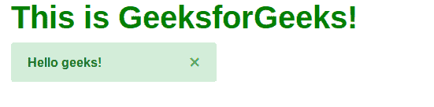
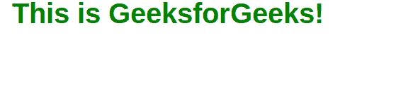
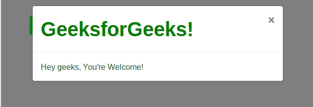

# 引导|关闭图标，通过示例消除内容

> 原文:[https://www . geeksforgeeks . org/bootstrap-close-icon-for-discovery-content-with-examples/](https://www.geeksforgeeks.org/bootstrap-close-icon-for-dismissing-content-with-examples/)

引导中的**关闭图标**是一个实用程序，用于关闭任何内容(例如，警报、模式、弹出窗口)。它由一个通用的交叉/关闭图标表示。
下面是一个示例 HTML 代码，包括一个关闭图标，用于关闭引导中的内容:

## 超文本标记语言

```
<!doctype html>
<html>
    <head>
        <!-- Bootstrap CSS -->
        <link rel="stylesheet" href="https://maxcdn.bootstrapcdn.com/bootstrap/4.0.0/css/bootstrap.min.css" integrity="sha384-Gn5384xqQ1aoWXA+058RXPxPg6fy4IWvTNh0E263XmFcJlSAwiGgFAW/dAiS6JXm" crossorigin="anonymous">       

        <!-- Optional JavaScript -->
        <!-- jQuery first, then Popper.js,
             then Bootstrap JS -->
        <script src="https://code.jquery.com/jquery-3.3.1.slim.min.js" integrity="sha384-q8i/X+965DzO0rT7abK41JStQIAqVgRVzpbzo5smXKp4YfRvH+8abtTE1Pi6jizo" crossorigin="anonymous"></script>
        <script src="https://cdnjs.cloudflare.com/ajax/libs/popper.js/1.14.3/umd/popper.min.js" integrity="sha384-ZMP7rVo3mIykV+2+9J3UJ46jBk0WLaUAdn689aCwoqbBJiSnjAK/l8WvCWPIPm49" crossorigin="anonymous"></script>
        <script src="https://stackpath.bootstrapcdn.com/bootstrap/4.1.3/js/bootstrap.min.js" integrity="sha384-ChfqqxuZUCnJSK3+MXmPNIyE6ZbWh2IMqE241rYiqJxyMiZ6OW/JmZQ5stwEULTy" crossorigin="anonymous"></script>
        <title>Close Icon!</title>
    </head>

    <body class="container mt-5">

        <!--Close Icon-->
        <button type="button" class="close">
        <span>×</span>
        </button>

    </body>
</html>                   
```

**注意:****数据消除**属性可以与按钮标签一起使用，以消除组件，如模式或警报。

### 关闭图标以消除警报

**示例:**

## 超文本标记语言

```
<!DOCTYPE html>
<html lang="en">
    <head>
        <!-- Bootstrap CSS -->
        <link rel="stylesheet" href="https://stackpath.bootstrapcdn.com/bootstrap/4.1.3/css/bootstrap.min.css" integrity="sha384-MCw98/SFnGE8fJT3GXwEOngsV7Zt27NXFoaoApmYm81iuXoPkFOJwJ8ERdknLPMO" crossorigin="anonymous">

        <!-- Include JavaScript -->
        <!-- jQuery first, then Popper.js, then Bootstrap JS -->
        <script src="https://code.jquery.com/jquery-3.3.1.slim.min.js" integrity="sha384-q8i/X+965DzO0rT7abK41JStQIAqVgRVzpbzo5smXKp4YfRvH+8abtTE1Pi6jizo" crossorigin="anonymous"></script>
        <script src="https://cdnjs.cloudflare.com/ajax/libs/popper.js/1.14.3/umd/popper.min.js" integrity="sha384-ZMP7rVo3mIykV+2+9J3UJ46jBk0WLaUAdn689aCwoqbBJiSnjAK/l8WvCWPIPm49" crossorigin="anonymous"></script>
        <script src="https://stackpath.bootstrapcdn.com/bootstrap/4.1.3/js/bootstrap.min.js" integrity="sha384-ChfqqxuZUCnJSK3+MXmPNIyE6ZbWh2IMqE241rYiqJxyMiZ6OW/JmZQ5stwEULTy" crossorigin="anonymous"></script>

        <style media="screen">
            h1{
            color:green;
            font-weight: bold;}
        </style>

        <title>Close Icon!</title>
    </head>

    <body class="container">
        <h1>This is GeeksforGeeks!</h1>

        <!--Alert-->
        <div class="alert alert-success alert-dismissible
            fade show w-50" role="alert">

            <strong>Hello geeks!</strong>

            <!--Close Icon-->
            <button type="button" class="btn close"
                data-dismiss="alert" aria-label="Close">

                <span aria-hidden="true">×</span>
            </button>
        </div>
    </body>
</html>                   
```

**输出:**
前:



之后:



### 关闭图标以关闭模式

**示例:**

## 超文本标记语言

```
<!DOCTYPE html>
<html>
    <head>
        <!-- Bootstrap CSS -->
        <link rel="stylesheet" href="https://stackpath.bootstrapcdn.com/bootstrap/4.1.3/css/bootstrap.min.css" integrity="sha384-MCw98/SFnGE8fJT3GXwEOngsV7Zt27NXFoaoApmYm81iuXoPkFOJwJ8ERdknLPMO" crossorigin="anonymous">

        <style media="screen">
            h1{
            color:green;
            font-weight: bold;}
        </style>

        <title>Close Icon!</title>

        <!-- Include JavaScript -->
        <!-- jQuery first, then Popper.js, then Bootstrap JS -->
        <script src="https://code.jquery.com/jquery-3.3.1.slim.min.js" integrity="sha384-q8i/X+965DzO0rT7abK41JStQIAqVgRVzpbzo5smXKp4YfRvH+8abtTE1Pi6jizo" crossorigin="anonymous"></script>
        <script src="https://cdnjs.cloudflare.com/ajax/libs/popper.js/1.14.3/umd/popper.min.js" integrity="sha384-ZMP7rVo3mIykV+2+9J3UJ46jBk0WLaUAdn689aCwoqbBJiSnjAK/l8WvCWPIPm49" crossorigin="anonymous"></script>
        <script src="https://stackpath.bootstrapcdn.com/bootstrap/4.1.3/js/bootstrap.min.js" integrity="sha384-ChfqqxuZUCnJSK3+MXmPNIyE6ZbWh2IMqE241rYiqJxyMiZ6OW/JmZQ5stwEULTy" crossorigin="anonymous"></script>
    </head>

    <body class="container mt-5">

        <!-- Button trigger modal -->
        <button type="button" class="btn btn-success"
            data-toggle="modal" data-target="#geekymodal">
            Click here to launch modal!
        </button>

        <!-- Modal -->
        <div class="modal fade" id="geekymodal"
            tabindex="-1" role="dialog" aria-labelledby="geekymodal"
                aria-hidden="true">
            <div class="modal-dialog" role="document">
                <div class="modal-content">
                    <div class="modal-header">

                        <h1 class="modal-title">
                            GeeksforGeeks!
                        </h1>

                        <!--Close Icon-->
                        <button type="button" class="btn close"
                            data-dismiss="modal" aria-label="Close">
                            <span aria-hidden="true">×</span>
                        </button>
                    </div>

                    <div class="modal-body">
                        Hey geeks, You're Welcome!
                    </div>
                </div>
            </div>
        </div>
    </body>
</html>                   
```

**输出:**
前:



之后:


**支持的浏览器:**

*   谷歌 Chrome
*   微软公司出品的 web 浏览器
*   火狐浏览器
*   歌剧
*   旅行队