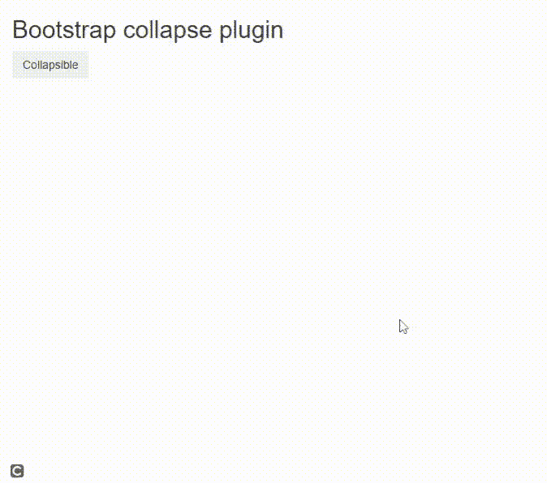
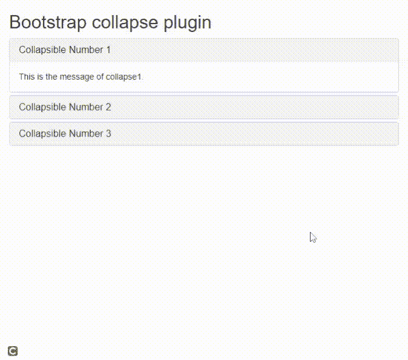

# 引导折叠插件

> 原文:[https://www.geeksforgeeks.org/bootstrap-collapse-plugin/](https://www.geeksforgeeks.org/bootstrap-collapse-plugin/)

引导**折叠**插件有助于折叠网页内容并切换其在应用程序中的可见性。该插件有助于划分页面内容，使其易于折叠，并支持许多内容选项，如手风琴。

**方法:** Bootstrap 提供一些 JavaScript 函数作为属性，折叠 JavaScript 插件附带一个名为 *data-** 的属性。

要切换任何数据:

*   在切换按钮中*数据切换*属性被设置为*折叠*。
*   *数据目标*被设置为您想要切换的 div 的类或 id。
*   将 div 类设置为*数据-切换=折叠您想要切换的*，以便数据最初不可见。

**例 1:**

## 超文本标记语言

```html
<!DOCTYPE html>
<html>

<head>
    <meta name="viewport" content=
        "width=device-width, initial-scale=1">

    <link rel="stylesheet" href=
"https://maxcdn.bootstrapcdn.com/bootstrap/3.4.1/css/bootstrap.min.css">

    <script src=
"https://ajax.googleapis.com/ajax/libs/jquery/3.5.1/jquery.min.js">
    </script>

    <script src=
"https://maxcdn.bootstrapcdn.com/bootstrap/3.4.1/js/bootstrap.min.js">
    </script>
</head>

<body>
    <div class="container">
        <h2>Bootstrap collapse plugin</h2>
        <button class="btn" data-toggle="collapse"
            data-target="#disappear">
            Collapsible
        </button>

        <div id="disappear" class="collapse">
            This is a disappearing message
        </div>
    </div>
</body>

</html>
```

**输出:**



**示例 2:** 在手风琴中，您可能需要另一个名为*数据父项*的属性，该属性确保如果显示其中一个项目，给定父项下的所有可折叠元素都将关闭。在这种情况下，将*数据父级*属性设置为容器 *div* 的 *id* 或*类*。

## 超文本标记语言

```html
<!DOCTYPE html>
<html>

<head>
    <meta name="viewport" content=
        "width=device-width, initial-scale=1">

    <link rel="stylesheet" href=
"https://maxcdn.bootstrapcdn.com/bootstrap/3.4.1/css/bootstrap.min.css">

    <script src=
"https://ajax.googleapis.com/ajax/libs/jquery/3.5.1/jquery.min.js">
    </script>

    <script src=
"https://maxcdn.bootstrapcdn.com/bootstrap/3.4.1/js/bootstrap.min.js">
    </script>
</head>

<body>

    <div class="container">
        <h2>Bootstrap collapse plugin</h2>
        <div class="panel-group" id="accordion">
            <div class="panel panel-default">
                <div class="panel-heading">
                    <h4 class="panel-title">
                        <a data-toggle="collapse"
                            data-parent="#accordion"
                            href="#collapse1">
                            Collapsible Number 1
                        </a>
                    </h4>
                </div>
                <div id="collapse1" class=
                    "panel-collapse collapse in">
                    <div class="panel-body">
                        This is the message of collapse1.
                    </div>
                </div>
            </div>
            <div class="panel panel-default">
                <div class="panel-heading">
                    <h4 class="panel-title">
                        <a data-toggle="collapse"
                            data-parent="#accordion"
                            href="#collapse2">
                            Collapsible Number 2
                        </a>
                    </h4>
                </div>
                <div id="collapse2" class=
                    "panel-collapse collapse">
                    <div class="panel-body">
                        This is the message of collapse2.
                    </div>
                </div>
            </div>
            <div class="panel panel-default">
                <div class="panel-heading">
                    <h4 class="panel-title">
                        <a data-toggle="collapse"
                            data-parent="#accordion"
                            href="#collapse3">
                            Collapsible Number 3
                        </a>
                    </h4>
                </div>
                <div id="collapse3" class=
                    "panel-collapse collapse">
                    <div class="panel-body">
                        This is the message of collapse3.
                    </div>
                </div>
            </div>
        </div>
    </div>

</body>

</html>
```

**输出:**



**支持的浏览器:**

*   谷歌 Chrome
*   微软边缘
*   火狐浏览器
*   歌剧
*   旅行队