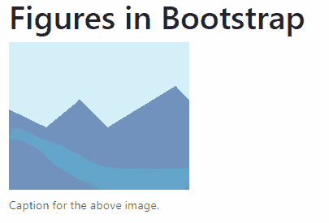

# 引导图|带示例的图形类

> 原文:[https://www . geesforgeks . org/bootstrap-figure-class-with-examples/](https://www.geeksforgeeks.org/bootstrap-figure-class-with-examples/)

当需要显示一段内容时，使用**图形**，通常是带有可选标题的图像。Bootstrap 中的图形类用于为默认图形元素添加样式。

*   基础**。图**类用于表示一个图元素。
*   **。图-img** 用于指示图元素中使用的图像。
*   **。图形-标题**可用于在图形下方显示标题。

**示例**:使用**。图**类带样本图像。

```
<!DOCTYPE html>
<html>
<head>
    <!-- Including Bootstrap CSS -->
    <link rel="stylesheet" href="https://maxcdn.bootstrapcdn.com/bootstrap/4.0.0/css/bootstrap.min.css">
    <title>Figures in Bootstrap</title>
</head>

<body>
    <div class="container">
        <h1>Figures in Bootstrap</h1>
        <figure class="figure">
            
        </figure>
</body>
</html>                    
```

**输出:**


**示例**:使用**。图-标题**类在图像下方显示标题。此类与 **< figcaption >** 标签一起使用。

```
<!DOCTYPE html>
<html>
<head>
    <!-- Add Bootstrap CSS -->
    <link rel="stylesheet" href="https://maxcdn.bootstrapcdn.com/bootstrap/4.0.0/css/bootstrap.min.css">

    <title>Figures in Bootstrap</title>
</head>

<body>
    <div class="container">
        <h1>Figures in Bootstrap</h1>

        <figure class="figure">
            

            <figcaption class="figure-caption">
                Caption for the above image.
            </figcaption>
        </figure>
</body>
</html>                    
```

**输出:**


**参考**:[https://getbootstrap.com/docs/4.0/content/figures/](https://getbootstrap.com/docs/4.0/content/figures/)