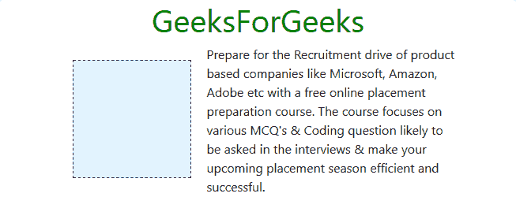
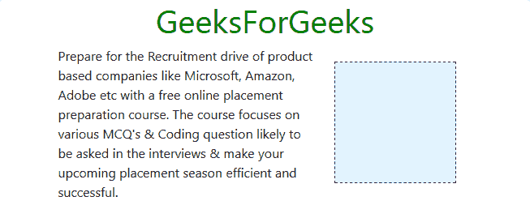

# 引导|浮动实用程序示例

> 原文:[https://www . geesforgeks . org/bootstrap-float-utilities-with-examples/](https://www.geeksforgeeks.org/bootstrap-float-utilities-with-examples/)

Bootstrap 为我们提供了一系列的 float 实用程序类，允许一个元素左右浮动，或者使其不浮动，就像 [CSS float](https://www.geeksforgeeks.org/css-float/) 属性一样。除此之外，bootstrap 还提供了响应的浮动类，使元素根据视口大小浮动。

**引导断点:**

*   **sm:** 视口大于 576px。
*   **md:** 视口大于 768px。
*   **lg:** 视口大于 992px。
*   **xl:** 视口大于 1200px。

**普通浮动类**

*   **float-left:** It makes the element to float left on all viewport sizes.

    **示例:**

    ```html
    <!DOCTYPE html>
    <html>
      <head>   
        <!-- Custom CSS -->
        <style>
          h1.head{
            color: green;
            text-align: center;
          }
          div.box{
            height: 150px;
            width: 150px;
            border: 1px dashed black;
            background: #E3F2FD;
            margin: 20px;
          }
        </style>

        <!-- Bootstrap CSS -->
        <link rel="stylesheet" href="https://stackpath.bootstrapcdn.com/bootstrap/4.2.1/css/bootstrap.min.css" integrity="sha384-GJzZqFGwb1QTTN6wy59ffF1BuGJpLSa9DkKMp0DgiMDm4iYMj70gZWKYbI706tWS" crossorigin="anonymous">

        <title>Hello, world!</title>
      </head>
      <body>
        <div class="container"><!-- For making div reponsive -->
          <h1 class="head">GeeksForGeeks</h1>

          <!-- float-left, bootstrap class -->
          <div class="float-left box">

          </div>

          <p>
            Prepare for the Recruitment drive of product
            based companies like Microsoft, Amazon, Adobe
            etc with a free online placement preparation
            course. The course focuses on various MCQ's
            & Coding question likely to be asked in the
            interviews & make your upcoming placement
            season efficient and successful.
          </p>

        </div>

        <!-- Link JavaScript -->
        <!-- jQuery first, then Popper.js, then Bootstrap JS -->
        <script src="https://code.jquery.com/jquery-3.3.1.slim.min.js" integrity="sha384-q8i/X+965DzO0rT7abK41JStQIAqVgRVzpbzo5smXKp4YfRvH+8abtTE1Pi6jizo" crossorigin="anonymous"></script>
        <script src="https://cdnjs.cloudflare.com/ajax/libs/popper.js/1.14.6/umd/popper.min.js" integrity="sha384-wHAiFfRlMFy6i5SRaxvfOCifBUQy1xHdJ/yoi7FRNXMRBu5WHdZYu1hA6ZOblgut" crossorigin="anonymous"></script>
        <script src="https://stackpath.bootstrapcdn.com/bootstrap/4.2.1/js/bootstrap.min.js" integrity="sha384-B0UglyR+jN6CkvvICOB2joaf5I4l3gm9GU6Hc1og6Ls7i6U/mkkaduKaBhlAXv9k" crossorigin="anonymous"></script>
      </body>
    </html>
    ```

    **输出:**

    

*   **float-right:** It makes the element to float right on all viewport sizes.

    **示例:**

    ```html
    <!DOCTYPE html>

    <html>
      <head>

        <!-- Custom CSS -->
        <style>
          h1.head{
            color: green;
            text-align: center;
          }
          div.box{
            height: 150px;
            width: 150px;
            border: 1px dashed black;
            background: #E3F2FD;
            margin: 20px;
          }
        </style>

        <!-- Bootstrap CSS -->
        <link rel="stylesheet" href="https://stackpath.bootstrapcdn.com/bootstrap/4.2.1/css/bootstrap.min.css" integrity="sha384-GJzZqFGwb1QTTN6wy59ffF1BuGJpLSa9DkKMp0DgiMDm4iYMj70gZWKYbI706tWS" crossorigin="anonymous">

        <title>Hello, world!</title>
      </head>
      <body>
        <div class="container"><!-- For making div reponsive -->
          <h1 class="head">GeeksForGeeks</h1>

          <!-- float-right, bootstrap class -->
          <div class="float-right box">

          </div>

          <p>
            Prepare for the Recruitment drive of product
            based companies like Microsoft, Amazon, Adobe
            etc with a free online placement preparation
            course. The course focuses on various MCQ's
            & Coding question likely to be asked in the
            interviews & make your upcoming placement
            season efficient and successful.
          </p>

        </div>

        <!-- Link JavaScript -->
        <!-- jQuery first, then Popper.js, then Bootstrap JS -->
        <script src="https://code.jquery.com/jquery-3.3.1.slim.min.js" integrity="sha384-q8i/X+965DzO0rT7abK41JStQIAqVgRVzpbzo5smXKp4YfRvH+8abtTE1Pi6jizo" crossorigin="anonymous"></script>
        <script src="https://cdnjs.cloudflare.com/ajax/libs/popper.js/1.14.6/umd/popper.min.js" integrity="sha384-wHAiFfRlMFy6i5SRaxvfOCifBUQy1xHdJ/yoi7FRNXMRBu5WHdZYu1hA6ZOblgut" crossorigin="anonymous"></script>
        <script src="https://stackpath.bootstrapcdn.com/bootstrap/4.2.1/js/bootstrap.min.js" integrity="sha384-B0UglyR+jN6CkvvICOB2joaf5I4l3gm9GU6Hc1og6Ls7i6U/mkkaduKaBhlAXv9k" crossorigin="anonymous"></script>
      </body>
    </html>
    ```

    **输出:**
    

*   **float-none:** It makes the element not to float across all viewport sizes.
    **Example:**

    ```html
    <!DOCTYPE html>

    <html>
      <head>
        <!-- Custom CSS -->
        <style>
          h1.head{
            color: green;
            text-align: center;
          }
          div.box{
            height: 150px;
            width: 150px;
            border: 1px dashed black;
            background: #E3F2FD;
            margin: 20px;
          }
        </style>

        <!-- Bootstrap CSS -->
        <link rel="stylesheet" href="https://stackpath.bootstrapcdn.com/bootstrap/4.2.1/css/bootstrap.min.css" integrity="sha384-GJzZqFGwb1QTTN6wy59ffF1BuGJpLSa9DkKMp0DgiMDm4iYMj70gZWKYbI706tWS" crossorigin="anonymous">

        <title>Hello, world!</title>
      </head>
      <body>
        <div class="container"><!-- For making div reponsive -->
          <h1 class="head">GeeksForGeeks</h1>

          <!-- float-none, bootstrap class -->
          <div class="float-none box">

          </div>

          <p>
            Prepare for the Recruitment drive of product
            based companies like Microsoft, Amazon, Adobe
            etc with a free online placement preparation
            course. The course focuses on various MCQ's
            & Coding question likely to be asked in the
            interviews & make your upcoming placement
            season efficient and successful.
          </p>

        </div>

        <!-- Link JavaScript -->
        <!-- jQuery first, then Popper.js, then Bootstrap JS -->
        <script src="https://code.jquery.com/jquery-3.3.1.slim.min.js" integrity="sha384-q8i/X+965DzO0rT7abK41JStQIAqVgRVzpbzo5smXKp4YfRvH+8abtTE1Pi6jizo" crossorigin="anonymous"></script>
        <script src="https://cdnjs.cloudflare.com/ajax/libs/popper.js/1.14.6/umd/popper.min.js" integrity="sha384-wHAiFfRlMFy6i5SRaxvfOCifBUQy1xHdJ/yoi7FRNXMRBu5WHdZYu1hA6ZOblgut" crossorigin="anonymous"></script>
        <script src="https://stackpath.bootstrapcdn.com/bootstrap/4.2.1/js/bootstrap.min.js" integrity="sha384-B0UglyR+jN6CkvvICOB2joaf5I4l3gm9GU6Hc1og6Ls7i6U/mkkaduKaBhlAXv9k" crossorigin="anonymous"></script>
      </body>
    </html>
    ```

    **输出:**
    

**响应浮动类**:

| 班级 | 描述 |
| --- | --- |
| 左浮动 | 它使元素在大于 576px (sm)的视口中向左浮动。 |
| 右浮动 | 它使元素在大于 576px (sm)的视口中向右浮动。 |
| 浮动-sm-无 | 它使元素不会在大于 576px (sm)的视口中浮动。 |
| 浮动-纵向-左侧 | 它使元素在大于 768px (md)的视口中向左浮动。 |
| 浮动-纵向-右侧 | 它使元素在大于 768px (md)的视口中向右浮动。 |
| 浮动-MD-无 | 它使元素不会在大于 768px (md)的视口中浮动。 |
| 浮动-LG-左侧 | 它使元素在大于 992px (lg)的视口中向左浮动。 |
| 浮动-LG-右侧 | 它使元素在大于 992px (lg)的视口中向右浮动。 |
| 浮动-LG-无 | 它使元素不会在大于 992px (lg)的视口中浮动。 |
| 左浮动-xl | 它使元素在大于 1200px (xl)的视口中向左浮动。 |
| 浮动-XL-右侧 | 它使元素在大于 1200px (xl)的视口中向右浮动。 |
| 浮点-XL-无 | 它使元素不会在大于 1200px (xl)的视口中浮动。 |

**示例:** float-md-right。

```html
<!DOCTYPE html>

<html>
  <head>
    <!-- Custom CSS -->
    <style>
      h1.head{
        color: green;
        text-align: center;
      }
      div.box{
        height: 150px;
        width: 150px;
        border: 1px dashed black;
        background: #E3F2FD;
        margin: 20px;
      }
    </style>

    <!-- Bootstrap CSS -->
    <link rel="stylesheet" href="https://stackpath.bootstrapcdn.com/bootstrap/4.2.1/css/bootstrap.min.css" integrity="sha384-GJzZqFGwb1QTTN6wy59ffF1BuGJpLSa9DkKMp0DgiMDm4iYMj70gZWKYbI706tWS" crossorigin="anonymous">

    <title>Hello, world!</title>
  </head>
  <body>
    <div class="container"><!-- For making div reponsive -->
      <h1 class="head">GeeksForGeeks</h1>

      <!-- float-md-right, bootstrap class -->
      <div class="float-md-right box">

      </div>

      <p>
        Prepare for the Recruitment drive of product
        based companies like Microsoft, Amazon, Adobe
        etc with a free online placement preparation
        course. The course focuses on various MCQ's
        & Coding question likely to be asked in the
        interviews & make your upcoming placement
        season efficient and successful.
      </p>

    </div>

    <!-- Link JavaScript -->
    <!-- jQuery first, then Popper.js, then Bootstrap JS -->
    <script src="https://code.jquery.com/jquery-3.3.1.slim.min.js" integrity="sha384-q8i/X+965DzO0rT7abK41JStQIAqVgRVzpbzo5smXKp4YfRvH+8abtTE1Pi6jizo" crossorigin="anonymous"></script>
    <script src="https://cdnjs.cloudflare.com/ajax/libs/popper.js/1.14.6/umd/popper.min.js" integrity="sha384-wHAiFfRlMFy6i5SRaxvfOCifBUQy1xHdJ/yoi7FRNXMRBu5WHdZYu1hA6ZOblgut" crossorigin="anonymous"></script>
    <script src="https://stackpath.bootstrapcdn.com/bootstrap/4.2.1/js/bootstrap.min.js" integrity="sha384-B0UglyR+jN6CkvvICOB2joaf5I4l3gm9GU6Hc1og6Ls7i6U/mkkaduKaBhlAXv9k" crossorigin="anonymous"></script>
  </body>
</html>
```

**输出:**

<video class="wp-video-shortcode" id="video-265980-1" width="665" height="370" preload="metadata" controls=""><source type="video/webm" src="https://media.geeksforgeeks.org/wp-content/uploads/float-md-right.webm?_=1">[https://media.geeksforgeeks.org/wp-content/uploads/float-md-right.webm](https://media.geeksforgeeks.org/wp-content/uploads/float-md-right.webm)</video>
**Note:** We can use more that one float utility class simultaneously to get the desired results. For example we may set float-right and float-md-left, to float element to right on viewport size less than 768px and float to left when viewport is greater than 768px.

**示例:**

```html
<!DOCTYPE html>

<html>
  <head>
     <!-- Custom CSS -->
    <style>
      h1.head{
        color: green;
        text-align: center;
      }
      div.box{
        height: 150px;
        width: 150px;
        border: 1px dashed black;
        background: #E3F2FD;
        margin: 20px;
      }
    </style>

    <!-- Bootstrap CSS -->
    <link rel="stylesheet" href="https://stackpath.bootstrapcdn.com/bootstrap/4.2.1/css/bootstrap.min.css" integrity="sha384-GJzZqFGwb1QTTN6wy59ffF1BuGJpLSa9DkKMp0DgiMDm4iYMj70gZWKYbI706tWS" crossorigin="anonymous">

    <title>Hello, world!</title>
  </head>
  <body>
    <div class="container"><!-- For making div reponsive -->
      <h1 class="head">GeeksForGeeks</h1>

      <!-- float-right float-md-left, bootstrap classes -->
      <div class="float-right float-md-left box">

      </div>

      <p>
        Prepare for the Recruitment drive of product
        based companies like Microsoft, Amazon, Adobe
        etc with a free online placement preparation
        course. The course focuses on various MCQ's
        & Coding question likely to be asked in the
        interviews & make your upcoming placement
        season efficient and successful.
      </p>

    </div>

    <!-- Link JavaScript -->
    <!-- jQuery first, then Popper.js, then Bootstrap JS -->
    <script src="https://code.jquery.com/jquery-3.3.1.slim.min.js" integrity="sha384-q8i/X+965DzO0rT7abK41JStQIAqVgRVzpbzo5smXKp4YfRvH+8abtTE1Pi6jizo" crossorigin="anonymous"></script>
    <script src="https://cdnjs.cloudflare.com/ajax/libs/popper.js/1.14.6/umd/popper.min.js" integrity="sha384-wHAiFfRlMFy6i5SRaxvfOCifBUQy1xHdJ/yoi7FRNXMRBu5WHdZYu1hA6ZOblgut" crossorigin="anonymous"></script>
    <script src="https://stackpath.bootstrapcdn.com/bootstrap/4.2.1/js/bootstrap.min.js" integrity="sha384-B0UglyR+jN6CkvvICOB2joaf5I4l3gm9GU6Hc1og6Ls7i6U/mkkaduKaBhlAXv9k" crossorigin="anonymous"></script>
  </body>
</html>
```

**输出:**

<video class="wp-video-shortcode" id="video-265980-2" width="665" height="370" preload="metadata" controls=""><source type="video/webm" src="https://media.geeksforgeeks.org/wp-content/uploads/float-utility.webm?_=2">[https://media.geeksforgeeks.org/wp-content/uploads/float-utility.webm](https://media.geeksforgeeks.org/wp-content/uploads/float-utility.webm)</video>