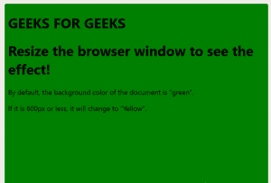
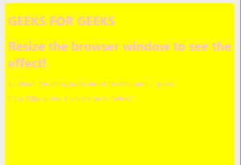

# 引导|媒体查询

> 原文:[https://www.geeksforgeeks.org/bootstrap-media-queries/](https://www.geeksforgeeks.org/bootstrap-media-queries/)

我们使用一些媒体查询将不同风格的表单传递到不同的设备，为我们的布局和界面创建合理的断点。这些断点主要基于最小视口宽度，允许我们随着视口的变化放大元素。

Bootstrap 主要在我们的布局、网格系统和组件的源 Sass 文件中使用以下媒体查询范围或断点。

```html
// Extra small devices (portrait phones, less than 576px)
// No media query since this is the default in Bootstrap

// Small devices (landscape phones, 576px and up)
@media (min-width: 576px) { ... }

// Medium devices (tablets, 768px and up)
@media (min-width: 768px) { ... }

// Large devices (desktops, 992px and up)
@media (min-width: 992px) { ... }

// Extra large devices (large desktops, 1200px and up)
@media (min-width: 1200px) { ... }

```

**媒体查询更改背景颜色**
复制下面的代码并保存。htm 扩展和调整浏览器窗口大小查看效果
**示例:**

```html
<!DOCTYPE html>
<html>
<head>
<style>
body {
  background-color:#008000;
  color: black;
}

/* On screens that are 992px wide or less,
   the background color is green */
@media screen and (max-width: 992px) {
  body {
    background-color: #008000;
    color: black;
  }
}

/* On screens that are 600px wide or less,
  the background color is yellow */
@media screen and (max-width: 600px) {
  body {
    background-color: Yellow;
    color: Pink;
  }
}
</style>
</head>
<body>
<h1>GEEKS FOR GEEKS</h1>
<h1>Resize the browser window to see the effect!</h1>
<p>By default, the background color of 
   the document is "green".</p>
<p> If it is 600px or less, 
     it will change to "Yellow".</p>

</body>
</html>
```


调整窗口大小后我们得到:

同样，媒体查询可以在不同的地方使用

1.  **栏目媒体查询**
2.  **菜单的媒体查询**
3.  **通过媒体查询改变字体大小**
4.  **方位:人像/风景等..**