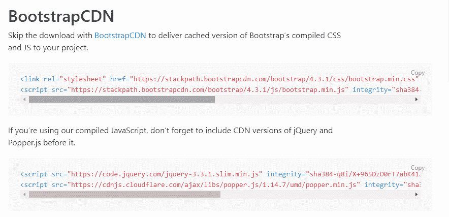
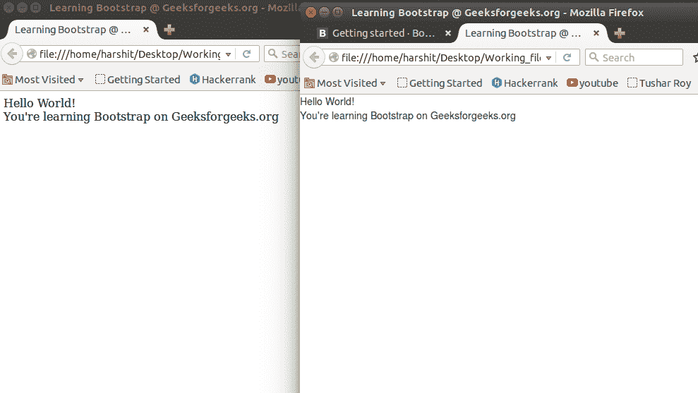
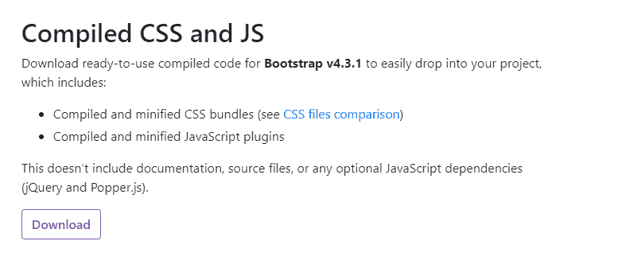

# BootStrap (Part-1) |介绍与安装

> 原文:[https://www . geesforgeks . org/bootstrap-part-1-简介-安装/](https://www.geeksforgeeks.org/bootstrap-part-1-introduction-and-installation/)

要开始网络开发，你可以先浏览一下本文。

1.  [电网系统](https://www.geeksforgeeks.org/bootstrap-part-2/)
2.  [按钮、图形、表格](https://www.geeksforgeeks.org/bootstrap-part-3/)
3.  [垂直形式、水平形式、直列形式](https://www.geeksforgeeks.org/bootstrap-part-4/)
4.  [下拉和响应标签](https://www.geeksforgeeks.org/bootstrap-part-5/)
5.  [进度条和大屏幕](https://www.geeksforgeeks.org/bootstrap-part-6-progress-bar-jumbotron/)

Bootstrap 是一个免费的开源工具集合，用于创建网站和网络应用程序。它是最流行的 HTML、CSS 和 JavaScript 框架，用于开发响应迅速、移动优先的网站。它解决了我们曾经遇到的许多问题，其中之一就是跨浏览器兼容性问题。如今，这些网站非常适合所有浏览器(IE、火狐和 Chrome)和所有大小的屏幕(台式机、平板电脑、平板电脑和手机)。这都要感谢 Bootstrap 的开发者——推特的马克·奥托和雅各布·桑顿，尽管后来它被宣布为开源项目。

**选择 Bootstrap 的理由:**

*   更快更容易的网络开发。
*   它创建独立于平台的网页。
*   它创建响应性网页。
*   它也是为响应移动设备而设计的。
*   它是免费的！可在 www.getbootstrap.com 获得

使用大量 CSS 和 JavaScript 构建的网站现在可以使用 Bootstrap 用几行代码来构建。引导主要由三个部分组成:

*   半铸钢ˌ钢性铸铁(Cast Semi-Steel)
*   字体
*   java 描述语言

**安装 Bootstrap:** 我们可以通过两种方式安装 Bootstrap。我将讨论安装引导的两种方法。但是在安装 Bootstrap 之前，我们必须编写一个基本的 html 文档来安装 Bootstrap。在这里，

**示例:**

```html
<!DOCTYPE html>
<html lang="en">

<head>
    <meta charset="utf-8">
    <title>Learning Bootstrap @ GeeksforGeeks.org</title>
    <meta name="description" content="Hello World">
</head>
<body>
      <div> Hello World!</div>
      <div> You're learning Bootstrap on Geeksforgeeks.org</div>
</body>
</html>
```

**方法 1 (BootstrapCDN):** 这种安装 BootstrapCDN 的方法相当简单，但需要互联网连接。强烈建议您遵循此方法。

*   **第一步:**转到[获取引导](https://getbootstrap.com/)并点击开始。向下滚动。

    

*   **第二步:**复制<链接>粘贴到 HTML 代码的头部。

    ```html
    <!DOCTYPE html>
    <html lang="en">
      <head>
        <meta charset="utf-8" />
        <title>Learning Bootstrap @ GeeksforGeeks.org</title>
        <meta name="description" content="Hello World" />
        <link
          rel="stylesheet"
          href=
    "https://stackpath.bootstrapcdn.com/bootstrap/4.3.1/css/bootstrap.min.css"
          integrity=
    "sha384-ggOyR0iXCbMQv3Xipma34MD+dH/1fQ784/j6cY/iJTQUOhcWr7x9JvoRxT2MZw1T"
          crossorigin="anonymous"/>
      </head>

      <body>
        <div>Hello World!</div>
        <div>You're learning Bootstrap on Geeksforgeeks.org</div>

        <script
          src=
    "https://code.jquery.com/jquery-3.3.1.slim.min.js"
          integrity=
    "sha384-q8i/X+965DzO0rT7abK41JStQIAqVgRVzpbzo5smXKp4YfRvH+8abtTE1Pi6jizo"
          crossorigin="anonymous">
        </script>
        <script
          src=
    "https://cdnjs.cloudflare.com/ajax/libs/popper.js/1.14.7/umd/popper.min.js"
          integrity=
    "sha384-UO2eT0CpHqdSJQ6hJty5KVphtPhzWj9WO1clHTMGa3JDZwrnQq4sF86dIHNDz0W1"
          crossorigin="anonymous">
        </script>
        <script
          src=
    "https://stackpath.bootstrapcdn.com/bootstrap/4.3.1/js/bootstrap.min.js"
          integrity=
    "sha384-JjSmVgyd0p3pXB1rRibZUAYoIIy6OrQ6VrjIEaFf/nJGzIxFDsf4x0xIM+B07jRM"
          crossorigin="anonymous">
        </script>
      </body>
    </html>
    ```

*   **第三步:**复制<脚本>标签，把那些东西像上面的代码一样粘贴在底部位置的正文部分。

*   **第四步:**答对了！您已经在 html 文档中安装了引导程序。要查看文档上的更改，请尝试在浏览器的单独选项卡上打开页面，您可以很容易地注意到这两个代码之间的差异。虽然，到目前为止感觉不到太大的不同，但在文章的后面部分会很明显。这里，左边的没有引导，右边的安装了引导。

**方法 2(编译好的 CSS 和 JS):** 这种安装 bootstrap 的方法也很简单，但是可以脱机工作(不需要互联网连接)，但是可能对某些浏览器不起作用。

*   **Step 1:** Goto [getbootstrap](https://getbootstrap.com/) and click Getting Started. Click on the Download Bootstrap button and download the compiled CSS and JS.

    

*   **第二步:**下载一个. zip 文件。提取它并进入分发文件夹。你会看到两个名为 CSS 和 JS 的文件夹。您可以在那里创建您的 HTML 文件，然后您必须将这些链接粘贴到它们各自的部分中。

    > <src = " js/bootstrap . min . js "></script><src =
    > 脚本 https://Ajax . Google APIs . com/Ajax/libs/jquery/2 . 1 . 3/jquery . min . js】【t】

    ```html
    <!DOCTYPE html>
    <html lang="en">

    <head>
        <meta charset="utf-8">
        <title>Learning Bootstrap @ GeeksforGeeks.org</title>
        <meta name="description" content="Hello World">
        <link rel="stylesheet" type="text/css" href="css/bootstrap.min.css">

    </head>

    <body>
          <div> Hello World!</div>
          <div> You're learning Bootstrap on Geeksforgeeks.org</div>

         <script src="js/bootstrap.min.js"> </script>
         <script src=
    "https://ajax.googleapis.com/ajax/libs/jquery/2.1.3/jquery.min.js">
         </script>
    </body>
    </html>
    ```

*   **HTML 3:** 用浏览器打开 HTML 文档，看看 bootstrap 带来的不同！这可能不支持更高版本的 Internet Explorer(8+)，对于他们来说，我们需要下载额外的文件，这很麻烦。所以，强烈建议遵循方法 A，方法 A 真的很简单。

    这只是安装和一些关于 Bootstrap 的基本知识。我们将在**下一部分**中讨论其他话题。继续学习！

文章作者[哈什特·古普塔](https://in.linkedin.com/pub/harshit-gupta/102/b71/605) : [ ](https://media.geeksforgeeks.org/wp-content/cdn-uploads/harshit.jpg) 
总部位于加尔各答的哈什特·古普塔是一位活跃的博主，对撰写时事、技术博客、故事和个人生活经历有着浓厚的兴趣。除了热爱写作，他还热爱编码和舞蹈。目前就读于 IIEST，他是 geeksforgeeks 的活跃博客撰稿人。你可以在[https://in.linkedin.com/pub/harshit-gupta/102/b71/605](https://in.linkedin.com/pub/harshit-gupta/102/b71/605)T11 找到他

**如果你也想在这里展示你的博客，请查看 [GBlog](http://geeksquiz.com/gblog/) 在 GeeksforGeeks 上的客座博文。**