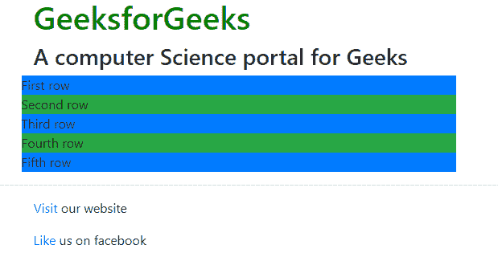

# 自举(Part-2) |电网系统

> 原文:[https://www.geeksforgeeks.org/bootstrap-part-2-grid-system/](https://www.geeksforgeeks.org/bootstrap-part-2-grid-system/)

1.  [介绍与安装](https://www.geeksforgeeks.org/beginning-bootstrap-part-1/)
2.  [按钮、图形、表格](https://www.geeksforgeeks.org/bootstrap-part-3/)
3.  [垂直形式、水平形式、直列形式](https://www.geeksforgeeks.org/bootstrap-part-4/)
4.  [下拉和响应标签](https://www.geeksforgeeks.org/bootstrap-part-5/)
5.  [进度条和大屏幕](https://www.geeksforgeeks.org/bootstrap-part-6-progress-bar-jumbotron/)

**先决条件:** [网络开发基础知识](https://www.geeksforgeeks.org/begin-web-development-with-a-head-start/)和[引导程序(第 1 部分)](https://www.geeksforgeeks.org/beginning-bootstrap-part-1/)

**电网系统:**在上一篇文章中，我们已经了解了引导及其安装。但是，从本文开始，我们将从学习 Bootstrap 开始。我们将在本文中讨论**引导网格系统**。

**网格系统:**引导网格系统允许页面中最多有 12 列。您可以单独使用它们中的每一个，也可以将它们合并在一起用于更宽的列。您可以使用总和为 12 的所有值组合。您可以使用宽度为 1 的 12 列，或宽度为 3 的 4 列或任何其他组合。


**网格类:**Bootstrap 网格系统有四个类，可以组合成更灵活的布局:

*   **xs ( < 576px):** 适用于人像手机。
*   **sm ( > =576px):** 适用于风景手机
*   **MD(>= 768 像素):**适用于片剂/药片
*   **lg ( > =992px):** 适用于小型台式机/笔记本电脑
*   **xl ( > =1200px):** 适用于大型台式机/笔记本电脑

**注意:**输出可以如图所示相差不大，这取决于你的屏幕大小。

**网格系统的组件:**我们将逐一学习网格系统的组件:

1.  **Containers**: Bootstrap requires a containing element to wrap site contents and house our grid system. The word ‘container’ is a container of row elements and row elements are ‘containers’ of the column elements. You will understand it more in the latter part of the article where we have dealt with columns.

    使用“容器”作为响应的固定宽度容器，使用“容器-流体”作为全宽容器，横跨视窗的整个宽度。

    **例:**

    ## 超文本标记语言

    ```
    <!DOCTYPE html>
    <html lang="en">
      <head>
        <meta charset="utf-8" />
        <meta name="viewport" 
              content="width=device-width, initial-scale=1" />
        <link
          rel="stylesheet"
          href=
    "https://maxcdn.bootstrapcdn.com/bootstrap/4.3.1/css/bootstrap.min.css"/>
        <script src=
    "https://ajax.googleapis.com/ajax/libs/jquery/3.4.0/jquery.min.js">
        </script>
        <script src=
    "https://cdnjs.cloudflare.com/ajax/libs/popper.js/1.14.7/umd/popper.min.js">
        </script>
        <script src=
    "https://maxcdn.bootstrapcdn.com/bootstrap/4.3.1/js/bootstrap.min.js">
        </script>
      </head>

      <body>
        <header>
          <div class="container">
            <h1 style="color: green">GeeksforGeeks</h1>
            <strong>A computer Science portal for Geeks</strong>
          </div>
        </header>

        <footer>
          <hr />
          <div class="container">

    <p>
              <a href="https://www.geeksforgeeks.org/"> 
              Visit </a> our website
            </p>

    <p>
              <a href="https://www.geeksforgeeks.org/"> 
              Like </a>us on facebook
            </p>

          </div>
        </footer>
      </body>
    </html>
    ```

    **Output:** 
    

    **注意:**<div>标签定义了 HTML 文档中的一个部分或一个部分。< div >标签用于对块元素进行分组，以便用 CSS 对它们进行格式化。

2.  **Rows:** Rows must be placed within a ‘container’ or ‘container-fluid’ for proper alignment and padding. We use rows to create horizontal groups of columns. 
    **Example:** 

    ## 超文本标记语言

    ```
    <!DOCTYPE html>
    <html lang="en">
      <head>
        <title>Bootstrap Example</title>
        <meta charset="utf-8" />
        <meta name="viewport" 
              content="width=device-width, initial-scale=1" />
        <link
          rel="stylesheet"
          href=
    "https://maxcdn.bootstrapcdn.com/bootstrap/4.3.1/css/bootstrap.min.css"/>
        <script src=
    "https://ajax.googleapis.com/ajax/libs/jquery/3.4.0/jquery.min.js">
        </script>
        <script src=
    "https://cdnjs.cloudflare.com/ajax/libs/popper.js/1.14.7/umd/popper.min.js">
        </script>
        <script src=
    "https://maxcdn.bootstrapcdn.com/bootstrap/4.3.1/js/bootstrap.min.js">
        </script>
      </head>
      <body>
        <header>
          <div class="container">
            <h1 style="color: green">GeeksforGeeks</h1>
            <strong>
                A computer Science portal for Geeks
            </strong>
          </div>
        </header>

        <div class="container">
          <div class="row">
            <div class="bg bg-primary w-100">
                First row
            </div>
          </div>
          <div class="row">
            <div class="bg bg-success w-100">
                Second row
            </div>
          </div>
          <div class="row">
            <div class="bg bg-primary w-100">
                Third row
            </div>
          </div>
          <div class="row">
            <div class="bg bg-success w-100">
                Fourth row
            </div>
          </div>
          <div class="row">
            <div class="bg bg-primary w-100">
                Fifth row
            </div>
          </div>
        </div>

        <footer>
          <hr />
          <div class="container">

    <p>
              <a href="https://www.geeksforgeeks.org/">
                   Visit</a> our website
            </p>

    <p>
              <a href="https://www.geeksforgeeks.org/">
                   Like </a>us on facebook
            </p>

          </div>
        </footer>
      </body>
    </html>
    ```

    **Output:** 
    
3.  **列:**网格列是通过指定您希望跨越的十二个可用列的数量来创建的。例如，三个相等的列将使用三个“col-sm-4”。
    **例:**

## 超文本标记语言

```
<!DOCTYPE html>
<html lang="en">
  <head>
    <title>Bootstrap Example</title>
    <meta charset="utf-8" />
    <meta name="viewport" content="width=device-width, initial-scale=1" />
    <link
      rel="stylesheet"
      href=
"https://maxcdn.bootstrapcdn.com/bootstrap/4.3.1/css/bootstrap.min.css"/>
    <script src=
"https://ajax.googleapis.com/ajax/libs/jquery/3.4.0/jquery.min.js">
    </script>
    <script src=
"https://cdnjs.cloudflare.com/ajax/libs/popper.js/1.14.7/umd/popper.min.js">
    </script>
    <script src=
"https://maxcdn.bootstrapcdn.com/bootstrap/4.3.1/js/bootstrap.min.js">
    </script>
  </head>
  <body>
    <header>
      <div class="container">
        <h1 style="color: green">GeeksforGeeks</h1>
        <strong>
            A computer Science portal for Geeks
        </strong>
      </div>
    </header>
    <div class="container">
      <div class="row">
        <div class="bg bg-primary w-100">First row</div>
      </div>
      <div class="row">
        <div class="bg bg-success w-100">Second row</div>
      </div>
    </div>
    <br />
    <div class="container">
      <div class="row">
        <div class="col-sm-4">
          <div class="well bg bg-danger">
              1st Column
          </div>
        </div>
        <div class="col-sm-4">
          <div class="well bg bg-warning">
              2nd Column
          </div>
        </div>
        <div class="col-sm-4">
          <div class="well bg bg-secondary">
              3rd Column
          </div>
        </div>
      </div>
    </div>

    <footer>
      <hr />
      <div class="container">

<p>
          <a href="https://www.geeksforgeeks.org/">
               Visit</a> our website
        </p>

<p>
          <a href="https://www.geeksforgeeks.org/">
               Like </a>us on facebook
        </p>

      </div>
    </footer>
  </body>
</html>
```

请记住，我们可以为不同的屏幕尺寸使用所有的网格类(xs、sm、md、lg 和 xl)。

**输出:**


但是，在这种情况下，我们将面临一个主要问题。请注意，对于像手机人像(xs)和风景(sm)这样的设备，这些列会堆叠在一起。如果我们希望我们的列保持在同一行，不管设备的大小如何，那么我们必须使用 xs。但是有时候看起来很丑。

因此，我们可以使用多种列选择来构建更加动态和强大的布局。假设我们定义了 4 列的属性，如下所示。

```
<div class="col-xs-2 col-sm-6 col-md-4 col-lg-5 col-xl-6">
<div class="col-xs-2 col-sm-6 col-md-4 col-lg-5 col-xl-6">
<div class="col-xs-2 col-sm-6 col-md-4 col-lg-5 col-xl-6">
<div class="col-xs-2 col-sm-6 col-md-4 col-lg-5 col-xl-6">
```

这意味着:

**例:**

## 超文本标记语言

```
<!DOCTYPE html>
<html lang="en">
  <head>
    <meta charset="utf-8" />
    <meta name="viewport" content="width=device-width, initial-scale=1" />
    <link
      rel="stylesheet"
      href=
"https://maxcdn.bootstrapcdn.com/bootstrap/4.3.1/css/bootstrap.min.css"/>
    <script src=
"https://ajax.googleapis.com/ajax/libs/jquery/3.4.0/jquery.min.js">
    </script>
    <script src=
"https://cdnjs.cloudflare.com/ajax/libs/popper.js/1.14.7/umd/popper.min.js">
    </script>
    <script src=
"https://maxcdn.bootstrapcdn.com/bootstrap/4.3.1/js/bootstrap.min.js">
    </script>
  </head>
  <body>
    <header>
      <div class="container">
        <h1 style="color: green">GeeksforGeeks</h1>
        <strong>
            A computer Science portal for Geeks
        </strong>
      </div>
    </header>
    <div class="container">
      <div class="row">
        <div class="bg bg-secondary w-100">
            First Row
        </div>
      </div>
      <div class="row">
        <div class="bg bg-primary w-100">
            Second row
        </div>
      </div>
    </div>
    <br />
    <div class="container">
      <div class="row">
        <div class="col-xs-2 col-sm-6 col-md-3 
                    col-lg-4 col-xl-6">
          <div class="well bg bg-success">
              First Column
          </div>
        </div>
        <div class="col-xs-2 col-sm-6 col-md-3 
                    col-lg-4 col-xl-6">
          <div class="well bg bg-danger">
              Second Column
          </div>
        </div>
        <div class="col-xs-2 col-sm-6 col-md-3 
                    col-lg-4 col-xl-6">
          <div class="well bg bg-warning">
              Third Column
          </div>
        </div>
        <div class="col-xs-2 col-sm-6 col-md-3 
                    col-lg-4 col-xl-6">
          <div class="well bg bg-primary">
              Fourth Column
          </div>
        </div>
      </div>
    </div>
    <footer>
      <hr />
      <div class="container">

<p>
          <a href="https://www.geeksforgeeks.org/">
               Visit</a> our website
        </p>

<p>
          <a href="https://www.geeksforgeeks.org/">
               Like </a>us on facebook
        </p>

      </div>
    </footer>
  </body>
</html>
```