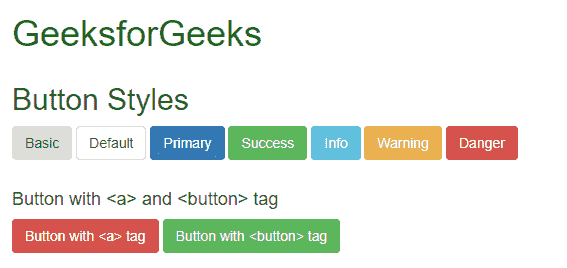
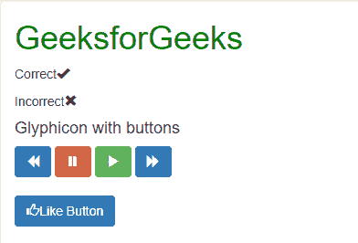
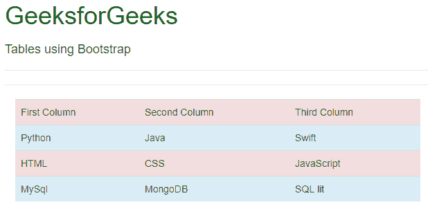

# 引导(第 3 部分)|按钮、图形、表格

> 原文:[https://www.geeksforgeeks.org/bootstrap-part-3/](https://www.geeksforgeeks.org/bootstrap-part-3/)

1.  [介绍与安装](https://www.geeksforgeeks.org/beginning-bootstrap-part-1/)
2.  [电网系统](https://www.geeksforgeeks.org/bootstrap-part-2/)
3.  [垂直形式、水平形式、直列形式](https://www.geeksforgeeks.org/bootstrap-part-4/)
4.  [下拉和响应标签](https://www.geeksforgeeks.org/bootstrap-part-5/)
5.  [进度条和大屏幕](https://www.geeksforgeeks.org/bootstrap-part-6-progress-bar-jumbotron/)

看完[之前的](https://www.geeksforgeeks.org/bootstrap-part-2/)文章，应该对 Bootstrap 的网格系统比较熟悉。现在，我们将学习制作按钮，所有新的图形和表格。我们开始吧。

*   [带](”)
    **示例:**

## 超文本标记语言

```
<!DOCTYPE html>
<html lang="en">
<head>
  <title>Bootstrap Example</title>
  <meta charset="utf-8">
  <meta name="viewport" content="width=device-width, initial-scale=1">
  <link rel="stylesheet" href="https://maxcdn.bootstrapcdn.com/bootstrap/3.4.0/css/bootstrap.min.css">
  <script src="https://ajax.googleapis.com/ajax/libs/jquery/3.4.0/jquery.min.js"></script>
  <script src="https://maxcdn.bootstrapcdn.com/bootstrap/3.4.0/js/bootstrap.min.js"></script>
</head>
<body>
    <div class="container" style="color:green">
     <h1>GeeksforGeeks</h1>
    </div>
<div class="container">
  <h2>Button Styles</h2>
  <button type="button" class="btn">Basic</button>
  <button type="button" class="btn btn-default">Default</button>
  <button type="button" class="btn btn-primary">Primary</button>
  <button type="button" class="btn btn-success">Success</button>
  <button type="button" class="btn btn-info">Info</button>
  <button type="button" class="btn btn-warning">Warning</button>
  <button type="button" class="btn btn-danger">Danger</button>
</div>
<br>

<div class="container">
  <h4>Button with <a> and  <button> tag</h4>
  <a href="https://ide.geeksforgeeks.org/tryit.php"class="btn btn-danger">
    Button with <a> tag </a>
  <button type="button" class="btn btn-success">Button with <button> tag </button>      
</div>

</body>
</html>
```

*   **输出:**



*   **华丽的花纹:**

Glyphicons 是一个由精确准备的单色图标和符号组成的库，创建时强调简单和易于定位。我们可以像这样在 span 标签中使用 Glyphicons:

```
<span class="Name of the glyphicon"> </span>
```

图形也可以用在这样的按钮中:

```
<a href="" class="btn btn-default"><span class="Name of the glyphicon"> </span> </a>
```

*   你可以在 http://getbootstrap.com/components 免费看到所有的文字。您可以复制它们的名称并粘贴到引号类中。如果你需要更具体的字体，可以去[http://glyphicons.com/](http://glyphicons.com/)购买。

*   **例:**

## 超文本标记语言

```
<!DOCTYPE html>
<html lang="en">
<head>
  <title>Bootstrap Example</title>
  <meta charset="utf-8">
  <meta name="viewport" content="width=device-width, initial-scale=1">
  <link rel="stylesheet" href="https://maxcdn.bootstrapcdn.com/bootstrap/3.4.0/css/bootstrap.min.css">
  <script src="https://ajax.googleapis.com/ajax/libs/jquery/3.4.0/jquery.min.js"></script>
  <script src="https://maxcdn.bootstrapcdn.com/bootstrap/3.4.0/js/bootstrap.min.js"></script>
</head>
<body>
    <div class="container" style="color:green">
     <h1>GeeksforGeeks</h1>

    </div>
    <div class="container">

<p>Correct<span class="glyphicon glyphicon-ok"></span></p>

<p>Incorrect<span class="glyphicon glyphicon-remove"></span></p>

        <h4>Glyphicon with buttons</h4>
        <a href="https://www.geeksforgeeks.org"class="btn btn-primary">
            <span class="glyphicon glyphicon-backward"></span> 
        </a>
        <a href="https://www.geeksforgeeks.org"class="btn btn-danger">
            <span class="glyphicon glyphicon-pause"></span> 
        </a>
        <a href="https://www.geeksforgeeks.org"class="btn btn-success">
            <span class="glyphicon glyphicon-play"></span> 
        </a>
        <a href="https://www.geeksforgeeks.org"class="btn btn-primary">
            <span class="glyphicon glyphicon-forward"></span> 
        </a>
    </div>
    <br>
    <div class="container">
        <a href="https://www.geeksforgeeks.org"class="btn btn-primary">
        <span class="glyphicon glyphicon-thumbs-up"></span>Like Button 
    </a>
    </div>
</body>
</html>
```

*   **输出:**



*   **诱人的桌子:**

为了创建表格，我们需要标记，其中我们使用标记来定义每一行，使用

| / | Mark to represent the actual data unit. In the table tab, we can add different classes, which can make our table look better. Some table classes can be table striped, table bounded, table hovering, table compressed and so on. You can find all the table classes here. The basic structure of the table is: |

```
<table class="table-striped">
   <tr>
      <td>First Column</td>
      <td>Second Column</td>
      <td>Third Column</td>
   </tr>
</table>
```

*   您也可以使用
    < tr >标签中的颜色为表格的每一行添加不同的颜色，如<tr class = " danger "></tr>
    同样，您也可以通过在< td >标签中包含颜色类别来为每个单元格添加颜色。
    **例:**

## 超文本标记语言

```
<!DOCTYPE html>
<html lang="en">
<head>
  <title>Bootstrap Example</title>
  <meta charset="utf-8">
  <meta name="viewport" content="width=device-width, initial-scale=1">
  <link rel="stylesheet" href="https://maxcdn.bootstrapcdn.com/bootstrap/3.4.0/css/bootstrap.min.css">
  <script src="https://ajax.googleapis.com/ajax/libs/jquery/3.4.0/jquery.min.js"></script>
  <script src="https://maxcdn.bootstrapcdn.com/bootstrap/3.4.0/js/bootstrap.min.js"></script>
</head>
<body>
    <div class="container" style="color:green">
     <h1>GeeksforGeeks</h1>

    </div>
    <div class="container">
        <h4>Tables using Bootstrap</h4>
        <hr><hr>
        <div class="container">
            <div class="bg bg-success">
                <table class="table table-hover">
                   <tr class="danger">
                    <td>First Column</td>
                    <td>Second Column</td>
                    <td>Third Column</td>
                   </tr>
                   <tr class="info">
                    <td>Python</td>
                    <td>Java</td>
                    <td>Swift</td>
                   </tr>
                   <tr class="danger">
                    <td>HTML</td>
                    <td>CSS</td>
                    <td>JavaScript</td>
                   </tr>
                   <tr class="info">
                    <td>MySql</td>
                    <td>MongoDB</td>
                    <td>SQL lit</td>
                   </tr>
                </table>
            </div>
       </div>
   </div>
</body>
</html>
```

*   **输出:**



**支持的浏览器:**

*   谷歌 Chrome
*   微软边缘
*   火狐浏览器
*   歌剧
*   狩猎