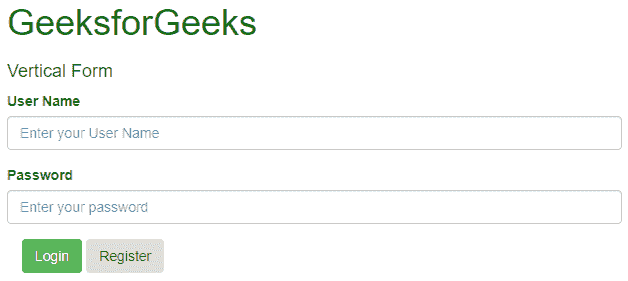
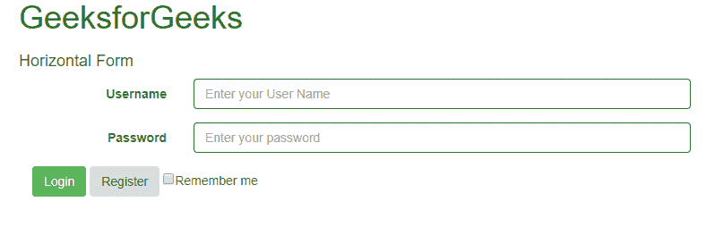
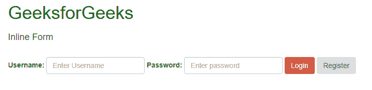

# 引导程序(第 4 部分)|垂直表单、水平表单、内嵌表单

> 原文:[https://www.geeksforgeeks.org/bootstrap-part-4/](https://www.geeksforgeeks.org/bootstrap-part-4/)

1.  [介绍与安装](https://www.geeksforgeeks.org/beginning-bootstrap-part-1/)
2.  [电网系统](https://www.geeksforgeeks.org/bootstrap-part-2/)
3.  [按钮、图形、表格](https://www.geeksforgeeks.org/bootstrap-part-3/)
4.  [下拉和响应标签](https://www.geeksforgeeks.org/bootstrap-part-5/)
5.  [进度条和大屏幕](https://www.geeksforgeeks.org/bootstrap-part-6-progress-bar-jumbotron/)

在本文中，我们将学习创建表单。几乎每个网站都使用表单，它们用于收集用户输入。
**表单** :
Bootstrap 提供 3 种表单布局，分别是:

*   垂直表单(默认)
*   水平形式
*   内嵌表单
*   **垂直表单:**
    首先，我们使用<表单>标签初始化表单。我们将把所有标签和表单控件包装在标签<中。这对于模板组件之间的最佳间距是必需的。
    现在，我们可以根据需要在这些标签中设计表单。我们可以使用标签来定义输入元素的标签。记住<标签>的< for >属性应该等于相关元素的 id 属性才能将它们绑定在一起。在标签标签之后，可以输入<输入>标签，该标签指定了用户可以输入数据的输入字段。要在输入标记中使用的类必须是 class =“form-control”。还可以使用占位符属性，该属性指定描述输入字段预期值的简短提示。

    **例:**

## 超文本标记语言

```
<!DOCTYPE html>
<html lang="en">
<head>
  <title>Bootstrap Example</title>
  <meta charset="utf-8">
  <meta name="viewport"
        content="width=device-width, initial-scale=1">
  <link rel="stylesheet"
        href=
"https://maxcdn.bootstrapcdn.com/bootstrap/3.4.0/css/bootstrap.min.css">
  <script src=
"https://ajax.googleapis.com/ajax/libs/jquery/3.4.0/jquery.min.js">
      </script>
  <script src=
"https://maxcdn.bootstrapcdn.com/bootstrap/3.4.0/js/bootstrap.min.js">
   </script>
</head>
<body>
    <div class="container" style="color:green">
     <h1>GeeksforGeeks</h1>
    </div>
<div class="container">
    <h4>Vertical Form</h4>
    <form action="">
        <div class="form-group">
            <label for="id1">User Name</label>
            <input class="form-control"
                   type="text"
                   id="id1"
                   placeholder="Enter your User Name">
        </div>
        <div class="form-group">
            <label for="id2">Password</label>
            <input class="form-control"
                   type="password"
                   id="id2"
                   placeholder="Enter your password">
        </div>
        <div class="container">
            <button type="button"
                    class="btn btn-success">Login</button>
            <button type="button"
                    class="btn btn-secondary">Register</button>
        </div>
    </form>
</div>

</body>
</html>
```

**输出:**



*   **水平形式:**

水平形式与垂直形式的区别不仅在于标记的数量，还在于形式的呈现方式。要使表单水平，请在

<form>元素中添加 class="form-horizontal "。如果您正在使用<label>元素，那么您必须使用 class="control-label "。另外，请记住，您可以使用 Bootstrap 的预定义网格类在水平布局中对齐标签和表单控件组。</label></form>

您还可以向标签和输入字段添加特定的样式。添加任何有警告、有成功、有错误等的类。在

标签中包含一个类，该类有一个形状组，当被选中时可以给它不同的效果。

**例:**

## 超文本标记语言

```
<!DOCTYPE html>
<html lang="en">
<head>
  <title>Bootstrap Example</title>
  <meta charset="utf-8">
  <meta name="viewport" content="width=device-width, initial-scale=1">
  <link rel="stylesheet"
        href=
"https://maxcdn.bootstrapcdn.com/bootstrap/3.4.0/css/bootstrap.min.css">
  <script src=
"https://ajax.googleapis.com/ajax/libs/jquery/3.4.0/jquery.min.js">
        </script>
  <script src=
"https://maxcdn.bootstrapcdn.com/bootstrap/3.4.0/js/bootstrap.min.js">
        </script>
</head>
<body>
    <div class="container" style="color:green">
     <h1>GeeksforGeeks</h1>
    </div>
<div class="container">
    <h4>Horizontal Form</h4>
    <form action="" class="form-horizontal">
        <div class="form-group has-success">
            <label class="control-label col-sm-2"
                   for="id1">Username</label>
            <div class="col-sm-6">
                <input class="form-control"
                       type="text"
                       id="id1"
                       placeholder="Enter your User Name">
            </div>
        </div>
        <div class="form-group has-success">
            <label class="control-label col-sm-2"
                   for="id2">Password</label>
            <div class="col-sm-6">
                <input class="form-control"
                       type="password"
                       id="id2"
                       placeholder="Enter your password">
            </div>
        </div>
        <div class="container">
            <button type="button" class="btn btn-success">
                    Login
            </button>
            <button type="button" class="btn btn-secondary">
                    Register
            </button>
            <label>
                <input type="checkbox">Remember me
            </label>
        </div>
    </form>
</div>

</body>
</html>
```

**输出:**



*   **内嵌表单:**

顾名思义，在内联形式中，所有元素都是内联的，左对齐的，标签在旁边。您只需要在 form 元素中添加 class="form-inline "。
使用 class="sr-only "可以隐藏内联表单的标签，这有时可能会导致问题。
你也可以在表单里面添加图案。为此，您必须添加 class="has-feedback "并在<输入>标记后添加 span 标记，在该标记中出现了字形。记住添加 form-control-feed 作为 span 标记的类。

**示例:**

## 超文本标记语言

```
<!DOCTYPE html>
<html lang="en">
<head>
  <title>Bootstrap Example</title>
  <meta charset="utf-8">
  <meta name="viewport" content="width=device-width, initial-scale=1">
  <link rel="stylesheet"
        href=
"https://maxcdn.bootstrapcdn.com/bootstrap/3.4.0/css/bootstrap.min.css">
  <script src=
"https://ajax.googleapis.com/ajax/libs/jquery/3.4.0/jquery.min.js">
     </script>
  <script src=
"https://maxcdn.bootstrapcdn.com/bootstrap/3.4.0/js/bootstrap.min.js">
    </script>
</head>
<body>
    <div class="container" style="color:green">
     <h1>GeeksforGeeks</h1>
    </div>
<div class="container">
    <h4>Inline Form</h4>
    <br>
  <form class="form-inline" action="/action_page.php">
    <label for="email">Username:</label>
    <input type="email"
           class="form-control"
           id="email"
           placeholder="Enter Username"
           name="email">
    <label for="pwd">Password:</label>
    <input type="password"
           class="form-control"
           id="pwd"
           placeholder="Enter password"
           name="pswd">
    <button type="button"
            class="btn btn-danger">Login</button>
    <button type="button"
            class="btn btn-secondary">Register</button>
  </form>

</div>

</body>
</html>
```

**输出:**



**支持的浏览器:**

*   谷歌 Chrome
*   微软公司出品的 web 浏览器
*   火狐浏览器
*   歌剧
*   旅行队