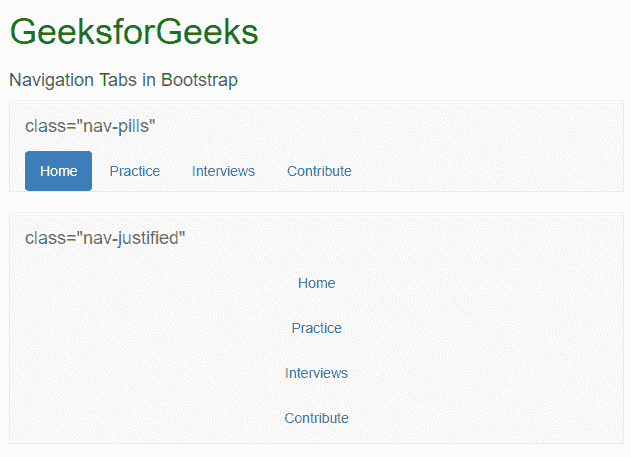

# 引导(第 5 部分)|下拉和响应标签

> 原文:[https://www.geeksforgeeks.org/bootstrap-part-5/](https://www.geeksforgeeks.org/bootstrap-part-5/)

1.  [介绍与安装](https://www.geeksforgeeks.org/beginning-bootstrap-part-1/)
2.  [电网系统](https://www.geeksforgeeks.org/bootstrap-part-2/)
3.  [按钮、图形、表格](https://www.geeksforgeeks.org/bootstrap-part-3/)
4.  [垂直形式、水平形式、直列形式](https://www.geeksforgeeks.org/bootstrap-part-4/)
5.  [进度条和大屏幕](https://www.geeksforgeeks.org/bootstrap-part-6-progress-bar-jumbotron/)

**使用引导的下拉菜单:**
在引导中，下拉菜单是使用 class =“drop down”创建的。我们要做的是创建一个按钮，然后将该按钮转换为下拉列表。

正如在前几个教程中已经开始的，可以使用<button>标签创建按钮。但是在这个按钮中，我们想要创建一个下拉列表，所以我们将添加 class="btn dropdown-toggle "和 data-toggle="dropdown "。</button>

基本上，它看起来像这样。

<button class="”btn" btn-default="" dropdown-toggle="" type="”button”" data-toggle="”dropdown”">我的下拉菜单</button>

现在我们想把这个按钮转换成一个下拉菜单。因此，我们将使用带有 class=“下拉菜单”的

*   Add items with labels.

**示例:**

## 超文本标记语言

```html
<!DOCTYPE html>
<html lang="en">
<head>
  <title>Bootstrap Example</title>
  <meta charset="utf-8">
  <meta name="viewport" content="width=device-width, initial-scale=1">
  <link rel="stylesheet" href="https://maxcdn.bootstrapcdn.com/bootstrap/3.4.0/css/bootstrap.min.css">
  <script src="https://ajax.googleapis.com/ajax/libs/jquery/3.4.0/jquery.min.js"></script>
  <script src="https://maxcdn.bootstrapcdn.com/bootstrap/3.4.0/js/bootstrap.min.js"></script>
</head>
<body>
    <div class="container" style="color:green">
     <h1>GeeksforGeeks</h1>
    </div>
<div class="container">
    <h4>Dropdown in Bootstrap</h4>
</div>
<div class="container">
    <div class="row">
            <div class="col-md-3">
                     <div class="dropdown">
                        <button class="btn btn-success dropdown-toggle" type="button" data-toggle="dropdown">GeeksforGeeks
                         <span class="caret"></span>
                        </button>
                        <ul class="dropdown-menu">
                            <li><a href="#">HTML</a></li>
                            <li><a href="#">CSS</a></li>
                            <li><a href="#">JavaScript</a></li>
                            <li><a href="#">SQL</a></li>
                        </ul>
                    </div>
            </div>
    </div>
</div>                  

</body>
</html>
```

**输出:**


您可以通过使用

*   Tag to make your drop-down menu better. To add a title to the drop-down list, use class="divider "to add a dividing line between items, and use class="disabled" to disable items in the list.

**示例:**

## 超文本标记语言

```html
<!DOCTYPE html>
<html lang="en">
<head>
  <title>Bootstrap Example</title>
  <meta charset="utf-8">
  <meta name="viewport" content="width=device-width, initial-scale=1">
  <link rel="stylesheet" href="https://maxcdn.bootstrapcdn.com/bootstrap/3.4.0/css/bootstrap.min.css">
  <script src="https://ajax.googleapis.com/ajax/libs/jquery/3.4.0/jquery.min.js"></script>
  <script src="https://maxcdn.bootstrapcdn.com/bootstrap/3.4.0/js/bootstrap.min.js"></script>
</head>
<body>
    <div class="container" style="color:green">
     <h1>GeeksforGeeks</h1>
    </div>
<div class="container">
    <h4>Dropdown in Bootstrap</h4>
</div>
<div class="container">
    <div class="row">
            <div class="col-md-3">
                     <div class="dropdown">
                        <button class="btn btn-success dropdown-toggle" type="button" data-toggle="dropdown">GeeksforGeeks
                         <span class="caret"></span>
                        </button>
                        <ul class="dropdown-menu">
                            <li class="drodown-header container"><b>HTML</b></li>
                            <li><a href="#">CSS</a></li>
                            <li><a href="#">JS</a></li>
                            <li class="divider"></li>
                            <li class="drodown-header container"><b>Language</b></li>
                            <li><a href="#"></a></li>
                            <li><a href="#">Python</a></li>
                            <li><a href="#">SQL</a></li>
                        </ul>
                    </div>
            </div>
    </div>
</div>                  

</body>
</html>
```

**输出:**


**使用引导的导航标签:**

要创建一个选项卡式导航菜单，我们需要使用

*   The label has been added. Remember to assign a class =“active "tab as the default active tab. Now, we need to use the class = "tab-pane" in the class = "tab-content" to write the content written in each tab. Please note that you must assign the id to the corresponding tab pane.

添加 class=“淡入淡出”会在切换标签时添加淡入淡出效果。

**示例:**

## 超文本标记语言

```html
<!DOCTYPE html>
<html lang="en">
<head>
  <title>Bootstrap Example</title>
  <meta charset="utf-8">
  <meta name="viewport" content="width=device-width, initial-scale=1">
  <link rel="stylesheet" href="https://maxcdn.bootstrapcdn.com/bootstrap/3.4.0/css/bootstrap.min.css">
  <script src="https://ajax.googleapis.com/ajax/libs/jquery/3.4.0/jquery.min.js"></script>
  <script src="https://maxcdn.bootstrapcdn.com/bootstrap/3.4.0/js/bootstrap.min.js"></script>
</head>
<body>
    <div class="container" style="color:green">
     <h1>GeeksforGeeks</h1>
    </div>
<div class="container">
    <h4>Navigation Tabs in Bootstrap</h4>
</div>
<div class="container">
    <nav class="navbar navbar-default">
  <div class="container-fluid">
    <div class="navbar-header">
      <a class="navbar-brand" href="#">Nav bar</a>
    </div>
    <ul class="nav navbar-nav">
      <li class="active"><a href="#">Home</a></li>
      <li><a href="#">Practice</a></li>
      <li><a href="#">Interviews</a></li>
      <li><a href="#">Contribute</a></li>
    </ul>
  </div>
</nav>

</div>

</body>
</html>
```

**输出:**


您可以通过将 class =“nav bar-nav”更改为“nav-pits”或“nav-stacked”来更改选项卡的外观，如果您希望您的选项卡覆盖整个屏幕，请尝试添加 class =“nav-aligned”
类似于 Dropdowns，我们可以使用 class =“disabled”禁用任何选项卡

**输出:**



**注意:**使用导航条时要小心，它会根据屏幕大小改变大小。

**支持的浏览器:**

*   谷歌 Chrome
*   微软公司出品的 web 浏览器
*   火狐浏览器
*   歌剧
*   旅行队

哈什特·古普塔文章:

加尔各答的哈什特·古普塔是一个活跃的博客作者，他对写时事、技术博客、故事和个人生活经历非常感兴趣。除了热爱写作，他还热爱编码和舞蹈。目前就读于 IIEST，他是 geeksforgeeks 的一名活跃博客撰稿人。

**如果你也想在这里展示你的博客，请查看**[**【GBlog】**](http://geeksquiz.com/gblog/)**在 GeeksforGeeks 上写客博。**