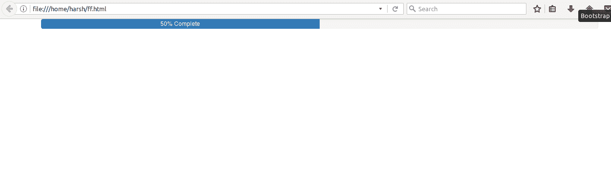
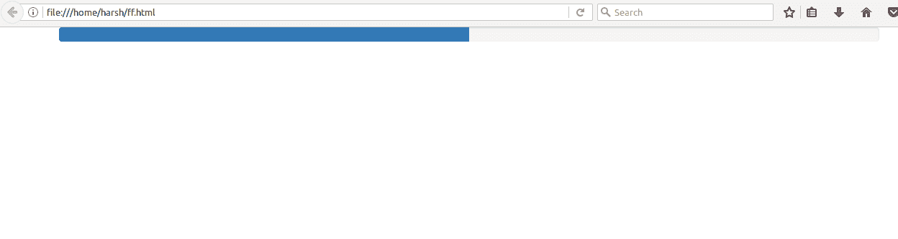
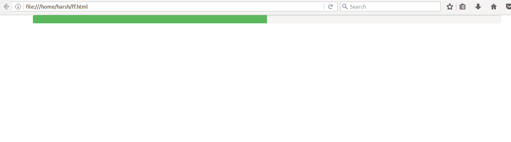
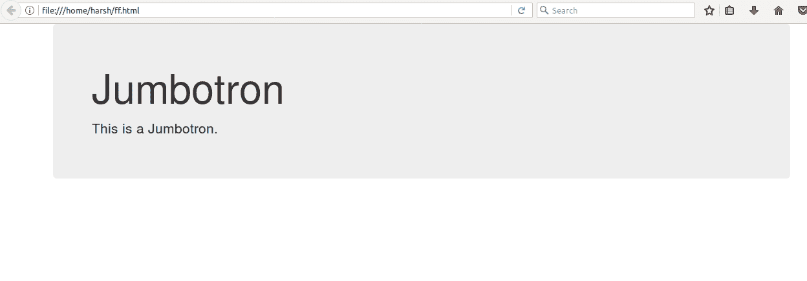

# 自举(Part-6) |进度条和大屏幕

> 原文:[https://www . geesforgeks . org/bootstrap-part-6-进度条-jumbotron/](https://www.geeksforgeeks.org/bootstrap-part-6-progress-bar-jumbotron/)

BootStrap 文章:

1.  [介绍与安装](https://www.geeksforgeeks.org/beginning-bootstrap-part-1/)
2.  [电网系统](https://www.geeksforgeeks.org/bootstrap-part-2/)
3.  [按钮、图形、表格](https://www.geeksforgeeks.org/bootstrap-part-3/)
4.  [垂直形式、水平形式、直列形式](https://www.geeksforgeeks.org/bootstrap-part-4/)
5.  [下拉和响应标签](https://www.geeksforgeeks.org/bootstrap-part-5/)

**进度条**

我们都在计算机中执行某个进程时看到过进度条。进度条显示流程完成了多少，还剩下多少。您可以使用预定义的引导类在网页中添加进度条。Bootstrap 有一些预定义的类，可以很容易地与 HTML 一起使用，为你的网页设计出精彩的风格，让你的网页具有响应性。Bootstrap 提供了许多类型的进度条。
我们可以在 div 类中使用**进度**类给我们的网页添加进度条。
在你的 HTML 代码中使用这个代码来添加一个默认的进度条。
**创建进度条:**

1.  在 div 类中使用类**进度**。
2.  在已经制作好的 div 类中，添加另一个带有类**的 div 标签。进度条**。
3.  使用宽度作为百分比，在样式属性下提及栏的进度。对于 eg- style= "宽度:50%

**带标签的默认进度条代码。**

```html
<div class="progress">
    <div class="progress-bar" role="progressbar" aria-valuenow="50"
          aria-valuemin="0" aria-valuemax="100" style="width:50%">
               <span>50% Complete</span>
    </div>
</div>
```

**输出:**


To remove the label from the progress bar, remove the span tag from the code.**Code for progress bar without label**

```html
<div class="progress">
    <div class="progress-bar" role="progressbar" aria-valuenow="50"
    aria-valuemin="0" aria-valuemax="100" style="width:50%">
    </div>
</div>
```

**输出**


**Coloured Progress Bar**To add coloured progress bars ,we use different classes for different colours.

绿色–。进度条-成功
蓝色–。进度条信息
黄色-。进度条警告
红色–。进度条-危险
使用 div 元素中的这些类为进度条
**着色代码为彩色进度条**

```html
<div class="progress">
     <div class="progress-bar progress-bar-success" role="progressbar"
aria-valuenow="50" aria-valuemin="0" aria-valuemax="100" style="width:50%">
     </div>
 </div>
```

**输出**


**大屏幕**

Jumbotron 是一个灰色的大方框，用来指示一些需要额外注意的文本。任何看起来重要的文本都可以写在一个大屏幕里，让它看起来大而引人注目。
添加一个大屏幕–

1.  在一个 div 元素中，使用一个**冗屏**类。
2.  在这个 div 标签之后，您可以添加任何您想要的文本或信息。
3.  CLose the div element with class jumbotron.
    **Code for a jumbotron**

    ```html
    <div class="container">
      <div class="jumbotron">
        <h1>Jumbotron</h1>
        <p>This is a Jumbotron.</p>
      </div>
    </div>
    ```

    **输出**
    

本文由 **Ayush Saxena** 供稿。如果你喜欢 GeeksforGeeks 并想投稿，你也可以使用[contribute.geeksforgeeks.org](http://www.contribute.geeksforgeeks.org)写一篇文章或者把你的文章邮寄到 contribute@geeksforgeeks.org。看到你的文章出现在极客博客主页上，帮助其他极客。

如果你发现任何不正确的地方，或者你想分享更多关于上面讨论的话题的信息，请写评论。