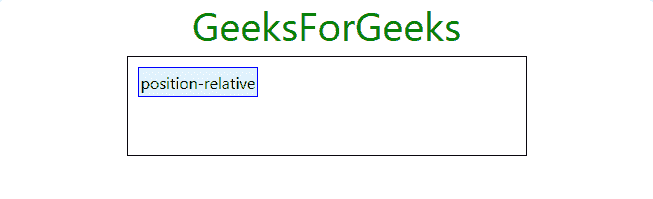

# 引导|用示例定位元素

> 原文:[https://www . geeksforgeeks . org/bootstrap-positioning-an-element-with-examples/](https://www.geeksforgeeks.org/bootstrap-positioning-an-element-with-examples/)

bootstrap 框架为我们提供了一系列允许我们改变元素位置的类。它为我们提供了五个函数中常见的 CSS 位置属性类。此外，它还提供了三个用于控制元素位置的附加类。
**普通班** :

*   **位置-静止:**其工作原理与*位置相同:静止；*CSS 的属性。
    **例:**

## 超文本标记语言

```
<!DOCTYPE html>
<html>
   <head>
      <!-- Custom CSS -->
      <style>
         h1.text-center{
         color: green;
         }

         div.parent{
         height: 100px;
         width: 400px;
         border: 1px solid black;
         margin: 0 auto;
         }

         p{
         top: 10px;
         left: 10px;
         padding: 2px;
         border: 1px solid blue;
         display: inline-block;
         background: #E3F2FD;
         }
      </style>

      <!-- Bootstrap CSS -->
      <link rel="stylesheet" href="https://stackpath.bootstrapcdn.com/bootstrap/4.2.1/css/bootstrap.min.css" integrity="sha384-GJzZqFGwb1QTTN6wy59ffF1BuGJpLSa9DkKMp0DgiMDm4iYMj70gZWKYbI706tWS" crossorigin="anonymous">

      <title>Bootstrap Text Utilities</title>
   </head>

   <body>
      <!-- Bootstrap class for making the enire div responsive -->
      <div class="container">
         <h1 class="text-center">GeeksForGeeks</h1>
         <div class="parent">
            <p class="position-static">position-static</p>

         </div>
      </div>

      <!-- Link JavaScript -->
      <!-- jQuery, Popper.js, Bootstrap JS -->
      <script src="https://code.jquery.com/jquery-3.3.1.slim.min.js" integrity="sha384-q8i/X+965DzO0rT7abK41JStQIAqVgRVzpbzo5smXKp4YfRvH+8abtTE1Pi6jizo" crossorigin="anonymous"></script>
      <script src="https://cdnjs.cloudflare.com/ajax/libs/popper.js/1.14.6/umd/popper.min.js" integrity="sha384-wHAiFfRlMFy6i5SRaxvfOCifBUQy1xHdJ/yoi7FRNXMRBu5WHdZYu1hA6ZOblgut" crossorigin="anonymous"></script>
      <script src="https://stackpath.bootstrapcdn.com/bootstrap/4.2.1/js/bootstrap.min.js" integrity="sha384-B0UglyR+jN6CkvvICOB2joaf5I4l3gm9GU6Hc1og6Ls7i6U/mkkaduKaBhlAXv9k" crossorigin="anonymous"></script>
   </body>
</html>
```

*   **输出:**


*   **位置相对:**工作原理与*位置相对；*CSS 的属性。
    **例:**

## 超文本标记语言

```
<!DOCTYPE html>
<html>
   <head>
      <!-- Custom CSS -->
      <style>
         h1.text-center{
         color: green;
         }

         div.parent{
         height: 100px;
         width: 400px;
         border: 1px solid black;
         margin: 0 auto;
         }

         p{
         top: 10px;
         left: 10px;
         padding: 2px;
         border: 1px solid blue;
         display: inline-block;
         background: #E3F2FD;
         }
      </style>

      <!-- Bootstrap CSS -->
      <link rel="stylesheet" href="https://stackpath.bootstrapcdn.com/bootstrap/4.2.1/css/bootstrap.min.css" integrity="sha384-GJzZqFGwb1QTTN6wy59ffF1BuGJpLSa9DkKMp0DgiMDm4iYMj70gZWKYbI706tWS" crossorigin="anonymous">

      <title>Bootstrap Text Utilities</title>
   </head>
   <body>

      <!-- Bootstrap class for making the enire
            div responsive -->
      <div class="container">
         <h1 class="text-center">GeeksForGeeks</h1>
         <div class="parent">
            <p class="position-relative">
                position-relative
            </p>

         </div>
      </div>

      <!-- Link JavaScript -->
      <!-- jQuery, Popper.js, Bootstrap JS -->
      <script src="https://code.jquery.com/jquery-3.3.1.slim.min.js" integrity="sha384-q8i/X+965DzO0rT7abK41JStQIAqVgRVzpbzo5smXKp4YfRvH+8abtTE1Pi6jizo" crossorigin="anonymous"></script>
      <script src="https://cdnjs.cloudflare.com/ajax/libs/popper.js/1.14.6/umd/popper.min.js" integrity="sha384-wHAiFfRlMFy6i5SRaxvfOCifBUQy1xHdJ/yoi7FRNXMRBu5WHdZYu1hA6ZOblgut" crossorigin="anonymous"></script>
      <script src="https://stackpath.bootstrapcdn.com/bootstrap/4.2.1/js/bootstrap.min.js" integrity="sha384-B0UglyR+jN6CkvvICOB2joaf5I4l3gm9GU6Hc1og6Ls7i6U/mkkaduKaBhlAXv9k" crossorigin="anonymous"></script>
   </body>
</html>
```

*   **输出:**



*   **位置-绝对:**工作原理和*位置一样:绝对；*CSS 的属性。
    **例:**

## 超文本标记语言

```
<!DOCTYPE html>
<html>
   <head>
      <!-- Custom CSS -->
      <style>
         h1.text-center{
         color: green;
         }

         div.parent{
         height: 100px;
         width: 400px;
         border: 1px solid black;
         margin: 0 auto;
         }

         p{
         top: 10px;
         right: 10px;
         padding: 2px;
         border: 1px solid blue;
         display: inline-block;
         background: #E3F2FD;
         }
      </style>

      <!-- Bootstrap CSS -->
      <link rel="stylesheet" href="https://stackpath.bootstrapcdn.com/bootstrap/4.2.1/css/bootstrap.min.css" integrity="sha384-GJzZqFGwb1QTTN6wy59ffF1BuGJpLSa9DkKMp0DgiMDm4iYMj70gZWKYbI706tWS" crossorigin="anonymous">

      <title>Bootstrap Text Utilities</title>
   </head>

   <body>
      <!-- Bootstrap class for making the
            enire div responsive -->
      <div class="container">
         <h1 class="text-center">GeeksForGeeks</h1>
         <div class="parent position-relative">
            <p class="position-absolute">
                position-absolute
            </p>

         </div>
      </div>

      <!-- Link JavaScript -->
      <!-- jQuery, Popper.js, Bootstrap JS -->
      <script src="https://code.jquery.com/jquery-3.3.1.slim.min.js" integrity="sha384-q8i/X+965DzO0rT7abK41JStQIAqVgRVzpbzo5smXKp4YfRvH+8abtTE1Pi6jizo" crossorigin="anonymous"></script>
      <script src="https://cdnjs.cloudflare.com/ajax/libs/popper.js/1.14.6/umd/popper.min.js" integrity="sha384-wHAiFfRlMFy6i5SRaxvfOCifBUQy1xHdJ/yoi7FRNXMRBu5WHdZYu1hA6ZOblgut" crossorigin="anonymous"></script>
      <script src="https://stackpath.bootstrapcdn.com/bootstrap/4.2.1/js/bootstrap.min.js" integrity="sha384-B0UglyR+jN6CkvvICOB2joaf5I4l3gm9GU6Hc1og6Ls7i6U/mkkaduKaBhlAXv9k" crossorigin="anonymous"></script>
   </body>
</html>
```

*   **输出:**


*   **位置固定:**与*位置相同:固定；*CSS 的属性。
    **例:**

## 超文本标记语言

```
<!DOCTYPE html>
<html>
   <head>
      <!-- Custom CSS -->
      <style>
         h1.text-center{
         color: green;
         }

         div.parent{
         height: 100px;
         width: 400px;
         border: 1px solid black;
         margin: 0 auto;
         }

         p{
         top: 10px;
         right: 10px;
         padding: 2px;
         border: 1px solid blue;
         display: inline-block;
         background: #E3F2FD;
         }
      </style>

      <!-- Bootstrap CSS -->
      <link rel="stylesheet" href="https://stackpath.bootstrapcdn.com/bootstrap/4.2.1/css/bootstrap.min.css" integrity="sha384-GJzZqFGwb1QTTN6wy59ffF1BuGJpLSa9DkKMp0DgiMDm4iYMj70gZWKYbI706tWS" crossorigin="anonymous">

      <title>Bootstrap Text Utilities</title>
   </head>

   <body>
      <!-- Bootstrap class for making the
            enire div responsive -->
      <div class="container">
         <h1 class="text-center">GeeksForGeeks</h1>
         <div class="parent">
            <p class="position-fixed">position-fixed</p>

         </div>
      </div>

      <!-- Link JavaScript -->
      <!-- jQuery, Popper.js, Bootstrap JS -->
      <script src="https://code.jquery.com/jquery-3.3.1.slim.min.js" integrity="sha384-q8i/X+965DzO0rT7abK41JStQIAqVgRVzpbzo5smXKp4YfRvH+8abtTE1Pi6jizo" crossorigin="anonymous"></script>
      <script src="https://cdnjs.cloudflare.com/ajax/libs/popper.js/1.14.6/umd/popper.min.js" integrity="sha384-wHAiFfRlMFy6i5SRaxvfOCifBUQy1xHdJ/yoi7FRNXMRBu5WHdZYu1hA6ZOblgut" crossorigin="anonymous"></script>
      <script src="https://stackpath.bootstrapcdn.com/bootstrap/4.2.1/js/bootstrap.min.js" integrity="sha384-B0UglyR+jN6CkvvICOB2joaf5I4l3gm9GU6Hc1og6Ls7i6U/mkkaduKaBhlAXv9k" crossorigin="anonymous"></script>
   </body>
</html>
```

*   **输出:**


*   **位置-粘性:**与*位置:粘性相同；*CSS 的属性。
    **例:**

## 超文本标记语言

```
<!DOCTYPE html>
<html>
   <head>
      <!-- Custom CSS -->
      <style>
         h1.text-center{
         color: green;
         }

         div.parent{
         height: 100px;
         width: 400px;
         border: 1px solid black;
         margin: 0 auto;
         }

         p{
         top: 10px;
         right: 10px;
         padding: 2px;
         border: 1px solid blue;
         display: inline-block;
         background: #E3F2FD;
         }
      </style>

      <!-- Bootstrap CSS -->
      <link rel="stylesheet" href="https://stackpath.bootstrapcdn.com/bootstrap/4.2.1/css/bootstrap.min.css" integrity="sha384-GJzZqFGwb1QTTN6wy59ffF1BuGJpLSa9DkKMp0DgiMDm4iYMj70gZWKYbI706tWS" crossorigin="anonymous">

      <title>Bootstrap Text Utilities</title>
   </head>
   <body>
      <!-- Bootstrap class for making the
            enire div responsive -->
      <div class="container">
         <h1 class="text-center">GeeksForGeeks</h1>
         <div class="parent">
            <p class="position-sticky">
                position-sticky
            </p>

         </div>
      </div>

      <!-- Link JavaScript -->
      <!-- jQuery, Popper.js, Bootstrap JS -->
      <script src="https://code.jquery.com/jquery-3.3.1.slim.min.js" integrity="sha384-q8i/X+965DzO0rT7abK41JStQIAqVgRVzpbzo5smXKp4YfRvH+8abtTE1Pi6jizo" crossorigin="anonymous"></script>
      <script src="https://cdnjs.cloudflare.com/ajax/libs/popper.js/1.14.6/umd/popper.min.js" integrity="sha384-wHAiFfRlMFy6i5SRaxvfOCifBUQy1xHdJ/yoi7FRNXMRBu5WHdZYu1hA6ZOblgut" crossorigin="anonymous"></script>
      <script src="https://stackpath.bootstrapcdn.com/bootstrap/4.2.1/js/bootstrap.min.js" integrity="sha384-B0UglyR+jN6CkvvICOB2joaf5I4l3gm9GU6Hc1og6Ls7i6U/mkkaduKaBhlAXv9k" crossorigin="anonymous"></script>
   </body>
</html>
```

*   **输出:**


**固定顶**T2】

*   **固定顶:**使元素固定在视口顶部，从边到边。
    **例:**

## 超文本标记语言

```
<!DOCTYPE html>
<html>
   <head>
      <!-- Custom CSS -->
      <style>
         h1.text-center{
         color: green;
         margin-top: 30px;
         }

         div.parent{
         height: 100px;
         width: 400px;
         border: 1px solid black;
         margin: 0 auto;
         }

         p{
         text-align: center;
         padding: 2px;
         border: 1px solid blue;
         display: inline-block;
         background: #E3F2FD;
         }
      </style>

      <!-- Bootstrap CSS -->
      <link rel="stylesheet" href="https://stackpath.bootstrapcdn.com/bootstrap/4.2.1/css/bootstrap.min.css" integrity="sha384-GJzZqFGwb1QTTN6wy59ffF1BuGJpLSa9DkKMp0DgiMDm4iYMj70gZWKYbI706tWS" crossorigin="anonymous">

      <title>Bootstrap Text Utilities</title>
   </head>
   <body>
      <!-- Bootstrap class for making the
            enire div responsive -->
      <div class="container">
         <h1 class="text-center">GeeksForGeeks</h1>
         <div class="parent">
            <p class="fixed-top">fixed-top</p>

         </div>
      </div>

      <!-- Link JavaScript -->
      <!-- jQuery, Popper.js, Bootstrap JS -->
      <script src="https://code.jquery.com/jquery-3.3.1.slim.min.js" integrity="sha384-q8i/X+965DzO0rT7abK41JStQIAqVgRVzpbzo5smXKp4YfRvH+8abtTE1Pi6jizo" crossorigin="anonymous"></script>
      <script src="https://cdnjs.cloudflare.com/ajax/libs/popper.js/1.14.6/umd/popper.min.js" integrity="sha384-wHAiFfRlMFy6i5SRaxvfOCifBUQy1xHdJ/yoi7FRNXMRBu5WHdZYu1hA6ZOblgut" crossorigin="anonymous"></script>
      <script src="https://stackpath.bootstrapcdn.com/bootstrap/4.2.1/js/bootstrap.min.js" integrity="sha384-B0UglyR+jN6CkvvICOB2joaf5I4l3gm9GU6Hc1og6Ls7i6U/mkkaduKaBhlAXv9k" crossorigin="anonymous"></script>
   </body>
</html>
```

*   **输出:**


**固定底部**T2】

*   **固定底部:**使元素固定在视口底部，从边到边。
    **例:**

## 超文本标记语言

```
<!DOCTYPE html>
<html>
   <head>
      <!-- Custom CSS -->
      <style>
         h1.text-center{
         color: green;
         margin-top: 30px;
         }

         div.parent{
         height: 100px;
         width: 400px;
         border: 1px solid black;
         margin: 0 auto;
         }

         p{
         text-align: center;
         padding: 2px;
         border: 1px solid blue;
         display: inline-block;
         background: #E3F2FD;

         /* Overriding default margin-bottom
            property of bootstrap, to make it
            stick perfectly to the bottom */
         margin-bottom: 1px !important;
         }
      </style>

      <!-- Bootstrap CSS -->
      <link rel="stylesheet" href="https://stackpath.bootstrapcdn.com/bootstrap/4.2.1/css/bootstrap.min.css" integrity="sha384-GJzZqFGwb1QTTN6wy59ffF1BuGJpLSa9DkKMp0DgiMDm4iYMj70gZWKYbI706tWS" crossorigin="anonymous">

      <title>Bootstrap Text Utilities</title>
   </head>

   <body>
      <!-- Bootstrap class for making the
           enire div responsive -->
      <div class="container">
         <h1 class="text-center">GeeksForGeeks</h1>
         <div class="parent">
            <p class="fixed-bottom">fixed-bottom</p>

         </div>
      </div>

      <!-- Link JavaScript -->
      <!-- jQuery, Popper.js, Bootstrap JS -->
      <script src="https://code.jquery.com/jquery-3.3.1.slim.min.js" integrity="sha384-q8i/X+965DzO0rT7abK41JStQIAqVgRVzpbzo5smXKp4YfRvH+8abtTE1Pi6jizo" crossorigin="anonymous"></script>
      <script src="https://cdnjs.cloudflare.com/ajax/libs/popper.js/1.14.6/umd/popper.min.js" integrity="sha384-wHAiFfRlMFy6i5SRaxvfOCifBUQy1xHdJ/yoi7FRNXMRBu5WHdZYu1hA6ZOblgut" crossorigin="anonymous"></script>
      <script src="https://stackpath.bootstrapcdn.com/bootstrap/4.2.1/js/bootstrap.min.js" integrity="sha384-B0UglyR+jN6CkvvICOB2joaf5I4l3gm9GU6Hc1og6Ls7i6U/mkkaduKaBhlAXv9k" crossorigin="anonymous"></script>
   </body>
</html>
```

*   **输出:**


**粘顶**T2】

*   **粘顶:**滚动经过元素后，使元素固定在视口顶部，从一边到另一边。否则，它被定位为静态。
    **例:**

## 超文本标记语言

```
<!DOCTYPE html>
<html>
   <head>
      <style>
         h1.text-center{
         color: green;
         margin-top: 30px;
         }

         div.parent{
         height: 100px;
         width: 400px;
         border: 1px solid black;
         margin: 0 auto;
         }

         p{
         top: 10px;
         left: 10px;
         text-align: center;
         padding: 2px;
         border: 1px solid blue;
         display: inline-block;
         background: #E3F2FD;
         }
      </style>

      <!-- Bootstrap CSS -->
      <link rel="stylesheet" href="https://stackpath.bootstrapcdn.com/bootstrap/4.2.1/css/bootstrap.min.css" integrity="sha384-GJzZqFGwb1QTTN6wy59ffF1BuGJpLSa9DkKMp0DgiMDm4iYMj70gZWKYbI706tWS" crossorigin="anonymous">

      <title>Bootstrap Text Utilities</title>
   </head>
   <body>
      <!-- Bootstrap class for making the
           enire div responsive -->
      <div class="container">
         <h1 class="text-center">GeeksForGeeks</h1>
         <div class="parent">
            <p class="sticky-top">sticky-top</p>

         </div>
      </div>

      <!-- Link JavaScript -->
      <!-- jQuery, Popper.js, Bootstrap JS -->
      <script src="https://code.jquery.com/jquery-3.3.1.slim.min.js" integrity="sha384-q8i/X+965DzO0rT7abK41JStQIAqVgRVzpbzo5smXKp4YfRvH+8abtTE1Pi6jizo" crossorigin="anonymous"></script>
      <script src="https://cdnjs.cloudflare.com/ajax/libs/popper.js/1.14.6/umd/popper.min.js" integrity="sha384-wHAiFfRlMFy6i5SRaxvfOCifBUQy1xHdJ/yoi7FRNXMRBu5WHdZYu1hA6ZOblgut" crossorigin="anonymous"></script>
      <script src="https://stackpath.bootstrapcdn.com/bootstrap/4.2.1/js/bootstrap.min.js" integrity="sha384-B0UglyR+jN6CkvvICOB2joaf5I4l3gm9GU6Hc1og6Ls7i6U/mkkaduKaBhlAXv9k" crossorigin="anonymous"></script>
   </body>
</html>
```

*   **输出:**


**支持的浏览器:**

*   谷歌 Chrome
*   微软公司出品的 web 浏览器
*   火狐浏览器
*   歌剧
*   狩猎