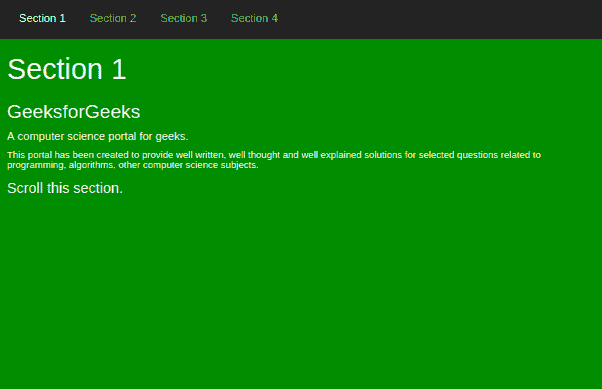

# 引导绳\ scroll spy

> 原文:[https://www.geeksforgeeks.org/bootstrap-scrollspy/](https://www.geeksforgeeks.org/bootstrap-scrollspy/)

有时在设计网站时，我们会加入一些吸引人的功能，让网站引人注目。其中一个功能是**引导滚动浏览**，它在滚动区域时自动定位导航栏内容。
**示例 1 : Scrollspy 垂直导航栏**

## 超文本标记语言

```
<!DOCTYPE html>
<html lang="en">
<head>
  <title>Bootstrap Example</title>
  <meta charset="utf-8">
  <meta name="viewport" content="width=device-width, initial-scale=1">
  <link rel="stylesheet"
href="https://maxcdn.bootstrapcdn.com/bootstrap/3.4.0/css/bootstrap.min.css">
  <script src="https://ajax.googleapis.com/ajax/libs/jquery/3.3.1/jquery.min.js">
</script>
  <script src="https://maxcdn.bootstrapcdn.com/bootstrap/3.4.0/js/bootstrap.min.js">
</script>
  <style>
  body {
    position: relative;
  }
  ul.nav-pills {
    top: 20px;
    position: fixed;
  }
  div.col-sm-9 div {
    height: 250px;
    font-size: 18px;
  }
  a {
       color: green;
  }
  #section1 {color: white; background-color: green;}
  #section2 {color: green; background-color: white;}
  #section3 {color: white; background-color: green;}
  #section4 {color: green; background-color: white;}

  @media screen and (max-width: 810px) {
    #section1, #section2, #section3, #section4 {
      margin-left: 150px;
    }
  }
  </style>
</head>
<body data-spy="scroll" data-target="#myScrollspy" data-offset="20">

<div class="container">
  <div class="row">
    <nav class="col-sm-3" id="myScrollspy">
      <ul class="nav nav-pills nav-stacked">
        <li class="active"><a href="#section1">Section 1</a></li>
        <li><a href="#section2">Section 2</a></li>
        <li><a href="#section3">Section 3</a></li>
        <li><a href="#section4">Section 4</a></li>
      </ul>
    </nav>
    <div class="col-sm-9">
      <div id="section1">   
        <center>
<h1>Section 1</h1>
<h3>GeeksforGeeks</h3>
<h5>A computer science portal for geeks.</h5>
<h6> This portal has been created to provide well written, well thought
and well explained solutions for selected questions related to programming,
algorithms, other computer science subjects.</h6>

<p>Scroll this section and see the navigation list while scrolling.</p>

      </center>
      </div>
      <div id="section2">
        <center>
<h1>Section 2</h1>
<h3>GeeksforGeeks</h3>
<h5>A computer science portal for geeks.</h5>
<h6> This portal also provide GATE previous year papers,
short notes for the aspirants.</h6>

<p>Scroll this section and see the navigation list while scrolling.</p>

      </center>
      </div>       
      <div id="section3">        
        <center>        
<h1>Section 3</h1>
<h3>GeeksforGeeks</h3>
<h5>A computer science portal for geeks.</h5>
<h6>This portal also provide interview questions asked
 by private and public sectors.</h6>

<p>Scroll this section and see the navigation list while scrolling.</p>

      </center>
      </div>
      <div id="section4">        
         <center>
<h1>Section 4</h1>
<h3>GeeksforGeeks</h3>
<h5>A computer science portal for geeks.</h5>
<h6>It also provide Internship aor contributor program for students.</h6>

<p>Scroll this section and see the navigation list while scrolling.</p>

      </center>
      </div>     
    </div>
  </div>
</div>

</body>
</html>
```

**输出:**


**示例 2 : Scrollspy 水平导航栏**

## 超文本标记语言

```
<!DOCTYPE html>
<html>
<head>
  <meta charset="utf-8">
  <meta name="viewport" content="width=device-width, initial-scale=1">
  <link rel="stylesheet"
 href="https://maxcdn.bootstrapcdn.com/bootstrap/3.4.0/css/bootstrap.min.css">
  <script src="https://ajax.googleapis.com/ajax/libs/jquery/3.3.1/jquery.min.js">
 </script>
  <script src="https://maxcdn.bootstrapcdn.com/bootstrap/3.4.0/js/bootstrap.min.js">
   </script>
  <style>
  body {
      position: relative;
  }
  p {
      font-size: 18px;
  }
  #section1 {padding-top:50px;height:500px;color: white; background-color: green;}
  #section2 {padding-top:50px;height:500px;color: green; background-color: white;}
  #section3 {padding-top:50px;height:500px;color: white; background-color: green;}
  #section4 {padding-top:50px;height:500px;color: green; background-color: white;}
  </style>
</head>
<body data-spy="scroll" data-target=".navbar" data-offset="50">

<nav class="navbar navbar-inverse navbar-fixed-top">
  <div class="container-fluid">
    <div class="navbar-header">
        <button type="button" class="navbar-toggle"
data-toggle="collapse" data-target="#myNavbar">
          <span class="icon-bar"></span>
          <span class="icon-bar"></span>
          <span class="icon-bar"></span>                       
      </button>
      <a class="navbar-brand" href="#">GeeksforGeeks</a>
    </div>
    <div>
      <div class="collapse navbar-collapse" id="myNavbar">
        <ul class="nav navbar-nav">
          <li><a href="#section1">Section 1</a></li>
          <li><a href="#section2">Section 2</a></li>
          <li><a href="#section3">Section 3</a></li>
          <li><a href="#section4">Section 4</a></li>
        </ul>
      </div>
    </div>
  </div>
</nav>   

<div id="section1" class="container-fluid">
  <h1>Section 1</h1>
<h3>GeeksforGeeks</h3>
<h5>A computer science portal for geeks.</h5>
<h6> This portal has been created to provide well written, well thought
 and well explained solutions for selected questions related to programming,
 algorithms, other computer science subjects.</h6>

<p>Scroll this section.</p>

</div>
<div id="section2" class="container-fluid">
  <h1>Section 2</h1>
<h3>GeeksforGeeks</h3>
<h5>A computer science portal for geeks.</h5>
<h6> This portal also provide GATE previous year papers,
 short notes for the aspirants.</h6>

<p>Scroll this section.</p>

</div>
<div id="section3" class="container-fluid">
  <h1>Section 3</h1>
<h3>GeeksforGeeks</h3>
<h5>A computer science portal for geeks.</h5>
<h6>This portal also provide interview questions
asked by private and public sectors.</h6>

<p>Scroll this section.</p>

</div>
<div id="section4" class="container-fluid">
   <h1>Section 4</h1>
<h3>GeeksforGeeks</h3>
<h5>A computer science portal for geeks.</h5>
<h6>It also provide Internship or contributor program for students.</h6>

<p>Scroll this section.</p>

</div>

</body>
</html>
```

**输出:**




**支持的浏览器:**

*   谷歌 Chrome
*   微软边缘
*   火狐浏览器
*   歌剧
*   旅行队

一些属性添加了实现该功能的元素。
这些是–

1.  **data-spy** 它是一个要添加元素的属性，该元素用作可滚动区域(在上面的示例中，我们将其作为主体)。
    数据间谍的价值是卷轴。
2.  **数据-目标**该属性用于连接导航栏和可滚动区。
    取值为导航栏 ID 或类的名称。
3.  **数据-偏移**该属性指定计算滚动位置时从顶部偏移的像素数。