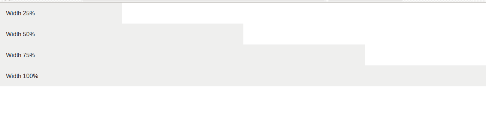
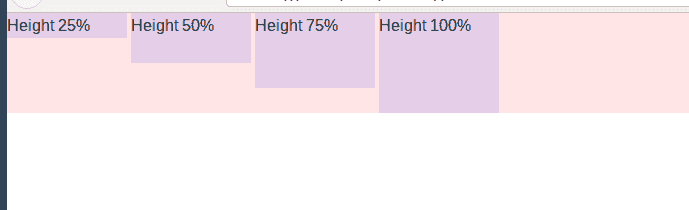
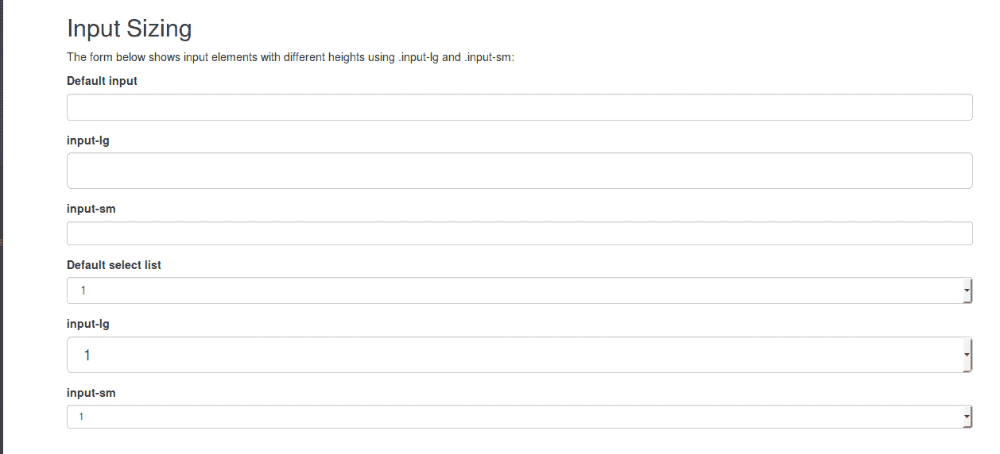
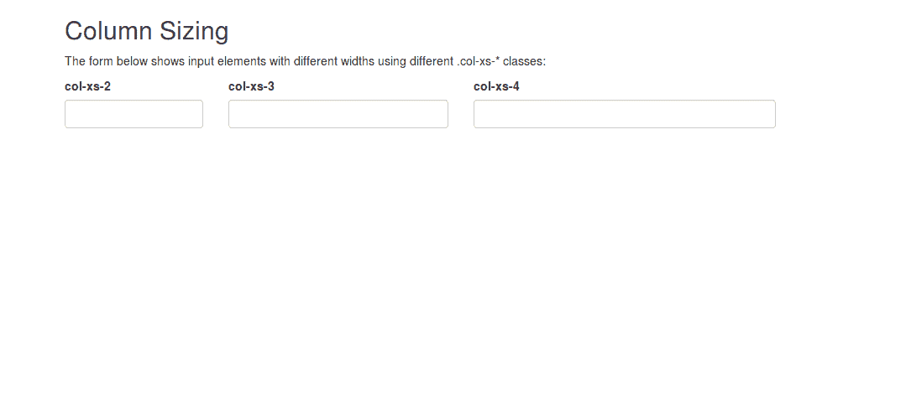

# 引导|通过示例确定元素大小

> 原文:[https://www . geeksforgeeks . org/bootstrap-通过示例调整元素大小/](https://www.geeksforgeeks.org/bootstrap-sizing-an-element-with-examples/)

顾名思义，大小调整是指借助于高度和宽度实用程序(以像素为单位或以百分比为单位)来调整元素相对于其父元素的大小。宽度和高度实用程序是从 _variables.scss 中的$ sizes Sass 映射生成的。

默认情况下，引导数据库规模包括对 25%、50%、75%和 100%的支持。如果您需要除此之外的任何尺寸，您可以添加特定的尺寸。

以下是一些示例，解释了 BootStrap 中的大小调整和可用的类:
**示例 1:**

```
<html>
    <head>
        <title>GeeksForGeeks</title>

        <!-- Link Bootstrap CSS -->
        <link rel="stylesheet" href="https://maxcdn.bootstrapcdn.com/bootstrap/4.0.0/css/bootstrap.min.css" integrity="sha384-Gn5384xqQ1aoWXA+058RXPxPg6fy4IWvTNh0E263XmFcJlSAwiGgFAW/dAiS6JXm" crossorigin="anonymous">
    </head>

    <body>
        <!-- This specifies width of 25% -->
        <div class="w-25 p-3" style="background-color: #eee;">
            Width 25%
        </div>

        <!-- This specifies width of 50% -->
        <div class="w-50 p-3" style="background-color: #eee;">
            Width 50%
        </div>

        <!-- This specifies width of 75% -->
        <div class="w-75 p-3" style="background-color: #eee;">
            Width 75%
        </div>

        <!-- This specifies width of 100% -->
        <div class="w-100 p-3" style="background-color: #eee;">
            Width 100%
        </div>
    </body>
</html>                    
```

**输出:**


**例 2:**

```
<html>
    <head>
        <title>GeeksForGeeks</title>

        <!-- Link Bootstrap CSS -->
        <link rel="stylesheet" href="https://maxcdn.bootstrapcdn.com/bootstrap/4.0.0/css/bootstrap.min.css" integrity="sha384-Gn5384xqQ1aoWXA+058RXPxPg6fy4IWvTNh0E263XmFcJlSAwiGgFAW/dAiS6JXm" crossorigin="anonymous">
    </head>

    <body>
        <div style="height: 100px; background-color: rgba(255, 0, 0, 0.1);">

        <!-- This specifies height of 25% -->
        <div class="h-25 d-inline-block" 
            style="width: 120px; background-color: rgba(0, 0, 255, .1)">
            Height 25%
        </div>

        <!-- This specifies height of 50% -->
        <div class="h-50 d-inline-block" 
            style="width: 120px; background-color: rgba(0, 0, 255, .1)">
            Height 50%
        </div>

        <!-- This specifies height of 75% -->
        <div class="h-75 d-inline-block" 
            style="width: 120px; background-color: rgba(0, 0, 255, .1)">
            Height 75%
        </div>

        <!-- This specifies height of 100% -->
        <div class="h-100 d-inline-block" 
            style="width: 120px; background-color: rgba(0, 0, 255, .1)">
            Height 100%
        </div>
        </div>
    </body>
</html>                    
```

**输出:**


<center>**Input sizing**</center>

We can also adjust the size of input elements in bootstrap by the use of classes like **.input-lg** and **.input-sm** for adjusting heights and **.col-lg*** and **.col-sm*** for adjusting width.

**例 1:**

```
<!DOCTYPE html>
<html>
<head>
    <title>Bootstrap Example</title>

    <!-- Add Bootstrap CSS -->
    <link rel="stylesheet" href="https://maxcdn.bootstrapcdn.com/bootstrap/3.3.7/css/bootstrap.min.css">

    <!-- Add JQuery and Bootstrap JS -->
    <script src="https://ajax.googleapis.com/ajax/libs/jquery/3.3.1/jquery.min.js"></script>
    <script src="https://maxcdn.bootstrapcdn.com/bootstrap/3.3.7/js/bootstrap.min.js"></script>
</head>

<body>
<div class="container">
    <h2>Input Sizing</h2>

    <p> The form below shows input elements 
        with different heights using .input-lg
        and .input-sm:
    </p>

    <form>
        <div class="form-group">
            <label for="inputdefault">
                Default input
            </label>
            <input class="form-control" id="inputdefault" 
                type="text">
        </div>

        <div class="form-group">
            <label for="inputlg">
                input-lg
            </label>
            <input class="form-control input-lg" 
                id="inputlg" type="text">
        </div>

        <div class="form-group">
            <label for="inputsm">
                input-sm
            </label>
          <input class="form-control input-sm" 
                id="inputsm" type="text">
        </div>

        <div class="form-group">
            <label for="sel1">Default select list</label>
                <select class="form-control" id="sel1">
                    <option>1</option>
                    <option>2</option>
                    <option>3</option>
                    <option>4</option>
                </select>
        </div>

        <div class="form-group">
            <label for="sel2">input-lg</label>
                <select class="form-control input-lg" id="sel2">
                    <option>1</option>
                    <option>2</option>
                    <option>3</option>
                </select>
        </div>

        <div class="form-group">
            <label for="sel3">input-sm</label>
                <select class="form-control input-sm" 
                    id="sel3">
                    <option>1</option>
                    <option>2</option>
                    <option>3</option>
                </select>
        </div>
  </form>
</div>

</body>
</html>
```

**输出:**


**例 2:**

```
<!DOCTYPE html>
<html>
    <head>
        <title>Bootstrap Example</title>

        <!-- Add Bootstrap CSS -->
        <link rel="stylesheet" href="https://maxcdn.bootstrapcdn.com/bootstrap/3.3.7/css/bootstrap.min.css">

        <!-- Add Bootstrap JS and JQuery -->
        <script src="https://ajax.googleapis.com/ajax/libs/jquery/3.3.1/jquery.min.js"></script>
        <script src="https://maxcdn.bootstrapcdn.com/bootstrap/3.3.7/js/bootstrap.min.js"></script>
    </head>
    <body>
        <div class="container">
            <h2>Column Sizing</h2>

            <p>The form below shows input elements with different widths using different .col-xs-* classes:</p>

            <form>
                <div class="form-group row">
                    <div class="col-xs-2">
                        <label for="ex1">col-xs-2</label>
                        <input class="form-control" id="ex1"
                            type="text">
                    </div>
                    <div class="col-xs-3">
                        <label for="ex2">col-xs-3</label>
                        <input class="form-control" id="ex2"
                            type="text">
                    </div>
                    <div class="col-xs-4">
                        <label for="ex3">col-xs-4</label>
                        <input class="form-control" id="ex3"
                            type="text">
                    </div>
                </div>
            </form>
        </div>
    </body>
</html>
```

**输出:**


**参考**:[https://getbootstrap.com/docs/4.0/utilities/sizing/](https://getbootstrap.com/docs/4.0/utilities/sizing/)