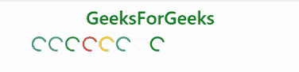

# 引导|纺纱器组-1

> 原文:[https://www.geeksforgeeks.org/bootstrap-spinners-set-1/](https://www.geeksforgeeks.org/bootstrap-spinners-set-1/)

Bootstrap 为我们提供了各种类来创建不同样式的**微调器**来指示加载状态。我们还可以用 Bootstrap 提供的类修改微调器的外观、大小和位置。
**喷丝头类型** :

*   **边框微调器:**我们可以使用类**微调器-边框**创建轻量边框微调器，如下所示。

## 超文本标记语言

```
<!DOCTYPE html>
<html>
<head>
    <!-- Bootstrap CSS -->
    <link rel="stylesheet" href="https://stackpath.bootstrapcdn.com/bootstrap/4.2.1/css
                                 /bootstrap.min.css"
          integrity="sha384-GJzZqFGwb1QTTN6wy59ffF1BuGJpLSa9DkKMp0DgiMDm4iYMj70gZWKYbI7
                     06tWS" crossorigin="anonymous">

    <title>Bootstrap | Spinner</title>

    <style>
    h1{
        color: green;
        text-align: center;
    }
    </style>
</head>

<body>
    <div class="container">
    <h1>GeeksForGeeks</h1>

    <!-- spinner-border, #1 -->
    <div class="spinner-border" role="status">
        <span class="sr-only">Loading</span>
    </div>

    <!-- spinner-border, #2 -->
    <div class="spinner-border" role="status">
        <span class="sr-only">Loading</span>
    </div>

    <!-- spinner-border, #3 -->
    <div class="spinner-border" role="status">
        <span class="sr-only">Loading</span>
    </div>

    </div>
</body>
</html>                   
```

*   **注意:**我们在<分区>中使用了类**旋转边框**。我们在< div >中使用了 role =“status”属性值对用于辅助功能，并且使用了带有 class =“Sr-only”的< span >标记，这是一个 Bootstrap 类，使容器及其内容仅在屏幕阅读器上可见。
    **输出:**


*   **彩色边框微调器:**我们可以使用 Bootstrap 的文本颜色实用程序类以及**微调器-边框**类来更改边框微调器的颜色，如下所示。

## 超文本标记语言

```
<!DOCTYPE html>
<html>

<head>
    <!-- Bootstrap CSS -->
    <link rel="stylesheet" href="https://stackpath.bootstrapcdn.com/bootstrap/4.2.1
                                 /css/bootstrap.min.css"
          integrity="sha384-GJzZqFGwb1QTTN6wy59ffF1BuGJpLSa9DkKMp0DgiMDm4iYMj7
                     0gZWKYbI706tWS" crossorigin="anonymous">

    <title>Bootstrap | Spinner</title>

    <style>
        h1 {
            color: green;
            text-align: center;
        }

        div {
            margin-top: 10px;
        }
    </style>
</head>

<body>
    <div class="container">
        <h1>GeeksForGeeks</h1>

        <!-- spinner-border, #1 -->
        <div class="spinner-border text-primary" role="status">
            <span class="sr-only">Loading</span>
        </div>

        <!-- spinner-border, #2 -->
        <div class="spinner-border text-secondary" role="status">
            <span class="sr-only">Loading</span>
        </div>

        <!-- spinner-border, #3 -->
        <div class="spinner-border text-success" role="status">
            <span class="sr-only">Loading</span>
        </div>

        <!-- spinner-border, #4 -->
        <div class="spinner-border text-danger" role="status">
            <span class="sr-only">Loading</span>
        </div>

        <!-- spinner-border, #5 -->
        <div class="spinner-border text-warning" role="status">
            <span class="sr-only">Loading</span>
        </div>

        <!-- spinner-border, #6 -->
        <div class="spinner-border text-info" role="status">
            <span class="sr-only">Loading</span>
        </div>

        <!-- spinner-border, #7 -->
        <div class="spinner-border text-light" role="status">
            <span class="sr-only">Loading</span>
        </div>

        <!-- spinner-border, #8 -->
        <div class="spinner-border text-dark" role="status">
            <span class="sr-only">Loading</span>
        </div>

    </div>
</body>

</html>
```

*   **注意:**我们在<分区>中使用了类**旋转边框**。我们在< div >中使用了 role =“status”属性值对用于辅助功能，并且使用了带有 class =“Sr-only”的< span >标记，这是一个 Bootstrap 类，使容器及其内容仅在屏幕阅读器上可见。
    **输出:**



*   **生长微调器:**我们可以使用如下所示的**微调器-生长**类 Bootstrap 来创建生长微调器。

## 超文本标记语言

```
<!DOCTYPE html>
<html>

<head>
    <!-- Bootstrap CSS -->
    <link rel="stylesheet" href="https://stackpath.bootstrapcdn.com/bootstrap/4.2.1
                                 /css/bootstrap.min.css"
          integrity="sha384-GJzZqFGwb1QTTN6wy59ffF1BuGJpLSa9DkKMp0DgiMDm4iYMj70gZ
                     WKYbI706tWS" crossorigin="anonymous">

    <title>Bootstrap | Spinner</title>

    <style>
        h1 {
            color: green;
            text-align: center;
        }

        div {
            margin-top: 10px;
        }
    </style>
</head>

<body>
    <div class="container">

        <h1>GeeksForGeeks</h1>

        <!-- spinner-grow, #1 -->
        <div class="spinner-grow" role="status">
            <span class="sr-only">Loading</span>
        </div>

    </div>
</body>

</html>
```

*   **注意:**我们已经在< div >中使用了类**旋转生长**。我们在< div >中使用了 role =“status”属性值对用于辅助功能，并且使用了带有 class =“Sr-only”的< span >标记，这是一个 Bootstrap 类，使容器及其内容仅在屏幕阅读器上可见。
    **输出:**


*   **彩色生长微调器:**我们可以使用 Bootstrap 的文本颜色实用程序类以及**微调器-生长**类来更改生长微调器的颜色，如下所示。

## 超文本标记语言

```
<!DOCTYPE html>
<html>

<head>
    <!-- Bootstrap CSS -->
    <link rel="stylesheet" href="https://stackpath.bootstrapcdn.com/bootstrap/4.2.1/css
                                 /bootstrap.min.css"
          integrity="sha384-GJzZqFGwb1QTTN6wy59ffF1BuGJpLSa9DkKMp0DgiMDm4iYMj70gZ
                     WKYbI706tWS" crossorigin="anonymous">

    <title>Bootstrap | Spinner</title>

    <style>
        h1 {
            color: green;
            text-align: center;
        }

        div {
            margin-top: 10px;
        }
    </style>

</head>

<body>
    <div class="container">
        <h1>GeeksForGeeks</h1>

        <!-- spinner-grow, #1 -->
        <div class="spinner-grow text-primary" role="status">
            <span class="sr-only">Loading</span>
        </div>

        <!-- spinner-grow, #2 -->
        <div class="spinner-grow text-secondary" role="status">
            <span class="sr-only">Loading</span>
        </div>

        <!-- spinner-grow, #3 -->
        <div class="spinner-grow text-success" role="status">
            <span class="sr-only">Loading</span>
        </div>

        <!-- spinner-grow, #4 -->
        <div class="spinner-grow text-danger" role="status">
            <span class="sr-only">Loading</span>
        </div>

        <!-- spinner-grow, #5 -->
        <div class="spinner-grow text-warning" role="status">
            <span class="sr-only">Loading</span>
        </div>

        <!-- spinner-grow, #6 -->
        <div class="spinner-grow text-info" role="status">
            <span class="sr-only">Loading</span>
        </div>

        <!-- spinner-grow, #7 -->
        <div class="spinner-grow text-light" role="status">
            <span class="sr-only">Loading</span>
        </div>

        <!-- spinner-grow, #8 -->
        <div class="spinner-grow text-dark" role="status">
            <span class="sr-only">Loading</span>
        </div>

    </div>
</body>

</html>
```

*   **注意:**我们已经在< div >中使用了类**旋转生长**。我们在< div >中使用了 role =“status”属性值对用于辅助功能，并且使用了带有 class =“Sr-only”的< span >标记，这是一个 Bootstrap 类，使容器及其内容仅在屏幕阅读器上可见。
    **输出:**


**支持的浏览器:**

*   谷歌 Chrome
*   微软边缘
*   火狐浏览器
*   歌剧
*   旅行队