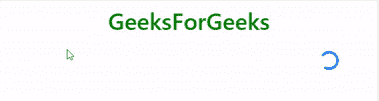

# 引导|纺纱器组-2

> 原文:[https://www.geeksforgeeks.org/bootstrap-spinners-set-2/](https://www.geeksforgeeks.org/bootstrap-spinners-set-2/)

Bootstrap 为我们提供了不同的类来创建不同风格的微调器来指示加载状态。我们还可以用 Bootstrap 提供的类修改微调器的外观、大小和位置。

*   **带边框微调器的按钮:**我们可以通过使用**微调器-边框**类将边框微调器放置在< span >标签内，该标签又嵌套在<按钮>标签内，该标签具有如下所示的[引导按钮](https://www.geeksforgeeks.org/bootstrap-buttons-with-examples/)类。

## 超文本标记语言

```
<!DOCTYPE html>
<html>

<head>
    <!-- Bootstrap CSS -->
    <link rel="stylesheet" href="https://stackpath.bootstrapcdn.com/bootstrap/4.2.1/css
                                 /bootstrap.min.css"
          integrity="sha384-GJzZqFGwb1QTTN6wy59ffF1BuGJpLSa9DkKMp0DgiMDm4iYMj70gZWKYbI
                     706tWS" crossorigin="anonymous">

    <title>Bootstrap | Spinner</title>

    <style>
        h1 {
            color: green;
            text-align: center;
        }

        div {
            margin-top: 10px;
        }
    </style>

</head>

<body>
    <div class="container">
        <h1>GeeksForGeeks</h1>

        <button type="button" class="btn btn-secondary" disabled>
            <span class="spinner-border spinner-border-sm" role="status"
                  aria-hidden="true">
            </span>
            <span class="sr-only">Loading</span>
        </button>

        <button type="button" class="btn btn-primary" disabled>
            <span class="spinner-border spinner-border-sm" role="status"
                  aria-hidden="true">
            </span>
            Processing...
        </button>

    </div>
</body>

</html>
```

*   **注意:**我们已经在<按钮>标签中放置了“禁用”属性来停用它，并在< span >标签中使用了“角色”和“咏叹调隐藏”属性来实现可访问性。
    **输出:**


*   **带生长微调器的按钮:**我们可以通过使用**微调器-生长**类将生长微调器放置在<跨度>标签内，该标签又嵌套在<按钮>标签内，该标签具有如下所示的[引导按钮](https://www.geeksforgeeks.org/bootstrap-buttons-with-examples/)类。

**改变尺寸**T2】

*   **使用类:**我们可以使用类**旋转-边界-sm** 和**旋转-生长-sm** 以及**旋转-边界**和**旋转-生长**分别使旋转器变小，如下所示。

## 超文本标记语言

```
<!DOCTYPE html>
<html>

<head>
    <!-- Bootstrap CSS -->
    <link rel="stylesheet" href="https://stackpath.bootstrapcdn.com/bootstrap/4.2.1/css
                                 /bootstrap.min.css"
          integrity="sha384-GJzZqFGwb1QTTN6wy59ffF1BuGJpLSa9DkKMp0DgiMDm4iYMj70gZWKYb
                     I706tWS" crossorigin="anonymous">

    <title>Bootstrap | Spinner</title>

    <style>
        h1 {
            color: green;
            text-align: center;
        }

        div {
            margin-top: 10px;
        }
    </style>

</head>

<body>
    <div class="container">
        <h1>GeeksForGeeks</h1>

        <!-- spinner-border-sm -->
        <div class="spinner-border text-primary spinner-border-sm" role="status">
            <span class="sr-only">Loading</span>
        </div>

        <!-- spinner-grow-sm -->
        <div class="spinner-grow text-primary spinner-grow-sm" role="status">
            <span class="sr-only">Loading</span>
        </div>
    </div>
</body>

</html>
```

**输出:**


*   **使用 CSS:** 我们也可以使用 CSS 样式改变微调器的大小，如下所示。

## 超文本标记语言

```
<!DOCTYPE html>
<html>

<head>
    <!-- Bootstrap CSS -->
    <link rel="stylesheet" href="https://stackpath.bootstrapcdn.com/bootstrap/4.2.1/css
                                 /bootstrap.min.css"
          integrity="sha384-GJzZqFGwb1QTTN6wy59ffF1BuGJpLSa9DkKMp0DgiMDm4iYMj70gZWKYb
                     I706tWS" crossorigin="anonymous">

    <title>Bootstrap | Spinner</title>

    <style>
        h1 {
            color: green;
            text-align: center;
        }

        div {
            margin-top: 10px;
        }
    </style>

</head>

<body>
    <div class="container">
        <h1>GeeksForGeeks</h1>

        <div class="spinner-border text-primary" role="status"
             style="height:5rem; width:5rem;">
            <span class="sr-only">Loading</span>
        </div>

        <div class="spinner-grow text-primary" role="status"
             style="height:5rem; width:5rem;">
            <span class="sr-only">Loading</span>
        </div>
    </div>
</body>

</html>
```

**输出:**


**更改路线**

*   **使用文本对齐实用程序:**我们可以通过将微调器放入< div >标签来更改其对齐方式，该标签使用[文本对齐实用程序](https://www.geeksforgeeks.org/bootstrap-text-utilities-alignment-wrapping-weight-etc/)类来控制子元素的对齐方式，如下所示。

## 超文本标记语言

```
<!DOCTYPE html>
<html>

<head>
    <!-- Bootstrap CSS -->
    <link rel="stylesheet" href="https://stackpath.bootstrapcdn.com/bootstrap/4.2.1/css
                                 /bootstrap.min.css"
          integrity="sha384-GJzZqFGwb1QTTN6wy59ffF1BuGJpLSa9DkKMp0DgiMDm4iYMj70gZWK
                     YbI706tWS" crossorigin="anonymous">

    <title>Bootstrap | Spinner</title>

    <style>
        h1 {
            color: green;
            text-align: center;
        }

        div {
            margin-top: 10px;
        }
    </style>

</head>

<body>
    <div class="container">
        <h1>GeeksForGeeks</h1>

        <!-- Changing alignment using text utilities class -->
        <div class="text-center">
            <div class="spinner-border text-primary" role="status">
                <span class="sr-only">Loading</span>
            </div>
        </div>

    </div>
</body>

</html>
```

**输出:**


*   **使用浮动工具:**我们可以通过将微调器放置在< div >标签中来更改微调器的对齐，该标签使用[浮动工具类](https://www.geeksforgeeks.org/bootstrap-float-utilities-with-examples/)来控制子元素的对齐，或者直接在< div >标签中使用[浮动工具类](https://www.geeksforgeeks.org/bootstrap-float-utilities-with-examples/)，通过该标签创建微调器，如下所示。

## 超文本标记语言

```
<!DOCTYPE html>
<html>

<head>
    <!-- Bootstrap CSS -->
    <link rel="stylesheet" href="https://stackpath.bootstrapcdn.com/bootstrap/4.2.1/css
                                 /bootstrap.min.css"
          integrity="sha384-GJzZqFGwb1QTTN6wy59ffF1BuGJpLSa9DkKMp0DgiMDm4iYMj70gZWK
                     YbI706tWS" crossorigin="anonymous">

    <title>Bootstrap | Spinner</title>

    <style>
        h1 {
            color: green;
            text-align: center;
        }

        div {
            margin-top: 10px;
        }
    </style>

</head>

<body>
    <div class="container">
        <h1>GeeksForGeeks</h1>

        <!-- Changing alignment using text utilities class -->
        <div class="clearfix float-right">
            <div class="spinner-border text-primary" role="status">
                <span class="sr-only">Loading</span>
            </div>
        </div>
    </div>

</body>
</html>
```

**输出:**



*   **使用 flexbox 实用程序:**我们可以通过将微调器放入< div >标签来更改微调器的对齐方式，该标签使用 flexbox 实用程序类来控制子元素的对齐方式，如下所示。

## 超文本标记语言

```
<!DOCTYPE html>
<html>

<head>
    <!-- Bootstrap CSS -->
    <link rel="stylesheet" href="https://stackpath.bootstrapcdn.com/bootstrap/4.2.1/css
                                 /bootstrap.min.css"
          integrity="sha384-GJzZqFGwb1QTTN6wy59ffF1BuGJpLSa9DkKMp0DgiMDm4iYMj70gZWKYbI7
                     06tWS" crossorigin="anonymous">

    <title>Bootstrap | Spinner</title>

    <style>
        h1 {
            color: green;
            text-align: center;
        }

        div {
            margin-top: 10px;
        }
    </style>
</head>

<body>
    <div class="container">
        <h1>GeeksForGeeks</h1>

        <!-- Changing alignment using text utilities class -->
        <div class="d-flex justify-content-center">
            <div class="spinner-border text-primary" role="status">
                <span class="sr-only">Loading</span>
            </div>
        </div>
    </div>
</body>

</html>
```

**输出:**


**支持的浏览器:**

*   谷歌 Chrome
*   微软边缘
*   火狐浏览器
*   歌剧
*   狩猎