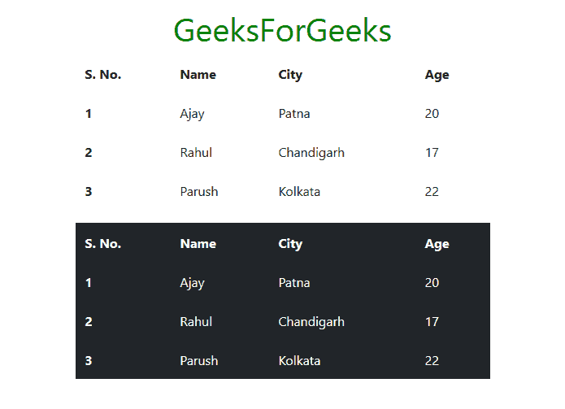
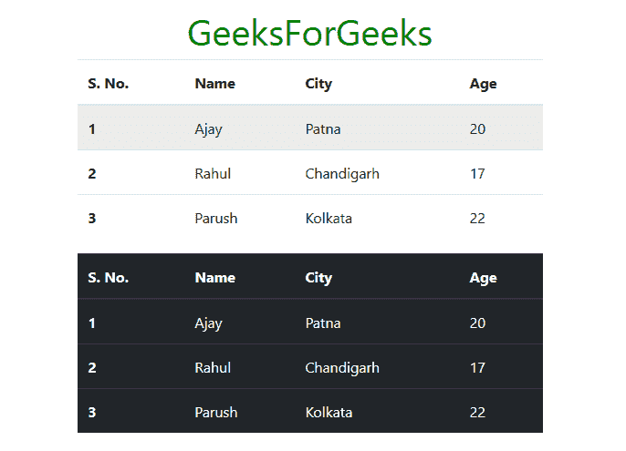
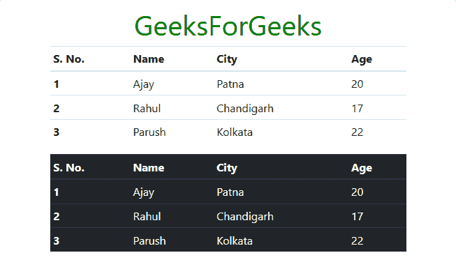
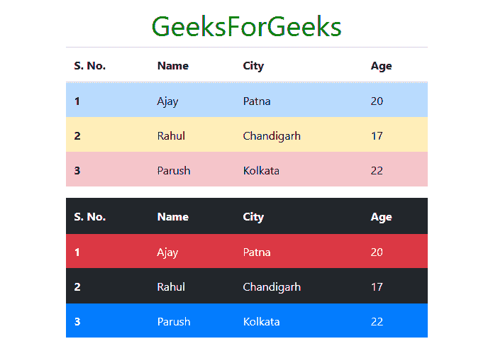
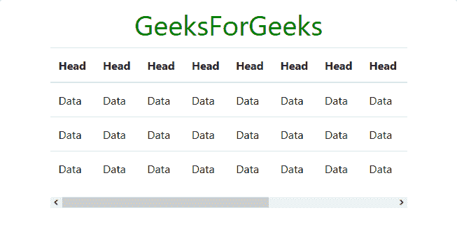
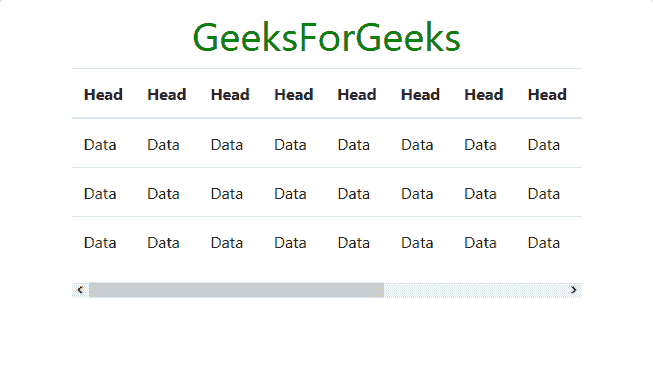

# 引导|表格|集合-2

> 原文:[https://www.geeksforgeeks.org/bootstrap-tables-set-2/](https://www.geeksforgeeks.org/bootstrap-tables-set-2/)

**Bootstrap** 为我们提供了一系列的类，可以用来对表格应用各种样式，比如改变标题外观，使行分条，添加或删除边框，使行可悬停。Bootstrap 还提供了使表响应的类。

*   **无边界表:**要使表无边界，使用类**表-无边界**连同类**表**类内的 **<表>** 标记。我们还可以通过 **<表>** 标签内的类**表**、**表-暗**和**表-无边界**的组合，使暗表无边界。请参见下面的示例进行说明。
    **例:**

## 超文本标记语言

```
<!DOCTYPE html>
<html lang="en">
  <head>
    <!-- Required meta tags -->
    <meta charset="utf-8">
    <meta name="viewport" content="width=device-width, initial-scale=1, shrink-to-fit=no">

    <!-- Bootstrap CSS -->
    <link rel="stylesheet" href="https://stackpath.bootstrapcdn.com/bootstrap/4.2.1/css/bootstrap.min.css" integrity="sha384-GJzZqFGwb1QTTN6wy59ffF1BuGJpLSa9DkKMp0DgiMDm4iYMj70gZWKYbI706tWS" crossorigin="anonymous">

    <title>Bootstrap | Tables</title>

    <style>
      h1{
        color: green;
        text-align: center;
      }
      div{
        margin-top: 10px;
      }
    </style>

  </head>
  <body>
    <div class="container">
      <h1>GeeksForGeeks</h1>

      <!-- table, table-borderless -->
      <table class="table table-borderless">
        <thead>
          <tr>
            <th scope="col">S. No.</td>
            <th scope="col">Name</td>
            <th scope="col">City</td>
            <th scope="col">Age</td>
          </tr>
        </thead>
        <tbody>
          <tr>
            <th scope="row">1</td>
            <td>Ajay</td>
            <td>Patna</td>
            <td>20</td>
          </tr>
          <tr>
            <th scope="row">2</td>
            <td>Rahul</td>
            <td>Chandigarh</td>
            <td>17</td>
          </tr>
          <tr>
            <th scope="row">3</td>
            <td>Parush</td>
            <td>Kolkata</td>
            <td>22</td>
          </tr>
        </tbody>
      </table>

      <!-- table, table-borderless, table-dark -->
      <table class="table table-borderless table-dark">
        <thead>
          <tr>
            <th scope="col">S. No.</td>
            <th scope="col">Name</td>
            <th scope="col">City</td>
            <th scope="col">Age</td>
          </tr>
        </thead>
        <tbody>
          <tr>
            <th scope="row">1</td>
            <td>Ajay</td>
            <td>Patna</td>
            <td>20</td>
          </tr>
          <tr>
            <th scope="row">2</td>
            <td>Rahul</td>
            <td>Chandigarh</td>
            <td>17</td>
          </tr>
          <tr>
            <th scope="row">3</td>
            <td>Parush</td>
            <td>Kolkata</td>
            <td>22</td>
          </tr>
        </tbody>
      </table>

    </div>
  </body>
</html>
```

*   **输出:**



*   **可悬停表:**要使表的行可悬停，请使用类**表-悬停**以及类**表**中的 **<表>** 标记。我们也可以在 **<表>** 标签内，使用类**表**、**表-悬停**和**表-深色**的组合，使深色表的行可以悬停。请参见下面的示例进行说明。
    **例:**

## 超文本标记语言

```
<!DOCTYPE html>
<html lang="en">
  <head>
    <!-- Required meta tags -->
    <meta charset="utf-8">
    <meta name="viewport" content="width=device-width, initial-scale=1, shrink-to-fit=no">

    <!-- Bootstrap CSS -->
    <link rel="stylesheet" href="https://stackpath.bootstrapcdn.com/bootstrap/4.2.1/css/bootstrap.min.css" integrity="sha384-GJzZqFGwb1QTTN6wy59ffF1BuGJpLSa9DkKMp0DgiMDm4iYMj70gZWKYbI706tWS" crossorigin="anonymous">

    <title>Bootstrap | Tables</title>

    <style>
      h1{
        color: green;
        text-align: center;
      }
      div{
        margin-top: 10px;
      }
    </style>

  </head>
  <body>
    <div class="container">
      <h1>GeeksForGeeks</h1>

      <!-- table, table-hover -->
      <table class="table table-hover">
        <thead>
          <tr>
            <th scope="col">S. No.</td>
            <th scope="col">Name</td>
            <th scope="col">City</td>
            <th scope="col">Age</td>
          </tr>
        </thead>
        <tbody>
          <tr>
            <th scope="row">1</td>
            <td>Ajay</td>
            <td>Patna</td>
            <td>20</td>
          </tr>
          <tr>
            <th scope="row">2</td>
            <td>Rahul</td>
            <td>Chandigarh</td>
            <td>17</td>
          </tr>
          <tr>
            <th scope="row">3</td>
            <td>Parush</td>
            <td>Kolkata</td>
            <td>22</td>
          </tr>
        </tbody>
      </table>

      <!-- table, table-hover, table-dark -->
      <table class="table table-hover table-dark">
        <thead>
          <tr>
            <th scope="col">S. No.</td>
            <th scope="col">Name</td>
            <th scope="col">City</td>
            <th scope="col">Age</td>
          </tr>
        </thead>
        <tbody>
          <tr>
            <th scope="row">1</td>
            <td>Ajay</td>
            <td>Patna</td>
            <td>20</td>
          </tr>
          <tr>
            <th scope="row">2</td>
            <td>Rahul</td>
            <td>Chandigarh</td>
            <td>17</td>
          </tr>
          <tr>
            <th scope="row">3</td>
            <td>Parush</td>
            <td>Kolkata</td>
            <td>22</td>
          </tr>
        </tbody>
      </table>

    </div>
  </body>
</html>
```

*   **输出:**



*   **小表:**要缩小表的大小，请在 **<表>** 标签中使用类**表-sm** 以及类**表**。这将单元格填充减少到一半。在 **<表>** 标签内，使用类**表**、**表-sm** 和**表-深色**的组合来缩小深色表。请参见下面的示例进行说明。
    **例:**

## 超文本标记语言

```
<!DOCTYPE html>
<html lang="en">
  <head>
    <!-- Required meta tags -->
    <meta charset="utf-8">
    <meta name="viewport" content="width=device-width, initial-scale=1, shrink-to-fit=no">

    <!-- Bootstrap CSS -->
    <link rel="stylesheet" href="https://stackpath.bootstrapcdn.com/bootstrap/4.2.1/css/bootstrap.min.css" integrity="sha384-GJzZqFGwb1QTTN6wy59ffF1BuGJpLSa9DkKMp0DgiMDm4iYMj70gZWKYbI706tWS" crossorigin="anonymous">

    <title>Bootstrap | Tables</title>

    <style>
      h1{
        color: green;
        text-align: center;
      }
      div{
        margin-top: 10px;
      }
    </style>

  </head>
  <body>
    <div class="container">
      <h1>GeeksForGeeks</h1>

      <!-- table, table-sm -->
      <table class="table table-sm">
        <thead>
          <tr>
            <th scope="col">S. No.</td>
            <th scope="col">Name</td>
            <th scope="col">City</td>
            <th scope="col">Age</td>
          </tr>
        </thead>
        <tbody>
          <tr>
            <th scope="row">1</td>
            <td>Ajay</td>
            <td>Patna</td>
            <td>20</td>
          </tr>
          <tr>
            <th scope="row">2</td>
            <td>Rahul</td>
            <td>Chandigarh</td>
            <td>17</td>
          </tr>
          <tr>
            <th scope="row">3</td>
            <td>Parush</td>
            <td>Kolkata</td>
            <td>22</td>
          </tr>
        </tbody>
      </table>

      <!-- table, table-sm, table-dark -->
      <table class="table table-sm table-dark">
        <thead>
          <tr>
            <th scope="col">S. No.</td>
            <th scope="col">Name</td>
            <th scope="col">City</td>
            <th scope="col">Age</td>
          </tr>
        </thead>
        <tbody>
          <tr>
            <th scope="row">1</td>
            <td>Ajay</td>
            <td>Patna</td>
            <td>20</td>
          </tr>
          <tr>
            <th scope="row">2</td>
            <td>Rahul</td>
            <td>Chandigarh</td>
            <td>17</td>
          </tr>
          <tr>
            <th scope="row">3</td>
            <td>Parush</td>
            <td>Kolkata</td>
            <td>22</td>
          </tr>
        </tbody>
      </table>

    </div>
  </body>
</html>
```

*   **输出:**



*   **彩色表格:** Bootstrap 为我们提供了许多上下文类，可用于给表格的整行或单个单元格着色。这些类应该与浅色桌子一起使用，而不是与深色桌子一起使用，以获得更好的外观。为了给深色的表格上色，我们可以使用 Bootstrap 的背景色类。上下文类如下所示。有关说明，请参见示例。

<figure class="table">

| 表-主要 | 表格-二级 | 表格-成功 |
| 桌面危险 | 表格警告 | 表格信息 |
| 台灯 | 深色桌面 | 表格-活动 |

</figure>

## 超文本标记语言

```
<!DOCTYPE html>
<html lang="en">
  <head>
    <!-- Required meta tags -->
    <meta charset="utf-8">
    <meta name="viewport" content="width=device-width, initial-scale=1, shrink-to-fit=no">

    <!-- Bootstrap CSS -->
    <link rel="stylesheet" href="https://stackpath.bootstrapcdn.com/bootstrap/4.2.1/css/bootstrap.min.css" integrity="sha384-GJzZqFGwb1QTTN6wy59ffF1BuGJpLSa9DkKMp0DgiMDm4iYMj70gZWKYbI706tWS" crossorigin="anonymous">

    <title>Bootstrap | Tables</title>

    <style>
      h1{
        color: green;
        text-align: center;
      }
      div{
        margin-top: 10px;
      }
    </style>

  </head>
  <body>
    <div class="container">
      <h1>GeeksForGeeks</h1>

      <!-- table, table-primary, table-warning, table-danger -->
      <table class="table">
        <thead>
          <tr>
            <th scope="col">S. No.</td>
            <th scope="col">Name</td>
            <th scope="col">City</td>
            <th scope="col">Age</td>
          </tr>
        </thead>
        <tbody>
          <tr class="table-primary">
            <th scope="row">1</td>
            <td>Ajay</td>
            <td>Patna</td>
            <td>20</td>
          </tr>
          <tr class="table-warning">
            <th scope="row">2</td>
            <td>Rahul</td>
            <td>Chandigarh</td>
            <td>17</td>
          </tr>
          <tr class="table-danger">
            <th scope="row">3</td>
            <td>Parush</td>
            <td>Kolkata</td>
            <td>22</td>
          </tr>
        </tbody>
      </table>

      <!-- table, bg-danger, bg-primary, table-dark -->
      <table class="table table-dark">
        <thead>
          <tr>
            <th scope="col">S. No.</td>
            <th scope="col">Name</td>
            <th scope="col">City</td>
            <th scope="col">Age</td>
          </tr>
        </thead>
        <tbody>
          <tr class="bg-danger">
            <th scope="row">1</td>
            <td>Ajay</td>
            <td>Patna</td>
            <td>20</td>
          </tr>
          <tr>
            <th scope="row">2</td>
            <td>Rahul</td>
            <td>Chandigarh</td>
            <td>17</td>
          </tr>
          <tr class="bg-primary">
            <th scope="row">3</td>
            <td>Parush</td>
            <td>Kolkata</td>
            <td>22</td>
          </tr>
        </tbody>
      </table>

    </div>
  </body>
</html>
```

*   **输出:**



*   **响应表:**要使表对所有视口大小都有响应，请将表包装在一个打开和关闭的 **< div >** 标签内，在打开的 **< div >** 标签内有类**表响应的**。类似地，为了使表根据视口大小做出响应，我们使用类**表响应{-sm|-md|-lg|-xl}** ，根据视口大小，我们希望使表做出响应。
    在响应表格中，如果表格不适合当前大小的视口，将出现水平滚动条。
    在视口特定响应表的情况下，如果视口大小小于类**表响应{-sm|-md|-lg|-xl}** 指定的视口，表将变为响应。请参见下面的示例进行说明。
    **示例 1:表响应**

## 超文本标记语言

```
<!DOCTYPE html>
<html lang="en">
  <head>
    <!-- Required meta tags -->
    <meta charset="utf-8">
    <meta name="viewport" content="width=device-width, initial-scale=1, shrink-to-fit=no">

    <!-- Bootstrap CSS -->
    <link rel="stylesheet" href="https://stackpath.bootstrapcdn.com/bootstrap/4.2.1/css/bootstrap.min.css" integrity="sha384-GJzZqFGwb1QTTN6wy59ffF1BuGJpLSa9DkKMp0DgiMDm4iYMj70gZWKYbI706tWS" crossorigin="anonymous">

    <title>Bootstrap | Tables</title>

    <style>
      h1{
        color: green;
        text-align: center;
      }
      div{
        margin-top: 10px;
      }
    </style>

  </head>
  <body>
    <div class="container">
      <h1>GeeksForGeeks</h1>

      <!-- table-responsive -->
      <div class="table-responsive">

        <!-- table -->
        <table class="table">
          <thead>
            <tr>
              <th scope="col">Head</td>
              <th scope="col">Head</td>
              <th scope="col">Head</td>
              <th scope="col">Head</td>
              <th scope="col">Head</td>
              <th scope="col">Head</td>
              <th scope="col">Head</td>
              <th scope="col">Head</td>
              <th scope="col">Head</td>
              <th scope="col">Head</td>
              <th scope="col">Head</td>
              <th scope="col">Head</td> 
            </tr>
          </thead>
          <tbody>
            <tr>
              <td>Data</td>
              <td>Data</td>
              <td>Data</td>
              <td>Data</td>
              <td>Data</td>
              <td>Data</td>
              <td>Data</td>
              <td>Data</td>
              <td>Data</td>
              <td>Data</td>
              <td>Data</td>
              <td>Data</td>
            </tr>
            <tr>
              <td>Data</td>
              <td>Data</td>
              <td>Data</td>
              <td>Data</td>
              <td>Data</td>
              <td>Data</td>
              <td>Data</td>
              <td>Data</td>
              <td>Data</td>
              <td>Data</td>
              <td>Data</td>
              <td>Data</td>
            </tr>
            <tr>
              <td>Data</td>
              <td>Data</td>
              <td>Data</td>
              <td>Data</td>
              <td>Data</td>
              <td>Data</td>
              <td>Data</td>
              <td>Data</td>
              <td>Data</td>
              <td>Data</td>
              <td>Data</td>
              <td>Data</td>
            </tr>
          </tbody>
        </table>

      </div>

    </div>
  </body>
</html>
```

*   **输出:**



*   **示例 2:桌面响应 md**

## 超文本标记语言

```
<!DOCTYPE html>
<html lang="en">
  <head>
    <!-- Required meta tags -->
    <meta charset="utf-8">
    <meta name="viewport" content="width=device-width, initial-scale=1, shrink-to-fit=no">

    <!-- Bootstrap CSS -->
    <link rel="stylesheet" href="https://stackpath.bootstrapcdn.com/bootstrap/4.2.1/css/bootstrap.min.css" integrity="sha384-GJzZqFGwb1QTTN6wy59ffF1BuGJpLSa9DkKMp0DgiMDm4iYMj70gZWKYbI706tWS" crossorigin="anonymous">

    <title>Bootstrap | Tables</title>

    <style>
      h1{
        color: green;
        text-align: center;
      }
      div{
        margin-top: 10px;
      }
    </style>

  </head>
  <body>
    <div class="container">
      <h1>GeeksForGeeks</h1>

      <!-- table-responsive-md -->
      <div class="table-responsive-md">

        <!-- table -->
        <table class="table">
          <thead>
            <tr>
              <th scope="col">Head</td>
              <th scope="col">Head</td>
              <th scope="col">Head</td>
              <th scope="col">Head</td>
              <th scope="col">Head</td>
              <th scope="col">Head</td>
              <th scope="col">Head</td>
              <th scope="col">Head</td>
              <th scope="col">Head</td>
              <th scope="col">Head</td>
              <th scope="col">Head</td>
              <th scope="col">Head</td> 
            </tr>
          </thead>
          <tbody>
            <tr>
              <td>Data</td>
              <td>Data</td>
              <td>Data</td>
              <td>Data</td>
              <td>Data</td>
              <td>Data</td>
              <td>Data</td>
              <td>Data</td>
              <td>Data</td>
              <td>Data</td>
              <td>Data</td>
              <td>Data</td>
            </tr>
            <tr>
              <td>Data</td>
              <td>Data</td>
              <td>Data</td>
              <td>Data</td>
              <td>Data</td>
              <td>Data</td>
              <td>Data</td>
              <td>Data</td>
              <td>Data</td>
              <td>Data</td>
              <td>Data</td>
              <td>Data</td>
            </tr>
            <tr>
              <td>Data</td>
              <td>Data</td>
              <td>Data</td>
              <td>Data</td>
              <td>Data</td>
              <td>Data</td>
              <td>Data</td>
              <td>Data</td>
              <td>Data</td>
              <td>Data</td>
              <td>Data</td>
              <td>Data</td>
            </tr>
          </tbody>
        </table>

      </div>

    </div>
  </body>
</html>
```

*   **输出:**



**支持的浏览器:**

*   谷歌 Chrome
*   微软公司出品的 web 浏览器
*   火狐浏览器
*   歌剧
*   狩猎