# 引导|文本实用程序(对齐、环绕、重量等)。)

> 原文:[https://www . geesforgeks . org/bootstrap-text-utilities-alignment-wrapping-weight-etc/](https://www.geeksforgeeks.org/bootstrap-text-utilities-alignment-wrapping-weight-etc/)

**Bootstrap** 是最受欢迎的开源前端框架作品之一，它帮助我们开发响应迅速、移动优先的网站和网络应用程序。作为其产品的一部分，bootstrap 为我们提供了一组类，称为**文本实用程序**类，它控制各种文本属性，如文本对齐、文本换行、文本溢出、文本转换、字体粗细、斜体、等宽、重置文本颜色、移除文本装饰。

**引导断点:**

*   **sm:** 视口大于 576px。
*   **md:** 视口大于 768px。
*   **lg:** 视口大于 992px。
*   **xl:** 视口大于 1200px。

现在让我们看看各种**类:**

**文本对齐:**

*   **文本对齐:**顾名思义，该类用于将文本对齐设置为对齐状态。
    T3】例:

```
<!DOCTYPE html>
<html>
  <head>
    <!-- Custom CSS -->
    <style>
      p{
        border: 1px dashed black;
      }
      h1.text-center{
        color: green;
      }

    </style>

    <!-- Bootstrap CSS -->
    <link rel="stylesheet" href="https://stackpath.bootstrapcdn.com/bootstrap/4.2.1/css/bootstrap.min.css" integrity="sha384-GJzZqFGwb1QTTN6wy59ffF1BuGJpLSa9DkKMp0DgiMDm4iYMj70gZWKYbI706tWS" crossorigin="anonymous">

    <title>Bootstrap Text Utilities</title>
  </head>
  <body>
    <!-- Bootstrap class for making the enire div responsive -->
    <div class="container">

      <h1 class="text-center">GeeksForGeeks</h1>

      <h3>text-justify</h3>

      <!-- text-justify class -->
      <p class="text-justify">
        Prepare for the Recruitment drive of product
        based companies like Microsoft, Amazon, Adobe
        etc with a free online placement preparation
        course. The course focuses on various MCQ's
        & Coding question likely to be asked in the
        interviews & make your upcoming placement
        season efficient and successful.
      </p>

    </div>

    <!-- Link JavaScript -->
    <!-- jQuery first, then Popper.js, then Bootstrap JS -->
    <script src="https://code.jquery.com/jquery-3.3.1.slim.min.js" integrity="sha384-q8i/X+965DzO0rT7abK41JStQIAqVgRVzpbzo5smXKp4YfRvH+8abtTE1Pi6jizo" crossorigin="anonymous"></script>
    <script src="https://cdnjs.cloudflare.com/ajax/libs/popper.js/1.14.6/umd/popper.min.js" integrity="sha384-wHAiFfRlMFy6i5SRaxvfOCifBUQy1xHdJ/yoi7FRNXMRBu5WHdZYu1hA6ZOblgut" crossorigin="anonymous"></script>
    <script src="https://stackpath.bootstrapcdn.com/bootstrap/4.2.1/js/bootstrap.min.js" integrity="sha384-B0UglyR+jN6CkvvICOB2joaf5I4l3gm9GU6Hc1og6Ls7i6U/mkkaduKaBhlAXv9k" crossorigin="anonymous"></script>
  </body>
</html>
```

**输出:**

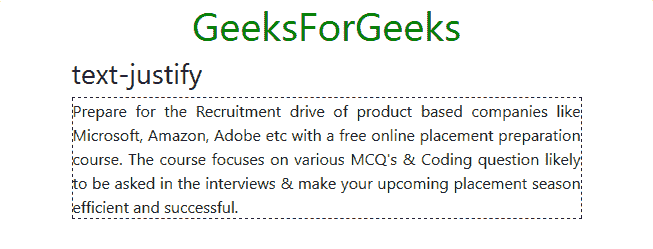

*   **text-center:** It sets the text alignment to center for all screen sizes.

    **示例:**

    ```
    <!DOCTYPE html>
    <html>
      <head>
        <!-- Custom CSS -->
        <style>
          p{
            border: 1px dashed black;
          }
          h1.text-center{
            color: green;
          }

        </style>

        <!-- Bootstrap CSS -->
        <link rel="stylesheet" href="https://stackpath.bootstrapcdn.com/bootstrap/4.2.1/css/bootstrap.min.css" integrity="sha384-GJzZqFGwb1QTTN6wy59ffF1BuGJpLSa9DkKMp0DgiMDm4iYMj70gZWKYbI706tWS" crossorigin="anonymous">

        <title>Bootstrap Text Utilities</title>
      </head>
      <body>
        <!-- Bootstrap class for making the enire div responsive -->
        <div class="container">

          <h1 class="text-center">GeeksForGeeks</h1>

          <h3>text-center</h3>

          <!-- text-center class -->
          <p class="text-center">
            Prepare for the Recruitment drive of product
            based companies like Microsoft, Amazon, Adobe
            etc with a free online placement preparation
            course. The course focuses on various MCQ's
            & Coding question likely to be asked in the
            interviews & make your upcoming placement
            season efficient and successful.
          </p>

        </div>

        <!-- Link JavaScript -->
        <!-- jQuery, Popper.js, Bootstrap JS -->
        <script src="https://code.jquery.com/jquery-3.3.1.slim.min.js" integrity="sha384-q8i/X+965DzO0rT7abK41JStQIAqVgRVzpbzo5smXKp4YfRvH+8abtTE1Pi6jizo" crossorigin="anonymous"></script>
        <script src="https://cdnjs.cloudflare.com/ajax/libs/popper.js/1.14.6/umd/popper.min.js" integrity="sha384-wHAiFfRlMFy6i5SRaxvfOCifBUQy1xHdJ/yoi7FRNXMRBu5WHdZYu1hA6ZOblgut" crossorigin="anonymous"></script>
        <script src="https://stackpath.bootstrapcdn.com/bootstrap/4.2.1/js/bootstrap.min.js" integrity="sha384-B0UglyR+jN6CkvvICOB2joaf5I4l3gm9GU6Hc1og6Ls7i6U/mkkaduKaBhlAXv9k" crossorigin="anonymous"></script>
      </body>
    </html>
    ```

    **输出:**

    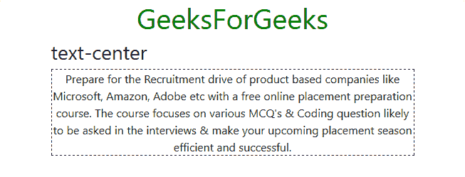

    *   **text-left:** It sets the text alignment to left for all screen sizes.

    **示例:**

    ```
    <!DOCTYPE html>
    <html>
      <head>
        <!-- Custom CSS -->
        <style>
          p{
            border: 1px dashed black;
          }
          h1.text-center{
            color: green;
          }

        </style>

        <!-- Bootstrap CSS -->
        <link rel="stylesheet" href="https://stackpath.bootstrapcdn.com/bootstrap/4.2.1/css/bootstrap.min.css" integrity="sha384-GJzZqFGwb1QTTN6wy59ffF1BuGJpLSa9DkKMp0DgiMDm4iYMj70gZWKYbI706tWS" crossorigin="anonymous">

        <title>Bootstrap Text Utilities</title>
      </head>
      <body>
        <!-- Bootstrap class for making the enire div responsive -->
        <div class="container">

          <h1 class="text-center">GeeksForGeeks</h1>

          <h3>text-left</h3>

          <!-- text-left class -->
          <p class="text-left">
            Prepare for the Recruitment drive of product
            based companies like Microsoft, Amazon, Adobe
            etc with a free online placement preparation
            course. The course focuses on various MCQ's
            & Coding question likely to be asked in the
            interviews & make your upcoming placement
            season efficient and successful.
          </p>

        </div>

        <!-- Link JavaScript -->
        <!-- jQuery, Popper.js, Bootstrap JS -->
        <script src="https://code.jquery.com/jquery-3.3.1.slim.min.js" integrity="sha384-q8i/X+965DzO0rT7abK41JStQIAqVgRVzpbzo5smXKp4YfRvH+8abtTE1Pi6jizo" crossorigin="anonymous"></script>
        <script src="https://cdnjs.cloudflare.com/ajax/libs/popper.js/1.14.6/umd/popper.min.js" integrity="sha384-wHAiFfRlMFy6i5SRaxvfOCifBUQy1xHdJ/yoi7FRNXMRBu5WHdZYu1hA6ZOblgut" crossorigin="anonymous"></script>
        <script src="https://stackpath.bootstrapcdn.com/bootstrap/4.2.1/js/bootstrap.min.js" integrity="sha384-B0UglyR+jN6CkvvICOB2joaf5I4l3gm9GU6Hc1og6Ls7i6U/mkkaduKaBhlAXv9k" crossorigin="anonymous"></script>
      </body>
    </html>
    ```

    **输出:**
    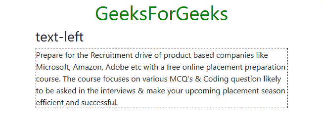

    *   **text-right:** It sets the text alignment to right for all screen sizes.

    **示例:**

    ```
    <!DOCTYPE html>
    <html>
      <head>
        <!-- Custom CSS -->
        <style>
          p{
            border: 1px dashed black;
          }
          h1.text-center{
            color: green;
          }

        </style>

        <!-- Bootstrap CSS -->
        <link rel="stylesheet" href="https://stackpath.bootstrapcdn.com/bootstrap/4.2.1/css/bootstrap.min.css" integrity="sha384-GJzZqFGwb1QTTN6wy59ffF1BuGJpLSa9DkKMp0DgiMDm4iYMj70gZWKYbI706tWS" crossorigin="anonymous">

        <title>Bootstrap Text Utilities</title>
      </head>
      <body>
        <!-- Bootstrap class for making the enire div responsive -->
        <div class="container">

          <h1 class="text-center">GeeksForGeeks</h1>

          <h3>text-right</h3>

          <!-- text-left right -->
          <p class="text-right">
            Prepare for the Recruitment drive of product
            based companies like Microsoft, Amazon, Adobe
            etc with a free online placement preparation
            course. The course focuses on various MCQ's
            & Coding question likely to be asked in the
            interviews & make your upcoming placement
            season efficient and successful.
          </p>

        </div>

        <!-- Link JavaScript -->
        <!-- jQuery, Popper.js, Bootstrap JS -->
        <script src="https://code.jquery.com/jquery-3.3.1.slim.min.js" integrity="sha384-q8i/X+965DzO0rT7abK41JStQIAqVgRVzpbzo5smXKp4YfRvH+8abtTE1Pi6jizo" crossorigin="anonymous"></script>
        <script src="https://cdnjs.cloudflare.com/ajax/libs/popper.js/1.14.6/umd/popper.min.js" integrity="sha384-wHAiFfRlMFy6i5SRaxvfOCifBUQy1xHdJ/yoi7FRNXMRBu5WHdZYu1hA6ZOblgut" crossorigin="anonymous"></script>
        <script src="https://stackpath.bootstrapcdn.com/bootstrap/4.2.1/js/bootstrap.min.js" integrity="sha384-B0UglyR+jN6CkvvICOB2joaf5I4l3gm9GU6Hc1og6Ls7i6U/mkkaduKaBhlAXv9k" crossorigin="anonymous"></script>
      </body>
    </html>
    ```

    **输出:**
    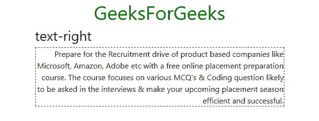

    *   **text-(viewport)-(align):** Bootstrap offers us a series of classes which can change the text alignment based on the viewport size.
    *   **text-sm-left:** 它在大于 576px(sm)的视口中将文本对齐设置为向左。
    *   **text-md-left:** 它在尺寸大于 768px(md)的视口中将文本对齐设置为向左。
    *   **text-lg-left:** 它在尺寸大于 992px(lg)的视口中将文本对齐设置为向左。
    *   **text-xl-left:** 它在尺寸大于 1200px(xl)的视口中将文本对齐设置为向左。
    *   **文本-sm-居中:**它将文本对齐设置为在大于 576px(sm)的视口上居中。
    *   **文本-纵向-居中:**它将文本对齐设置为在尺寸大于 768 像素(纵向)的视口上居中。
    *   **文本-LG-居中:**它将文本对齐设置为在尺寸大于 992px(lg)的视口上居中。
    *   **文本-XL-居中:**它将文本对齐设置为在尺寸大于 1200px(xl)的视口上居中。
    *   **text-sm-right:** 它在尺寸大于 576px(sm)的视口中将文本对齐设置为向右。
    *   **text-md-right:** 它在尺寸大于 768px(md)的视口中将文本对齐设置为向右。
    *   **text-lg-right:** 它在大于 992px(lg)的视口中将文本对齐设置为向右。
    *   **text-xl-right:** 它在尺寸大于 1200px(xl)的视口中将文本对齐设置为向右。

    **示例:** text-sm-right

    ```
    <!DOCTYPE html>
    <html>
      <head>
        <!-- Custom CSS -->
        <style>
          p{
            border: 1px dashed black;
          }
          h1.text-center{
            color: green;
          }

        </style>

        <!-- Bootstrap CSS -->
        <link rel="stylesheet" href="https://stackpath.bootstrapcdn.com/bootstrap/4.2.1/css/bootstrap.min.css" integrity="sha384-GJzZqFGwb1QTTN6wy59ffF1BuGJpLSa9DkKMp0DgiMDm4iYMj70gZWKYbI706tWS" crossorigin="anonymous">

        <title>Bootstrap Text Utilities</title>
      </head>
      <body>
        <!-- Bootstrap class for making the enire div responsive -->
        <div class="container">

          <h1 class="text-center">GeeksForGeeks</h1>

          <h3>text-sm-right</h3>

          <!-- text-sm-right -->
          <p class="text-sm-right">
            Prepare for the Recruitment drive of product
            based companies like Microsoft, Amazon, Adobe
            etc with a free online placement preparation
            course. The course focuses on various MCQ's
            & Coding question likely to be asked in the
            interviews & make your upcoming placement
            season efficient and successful.
          </p>

        </div>

        <!-- Link JavaScript -->
        <!-- jQuery, Popper.js, Bootstrap JS -->
        <script src="https://code.jquery.com/jquery-3.3.1.slim.min.js" integrity="sha384-q8i/X+965DzO0rT7abK41JStQIAqVgRVzpbzo5smXKp4YfRvH+8abtTE1Pi6jizo" crossorigin="anonymous"></script>
        <script src="https://cdnjs.cloudflare.com/ajax/libs/popper.js/1.14.6/umd/popper.min.js" integrity="sha384-wHAiFfRlMFy6i5SRaxvfOCifBUQy1xHdJ/yoi7FRNXMRBu5WHdZYu1hA6ZOblgut" crossorigin="anonymous"></script>
        <script src="https://stackpath.bootstrapcdn.com/bootstrap/4.2.1/js/bootstrap.min.js" integrity="sha384-B0UglyR+jN6CkvvICOB2joaf5I4l3gm9GU6Hc1og6Ls7i6U/mkkaduKaBhlAXv9k" crossorigin="anonymous"></script>
      </body>
    </html>
    ```

    **输出:**
    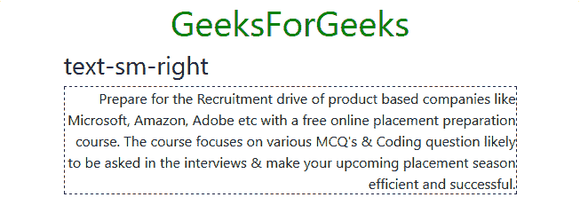

    **注意:**可以组合文本-(对齐)和文本-(视口)-(对齐)以及两种不同的文本-(视口)-(对齐)，根据不同的视口获得不同的对齐。类似地，当视口大小大于 768px(md)时，可以使用文本居中和文本 md 右对齐，在较小的视口中，文本将居中对齐。

    **文字环绕**

    *   **text-wrap:** It sets text wrapping on the applied element.

        ```
        <!DOCTYPE html>
        <html>
          <head>
            <!-- Custom CSS -->
            <style>
              p{
                border: 1px dashed black;
              }
              h1.text-center{
                color: green;
              }

            </style>

            <!-- Bootstrap CSS -->
            <link rel="stylesheet" href="https://stackpath.bootstrapcdn.com/bootstrap/4.2.1/css/bootstrap.min.css" integrity="sha384-GJzZqFGwb1QTTN6wy59ffF1BuGJpLSa9DkKMp0DgiMDm4iYMj70gZWKYbI706tWS" crossorigin="anonymous">

            <title>Bootstrap Text Utilities</title>
          </head>
          <body>
            <!-- Bootstrap class for making the enire div responsive -->
            <div class="container">

              <h1 class="text-center">GeeksForGeeks</h1>

              <h3>text-wrap</h3>

              <!-- text-wrap -->
              <p class="text-wrap" style="width: 30rem;">
                Prepare for the Recruitment drive of product
                based companies like Microsoft, Amazon, Adobe
                etc with a free online placement preparation
                course. The course focuses on various MCQ's
                & Coding question likely to be asked in the
                interviews & make your upcoming placement
                season efficient and successful.
              </p>

            </div>

            <!-- Link JavaScript -->
            <!-- jQuery, Popper.js, Bootstrap JS -->
            <script src="https://code.jquery.com/jquery-3.3.1.slim.min.js" integrity="sha384-q8i/X+965DzO0rT7abK41JStQIAqVgRVzpbzo5smXKp4YfRvH+8abtTE1Pi6jizo" crossorigin="anonymous"></script>
            <script src="https://cdnjs.cloudflare.com/ajax/libs/popper.js/1.14.6/umd/popper.min.js" integrity="sha384-wHAiFfRlMFy6i5SRaxvfOCifBUQy1xHdJ/yoi7FRNXMRBu5WHdZYu1hA6ZOblgut" crossorigin="anonymous"></script>
            <script src="https://stackpath.bootstrapcdn.com/bootstrap/4.2.1/js/bootstrap.min.js" integrity="sha384-B0UglyR+jN6CkvvICOB2joaf5I4l3gm9GU6Hc1og6Ls7i6U/mkkaduKaBhlAXv9k" crossorigin="anonymous"></script>
          </body>
        </html>
        ```

        **输出:**
        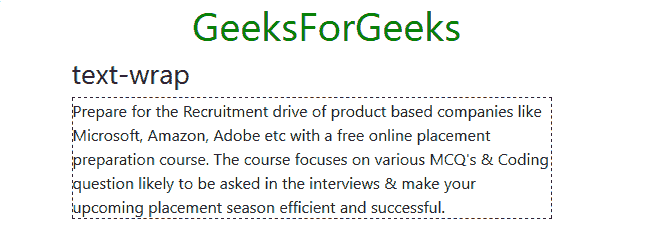

    *   **text-nowrap:** It removes text wrapping on the applied element.

        ```
        <!DOCTYPE html>
        <html>
          <head>
            <!-- Custom CSS -->
            <style>
              p{
                border: 1px dashed black;
              }
              h1.text-center{
                color: green;
              }

            </style>

            <!-- Bootstrap CSS -->
            <link rel="stylesheet" href="https://stackpath.bootstrapcdn.com/bootstrap/4.2.1/css/bootstrap.min.css" integrity="sha384-GJzZqFGwb1QTTN6wy59ffF1BuGJpLSa9DkKMp0DgiMDm4iYMj70gZWKYbI706tWS" crossorigin="anonymous">

            <title>Bootstrap Text Utilities</title>
          </head>
          <body>
            <!-- Bootstrap class for making the enire div responsive -->
            <div class="container">

              <h1 class="text-center">GeeksForGeeks</h1>

              <h3>text-nowrap</h3>

              <!-- text-nowrap -->
              <p class="text-nowrap" style="width: 30rem;">
                Prepare for the Recruitment drive of product
                based companies like Microsoft, Amazon, Adobe
                etc with a free online placement preparation
                course. The course focuses on various MCQ's
                & Coding question likely to be asked in the
                interviews & make your upcoming placement
                season efficient and successful.
              </p>

            </div>

            <!-- Link JavaScript -->
            <!-- jQuery, Popper.js, Bootstrap JS -->
            <script src="https://code.jquery.com/jquery-3.3.1.slim.min.js" integrity="sha384-q8i/X+965DzO0rT7abK41JStQIAqVgRVzpbzo5smXKp4YfRvH+8abtTE1Pi6jizo" crossorigin="anonymous"></script>
            <script src="https://cdnjs.cloudflare.com/ajax/libs/popper.js/1.14.6/umd/popper.min.js" integrity="sha384-wHAiFfRlMFy6i5SRaxvfOCifBUQy1xHdJ/yoi7FRNXMRBu5WHdZYu1hA6ZOblgut" crossorigin="anonymous"></script>
            <script src="https://stackpath.bootstrapcdn.com/bootstrap/4.2.1/js/bootstrap.min.js" integrity="sha384-B0UglyR+jN6CkvvICOB2joaf5I4l3gm9GU6Hc1og6Ls7i6U/mkkaduKaBhlAXv9k" crossorigin="anonymous"></script>
          </body>
        </html>
        ```

        **输出:**
        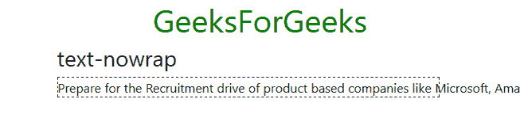

    *   **text-truncate:** It sets truncation on the applied element with ellipses.

        ```
        <!DOCTYPE html>
        <html>
          <head>
            <!-- Custom CSS -->
            <style>
              p{
                border: 1px dashed black;
              }

              h1.text-center{
                color: green;
              }
            </style>

            <!-- Bootstrap CSS -->
            <link rel="stylesheet" href="https://stackpath.bootstrapcdn.com/bootstrap/4.2.1/css/bootstrap.min.css" integrity="sha384-GJzZqFGwb1QTTN6wy59ffF1BuGJpLSa9DkKMp0DgiMDm4iYMj70gZWKYbI706tWS" crossorigin="anonymous">

            <title>Bootstrap Text Utilities</title>
          </head>
          <body>
            <!-- Bootstrap class for making the enire div responsive -->
            <div class="container">

              <h1 class="text-center">GeeksForGeeks</h1>

              <h3>text-truncate</h3>

              <!-- text-truncate -->
              <p class="text-truncate" style="width: 30rem;">
                Prepare for the Recruitment drive of product
                based companies like Microsoft, Amazon, Adobe
                etc with a free online placement preparation
                course. The course focuses on various MCQ's
                & Coding question likely to be asked in the
                interviews & make your upcoming placement
                season efficient and successful.
              </p>

            </div>

            <!-- Link JavaScript -->
            <!-- jQuery, Popper.js, Bootstrap JS -->
            <script src="https://code.jquery.com/jquery-3.3.1.slim.min.js" integrity="sha384-q8i/X+965DzO0rT7abK41JStQIAqVgRVzpbzo5smXKp4YfRvH+8abtTE1Pi6jizo" crossorigin="anonymous"></script>
            <script src="https://cdnjs.cloudflare.com/ajax/libs/popper.js/1.14.6/umd/popper.min.js" integrity="sha384-wHAiFfRlMFy6i5SRaxvfOCifBUQy1xHdJ/yoi7FRNXMRBu5WHdZYu1hA6ZOblgut" crossorigin="anonymous"></script>
            <script src="https://stackpath.bootstrapcdn.com/bootstrap/4.2.1/js/bootstrap.min.js" integrity="sha384-B0UglyR+jN6CkvvICOB2joaf5I4l3gm9GU6Hc1og6Ls7i6U/mkkaduKaBhlAXv9k" crossorigin="anonymous"></script>
          </body>
        </html>
        ```

        **输出:**
        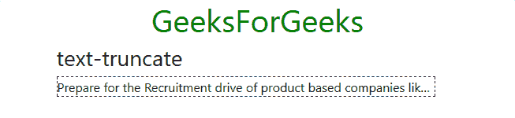

**字体粗细和斜体**

*   **font-weight-bold:** It is used to set font text to bold face.

    ```
    <!DOCTYPE html>
    <html>
      <head>
        <!-- Custom CSS -->
        <style>
          p{
            border: 1px dashed black;
          }

          h1.text-center{
            color: green;
          }
        </style>

        <!-- Bootstrap CSS -->
        <link rel="stylesheet" href="https://stackpath.bootstrapcdn.com/bootstrap/4.2.1/css/bootstrap.min.css" integrity="sha384-GJzZqFGwb1QTTN6wy59ffF1BuGJpLSa9DkKMp0DgiMDm4iYMj70gZWKYbI706tWS" crossorigin="anonymous">

        <title>Bootstrap Text Utilities</title>
      </head>
      <body>
        <!-- Bootstrap class for making the enire div responsive -->
        <div class="container">

          <h1 class="text-center">GeeksForGeeks</h1>

          <h3>font-weight-bold</h3>

          <!-- font-weight-bold -->
          <p class="font-weight-bold">
            Prepare for the Recruitment drive of product
            based companies like Microsoft, Amazon, Adobe
            etc with a free online placement preparation
            course. The course focuses on various MCQ's
            & Coding question likely to be asked in the
            interviews & make your upcoming placement
            season efficient and successful.
          </p>

        </div>

        <!-- Link JavaScript -->
        <!-- jQuery, Popper.js, Bootstrap JS -->
        <script src="https://code.jquery.com/jquery-3.3.1.slim.min.js" integrity="sha384-q8i/X+965DzO0rT7abK41JStQIAqVgRVzpbzo5smXKp4YfRvH+8abtTE1Pi6jizo" crossorigin="anonymous"></script>
        <script src="https://cdnjs.cloudflare.com/ajax/libs/popper.js/1.14.6/umd/popper.min.js" integrity="sha384-wHAiFfRlMFy6i5SRaxvfOCifBUQy1xHdJ/yoi7FRNXMRBu5WHdZYu1hA6ZOblgut" crossorigin="anonymous"></script>
        <script src="https://stackpath.bootstrapcdn.com/bootstrap/4.2.1/js/bootstrap.min.js" integrity="sha384-B0UglyR+jN6CkvvICOB2joaf5I4l3gm9GU6Hc1og6Ls7i6U/mkkaduKaBhlAXv9k" crossorigin="anonymous"></script>
      </body>
    </html>
    ```

    **输出:**
    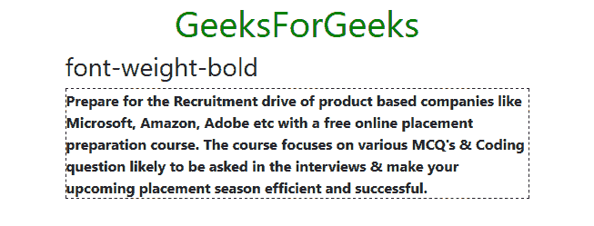

*   **font-weight-bolder:** It is used to set font weight bolder than its parent element.

    ```
    <!DOCTYPE html>
    <html>
      <head>
        <!-- Custom CSS -->
        <style>
          p{
            border: 1px dashed black;
          }

          h1.text-center{
            color: green;
          }
        </style>

        <!-- Bootstrap CSS -->
        <link rel="stylesheet" href="https://stackpath.bootstrapcdn.com/bootstrap/4.2.1/css/bootstrap.min.css" integrity="sha384-GJzZqFGwb1QTTN6wy59ffF1BuGJpLSa9DkKMp0DgiMDm4iYMj70gZWKYbI706tWS" crossorigin="anonymous">

        <title>Bootstrap Text Utilities</title>
      </head>
      <body>
        <!-- Bootstrap class for making the enire div responsive -->
        <div class="container">

          <h1 class="text-center">GeeksForGeeks</h1>

          <h3>font-weight-bolder</h3>

          <!-- font-weight-bolder -->
          <p class="font-weight-bolder">
            Prepare for the Recruitment drive of product
            based companies like Microsoft, Amazon, Adobe
            etc with a free online placement preparation
            course. The course focuses on various MCQ's
            & Coding question likely to be asked in the
            interviews & make your upcoming placement
            season efficient and successful.
          </p>

        </div>

        <!-- Link JavaScript -->
        <!-- jQuery, Popper.js, Bootstrap JS -->
        <script src="https://code.jquery.com/jquery-3.3.1.slim.min.js" integrity="sha384-q8i/X+965DzO0rT7abK41JStQIAqVgRVzpbzo5smXKp4YfRvH+8abtTE1Pi6jizo" crossorigin="anonymous"></script>
        <script src="https://cdnjs.cloudflare.com/ajax/libs/popper.js/1.14.6/umd/popper.min.js" integrity="sha384-wHAiFfRlMFy6i5SRaxvfOCifBUQy1xHdJ/yoi7FRNXMRBu5WHdZYu1hA6ZOblgut" crossorigin="anonymous"></script>
        <script src="https://stackpath.bootstrapcdn.com/bootstrap/4.2.1/js/bootstrap.min.js" integrity="sha384-B0UglyR+jN6CkvvICOB2joaf5I4l3gm9GU6Hc1og6Ls7i6U/mkkaduKaBhlAXv9k" crossorigin="anonymous"></script>
      </body>
    </html>
    ```

    **输出:**
    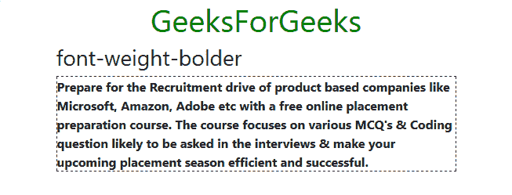

*   **font-weight-normal:** It is used to set normal font weight.

    ```
    <!DOCTYPE html>
    <html>
      <head>
        <!-- Custom CSS -->
        <style>
          p{
            border: 1px dashed black;
          }

          h1.text-center{
            color: green;
          }
        </style>

        <!-- Bootstrap CSS -->
        <link rel="stylesheet" href="https://stackpath.bootstrapcdn.com/bootstrap/4.2.1/css/bootstrap.min.css" integrity="sha384-GJzZqFGwb1QTTN6wy59ffF1BuGJpLSa9DkKMp0DgiMDm4iYMj70gZWKYbI706tWS" crossorigin="anonymous">

        <title>Bootstrap Text Utilities</title>
      </head>
      <body>
        <!-- Bootstrap class for making the enire div responsive -->
        <div class="container">

          <h1 class="text-center">GeeksForGeeks</h1>

          <h3>font-weight-normal</h3>

          <!-- font-weight-normal -->
          <p class="font-weight-normal">
            Prepare for the Recruitment drive of product
            based companies like Microsoft, Amazon, Adobe
            etc with a free online placement preparation
            course. The course focuses on various MCQ's
            & Coding question likely to be asked in the
            interviews & make your upcoming placement
            season efficient and successful.
          </p>

        </div>

        <!-- Link JavaScript -->
        <!-- jQuery, Popper.js, Bootstrap JS -->
        <script src="https://code.jquery.com/jquery-3.3.1.slim.min.js" integrity="sha384-q8i/X+965DzO0rT7abK41JStQIAqVgRVzpbzo5smXKp4YfRvH+8abtTE1Pi6jizo" crossorigin="anonymous"></script>
        <script src="https://cdnjs.cloudflare.com/ajax/libs/popper.js/1.14.6/umd/popper.min.js" integrity="sha384-wHAiFfRlMFy6i5SRaxvfOCifBUQy1xHdJ/yoi7FRNXMRBu5WHdZYu1hA6ZOblgut" crossorigin="anonymous"></script>
        <script src="https://stackpath.bootstrapcdn.com/bootstrap/4.2.1/js/bootstrap.min.js" integrity="sha384-B0UglyR+jN6CkvvICOB2joaf5I4l3gm9GU6Hc1og6Ls7i6U/mkkaduKaBhlAXv9k" crossorigin="anonymous"></script>
      </body>
    </html>
    ```

    **输出:**
    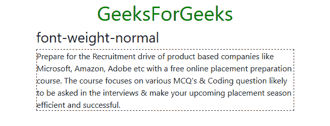

*   **font-weight-light:** It is used to set light font weight to the text.

    ```
    <!DOCTYPE html>
    <html>
      <head>
        <!-- Custom CSS -->
        <style>
          p{
            border: 1px dashed black;
          }

          h1.text-center{
            color: green;
          }
        </style>

        <!-- Bootstrap CSS -->
        <link rel="stylesheet" href="https://stackpath.bootstrapcdn.com/bootstrap/4.2.1/css/bootstrap.min.css" integrity="sha384-GJzZqFGwb1QTTN6wy59ffF1BuGJpLSa9DkKMp0DgiMDm4iYMj70gZWKYbI706tWS" crossorigin="anonymous">

        <title>Bootstrap Text Utilities</title>
      </head>
      <body>
        <!-- Bootstrap class for making the enire div responsive -->
        <div class="container">

          <h1 class="text-center">GeeksForGeeks</h1>

          <h3>font-weight-light</h3>

          <!-- font-weight-light -->
          <p class="font-weight-light">
            Prepare for the Recruitment drive of product
            based companies like Microsoft, Amazon, Adobe
            etc with a free online placement preparation
            course. The course focuses on various MCQ's
            & Coding question likely to be asked in the
            interviews & make your upcoming placement
            season efficient and successful.
          </p>

        </div>

        <!-- Link JavaScript -->
        <!-- jQuery, Popper.js, Bootstrap JS -->
        <script src="https://code.jquery.com/jquery-3.3.1.slim.min.js" integrity="sha384-q8i/X+965DzO0rT7abK41JStQIAqVgRVzpbzo5smXKp4YfRvH+8abtTE1Pi6jizo" crossorigin="anonymous"></script>
        <script src="https://cdnjs.cloudflare.com/ajax/libs/popper.js/1.14.6/umd/popper.min.js" integrity="sha384-wHAiFfRlMFy6i5SRaxvfOCifBUQy1xHdJ/yoi7FRNXMRBu5WHdZYu1hA6ZOblgut" crossorigin="anonymous"></script>
        <script src="https://stackpath.bootstrapcdn.com/bootstrap/4.2.1/js/bootstrap.min.js" integrity="sha384-B0UglyR+jN6CkvvICOB2joaf5I4l3gm9GU6Hc1og6Ls7i6U/mkkaduKaBhlAXv9k" crossorigin="anonymous"></script>
      </body>
    </html>
    ```

    **输出:**
    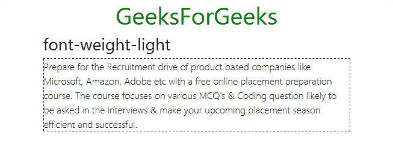

*   **font-weight-lighter:** It is used to set font weight lighter than its parent element.

    ```
    <!DOCTYPE html>
    <html>
      <head>
        <!-- Custom CSS -->
        <style>
          p{
            border: 1px dashed black;
          }
          h1.text-center{
            color: green;
          }

        </style>

        <!-- Bootstrap CSS -->
        <link rel="stylesheet" href="https://stackpath.bootstrapcdn.com/bootstrap/4.2.1/css/bootstrap.min.css" integrity="sha384-GJzZqFGwb1QTTN6wy59ffF1BuGJpLSa9DkKMp0DgiMDm4iYMj70gZWKYbI706tWS" crossorigin="anonymous">

        <title>Bootstrap Text Utilities</title>
      </head>
      <body>
        <!-- Bootstrap class for making the enire div responsive -->
        <div class="container">

          <h1 class="text-center">GeeksForGeeks</h1>

          <h3>font-weight-lighter</h3>

          <!-- font-weight-lighter -->
          <p class="font-weight-lighter">
            Prepare for the Recruitment drive of product
            based companies like Microsoft, Amazon, Adobe
            etc with a free online placement preparation
            course. The course focuses on various MCQ's
            & Coding question likely to be asked in the
            interviews & make your upcoming placement
            season efficient and successful.
          </p>

        </div>

        <!-- Link JavaScript -->
        <!-- jQuery, Popper.js, Bootstrap JS -->
        <script src="https://code.jquery.com/jquery-3.3.1.slim.min.js" integrity="sha384-q8i/X+965DzO0rT7abK41JStQIAqVgRVzpbzo5smXKp4YfRvH+8abtTE1Pi6jizo" crossorigin="anonymous"></script>
        <script src="https://cdnjs.cloudflare.com/ajax/libs/popper.js/1.14.6/umd/popper.min.js" integrity="sha384-wHAiFfRlMFy6i5SRaxvfOCifBUQy1xHdJ/yoi7FRNXMRBu5WHdZYu1hA6ZOblgut" crossorigin="anonymous"></script>
        <script src="https://stackpath.bootstrapcdn.com/bootstrap/4.2.1/js/bootstrap.min.js" integrity="sha384-B0UglyR+jN6CkvvICOB2joaf5I4l3gm9GU6Hc1og6Ls7i6U/mkkaduKaBhlAXv9k" crossorigin="anonymous"></script>
      </body>
    </html>
    ```

    **输出:**
    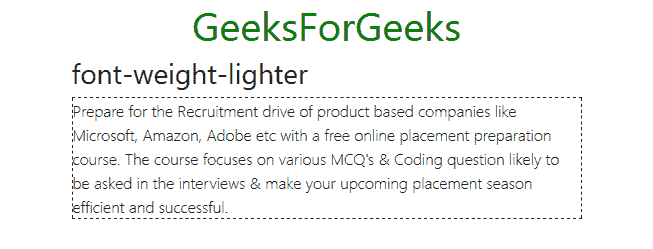

*   **font-italics:** It is used to set the style of the font to italics.

    ```
    <!DOCTYPE html>
    <html>
      <head>
        <!-- Custom CSS -->
        <style>
          p{
            border: 1px dashed black;
          }
          h1.text-center{
            color: green;
          }

        </style>

        <!-- Bootstrap CSS -->
        <link rel="stylesheet" href="https://stackpath.bootstrapcdn.com/bootstrap/4.2.1/css/bootstrap.min.css" integrity="sha384-GJzZqFGwb1QTTN6wy59ffF1BuGJpLSa9DkKMp0DgiMDm4iYMj70gZWKYbI706tWS" crossorigin="anonymous">

        <title>Bootstrap Text Utilities</title>
      </head>
      <body>
        <!-- Bootstrap class for making the enire div responsive -->
        <div class="container">

          <h1 class="text-center">GeeksForGeeks</h1>

          <h3>font-italic</h3>

          <!-- font-italic -->
          <p class="font-italic">
            Prepare for the Recruitment drive of product
            based companies like Microsoft, Amazon, Adobe
            etc with a free online placement preparation
            course. The course focuses on various MCQ's
            & Coding question likely to be asked in the
            interviews & make your upcoming placement
            season efficient and successful.
          </p>

        </div>

        <!-- Link JavaScript -->
        <!-- jQuery, Popper.js, Bootstrap JS -->
        <script src="https://code.jquery.com/jquery-3.3.1.slim.min.js" integrity="sha384-q8i/X+965DzO0rT7abK41JStQIAqVgRVzpbzo5smXKp4YfRvH+8abtTE1Pi6jizo" crossorigin="anonymous"></script>
        <script src="https://cdnjs.cloudflare.com/ajax/libs/popper.js/1.14.6/umd/popper.min.js" integrity="sha384-wHAiFfRlMFy6i5SRaxvfOCifBUQy1xHdJ/yoi7FRNXMRBu5WHdZYu1hA6ZOblgut" crossorigin="anonymous"></script>
        <script src="https://stackpath.bootstrapcdn.com/bootstrap/4.2.1/js/bootstrap.min.js" integrity="sha384-B0UglyR+jN6CkvvICOB2joaf5I4l3gm9GU6Hc1og6Ls7i6U/mkkaduKaBhlAXv9k" crossorigin="anonymous"></script>
      </body>
    </html>
    ```

    **输出:**
    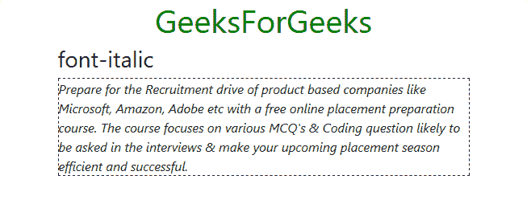

**等间距**:

*   **text-monospace:** It is used to change the text font to monospace.

    ```
    <!DOCTYPE html>
    <html>
      <head>
        <!-- Custom CSS -->
        <style>
          p{
            border: 1px dashed black;
          }

          h1.text-center{
            color: green;
          }

        </style>

        <!-- Bootstrap CSS -->
        <link rel="stylesheet" href="https://stackpath.bootstrapcdn.com/bootstrap/4.2.1/css/bootstrap.min.css" integrity="sha384-GJzZqFGwb1QTTN6wy59ffF1BuGJpLSa9DkKMp0DgiMDm4iYMj70gZWKYbI706tWS" crossorigin="anonymous">

        <title>Bootstrap Text Utilities</title>
      </head>
      <body>
        <!-- Bootstrap class for making the enire div responsive -->
        <div class="container">

          <h1 class="text-center">GeeksForGeeks</h1>

          <h3>text-monospace</h3>

          <!-- text-monospace -->
          <p class="text-monospace">
            Prepare for the Recruitment drive of product
            based companies like Microsoft, Amazon, Adobe
            etc with a free online placement preparation
            course. The course focuses on various MCQ's
            & Coding question likely to be asked in the
            interviews & make your upcoming placement
            season efficient and successful.
          </p>

        </div>

        <!-- Link JavaScript -->
        <!-- jQuery, Popper.js, Bootstrap JS -->
        <script src="https://code.jquery.com/jquery-3.3.1.slim.min.js" integrity="sha384-q8i/X+965DzO0rT7abK41JStQIAqVgRVzpbzo5smXKp4YfRvH+8abtTE1Pi6jizo" crossorigin="anonymous"></script>
        <script src="https://cdnjs.cloudflare.com/ajax/libs/popper.js/1.14.6/umd/popper.min.js" integrity="sha384-wHAiFfRlMFy6i5SRaxvfOCifBUQy1xHdJ/yoi7FRNXMRBu5WHdZYu1hA6ZOblgut" crossorigin="anonymous"></script>
        <script src="https://stackpath.bootstrapcdn.com/bootstrap/4.2.1/js/bootstrap.min.js" integrity="sha384-B0UglyR+jN6CkvvICOB2joaf5I4l3gm9GU6Hc1og6Ls7i6U/mkkaduKaBhlAXv9k" crossorigin="anonymous"></script>
      </body>
    </html>
    ```

    **输出:**
    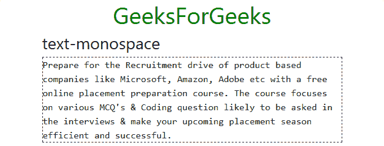

**重置颜色**:

*   **text-reset:** It is used to remove the font color from the text to font color inherited from its parent element.

    ```
    <!DOCTYPE html>
    <html>
      <head>
        <!-- Custom CSS -->
        <style>
          p{
            border: 1px dashed black;
            color: blue;
          }
          h1.text-center{
            color: green;
          }

        </style>

        <!-- Bootstrap CSS -->
        <link rel="stylesheet" href="https://stackpath.bootstrapcdn.com/bootstrap/4.2.1/css/bootstrap.min.css" integrity="sha384-GJzZqFGwb1QTTN6wy59ffF1BuGJpLSa9DkKMp0DgiMDm4iYMj70gZWKYbI706tWS" crossorigin="anonymous">

        <title>Bootstrap Text Utilities</title>
      </head>
      <body>
        <!-- Bootstrap class for making the enire div responsive -->
        <div class="container">

          <h1 class="text-center">GeeksForGeeks</h1>

          <h3>text-reset</h3>

          <!-- text-reset -->
          <p class="text-reset">
            Prepare for the Recruitment drive of product
            based companies like Microsoft, Amazon, Adobe
            etc with a free online placement preparation
            course. The course focuses on various MCQ's
            & Coding question likely to be asked in the
            interviews & make your upcoming placement
            season efficient and successful.
          </p>

        </div>

        <!-- Link JavaScript -->
        <!-- jQuery, Popper.js, Bootstrap JS -->
        <script src="https://code.jquery.com/jquery-3.3.1.slim.min.js" integrity="sha384-q8i/X+965DzO0rT7abK41JStQIAqVgRVzpbzo5smXKp4YfRvH+8abtTE1Pi6jizo" crossorigin="anonymous"></script>
        <script src="https://cdnjs.cloudflare.com/ajax/libs/popper.js/1.14.6/umd/popper.min.js" integrity="sha384-wHAiFfRlMFy6i5SRaxvfOCifBUQy1xHdJ/yoi7FRNXMRBu5WHdZYu1hA6ZOblgut" crossorigin="anonymous"></script>
        <script src="https://stackpath.bootstrapcdn.com/bootstrap/4.2.1/js/bootstrap.min.js" integrity="sha384-B0UglyR+jN6CkvvICOB2joaf5I4l3gm9GU6Hc1og6Ls7i6U/mkkaduKaBhlAXv9k" crossorigin="anonymous"></script>
      </body>
    </html>
    ```

    **输出:**
    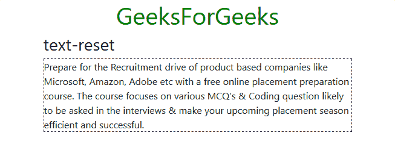

**移除文字装饰**:

*   **text-decoration-none:** It is used to remove all the text decoration from the text.

    ```
    <!DOCTYPE html>
    <html>
      <head>
        <!-- Custom CSS -->
        <style>
          p{
            border: 1px dashed black;
            text-decoration: line-through;
          }
          h1.text-center{
            color: green;
          }
        </style>

        <!-- Bootstrap CSS -->
        <link rel="stylesheet" href="https://stackpath.bootstrapcdn.com/bootstrap/4.2.1/css/bootstrap.min.css" integrity="sha384-GJzZqFGwb1QTTN6wy59ffF1BuGJpLSa9DkKMp0DgiMDm4iYMj70gZWKYbI706tWS" crossorigin="anonymous">

        <title>Bootstrap Text Utilities</title>
      </head>
      <body>
        <!-- Bootstrap class for making the enire div responsive -->
        <div class="container">

          <h1 class="text-center">GeeksForGeeks</h1>

          <h3>text-decoration-none</h3>

          <!-- text-decoration-none -->
          <p class="text-decoration-none">
            Prepare for the Recruitment drive of product
            based companies like Microsoft, Amazon, Adobe
            etc with a free online placement preparation
            course. The course focuses on various MCQ's
            & Coding question likely to be asked in the
            interviews & make your upcoming placement
            season efficient and successful.
          </p>

        </div>

        <!-- Link JavaScript -->
        <!-- jQuery, Popper.js, Bootstrap JS -->
        <script src="https://code.jquery.com/jquery-3.3.1.slim.min.js" integrity="sha384-q8i/X+965DzO0rT7abK41JStQIAqVgRVzpbzo5smXKp4YfRvH+8abtTE1Pi6jizo" crossorigin="anonymous"></script>
        <script src="https://cdnjs.cloudflare.com/ajax/libs/popper.js/1.14.6/umd/popper.min.js" integrity="sha384-wHAiFfRlMFy6i5SRaxvfOCifBUQy1xHdJ/yoi7FRNXMRBu5WHdZYu1hA6ZOblgut" crossorigin="anonymous"></script>
        <script src="https://stackpath.bootstrapcdn.com/bootstrap/4.2.1/js/bootstrap.min.js" integrity="sha384-B0UglyR+jN6CkvvICOB2joaf5I4l3gm9GU6Hc1og6Ls7i6U/mkkaduKaBhlAXv9k" crossorigin="anonymous"></script>
      </body>
    </html>
    ```

    **输出:**
    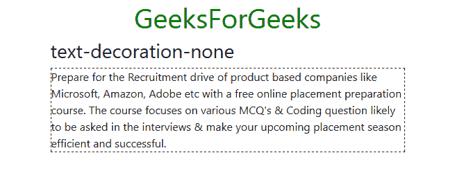