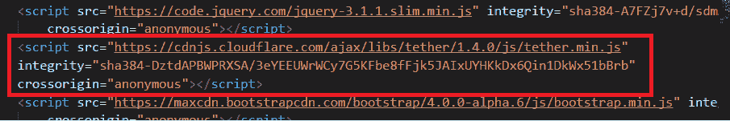
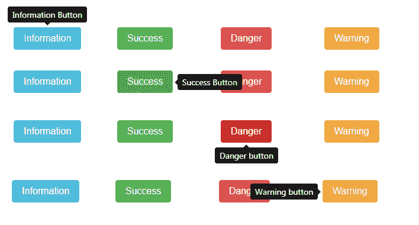

# 引导程序(第 9 部分)|工具提示

> 原文:[https://www.geeksforgeeks.org/bootstrap-tooltips/](https://www.geeksforgeeks.org/bootstrap-tooltips/)

在本文中，我们将讨论由 bootstrap 提供的**工具提示**插件。工具提示对于显示网页中不同元素的描述非常有用。工具提示可以在网页中的任何元素上调用。
引导上的工具提示依赖于第三方库**系绳**进行定位。



因此，我们需要在**bootstrap . js**
T5【之前包含 **tether.min.js** 现在让我们看一个工具提示的例子。


现在我们将检查生成上述工具提示
的**代码**

## Java 语言(一种计算机语言，尤用于创建网站)

```html
<!-- Tooltip on a header -->
<h3 data-toggle="tooltip" title="Hey! Tooltip here!">
    Hover Over me to see a tooltip
</h3>
```

为了引入工具提示，我们将数据切换属性添加到元素中，并且我们需要用 jQuery 初始化工具提示。
**用于初始化工具提示的 jQuery 代码:**

## Java 语言(一种计算机语言，尤用于创建网站)

```html
<script>
// jQuery code for initializing a tooltip
$(document).ready(function () 
{
    // jQuery Attribute value selector to 
    // select the specified element and 
    // call the tooltip method on it
    $('[data-toggle="tooltip"]').tooltip();
});
</script>
```

我们甚至可以**根据我们的需求定制**这个工具提示，让我们探索定制工具提示的不同方式。

*   **放置刀尖**:我们可以在元素的顶部、底部、左侧和右侧放置刀尖。
    **例:**



*   **代码**上例:

## Java 语言(一种计算机语言，尤用于创建网站)

```html
<!-- Tooltips on simple buttons -->
<!-- Placement of tooltips -->
<div class="row" style="margin:30px">
    <div class="col-2">
        <button type="button" class="btn btn-info" 
         data-toggle="tooltip" data-placement="top" 
         title="Information Button">
            Information 
        </button>
    </div>
    <div class="col-2">
        <button type="button" class="btn btn-success" 
         data-toggle="tooltip" data-placement="right" 
         title="Success Button">
            Success
        </button>
    </div>

    <div class="col-2">
        <button type="button" class="btn btn-danger" 
          data-toggle="tooltip" data-placement="bottom" 
          title="Danger button">
             Danger
        </button>
    </div>
    <div class="col-2">
        <button type="button" class="btn btn-warning" 
          data-toggle="tooltip" data-placement="left" 
          title="Warning button">
             Warning
        </button>
    </div>
</div>
```

*   在上面的代码中，我们使用了**数据放置**属性来设置刀尖的放置，我们还使用了*行*和*列*类，这些类由 bootstrap [网格系统](https://www.geeksforgeeks.org/bootstrap-part-2/)提供
*   **工具提示内的 Html**:我们可以添加 Html 作为工具提示的内容。
    **例:**


*   **代码**上例:

## Java 语言(一种计算机语言，尤用于创建网站)

```html
<!-- Tooltip with html -->
<div class="row" style="margin:40px">
    <button type="button" class="btn btn-warning" 
     data-toggle="tooltip" data-placement="left" 
     data-html="true"
     title="<h4>Hey!</h4>
<p>Tooltip with html</p>
">
          Warning
    </button>
</div>
```

*   在上面的代码中，我们使用了**数据-html** 属性，以便在工具提示中添加一个 html。
*   **工具提示的偏移**:我们可以设置刀尖相对于目标的偏移。
    示例:


*   **代码**上例:

## Java 语言(一种计算机语言，尤用于创建网站)

```html
<div class="row" style="margin:40px">
    <button type="button" class="btn btn-warning" 
     data-toggle="tooltip" data-placement="right" 
     data-offset ="20 0" 
     title="Don't click on Warning Button">
        Warning
    </button>
</div>
```

*   在上面的代码中，我们使用了**数据偏移**属性来设置属性

**注意:**下面所有代码的输出都是非静态的，因此这里不显示输出。

*   **工具提示上的动画:**
    默认情况下，工具提示上会添加一个动画，即它淡入淡出，我们可以删除这个动画。

## Java 语言(一种计算机语言，尤用于创建网站)

```html
<!-- Removing animation from the tooltip -->
<div class="row" style="margin:40px">
    <button type="button" class="btn btn-warning" 
     data-toggle="tooltip" data-placement="right" 
     data-animation="false" 
     title="Don't click on Warning Button">
         Warning
    </button>
</div>
```

*   在上面的代码中，我们使用了**数据-动画**属性，并将其设置为 false，以便从工具提示中移除动画
*   **出现和消失的延迟**:我们可以为工具提示的出现和消失设置一个时间间隔。
    我们可以通过两种方式设置延迟:
    *   我们为显示和隐藏
        设置相同的延迟时间

## Java 语言(一种计算机语言，尤用于创建网站)

```html
<!-- Delay in tooltip -->
<div class="row" style="margin:40px">
    <button type="button" class="btn btn-warning" 
     data-toggle="tooltip" data-placement="right" 
     data-delay="1000"
     title="Don't click on Warning Button">
         Warning
    </button>
</div>
```

*   在上面的代码中，我们使用了**数据延迟**属性来延迟分配给该属性的刀尖编号，单位为毫秒，即刀尖将延迟 1000 毫秒
*   我们可以添加**不同的延迟时间**间隔来显示和隐藏工具提示。
    **Html 代码:**

## Java 语言(一种计算机语言，尤用于创建网站)

```html
<!-- Delay in tooltip -->
<div class="row" style="margin:40px">
    <button type="button" class="btn btn-warning" 
     data-toggle="tooltip" data-placement="right" 
     title="Don't click on Warning Button">
         Warning
    </button>
</div>
```

html 代码没有变化。
**jQuery 代码:**

## Java 语言(一种计算机语言，尤用于创建网站)

```html
<script>
    $(document).ready(function () 
    {
        // jQuery Attribute value selector
        $('[data-toggle="tooltip"]').tooltip({
            delay: { "show": 1000, "hide": 2000 }
        });
    });
</script>
```

*   **触发工具提示**:我们可以添加一个触发工具提示的事件，默认在*悬停和聚焦*时触发工具提示，允许的各种事件有-点击、悬停、聚焦和手动。

## Java 语言(一种计算机语言，尤用于创建网站)

```html
<!-- triggering the  tooltip -->
<div class="row" style="margin:40px">
    <button type="button" class="btn btn-warning" 
     data-toggle="tooltip" data-placement="right" 
     data-trigger="click" 
     title="Don't click on Warning Button">
          Warning
    </button>
</div>
```

*   在上面的代码中，我们使用了**数据触发**属性，并将值设置为*点击*，这意味着当用户点击该元素时，将出现工具提示