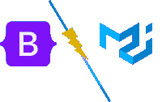

# 引导对比材料界面

> 原文:[https://www.geeksforgeeks.org/bootstrap-vs-material-ui/](https://www.geeksforgeeks.org/bootstrap-vs-material-ui/)

对于网页开发，你应该更喜欢引导程序还是材料用户界面？对于前端开发人员来说，这是一个长期存在的问题，尤其是那些刚刚开始深入研究前端框架的开发人员。关于这两个问题有很多争论和争论，但没有人有一个明确的答案。因此，我们将试图明确区分您应该使用哪一种。

[**【Bootstrap】**](https://www.geeksforgeeks.org/bootstrap-tutorials/)**是一个强大、免费、开源的 CSS 框架，由 Twitter 创建，作为他们的内部框架，通过实现预定义的类来构建响应性网站和 web 应用程序，让开发人员的生活变得更加轻松。自从推特在 2011 年将其开源以来，Bootstrap 是最受欢迎和使用最多的 CSS 框架，拥有庞大的社区。很多大公司像 Airbnb、苹果音乐、Dropbox、Coursera 等等。**

**[**材质 UI**](https://www.geeksforgeeks.org/material-ui-introduction-and-installation-for-react/) 是 2017 年的，主要工作在脸书的 React 框架和谷歌的 Material Design 指导方针上。它提供了一个令人筋疲力尽的框架，用于创建具有高交互性和移动优先用户界面的网站和应用程序，并具有响应性设计。材料设计和材料界面紧密相连，材料界面只是一个没有材料设计的组件库。谷歌在其所有产品中都使用了材料设计，而新趋势的材料用户界面目前由美国宇航局、Unity、亚马逊、摩根大通使用，该列表在未来几年将会增加。**

<figure class="table">

| 

### 自举

 | 

### 素材 UI

 |
| --- | --- |
| 它是一个 HTML、CSS & JS 框架，让反应灵敏的网站变得移动友好且易于创建。

 | 材质 UI 是基于 React UI 和 Material Design 的高度交互的&可定制框架。 |
| **由**推特开发，最初命名为推特蓝图。 | **由**一个充满激情的开发者小团队参考谷歌的材质设计开发而成。 |
| 目前，一个开源项目**由 Mark Otto、Jacob Thornton 和一小群核心开发者维护**，以及一个庞大的贡献者社区 | **由创始团队和一群核心贡献者以及素材社区维护**。 |
| 开发速度高**开发速度高**是因为可重用代码 | **开发速度比 bootstrap 低**但是可以通过大量使用可重用组件和模板来提高。 |
| **12 柱网格系统**为响应式设计

 | **12 柱网格系统****与 bootstrap 相同** |
| Bootstrap 的信息布局为所有平台提供了清晰一致的 UI。 | 此外，它是移动优先的，支持所有平台，但是过度使用定制、过渡和动画可能会影响某些平台的可访问性。 |
| 如果不执行适当的优化&重构，不必要的 JS、jQuery 脚本和大型类定义可能会使应用程序变得繁重。 | 它作用于可以相互独立的 React JS 组件。它不需要任何库来工作&因此我们只能使用我们需要的。 |
| Bootstrap 非常一致，提供了一个简单明了的界面即，很容易学习。相对来说，它的可定制性不如材料界面。 | Material UI 可高度定制，设计师可以通过它创建成吨的设计。但是它可能会在组件之间产生不一致。 |

</figure>

### ****我们可以两个都用吗？****

**有没有可能两者兼得？享受时尚的响应性设计，而无需花费太多时间来调整应用程序以适应各种平台？**

**是的，材料设计使得 Bootstrap(也称为 mdbootstrap)成为可能。它是一组建立在 Bootstrap 上的库，遵循其他众所周知的框架和内容设计准则，如 Vue、Angular、React。允许那些组合开发人员使用大家都熟悉的 Bootstrap 语法，这样在开发时就不会有太多问题。您可以在这里 <u>了解 mdbootstrap [<u>。</u>](https://mdbootstrap.com/)</u>**

### **下一个开发项目应该选择哪个？**

**可以想象，这个问题的答案只取决于你在做什么项目，努力实现什么目标。如果你的目标是在更短的时间内创建一个简单而专业且高度响应的网站，Bootstrap 应该是你的设计工具。**

**如果你想要一点精致，结合创造性和自然的设计，充满活力的颜色，视觉道具和微妙的动画，那么考虑材料设计。**