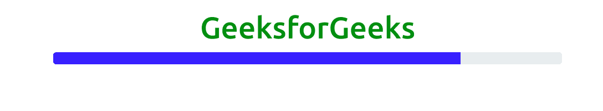
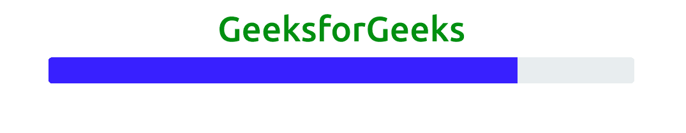
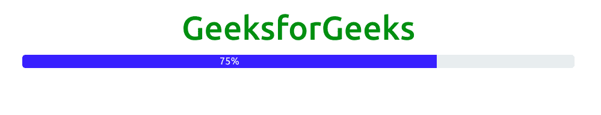
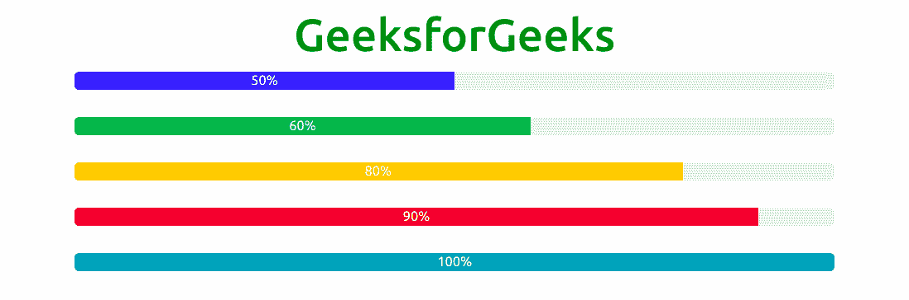
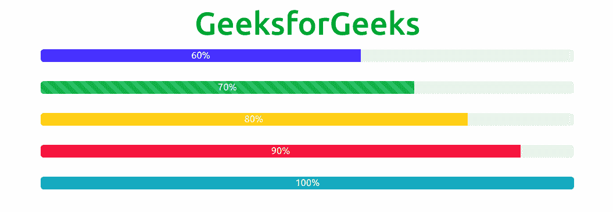
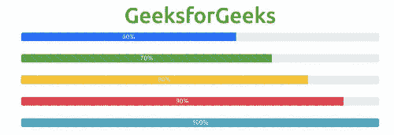
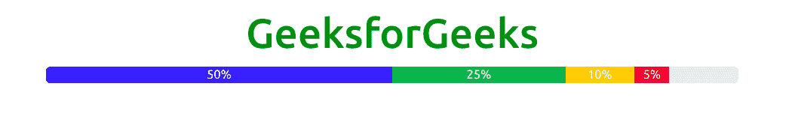

# Bootstrap5 |进度

> 原文:[https://www.geeksforgeeks.org/bootstrap5-progress/](https://www.geeksforgeeks.org/bootstrap5-progress/)

Bootstrap 5 是 Bootstrap 的最新主要版本，在该版本中，他们修改了用户界面并进行各种更改。进度条用于显示计算机上进程的进度。进度条显示流程完成了多少，还剩下多少。您可以使用预定义的引导类在网页上添加进度条。Bootstrap 提供了许多类型的进度条。进度组件是用两个 HTML 元素构建的，它们使用 CSS 来设置宽度和一些属性。它没有使用 HTML5 <progress>元素，这使得堆叠进度条、动画化进度条以及在进度条上放置文本标签成为可能。它使用*。进度*作为一个包装器来指示进度条和内部*的最大值。进度条*表示到目前为止的进度。</progress>

**语法:**

```
<div class="progress"> Contents... <div>
```

**示例:**

```
<!DOCTYPE html>
<html>
    <head>
        <!-- Load Bootstrap -->
        <link rel="stylesheet"
              href=
"https://stackpath.bootstrapcdn.com/bootstrap/5.0.0-alpha1/css/bootstrap.min.css" 
              integrity=
"sha384-r4NyP46KrjDleawBgD5tp8Y7UzmLA05oM1iAEQ17CSuDqnUK2+k9luXQOfXJCJ4I" 
              crossorigin="anonymous" />
        <script src=
"https://cdn.jsdelivr.net/npm/popper.js@1.16.0/dist/umd/popper.min.js"
                integrity=
"sha384-Q6E9RHvbIyZFJoft+2mJbHaEWldlvI9IOYy5n3zV9zzTtmI3UksdQRVvoxMfooAo" 
                crossorigin="anonymous"></script>
        <script src=
"https://stackpath.bootstrapcdn.com/bootstrap/5.0.0-alpha1/js/bootstrap.min.js" 
                integrity=
"sha384-oesi62hOLfzrys4LxRF63OJCXdXDipiYWBnvTl9Y9/TRlw5xlKIEHpNyvvDShgf/" 
                crossorigin="anonymous"></script>
    </head>

    <body style="text-align: center;">
        <div class="container mt-3" 
             style="width: 700px;">
            <h1 style="color: green;">
                GeeksforGeeks
            </h1>
            <div class="progress">
                <div class="progress-bar" 
                     style="width: 80%;"></div>
            </div>
        </div>
    </body>
</html>
```

**输出:**



**进度条高度:**我们可以使用 CSS 属性改变进度条的高度。默认进度高度为 16px。进度和进度条容器的高度必须相同。
T3】例:

```
<!DOCTYPE html>
<html>
    <head>
        <!-- Load Bootstrap -->
        <link rel="stylesheet" 
              href=
"https://stackpath.bootstrapcdn.com/bootstrap/5.0.0-alpha1/css/bootstrap.min.css" 
              integrity=
"sha384-r4NyP46KrjDleawBgD5tp8Y7UzmLA05oM1iAEQ17CSuDqnUK2+k9luXQOfXJCJ4I"
              crossorigin="anonymous" />
        <script src=
"https://cdn.jsdelivr.net/npm/popper.js@1.16.0/dist/umd/popper.min.js"
                integrity=
"sha384-Q6E9RHvbIyZFJoft+2mJbHaEWldlvI9IOYy5n3zV9zzTtmI3UksdQRVvoxMfooAo" 
                crossorigin="anonymous"></script>
        <script src=
"https://stackpath.bootstrapcdn.com/bootstrap/5.0.0-alpha1/js/bootstrap.min.js" 
                integrity=
"sha384-oesi62hOLfzrys4LxRF63OJCXdXDipiYWBnvTl9Y9/TRlw5xlKIEHpNyvvDShgf/" 
                crossorigin="anonymous"></script>
    </head>

    <body style="text-align: center;">
        <div class="container mt-3" 
             style="width: 700px;">
            <h1 style="color: green;">
                GeeksforGeeks
            </h1>
            <div class="progress"
                 style="height: 30px;">
                <div class="progress-bar"
                     style="width: 80%; height: 30px;">
              </div>
            </div>
        </div>
    </body>
</html>
```

**输出:**



**标注进度条:**标注进度条用于显示进度条内部的文本，以显示任务完成百分比。
T3】例:

```
<!DOCTYPE html>
<html>
    <head>
        <!-- Load Bootstrap -->
        <link rel="stylesheet"
              href=
"https://stackpath.bootstrapcdn.com/bootstrap/5.0.0-alpha1/css/bootstrap.min.css" 
              integrity=
"sha384-r4NyP46KrjDleawBgD5tp8Y7UzmLA05oM1iAEQ17CSuDqnUK2+k9luXQOfXJCJ4I" 
              crossorigin="anonymous" />
        <script src=
"https://cdn.jsdelivr.net/npm/popper.js@1.16.0/dist/umd/popper.min.js" 
                integrity=
"sha384-Q6E9RHvbIyZFJoft+2mJbHaEWldlvI9IOYy5n3zV9zzTtmI3UksdQRVvoxMfooAo"
                crossorigin="anonymous">
      </script>
        <script src=
"https://stackpath.bootstrapcdn.com/bootstrap/5.0.0-alpha1/js/bootstrap.min.js" 
                integrity=
"sha384-oesi62hOLfzrys4LxRF63OJCXdXDipiYWBnvTl9Y9/TRlw5xlKIEHpNyvvDShgf/"
                crossorigin="anonymous">
      </script>
    </head>

    <body style="text-align: center;">
        <div class="container mt-3"
             style="width: 700px;">
            <h1 style="color: green;">
                GeeksforGeeks
            </h1>
            <div class="progress">
                <div class="progress-bar" 
                     style="width: 75%;">
                    75%
                </div>
            </div>
        </div>
    </body>
</html>
```

**输出:**



**彩色进度条:**使用 Bootstrap 4 上下文背景类设置进度条的颜色。进度条的默认颜色是蓝色。

**例:**

```
<!DOCTYPE html>
<html>
    <head>
        <!-- Load Bootstrap -->
        <link rel="stylesheet"
              href=
"https://stackpath.bootstrapcdn.com/bootstrap/5.0.0-alpha1/css/bootstrap.min.css"
              integrity=
"sha384-r4NyP46KrjDleawBgD5tp8Y7UzmLA05oM1iAEQ17CSuDqnUK2+k9luXQOfXJCJ4I"
              crossorigin="anonymous" />
        <script src=
"https://cdn.jsdelivr.net/npm/popper.js@1.16.0/dist/umd/popper.min.js" 
                integrity=
"sha384-Q6E9RHvbIyZFJoft+2mJbHaEWldlvI9IOYy5n3zV9zzTtmI3UksdQRVvoxMfooAo" 
                crossorigin="anonymous">
      </script>
        <script src=
"https://stackpath.bootstrapcdn.com/bootstrap/5.0.0-alpha1/js/bootstrap.min.js" 
                integrity=
"sha384-oesi62hOLfzrys4LxRF63OJCXdXDipiYWBnvTl9Y9/TRlw5xlKIEHpNyvvDShgf/" 
                crossorigin="anonymous">
      </script>
    </head>

    <body style="text-align: center;">
        <div class="container mt-3" 
             style="width: 700px;">
            <h1 style="color: green;">
                GeeksforGeeks
            </h1>
            <div class="progress">
                <div class="progress-bar" 
                     style="width: 50%;">
                    50%
                </div>
            </div>
            <br />

            <div class="progress">
                <div class="progress-bar bg-success" 
                     style="width: 60%;">
                    60%
                </div>
            </div>
            <br />

            <div class="progress">
                <div class="progress-bar bg-warning"
                     style="width: 80%;">
                    80%
                </div>
            </div>
            <br />

            <div class="progress">
                <div class="progress-bar bg-danger"
                     style="width: 90%;">
                    90%
                </div>
            </div>
            <br />

            <div class="progress">
                <div class="progress-bar bg-info" 
                     style="width: 100%;">
                    100%
                </div>
            </div>
            <br />
        </div>
    </body>
</html>
```

**输出:**



**条纹进度条:***。进度条-条纹*类用于给进度条添加条纹。使用*的组合。进度条*和*。进度条-分条*类创建分条进度条。使用 Bootstrap 4 上下文背景类来设置进度条的颜色。

**例:**

```
<!DOCTYPE html>
<html>
    <head>
        <!-- Load Bootstrap -->
        <link rel="stylesheet"
              href=
"https://stackpath.bootstrapcdn.com/bootstrap/5.0.0-alpha1/css/bootstrap.min.css"
              integrity=
"sha384-r4NyP46KrjDleawBgD5tp8Y7UzmLA05oM1iAEQ17CSuDqnUK2+k9luXQOfXJCJ4I" 
              crossorigin="anonymous" />
        <script src=
"https://cdn.jsdelivr.net/npm/popper.js@1.16.0/dist/umd/popper.min.js"
                integrity=
"sha384-Q6E9RHvbIyZFJoft+2mJbHaEWldlvI9IOYy5n3zV9zzTtmI3UksdQRVvoxMfooAo" 
                crossorigin="anonymous">
      </script>
        <script src=
"https://stackpath.bootstrapcdn.com/bootstrap/5.0.0-alpha1/js/bootstrap.min.js"
                integrity=
"sha384-oesi62hOLfzrys4LxRF63OJCXdXDipiYWBnvTl9Y9/TRlw5xlKIEHpNyvvDShgf/"
                crossorigin="anonymous">
      </script>
    </head>

    <body style="text-align: center;">
        <div class="container mt-3"
             style="width: 700px;">
            <h1 style="color: green;">
                GeeksforGeeks
            </h1>
            <div class="progress">
                <div class=
                     "progress-bar progress-bar-striped" 
                     style="width: 60%;">60%</div>
            </div>
            <br />

            <div class="progress">
                <div class=
           "progress-bar bg-success progress-bar-striped" 
                     style="width: 70%;">70%</div>
            </div>
            <br />

            <div class="progress">
                <div class=
          "progress-bar bg-warning progress-bar-striped"
                     style="width: 80%;">80%</div>
            </div>
            <br />

            <div class="progress">
                <div class=
          "progress-bar bg-danger progress-bar-striped" 
                     style="width: 90%;">90%</div>
            </div>
            <br />

            <div class="progress">
                <div class=
          "progress-bar bg-info progress-bar-striped"
                     style="width: 100%;">100%</div>
            </div>
            <br />
        </div>
    </body>
</html>
```

**输出:**



**动画进度条:***。进度条-动画*类用于创建动画进度条。使用*的组合。进度条*、*。进度条条纹*和*。进度条-动画*创建动画进度条。
**示例:**

```
<!DOCTYPE html>
<html>
    <head>

        <!-- Load Bootstrap -->
        <link rel="stylesheet" 
              href=
"https://stackpath.bootstrapcdn.com/bootstrap/5.0.0-alpha1/css/bootstrap.min.css" 
              integrity=
"sha384-r4NyP46KrjDleawBgD5tp8Y7UzmLA05oM1iAEQ17CSuDqnUK2+k9luXQOfXJCJ4I" 
              crossorigin="anonymous" />
        <script src=
"https://cdn.jsdelivr.net/npm/popper.js@1.16.0/dist/umd/popper.min.js" 
                integrity=
"sha384-Q6E9RHvbIyZFJoft+2mJbHaEWldlvI9IOYy5n3zV9zzTtmI3UksdQRVvoxMfooAo"
                crossorigin="anonymous"></script>
        <script src=
"https://stackpath.bootstrapcdn.com/bootstrap/5.0.0-alpha1/js/bootstrap.min.js"
                integrity=
"sha384-oesi62hOLfzrys4LxRF63OJCXdXDipiYWBnvTl9Y9/TRlw5xlKIEHpNyvvDShgf/"
                crossorigin="anonymous">
      </script>
    </head>

    <body style="text-align: center;">
        <div class="container mt-3"
             style="width: 700px;">
            <h1 style="color: green;">
                GeeksforGeeks
            </h1>
            <div class="progress">
                <div class=
                     "progress-bar progress-bar-striped 
                      progress-bar-animated" 
                     style="width: 60%;">
                  60%</div>
            </div>
            <br />

            <div class="progress">
                <div class=
                     "progress-bar bg-success progress-bar-striped 
                      progress-bar-animated"
                     style="width: 70%;">
                  70%</div>
            </div>
            <br />

            <div class="progress">
                <div class=
                     "progress-bar bg-warning 
                      progress-bar-striped 
                      progress-bar-animated" 
                     style="width: 80%;">
                  80%</div>
            </div>
            <br />

            <div class="progress">
                <div class=
                     "progress-bar bg-danger
                      progress-bar-striped
                      progress-bar-animated"
                     style="width: 90%;">
                  90%</div>
            </div>
            <br />

            <div class="progress">
                <div class="progress-bar
                            bg-info progress-bar-striped
                            progress-bar-animated"
                     style="width: 100%;">100%</div>
            </div>
            <br />
        </div>
    </body>
</html>
```

**输出:**



**多个进度条:**可以堆叠多个进度条，以显示不同颜色的进度条。
T3】例:

```
<!DOCTYPE html>
<html>
    <head>
        <!-- Load Bootstrap -->
        <link rel="stylesheet"
              href=
"https://stackpath.bootstrapcdn.com/bootstrap/5.0.0-alpha1/css/bootstrap.min.css"
              integrity=
"sha384-r4NyP46KrjDleawBgD5tp8Y7UzmLA05oM1iAEQ17CSuDqnUK2+k9luXQOfXJCJ4I"
              crossorigin="anonymous" />
        <script src=
"https://cdn.jsdelivr.net/npm/popper.js@1.16.0/dist/umd/popper.min.js"
                integrity=
"sha384-Q6E9RHvbIyZFJoft+2mJbHaEWldlvI9IOYy5n3zV9zzTtmI3UksdQRVvoxMfooAo" 
                crossorigin="anonymous"></script>
        <script src=
"https://stackpath.bootstrapcdn.com/bootstrap/5.0.0-alpha1/js/bootstrap.min.js" 
                integrity=
"sha384-oesi62hOLfzrys4LxRF63OJCXdXDipiYWBnvTl9Y9/TRlw5xlKIEHpNyvvDShgf/" 
                crossorigin="anonymous">
      </script>
    </head>

    <body style="text-align: center;">
        <div class="container mt-3" 
             style="width: 700px;">
            <h1 style="color: green;">
                GeeksforGeeks
            </h1>
            <div class="progress">
                <div class="progress-bar"
                     style="width: 50%;">
                    50%
                </div>

                <div class="progress-bar bg-success" 
                     style="width: 25%;">
                    25%
                </div>

                <div class="progress-bar bg-warning" 
                     style="width: 10%;">
                    10%
                </div>

                <div class="progress-bar bg-danger" 
                     style="width: 5%;">
                    5%
                </div>
            </div>
        </div>
    </body>
</html>
```

**输出:**

