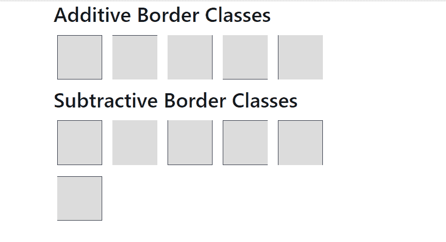
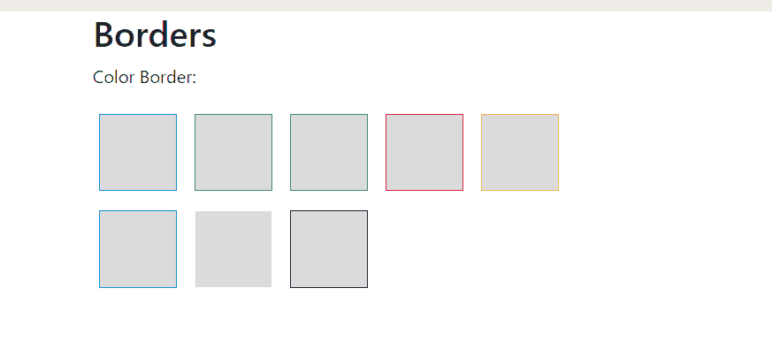
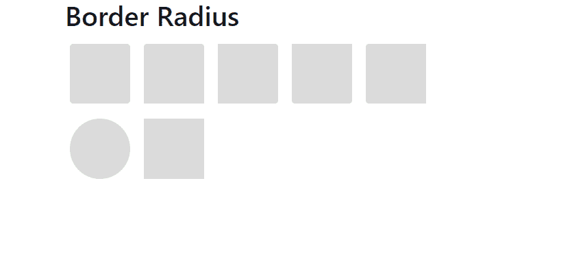

# 带示例的引导中的边框

> 原文:[https://www . geeksforgeeks . org/borders-in-bootstrap-with-examples/](https://www.geeksforgeeks.org/borders-in-bootstrap-with-examples/)

**边框:**边框通常用于显示框或表格单元格或任何其他 HTML 元素周围的轮廓。在引导数据库中，有不同的类可用于添加或删除边框。用于添加边框的类称为**加法类**，用于移除边框的类称为**减法类**。
**附加边框类** :

*   。边框:这个类在元素周围添加一个边框。
*   。边框-顶部:这个类在元素的上边缘添加一个边框。
*   。左边框:这个类在元素的左边缘添加一个边框。
*   。右边框:这个类在元素的右边添加一个边框。
*   。边框-底部:这个类在元素的底部添加一个边框。

**减法边界类** :

*   。边框-0:如果元素存在，这个类从元素周围移除边框。
*   。边框-顶端-0:如果存在，这个类从元素的顶端移除边框。
*   。边框-左-0:如果存在，这个类从元素的左边缘移除边框。
*   。border-right-0:如果存在，这个类从元素的右边移除边框。
*   。边框-底部-0:如果存在，这个类从元素底部移除边框。

下面的程序使用所有的加法和减法类来添加和删除边框:

## 超文本标记语言

```html
<!-- Bootstrap Borders -->
<!DOCTYPE html>
<html>
    <head>
        <title>Bootstrap Example</title>

        <!-- Link Bootstrap CSS -->
        <link rel="stylesheet" href="https://maxcdn.bootstrapcdn.com/bootstrap/4.1.3/css/bootstrap.min.css">

        <!-- Link Bootstrap JS and JQuery -->
        <script src="https://ajax.googleapis.com/ajax/libs/jquery/3.3.1/jquery.min.js"></script>
        <script src="https://cdnjs.cloudflare.com/ajax/libs/popper.js/1.14.3/umd/popper.min.js"></script>
        <script src="https://maxcdn.bootstrapcdn.com/bootstrap/4.1.3/js/bootstrap.min.js"></script>
        <style>
            /* CSS for Square boxes */
            span {
                display: inline-block;
                width: 70px;
                height: 70px;
                margin: 6px;
                background-color: #DCDCDC;
            }
        </style>
    </head>

    <body>

        <!-- Additive border classes -->
        <!-- Note: border-dark class is used to add
                black color to border -->
        <div class="container">
            <h2>Additive Border Classes</h2>
            <span class="border border-dark"></span>
            <span class="border-top border-dark"></span>
            <span class="border-right border-dark"></span>
            <span class="border-bottom border-dark"></span>
            <span class="border-left border-dark"></span>
        </div>

        <!-- Subtractive border classes -->
        <!-- Note: border-dark class is used to add
                black color to border -->
        <div class="container">
            <h2>Subtractive Border Classes</h2>
            <span class="border border-dark"></span>
            <span class="border border-0 border-dark"></span>
            <span class="border border-top-0 border-dark"></span>
            <span class="border border-right-0 border-dark"></span>
            <span class="border border-bottom-0 border-dark"></span>
            <span class="border border-left-0 border-dark"></span>
        </div>

    </body>
</html>
```

**输出** :



**边框颜色**
任何颜色都可以通过使用以下**边框颜色类**添加到边框中，这些颜色在引导程序中可用。如果您想要任何其他的裁剪颜色，那么您可以使用 CSS 属性手动设置它。

## 超文本标记语言

```html
<!DOCTYPE html>
<html>
    <head>
        <title>Bootstrap Example</title>

        <!-- Link Bootstrap CSS -->
        <link rel="stylesheet" href="https://maxcdn.bootstrapcdn.com/bootstrap/4.1.3/css/bootstrap.min.css">

        <!-- Link Bootstrap JS and JQuery -->   
        <script src="https://ajax.googleapis.com/ajax/libs/jquery/3.3.1/jquery.min.js"></script>
        <script src="https://cdnjs.cloudflare.com/ajax/libs/popper.js/1.14.3/umd/popper.min.js"></script>
        <script src="https://maxcdn.bootstrapcdn.com/bootstrap/4.1.3/js/bootstrap.min.js"></script>

        <style>
            /* CSS style for Boxes */
            span {
                display: inline-block;
                width: 70px;
                height: 70px;
                margin: 6px;
                background-color: #DCDCDC;
            }
        </style>
    </head>

    <body>
        <div class="container">
            <h2>Borders</h2>

<p>Color Border:</p>

            <span class="border border-primary"></span>
            <span class="border border-secondary"></span>
            <span class="border border-success"></span>
            <span class="border border-danger"></span>
            <span class="border border-warning"></span>
            <span class="border border-info"></span>
            <span class="border border-light"></span>
            <span class="border border-dark"></span>
        </div>
    </body>
</html>
```

**输出** :



**边框半径:**边框半径用于使边框的拐角弯曲。半径越大，它就会越弯越圆。
在 bootstrap 中，代码中使用的以下类用于在特定拐角处实现半径。

## 超文本标记语言

```html
<!DOCTYPE html>
<html>
    <head>
        <title>Bootstrap Example</title>

        <!-- Link Bootstrap CSS -->
        <link rel="stylesheet" href="https://maxcdn.bootstrapcdn.com/bootstrap/4.1.3/css/bootstrap.min.css">

        <!-- Link Bootstrap JS and JQuery -->
        <script src="https://ajax.googleapis.com/ajax/libs/jquery/3.3.1/jquery.min.js"></script>
        <script src="https://cdnjs.cloudflare.com/ajax/libs/popper.js/1.14.3/umd/popper.min.js"></script>
        <script src="https://maxcdn.bootstrapcdn.com/bootstrap/4.1.3/js/bootstrap.min.js"></script>

        <style>
            /* CSS Style for Boxes */
            span {
                display: inline-block;
                width: 70px;
                height: 70px;
                margin: 6px;
                background-color: #DCDCDC;
            }
        </style>
    </head>
    <body>
        <div class="container">
            <h2>Border Radius</h2>

            <!-- Below classes are used to add radius
                 to the borders -->
            <span class="rounded"></span>
            <span class="rounded-top"></span>
            <span class="rounded-right"></span>
            <span class="rounded-bottom"></span>
            <span class="rounded-left"></span>
            <span class="rounded-circle"></span>
            <span class="rounded-0"></span>
        </div>
    </body>
</html>
```

**输出** :



**支持的浏览器:**

*   谷歌 Chrome
*   微软公司出品的 web 浏览器
*   火狐浏览器
*   歌剧
*   狩猎