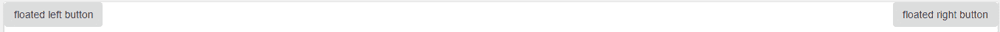
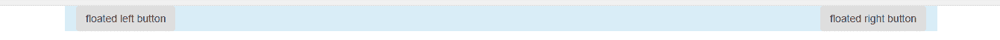

# 引导中的 clear fix

> 原文:[https://www.geeksforgeeks.org/clearfix-in-bootstrap/](https://www.geeksforgeeks.org/clearfix-in-bootstrap/)

HTML 结构的一个主要问题是，如果在父 div 中有一个子 div，子 div 会自动围绕父 div 流动。解决这个问题的方法是使用 CSS 的清晰属性。
Bootstrap 允许我们使用名为 **clearfix** 的类，该类用于清除任何容器内的浮动内容。
**例 1:** 无 clearfix 属性。在下面的程序中，两个按钮向左和向右浮动。

## 超文本标记语言

```html
<!DOCTYPE html>
<html>
<head>
    <title>Bootstrap Example</title>

    <!-- Bootstrap CSS and JS -->
    <link rel="stylesheet" href="https://maxcdn.bootstrapcdn.com/bootstrap/3.4.0/css/bootstrap.min.css">
    <script src="https://ajax.googleapis.com/ajax/libs/jquery/3.3.1/jquery.min.js"></script>
    <script src="https://maxcdn.bootstrapcdn.com/bootstrap/3.4.0/js/bootstrap.min.js"></script>

    <style>
    .left{
        float:left;
    }

    .right{
        float:right;
    }
    </style>
</head>

<body>
    <div class="bg-info">
        <button type="button" class="btn btn-secondary left">
            floated left button
        </button>

        <button type="button" class="btn btn-secondary right">
            floated right button
        </button>
    </div>
</body>
</html>
```

**输出:**



Clearfix 属性清除应用它的元素的所有浮动内容。它也用于清除容器中的浮动内容。
**例 2:** 带 clearfix 属性。如果不使用 clearfix 类，父 div 可能无法正确包装子按钮元素，并可能导致布局中断。

## 超文本标记语言

```html
<!DOCTYPE html>
<html>
<head>
    <title>Bootstrap Example</title>

    <!-- Bootstrap CSS and JS -->
    <link rel="stylesheet" href="https://maxcdn.bootstrapcdn.com/bootstrap/3.4.0/css/bootstrap.min.css">
    <script src="https://ajax.googleapis.com/ajax/libs/jquery/3.3.1/jquery.min.js"></script>
    <script src="https://maxcdn.bootstrapcdn.com/bootstrap/3.4.0/js/bootstrap.min.js"></script>

    <style>
    .left{
        float:left;
    }

    .right{
        float:right;
    }
    </style>
</head>

<body>
    <div class="bg-info clearfix">
        <button type="button" class="btn btn-secondary left">
            floated left button
        </button>

        <button type="button" class="btn btn-secondary right">
            floated right button
        </button>
    </div>
</body>
</html>
```

**输出:**



**支持的浏览器:**

*   谷歌 Chrome
*   微软公司出品的 web 浏览器
*   火狐浏览器
*   歌剧
*   旅行队