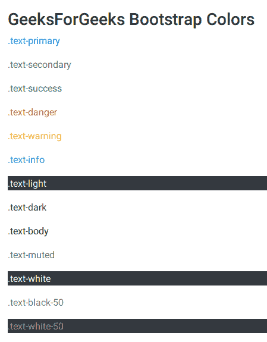
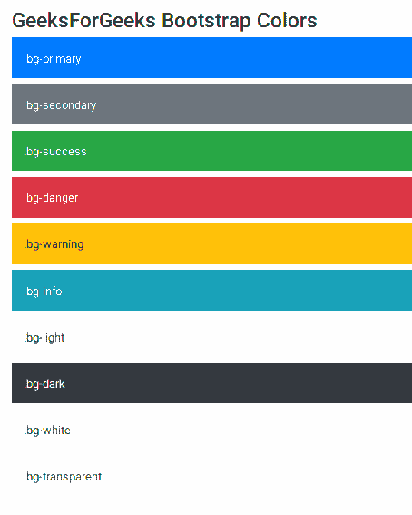
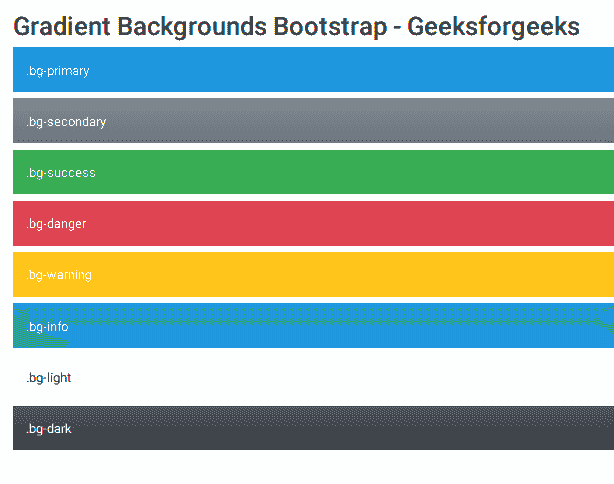

# 自举中的颜色和渐变示例

> 原文:[https://www . geeksforgeeks . org/colors-and-gradient-in-bootstrap-with-examples/](https://www.geeksforgeeks.org/colors-and-gradients-in-bootstrap-with-examples/)

Bootstrap 提供了各种类来将颜色属性应用于各种元素。
创建一个带有指向 Jquery 和 Bootstrap 的 CDN 链接的 HTML 文件。

## 超文本标记语言

```html
<!doctype html>
<html lang="en">
  <head>
    <!-- Required meta tags -->
    <meta charset="utf-8">
    <meta name="viewport" content="width=device-width,
         initial-scale=1, shrink-to-fit=no">

    <!-- Bootstrap CSS -->
    <link rel="stylesheet"
   href="https://stackpath.bootstrapcdn.com/bootstrap/4.2.1/css/bootstrap.min.css"
   integrity="sha384-GJzZqFGwb1QTTN6wy59ffF1BuGJpLSa9DkKMp0DgiMDm4iYMj70gZWKYbI706tWS"
crossorigin="anonymous">

    <title>Hello, world!</title>
  </head>
  <body>
    <h1>Hello, world!</h1>

    <!-- Optional JavaScript -->
    <!-- jQuery first, then Popper.js, then Bootstrap JS -->
    <script src="https://code.jquery.com/jquery-3.3.1.slim.min.js"
  integrity="sha384-q8i/X+965DzO0rT7abK41JStQIAqVgRVzpbzo5smXKp4YfRvH+8abtTE1Pi6jizo"
crossorigin="anonymous"></script>
    <script
 src="https://cdnjs.cloudflare.com/ajax/libs/popper.js/1.14.6/umd/popper.min.js"
integrity="sha384-wHAiFfRlMFy6i5SRaxvfOCifBUQy1xHdJ/yoi7FRNXMRBu5WHdZYu1hA6ZOblgut"
crossorigin="anonymous"></script>
    <script
src="https://stackpath.bootstrapcdn.com/bootstrap/4.2.1/js/bootstrap.min.js"
integrity="sha384-B0UglyR+jN6CkvvICOB2joaf5I4l3gm9GU6Hc1og6Ls7i6U/mkkaduKaBhlAXv9k"
crossorigin="anonymous"></script>
  </body>
</html>
```

在创建了基本的 HTML 文件之后，我们需要将这些元素添加到代码主体中，然后我们就可以看到所有必要的更改。
**元素中文字的颜色-**

## 超文本标记语言

```html
<p class="text-primary">.text-primary</p>

<p class="text-secondary">.text-secondary</p>

<p class="text-success">.text-success</p>

<p class="text-danger">.text-danger</p>

<p class="text-warning">.text-warning</p>

<p class="text-info">.text-info</p>

<p class="text-light bg-dark">.text-light</p>

<p class="text-dark">.text-dark</p>

<p class="text-body">.text-body</p>

<p class="text-muted">.text-muted</p>

<p class="text-white bg-dark">.text-white</p>

<p class="text-black-50">.text-black-50</p>

<p class="text-white-50 bg-dark">.text-white-50</p>
```

这些段落元素的输出如下-



**元素背景颜色-**
也有背景颜色类别-

## 超文本标记语言

```html
<div class="p-3 mb-2 bg-primary text-white">.bg-primary</div>
<div class="p-3 mb-2 bg-secondary text-white">.bg-secondary</div>
<div class="p-3 mb-2 bg-success text-white">.bg-success</div>
<div class="p-3 mb-2 bg-danger text-white">.bg-danger</div>
<div class="p-3 mb-2 bg-warning text-dark">.bg-warning</div>
<div class="p-3 mb-2 bg-info text-white">.bg-info</div>
<div class="p-3 mb-2 bg-light text-dark">.bg-light</div>
<div class="p-3 mb-2 bg-dark text-white">.bg-dark</div>
<div class="p-3 mb-2 bg-white text-dark">.bg-white</div>
<div class="p-3 mb-2 bg-transparent text-dark">.bg-transparent</div>
```

以上代码显示了以下输出-



**渐变背景颜色-**
要使用渐变背景颜色，需要将$enable-gradients 属性设置为 true。默认情况下，它设置为 false。

## 超文本标记语言

```html
<div class="p-3 mb-2 bg-gradient-primary text-white">.bg-primary</div>
<div class="p-3 mb-2 bg-gradient-secondary text-white">.bg-secondary</div>
<div class="p-3 mb-2 bg-gradient-success text-white">.bg-success</div>
<div class="p-3 mb-2 bg-gradient-danger text-white">.bg-danger</div>
<div class="p-3 mb-2 bg-gradient-warning text-white">.bg-warning</div>
<div class="p-3 mb-2 bg-gradient-info text-white">.bg-info</div>
<div class="p-3 mb-2 bg-gradient-light text-dark">.bg-light</div>
<div class="p-3 mb-2 bg-gradient-dark text-light">.bg-dark</div>
```

以上代码显示了以下输出-



**支持的浏览器:**

*   谷歌 Chrome
*   微软边缘
*   火狐浏览器
*   歌剧
*   旅行队