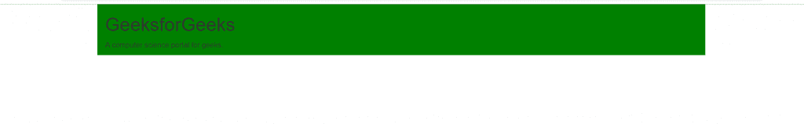

# Bootstrap 中的容器，带有示例

> 原文:[https://www . geesforgeks . org/containers-in-bootstrap-with-examples/](https://www.geeksforgeeks.org/containers-in-bootstrap-with-examples/)

在引导程序中，**容器**用于设置内容的边距。它包含行元素，行元素是列的容器。这就是所谓的网格系统。
bootstrap 中有两个容器类:

1.  **。容器**
2.  **。容器-流体**

让我们用例子详细看看上面两个类中的每一个:

*   **。容器**:容器。容器类提供了一个响应性的固定宽度容器。
    在下面的例子中，类为“container”的 div 将有一个固定的左右边距，并且不会占据其父级或视口的全部宽度。

## 超文本标记语言

```html
<!-- Bootstrap container class -->
<html>
<head>
  <title>Bootstrap Container Example</title>

  <!-- Add Bootstrap Links -->
  <link rel="stylesheet" href="https://maxcdn.bootstrapcdn.com/bootstrap/3.3.7/css/bootstrap.min.css">
  <script src="https://ajax.googleapis.com/ajax/libs/jquery/3.3.1/jquery.min.js"></script>
  <script src="https://maxcdn.bootstrapcdn.com/bootstrap/3.3.7/js/bootstrap.min.js"></script>
</head>

<body>

    <!-- Since we are using the class container, the below
        div will not take complete width of it's parent. -->
    <div class="container" style="background: green;">
      <h1>GeeksforGeeks</h1>

<p>A computer science portal for geeks.</p>

    </div>
</body>
</html>
```

*   **输出** :



*   **。容器-流体**:容器。container-fluid 类提供了一个全宽的容器，它跨越了视口的整个宽度。
    在下面的例子中，类别为“container-fluid”的 div 将占据视口的整个宽度，并且在视口调整大小时将会扩展或收缩。

## 超文本标记语言

```html
<!-- Bootstrap container-fluid class -->
<html>
<head>
  <title>Bootstrap Container Example</title>

  <!-- Add Bootstrap Links -->
  <link rel="stylesheet" href="https://maxcdn.bootstrapcdn.com/bootstrap/3.3.7/css/bootstrap.min.css">
  <script src="https://ajax.googleapis.com/ajax/libs/jquery/3.3.1/jquery.min.js"></script>
  <script src="https://maxcdn.bootstrapcdn.com/bootstrap/3.3.7/js/bootstrap.min.js"></script>
</head>

<body>

    <!-- Since we are using the class container-fluid, the below
        div will take-up complete width of the viewport and
        will expand or contract whenever the viewport is resized -->
    <div class="container-fluid" style="background: green;">
      <h1>GeeksforGeeks</h1>

<p>A computer science portal for geeks.</p>

    </div>
</body>
</html>
```

*   **输出** :


**支持的浏览器:**

*   谷歌 Chrome
*   微软公司出品的 web 浏览器
*   火狐浏览器
*   歌剧
*   狩猎