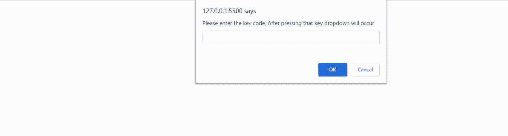

# 在按下特定键

后，创建引导下拉菜单

> 原文:[https://www . geeksforgeeks . org/create-a-bootstrap-drop-按下特定键后出现的情况/](https://www.geeksforgeeks.org/create-a-bootstrap-dropdown-that-occurs-after-pressing-specific-key/)

下拉列表是一组链接或列表，通过单击按钮或键盘事件来显示。Bootstrap 还提出了一个实现下拉菜单的框架。但是默认的引导下拉事件只在鼠标点击时发生。

在本文中，我们将看到如何覆盖这个默认特性，并使引导下拉事件在按下特定键后发生。

让我们看看逐步实现:

**第一步:添加 HTML 代码，创建一个显示下拉菜单**的按钮

*   将[引导最新的迷你 CSS](https://getbootstrap.com/docs/4.5/getting-started/introduction/) 链接到 HTML 文档。
*   将[引导下拉组件](https://getbootstrap.com/docs/4.0/components/dropdowns/)框架添加到 HTML 代码中。
*   HTML 代码完美地创建了下拉菜单，但是默认情况下，下拉事件只发生在单击时。要在按键时执行这个事件，我们必须使用脚本标签添加额外的 JavaScript 代码。

**第二步:添加 JavaScript 代码，进行下拉**

*   创建一个变量，并将特定键的键码作为输入。
*   创建一个名为 activateDropdown()的函数，该函数在被调用时将显示下拉菜单。在该函数中，我们选择名为#myDropdown 的 id，并切换驻留在该 div 中的所有类(下拉元素)的状态。这里切换状态仅仅意味着如果它被显示就隐藏它，如果它被隐藏就显示它。
*   当我们的特定键被按下时，调用函数。

## 超文本标记语言

```html
<!DOCTYPE html>
<html>

<head>
    <!--Bootstrap Latest Minified Css-->
    <link rel="stylesheet" href=
"https://cdn.jsdelivr.net/npm/bootstrap@4.5.3/dist/css/bootstrap.min.css"
        integrity=
"sha384-TX8t27EcRE3e/ihU7zmQxVncDAy5uIKz4rEkgIXeMed4M0jlfIDPvg6uqKI2xXr2"
        crossorigin="anonymous">
</head>

<body>
    <!--Bootstrap Framework to create a dropdown-->
    <div class="dropdown">
        <button class="btn btn-secondary dropdown-toggle"
            type="button" id="dropdownMenuButton" 
            data-toggle="dropdown" aria-haspopup="true" 
            aria-expanded="false">
            Dropdown button
        </button>

        <div class="dropdown-menu" id="myDropdown" 
            aria-labelledby="dropdownMenuButton">

            <a class="dropdown-item" href="#">
                Action
            </a>
            <a class="dropdown-item" href="#">
                Another action
            </a>
            <a class="dropdown-item" href="#">
                Something else here
            </a>
        </div>
    </div>

    <!-- JavaScript Code to perform the task-->
    <script>

        // Create a variable and take the
        // key-code of the specific key as
        // an input prompt
        let keyToShow = prompt("Please enter the "
            + "key code, After pressing that key "
            + "dropdown will occur");

        /* Create a function named activateDropdown()
        that will show the dropdown menu when called. 
        Inside that function we selected the id named 
        #myDropdown and toggled the state of all the 
        classes (dropdown elements) residing inside 
        that div */
        function activateDropdown() {
            document.getElementById("myDropdown")
                .classList.toggle("show");
        }

        // Call the function when our specific
        // key is pressed
        document.addEventListener('keydown', function(event) {
            if (event.keyCode == keyToShow) {
                activateDropdown();
            }
        });
    </script>
</body>

</html>
```

#### **输出:**



**说明:**在输出视频里面，首先我们输入了等于 13 的“回车”键的键码，然后每当我们在键盘上按 Enter 键，下拉事件就会发生。我们可以看到，当下拉事件发生时，鼠标光标也是固定的。