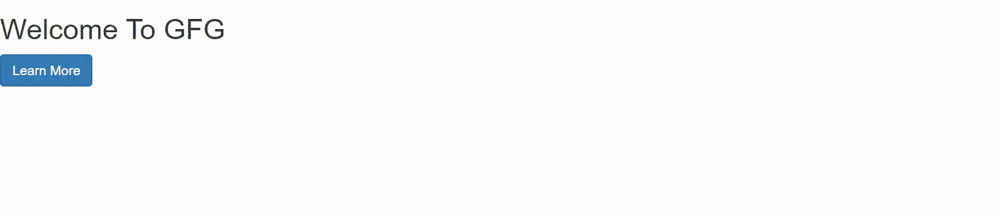

# 推特引导中的数据切换属性

> 原文:[https://www . geesforgeks . org/data-toggle-attributes-in-Twitter-bootstrap/](https://www.geeksforgeeks.org/data-toggle-attributes-in-twitter-bootstrap/)

数据切换是在引导中定义的 HTML-5 数据属性。使用它的好处是，您可以选择一个类或 id，并将元素与特定的小部件挂钩。例如，如果您选择一个元素，并将 data-toggle 的属性设置为“折叠”，那么通过使用 Bootstrap，您基本上可以在几分钟内折叠您的 div。

该属性有 7 个值。

**1。data-toggle = "collapse"** 当你想隐藏一个节，并且只在点击一个 div 的时候才出现的时候使用。比方说，div 是一个按钮，因此当单击该按钮时，您想要折叠的部分会出现，并使用该按钮重新出现。

**示例:**

## 超文本标记语言

```html
<!DOCTYPE html>
<html>

<head>
    <title>
        Data Toggle - Collapse example
    </title>

    <meta name="viewport" content=
        "width=device-width, initial-scale=1">

    <link rel="stylesheet" href=
"https://maxcdn.bootstrapcdn.com/bootstrap/3.4.1/css/bootstrap.min.css">

    <script src=
"https://ajax.googleapis.com/ajax/libs/jquery/3.5.1/jquery.min.js">
    </script>

    <script src=
"https://maxcdn.bootstrapcdn.com/bootstrap/3.4.1/js/bootstrap.min.js">
    </script>
</head>

<body>
    <h2>Welcome To GFG</h2>
    <button type="button"
        class="btn btn-primary"
        data-toggle="collapse"
        data-target="#learnMore">
        Learn More
    </button>

    <div id="learnMore" class="collapse">
        GeeksforGeeks is a computer science
        portal where you can learn
        programming. It is a platform
        where you can practice multiple
        languages content and many more.
    </div>
</body>

</html>
```

**输出:**



**通过 JavaScript–**

## java 描述语言

```html
$('.collapse').collapse()
```

**2。data-toggle =“drop down”**这可以添加到按钮中，以创建一个切换下拉菜单。

## 超文本标记语言

```html
<!DOCTYPE html>
<html>

<head>
    <title>
        Data Toggle - Collapse example
    </title>

    <meta name="viewport" content=
        "width=device-width, initial-scale=1">

    <link rel="stylesheet" href=
"https://maxcdn.bootstrapcdn.com/bootstrap/3.4.1/css/bootstrap.min.css">

    <script src=
"https://ajax.googleapis.com/ajax/libs/jquery/3.5.1/jquery.min.js">
    </script>

    <script src=
"https://maxcdn.bootstrapcdn.com/bootstrap/3.4.1/js/bootstrap.min.js">
    </script>
</head>

<body>
    <h2>Welcome To GFG</h2>
    <div class="dropdown">
        <button type="button"
            class="btn btn-primary"
            id="dropDownButton"
            data-toggle="dropdown"
            aria-expanded="false">
            Programming Languages
            <span class="caret"></span>
        </button>

        <ul class="dropdown-menu"
            aria-labelledby="dropDownButton">
            <li><a href="#">C++</a></li>
            <li><a href="#">Python</a></li>
            <li><a href="#">R</a></li>
            <li><a href="#">Java</a></li>
        </ul>
    </div>
</body>

</html>
```

**输出:**


**通过 JavaScript–**

## java 描述语言

```html
$('.dropdown-toggle').dropdown()
```

**3。data-toggle = "modal"** Modal 是事件发生时在页面顶部显示的对话框/弹出窗口。例如，单击按钮时，会出现一个弹出窗口。

## 超文本标记语言

```html
<!DOCTYPE html>
<html>

<head>
    <title>
        Data Toggle - Collapse example
    </title>

    <meta name="viewport" content=
        "width=device-width, initial-scale=1">

    <link rel="stylesheet" href=
"https://maxcdn.bootstrapcdn.com/bootstrap/3.4.1/css/bootstrap.min.css">

    <script src=
"https://ajax.googleapis.com/ajax/libs/jquery/3.5.1/jquery.min.js">
    </script>

    <script src=
"https://maxcdn.bootstrapcdn.com/bootstrap/3.4.1/js/bootstrap.min.js">
    </script>
</head>

<body>
    <h2>Welcome To GFG</h2>

    <button type="button"
        class="btn btn-primary"
        data-toggle="modal"
        data-target="#modalExample">
        Click here!
    </button>

    <!-- Modal -->
    <div class="modal fade"
        id="modalExample" role="dialog">
        <div class="modal-dialog">

            <!-- Modal content-->
            <div class="modal-content">
                <div class="modal-header">

                    <h1 class="modal-title">
                        Welcome!
                    </h1>
                </div>

                <div class="modal-body">

<p>
                        GeeksforGeeks is a computer
                        science portal where you can
                        learn programming. It is a
                        platform where you can practice
                        multiple languages content and
                        many more.
                    </p>

                </div>

                <div class="modal-footer">
                    <button type="button"
                        class="btn btn-primary">
                        Go to GFG
                    </button>

                    <button type="button"
                        class="btn btn-default"
                        data-dismiss="modal">
                        Close
                    </button>
                </div>
            </div>
        </div>
    </div>
</body>

</html>
```

**输出:**


通过 JavaScript-

## java 描述语言

```html
$("#myModal").modal()
```

**4。data-toggle = " scroll spy "**scroll spy 用于根据滚动位置更新/高亮显示导航链接。当你向下滚动时，特定部分的导航会高亮显示。

## 超文本标记语言

```html
<!DOCTYPE html>
<html>

<head>
    <title>
        Bootstrap Example
    </title>

    <meta charset="utf-8">
    <meta name="viewport" content=
        "width=device-width, initial-scale=1">

    <link rel="stylesheet" href=
"https://maxcdn.bootstrapcdn.com/bootstrap/3.4.1/css/bootstrap.min.css">

    <script src=
"https://ajax.googleapis.com/ajax/libs/jquery/3.5.1/jquery.min.js">
    </script>

    <script src=
"https://maxcdn.bootstrapcdn.com/bootstrap/3.4.1/js/bootstrap.min.js">
    </script>

    <style>
        body {
            position: relative;
        }

        #about {
            padding-top: 50px;
            height: 500px;
            color: #fff;
            background-color: #510707;
        }

        #team {
            padding-top: 50px;
            height: 500px;
            color: #fff;
            background-color: #492020;
        }

        #Contact {
            padding-top: 50px;
            height: 500px;
            color: #fff;
            background-color: #165f8b;
        }
    </style>

</head>

<body data-spy="scroll"
    data-target=".navbar"
    data-offset="50">

    <nav class="navbar navbar-inverse
                navbar-fixed-top">
        <div class="container-fluid">
            <div class="navbar-header">
                <button type="button"
                    class="navbar-toggle"
                    data-toggle="collapse"
                    data-target="#myNavbar">
                    <span class="icon-bar">
                    </span>
                    <span class="icon-bar">
                    </span>
                    <span class="icon-bar">
                    </span>
                </button>
                <a class="navbar-brand"
                    href="#">GFG</a>
            </div>
            <div>
                <div class="collapse navbar-collapse"
                        id="myNavbar">
                    <ul class="nav navbar-nav">
                        <li><a href="#about">
                            About
                        </a></li>
                        <li><a href="#team">
                            Team
                        </a></li>
                        <li><a href="#contact">
                            Contact
                        </a></li>
                    </ul>
                </div>
            </div>
        </div>
    </nav>

    <div id="about" class="container-fluid">
        <h1>About</h1>

<p>
            GeeksforGeeks is a computer
            science portal where you can
            learn programming. It is a
            platform where you can practice
            multiple languages content and
            many more.
        </p>

    </div>

    <div id="team" class="container-fluid">
        <h1>The team</h1>

<p>
            GeeksforGeeks is a computer
            science portal where you can
            learn programming. It is a
            platform where you can practice
            multiple languages content and
            many more.
        </p>

    </div>
    <div id="contact" class="container-fluid">
        <h1>Contact Us!</h1>

<p>
            GeeksforGeeks is a computer
            science portal where you can
            learn programming. It is a
            platform where you can practice
            multiple languages content and
            many more.
        </p>

    </div>
</body>

</html>
```

**输出:**


**通过 JavaScript-**

## java 描述语言

```html
$('body').scrollspy({target: ".navbar"})
```

**5。data-toggle = "tab"** 用于导航链接及其内容之间的平滑过渡。

## 超文本标记语言

```html
<!DOCTYPE html>
<html lang="en">

<head>
    <title>Bootstrap Example</title>
    <meta charset="utf-8">
    <meta name="viewport" content=
        "width=device-width, initial-scale=1">

    <link rel="stylesheet" href=
"https://maxcdn.bootstrapcdn.com/bootstrap/3.4.1/css/bootstrap.min.css">

    <script src=
"https://ajax.googleapis.com/ajax/libs/jquery/3.5.1/jquery.min.js">
    </script>

    <script src=
"https://maxcdn.bootstrapcdn.com/bootstrap/3.4.1/js/bootstrap.min.js">
    </script>
</head>

<body>
    <div class="container">
        <ul class="nav nav-tabs">
            <li class="active">
                <a data-toggle="tab"
                href="#home">Home</a>
            </li>
            <li>
                <a data-toggle="tab"
                href="#about">About</a>
            </li>
            <li>
                <a data-toggle="tab"
                href="#team">Team</a>
            </li>
            <li><a data-toggle="tab"
                href="#contact">Contact</a>
            </li>
        </ul>

        <div class="tab-content">
            <div id="home" class=
                "tab-pane fade in active">
                <h3>HOME</h3>

<p>
                    GeeksforGeeks is a computer
                    science portal where you can
                    learn programming. It is a
                    platform where you can practice
                    multiple languages content and
                    many more.
                </p>

            </div>
            <div id="about" class="tab-pane fade">
                <h3>ABOUT</h3>

<p>
                    GeeksforGeeks is a computer
                    science portal where you can
                    learn programming. It is a
                    platform where you can practice
                    multiple languages content and
                    many more.
                </p>

            </div>
            <div id="team" class="tab-pane fade">
                <h3>TEAM</h3>

<p>
                    GeeksforGeeks is a computer
                    science portal where you can
                    learn programming. It is a
                    platform where you can practice
                    multiple languages content and
                    many more.
                </p>

            </div>
            <div id="contact" class="tab-pane fade">
                <h3>CONTACT</h3>

<p>
                    GeeksforGeeks is a computer
                    science portal where you can
                    learn programming. It is a
                    platform where you can practice
                    multiple languages content and
                    many more.
                </p>

            </div>
        </div>
    </div>
</body>

</html>
```

**输出:**


**通过 JavaScript-**

## java 描述语言

```html
$('.nav-tabs a').click(function(){
  $(this).tab('show');
})

$('.nav-tabs a[href="#home"]').tab('show')

$('.nav-tabs a:home').tab('show')

$('.nav-tabs a:team').tab('show')
```

**6。data-toggle =“工具提示”**用于用户悬停在 div 上时创建一个小弹出窗口。

## 超文本标记语言

```html
<!DOCTYPE html>
<html lang="en">

<head>
    <title>Bootstrap Example</title>
    <meta charset="utf-8">
    <meta name="viewport" content=
        "width=device-width, initial-scale=1">

    <link rel="stylesheet" href=
"https://maxcdn.bootstrapcdn.com/bootstrap/3.4.1/css/bootstrap.min.css">

    <script src=
"https://ajax.googleapis.com/ajax/libs/jquery/3.5.1/jquery.min.js">
    </script>

    <script src=
"https://maxcdn.bootstrapcdn.com/bootstrap/3.4.1/js/bootstrap.min.js">
    </script>
</head>

<body>

    <a href="#" data-toggle="tooltip"
        title="Some tooltip text!">
        Hover over me!
    </a>

    <div class="tooltip top" role="tooltip">
        <div class="tooltip-arrow"></div>
        <div class="tooltip-inner">
            Hi, welcome!
        </div>
    </div>
</body>

</html>
```

**输出:**


**通过 JavaScript-**

## java 描述语言

```html
// Select all elements with data-toggle="tooltips" in the document
$('[data-toggle="tooltip"]').tooltip();

// Select a specified element
$('#myTooltip').tooltip();
```

**7。data-toggle =“popover”**它和 tooltip 非常相似，唯一的区别是它可以容纳更多的文本，并且可以有一个标题。

## 超文本标记语言

```html
<!DOCTYPE html>
<html lang="en">

<head>
    <title>Bootstrap Example</title>
    <meta charset="utf-8">
    <meta name="viewport" content=
        "width=device-width, initial-scale=1">

    <link rel="stylesheet" href=
"https://maxcdn.bootstrapcdn.com/bootstrap/3.4.1/css/bootstrap.min.css">

    <script src=
"https://ajax.googleapis.com/ajax/libs/jquery/3.5.1/jquery.min.js">
    </script>

    <script src=
"https://maxcdn.bootstrapcdn.com/bootstrap/3.4.1/js/bootstrap.min.js">
    </script>
</head>

<body>

    <button type="button"
        class="btn btn-default"
        data-container="body"
        data-toggle="popover"
        data-placement="bottom"
        data-content="Vivamus
        sagittis lacus vel augue
        laoreet rutrum faucibus">
        Popover on bottom
    </button>
</body>

</html>
```

**输出:**


**支持的浏览器:**

*   谷歌 Chrome
*   微软公司出品的 web 浏览器
*   火狐浏览器
*   歌剧
*   旅行队