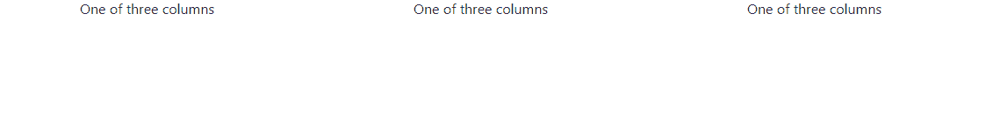
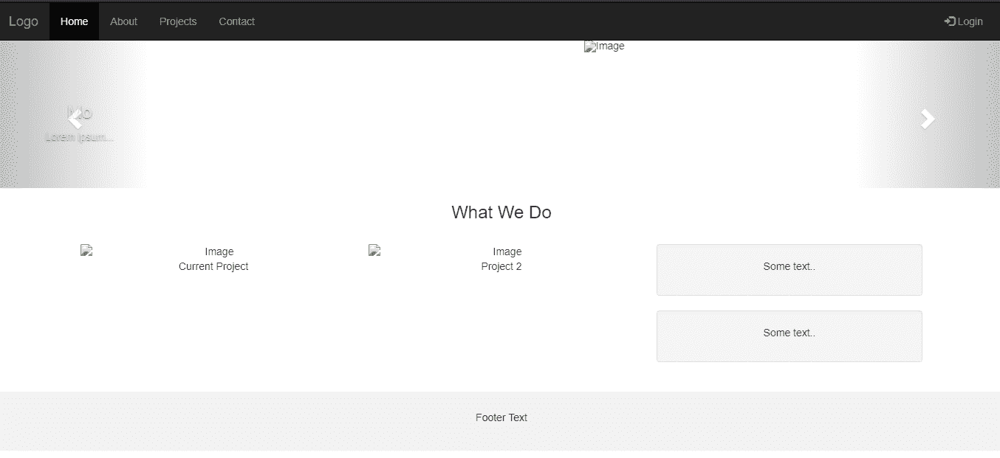

# 【bootstrap.css 和 bootstrap-theme.css 的区别

> 原文:[https://www . geesforgeks . org/bootstrap-CSS-和-bootstrap-theme-css/](https://www.geeksforgeeks.org/difference-between-bootstrap-css-and-bootstrap-theme-css/) 的区别

Bootstrap 是一个 HTML、CSS 和 JS 前端框架，用于在网络上开发响应性和移动优先的项目。正是这个框架提出了预定义的术语，从而使您能够使用这些代码，而不必从头开始创建代码。它是 HTML、CSS 和 JS 代码的集合，旨在帮助构建用户界面组件。它有几个版本，最新的是 2019 年 11 月 28 日发布的 4.4.1。

Bootstrap 很容易使用，要么我们使用这个[链接](https://getbootstrap.com/docs/4.4/getting-started/download/)从官网下载，要么我们可以直接从免费提供的官网复制写好的代码。
Bootstrap CDN 是公共内容交付网络，使用户能够从其服务器远程加载 CSS 或 js 和图像。引导 CDN 包含以下功能:

*   简单易用有了 HTML 的基础知识，我们就可以开始使用 Bootstrap 了。
*   **简单集成:** Bootstrap 可以简单地与不同的其他平台和框架集成在一起，在现有网站和新网站上也是如此，还有一点，您也可以在当前的 CSS 中利用 Bootstrap 的特定元素。
*   **伟大的网格系统:** Bootstrap 建立在响应性的 12 列网格、布局和组件之上。无论你需要一个固定的网格还是一个响应的，这只是一些改变的问题。

**示例:**用于将网页分成三列的示例代码，在这三列中直接使用引导程序，而无需创建官方网站上提供的新方法。(来源:[https://getbootstrap . com/docs/4.4/入门/简介/](https://getbootstrap.com/docs/4.4/getting-started/introduction/) )

```
<!DOCTYPE html>
<html>

<head>
    <link rel="stylesheet" href=
"https://stackpath.bootstrapcdn.com/bootstrap/4.4.1/css/bootstrap.min.css"
        integrity=
"sha384-Vkoo8x4CGsO3+Hhxv8T/Q5PaXtkKtu6ug5TOeNV6gBiFeWPGFN9MuhOf23Q9Ifjh"
        crossorigin="anonymous">
</head>

<body>
    <div class="container">
        <div class="row">
            <div class="col-md">
                n One of three columns
            </div>

            <!-- Dividing the website into
                three columns -->
            <div class="col-md">
                One of three columns
            </div>

            <div class="col-md">
                One of three columns
            </div>
        </div>
    </div>
</body>

</html>
```

**输出:**


**自举的问题:**会有很多文件被覆盖，更多的时间花在设计网站上。我们需要花更多的时间来创建一个设计，否则大多数网页看起来都是一样的。JS 与 jquery 联系在一起，并且是公共库之一，因此大多数插件都没有使用。

**Bootstrap-Theme 简介:** Bootstrap 主题是 HTML、CSS 和 js 的包，它们提供样式、UI 组件和页面布局以在 web 项目中使用。模板已经由开发人员编写，用于改编脚本，便于个人学习构建新网站。

**功能:**引导主题包括按钮、下拉菜单、导航栏、进度条、面板。术语类允许我们通过类选择器访问 CSS 和 JS 的特定元素。按钮中预先定义的类节省了大量时间，可以自定义。用于设置网格高度和网页背景颜色的主题具有不同的文本样式格式，通过文本的内容和高度，我们可以设置网格的填充。容器-流体以创建流体布局，从而在所有设备上利用 100%的视口宽度。

**示例:**

```
<!DOCTYPE html>
<html lang="en">

<head>
    <title>Bootstrap Example</title>
    <meta charset="utf-8">
    <meta name="viewport" 
          content="width=device-width, initial-scale=1">
    <link rel="stylesheet" 
          href=
"https://maxcdn.bootstrapcdn.com/bootstrap/3.4.1/css/bootstrap.min.css">
    <script src=
"https://ajax.googleapis.com/ajax/libs/jquery/3.4.1/jquery.min.js">
  </script>
    <script src=
"https://maxcdn.bootstrapcdn.com/bootstrap/3.4.1/js/bootstrap.min.js">
  </script>
    <style>
        /* Remove the navbar's default margin-bottom
           and rounded borders */

        .navbar {
            margin-bottom: 0;
            border-radius: 0;
        }
        /* Add a gray background color and some
           padding to the footer */

        footer {
            background-color: #f2f2f2;
            padding: 25px;
        }

        .carousel-inner img {
            width: 100%;
            /* Set width to 100% */
            margin: auto;
            min-height: 200px;
        }
        /* Hide the carousel text when the screen
           is less than 600 pixels wide */

        @media (max-width: 600px) {
            .carousel-caption {
                display: none;
            }
        }
    </style>
</head>

<body>

    <nav class="navbar navbar-inverse">
        <div class="container-fluid">
            <div class="navbar-header">
                <button type="button" 
                        class="navbar-toggle" 
                        data-toggle="collapse" 
                        data-target="#myNavbar">
                    <span class="icon-bar">
                  </span>
                    <span class="icon-bar">
                  </span>
                    <span class="icon-bar">
                  </span>
                </button>
                <a class="navbar-brand" 
                   href="#">Logo</a>
            </div>
            <div class="collapse navbar-collapse" 
                 id="myNavbar">
                <ul class="nav navbar-nav">
                    <li class="active"><a href="#">Home</a></li>
                    <li><a href="#">About</a></li>
                    <li><a href="#">Projects</a></li>
                    <li><a href="#">Contact</a></li>
                </ul>
                <ul class="nav navbar-nav navbar-right">
                    <li><a href="#">
                      <span class="glyphicon glyphicon-log-in">
                      </span> Login</a></li>
                </ul>
            </div>
        </div>
    </nav>

    <div id="myCarousel" 
         class="carousel slide" 
         data-ride="carousel">
        <!-- Indicators -->
        <ol class="carousel-indicators">
            <li data-target="#myCarousel" 
                data-slide-to="0" 
                class="active"></li>

            <li data-target="#myCarousel" 
                data-slide-to="1"></li>
        </ol>

        <!-- Wrapper for slides -->
        <div class="carousel-inner" role="listbox">
            <div class="item active">
                
                <div class="carousel-caption">
                    <h3>SomeText</h3>
                    <p>content.</p>
                </div>
            </div>

            <div class="item">
                
                <div class="carousel-caption">
                    <h3>Mo</h3>
                    <p>Lorem ipsum...</p>
                </div>
            </div>
        </div>

        <!-- Left and right controls -->
        <a class="left carousel-control"
           href="#myCarousel" 
           role="button"
           data-slide="prev">
            <span class="glyphicon glyphicon-chevron-left" 
                  aria-hidden="true"></span>
            <span class="sr-only">Previous</span>
        </a>
        <a class="right carousel-control" 
           href="#myCarousel" 
           role="button" 
           data-slide="next">
            <span class="glyphicon glyphicon-chevron-right" 
                  aria-hidden="true">
          </span>
            <span class="sr-only">Next</span>
        </a>
    </div>

    <div class="container text-center">
        <h3>What We Do</h3>
        <br>
        <div class="row">
            <div class="col-sm-4">
                
                <p>Current Project</p>
            </div>
            <div class="col-sm-4">
                
                <p>Project 2</p>
            </div>
            <div class="col-sm-4">
                <div class="well">
                    <p>Some text..</p>
                </div>
                <div class="well">
                    <p>Some text..</p>
                </div>
            </div>
        </div>
    </div>
    <br>

    <footer class="container-fluid text-center">
        <p>Footer Text</p>
    </footer>

</body>

</html>
```

**输出:**


【Bootstrap 的问题-主题:写代码时要记住术语，不会显示错误，我们应该重新检查代码，以获得正确的输出。每个术语都应该被指定用于设计网站。

**区别:** Bootstrap.css 框架用于设计带有一些上下文和预定义设计的基础网页。网站的样式是通过在官方网站中导入 CSS 链接来完成的。正如 bootstrap-theme.css 用于下拉菜单、导航栏、进度条、不同样式的按钮，我们可以通过在代码中调用类属性来添加它们。用不同的样式格式化文本，在网站上滑动文本。

我们可以通过图标为网站上的图像和社交媒体按钮添加动画，以共享网站上的内容。我们在包中有预定义的类，我们需要为按钮的样式调用属性。