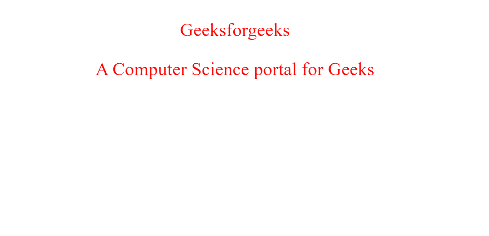
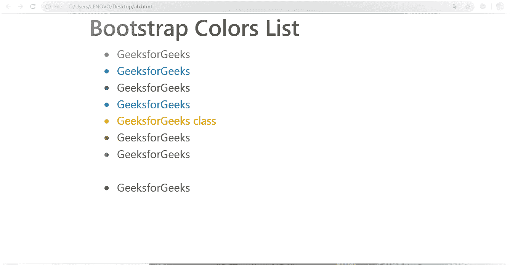

# CSS 和 Bootstrap 的区别

> 原文:[https://www . geeksforgeeks . org/CSS 和 bootstrap 的区别/](https://www.geeksforgeeks.org/difference-between-css-and-bootstrap/)

**[级联样式表(CSS)](https://www.geeksforgeeks.org/css-tutorials/) :** CSS 是由伯特·波斯哈肯·威姆开发的，万维网 1996 年 12 月 17 日。它是一种用于描述 HTML 元素如何在网页或 HTML 文档布局上显示的语言，如字体、颜色、边距、填充、高度、宽度、背景图像等。CSS 代表层叠样式表，这里层叠是指我们应用样式过程的部分，样式是指颜色、边距、表格段落的字体和标题等。工作表是指网页的外观。在 CSS 中，我们可以通过编辑单个 CSS 文件来改变网页的外观和布局。

**CSS 有三种[类型。](https://www.geeksforgeeks.org/types-of-css-cascading-style-sheet/)**

1.  内嵌 CSS
2.  内部 CSS
3.  外部 CSS

**示例:**这个示例描述了简单 CSS 属性的使用。

```html
<!DOCTYPE html>
<html>

<head>
    <style>
        p {
            color: red;
            text-align: center;
        }
    </style>
</head>

<body>
    <p>Geeksforgeeks</p>
    <p>
        A Computer Science 
        portal for Geeks
    </p>
</body>

</html>
```

**输出:**


**[Bootstrap](https://www.geeksforgeeks.org/bootstrap-tutorials/):**Bootstrap 是目前最流行的开源前端框架。它是由马克·奥托、雅各布·桑顿于 2011 年 8 月 19 日开发的。Bootstrap 是 CSS 类和 JavaScript 函数的集合，用于响应性设计和构建响应性、移动优先的站点和应用程序。它通常在网格系统上工作，在行和列的帮助下创建页面布局，并且它支持创建响应性网站的所有浏览器。

**示例:**

```html
<!DOCTYPE html> 
<html lang="en"> 

<head> 
    <title>Bootstrap Color Example</title> 

    <meta charset="utf-8"> 

    <meta name="viewport" 
          content="width=device-width,
                   initial-scale=1"> 

    <link rel="stylesheet" href= 
"https://maxcdn.bootstrapcdn.com/bootstrap/4.3.1/css/bootstrap.min.css"> 

    <script src= 
"https://ajax.googleapis.com/ajax/libs/jquery/3.3.1/jquery.min.js"> 
    </script> 

    <script src= 
"https://cdnjs.cloudflare.com/ajax/libs/popper.js/1.14.7/umd/popper.min.js"> 
    </script> 

    <script src= 
"https://maxcdn.bootstrapcdn.com/bootstrap/4.3.1/js/bootstrap.min.js"> 
    </script> 
</head> 

<body> 
    <div class="container"> 
        <h2>Bootstrap Colors List</h2> 
        <ul> 
            <li class="text-muted">GeeksforGeeks</li> 
            <li class="text-primary">GeeksforGeeks</li> 
            <li class="text-success">GeeksforGeeks</li> 
            <li class="text-info">GeeksforGeeks</li> 
            <li class="text-warning">GeeksforGeeks class</li> 
            <li class="text-danger">GeeksforGeeks</li> 
            <li class="text-secondary">GeeksforGeeks</li> 
            <li class="text-white">GeeksforGeeks</li> 
            <li class="text-dark">GeeksforGeeks</li> 

        </ul> 
    </div> 
</body> 

</html> 
```

**输出:**


**CSS 和 Bootstrap 的区别:**

| 级联样式表 | 引导程序 |
| CSS 是由伯特·波斯哈肯·维姆·莱于 1996 年 12 月 17 日在万维网上开发的。 | 自举由马克·奥托开发，雅各布·桑顿 2011 年 8 月 19 日。 |
| CSS 代表内容的样式和外观，如字体、颜色、边距、填充等。 | Bootstrap 是一个免费的开源 CSS 框架，用于开发响应性网站。 |
| CSS 没有网格系统。 | Bootstrap 基于网格系统。 |
| 它目前正在开发最新版本的 CSS3。 | Bootstrap 目前正在运行 Bootstrap 4，这是 Bootstrap 的最新版本。 |
| CSS 不提供响应页面或网站。 | 在 Bootstrap 中，我们可以设计一个有响应的网站或网页。 |
| CSS 比 Bootstrap 更复杂，因为没有预定义的类和设计。 | Bootstrap 很容易理解，它有很多预设计类。 |
| 在 CSS 中，我们必须从头开始编写代码。 | 在 Bootstrap 中，我们可以在代码中添加预定义的类，而无需编写代码。 |