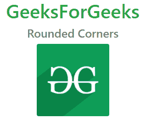
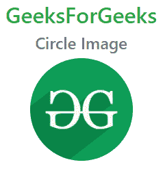
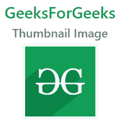
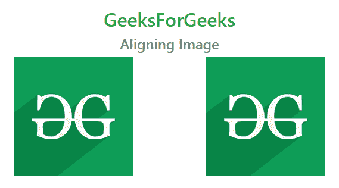

# Bootstrap 4

中使用的不同类型的图像形状&角

> 原文:[https://www . geeksforgeeks . org/不同类型的图像形状-角-用于引导-4/](https://www.geeksforgeeks.org/different-types-of-image-shapes-corners-used-in-bootstrap-4/)

在本文中，我们将学习如何使用 Bootstrap 制作不同的图像形状&还将通过示例了解其实现。Bootstrap 为图像提供了不同的类别，以使它们的外观更好，并使它们更具响应性。使图像具有响应性意味着它应该根据其父元素进行缩放。也就是说，图像的大小不应溢出其父元素，并将根据其父元素大小的变化而增长和收缩，而不会失去其纵横比。我们将讨论 Bootstrap 中可用于映像的不同类。

在 Bootstrap 4 中，使用不同形状和角的标签显示图像。这些形状和角可以使用类来实现。bootstrap 中可用于图像的不同形状和角如下所示:

*   圆角
*   圆
*   极小的
*   对齐图像

在这里，我们使用了 Bootstrap 4 CDN 链接，可以很容易地从他们的[官方](https://getbootstrap.com/docs/4.5/getting-started/introduction/)网站获得。

**引导 CDN 链接:**

在加载所有其他 CSS 文件之前，在标签中复制并粘贴给定的样式表<link>。

> <link rel="”stylesheet”" href="”https://maxcdn.bootstrapcdn.com/bootstrap/4.5.2/css/bootstrap.min.css”">

为了使用 Javascript 功能，我们可以使用下面的 CDN 链接进行 javascript。

> <src 脚本= " https://cdnjs . cloudflare . com/Ajax/libs/popper . js/1 . 16 . 0/UMD/popper . min . js "></script><src 脚本= " https://maxcdn . boot

我们将利用上面的 CDN 链接来实现它，以制作不同形状的图像。

**圆角:**在圆角中，显示的图像将使其角变圆。*。圆角*类为图像添加圆角。此类与< img >标签一起使用。

**语法:**

```html

```

**例 1:** 这个例子说明了*的用法。Bootstrap 中四舍五入的*类。

## 超文本标记语言

```html
<!DOCTYPE html>
<html lang="en">

<head>
    <title>Bootstrap Example</title>
    <meta charset="utf-8" />
    <meta name="viewport" content=
        "width=device-width, initial-scale=1" />
    <link rel="stylesheet" href=
"https://maxcdn.bootstrapcdn.com/bootstrap/4.5.2/css/bootstrap.min.css" />
</head>

<body>
    <center>
        <h1 class="text-success">GeeksForGeeks</h1>
        <h4 class="text-secondary">Rounded Corners</h4>
        
    </center>
</body>

</html>
```

**输出**:输出中显示的图像角被四舍五入。



**圆圈:***。圆形*类用于创建圆形图像。

**语法:**

```html
 
```

**例 2:** 这个例子说明了*的用法。Bootstrap 中的圆形*类。

## 超文本标记语言

```html
<!DOCTYPE html>
<html lang="en">

<head>
    <title>Bootstrap Example</title>
    <meta charset="utf-8" />
    <meta name="viewport" content=
        "width=device-width, initial-scale=1" />
    <link rel="stylesheet" href=
"https://maxcdn.bootstrapcdn.com/bootstrap/4.5.2/css/bootstrap.min.css" />
</head>

<body>
    <center>
        <h2 class="text-success">
            GeeksForGeeks
        </h2>

        <h4 class="text-secondary">
            Circle Image
        </h4>
        
    </center>
</body>

</html>
```

**输出:**输出中显示的图像，是圆形图像。



**缩略图:**缩略图是代表较大图像的小图像。*。img-thumbnail* 类用于创建缩略图(有边框的)图像。

**语法:**

```html
 
```

**例 3:** 这个例子说明了*的用法。Bootstrap 中的 img-缩略图*类。

## 超文本标记语言

```html
<!DOCTYPE html>
<html lang="en">

<head>
    <title>Bootstrap Example</title>
    <meta charset="utf-8" />
    <meta name="viewport" content=
        "width=device-width, initial-scale=1" />
    <link rel="stylesheet" href=
"https://maxcdn.bootstrapcdn.com/bootstrap/4.5.2/css/bootstrap.min.css" />
</head>

<body>
    <center>
        <h2 class="text-success">
            GeeksForGeeks
        </h2>

        <h4 class="text-secondary">
            Thumbnail Image
        </h4>

        
    </center>
</body>

</html>
```

**输出:**显示的图像被边框包围。



**对齐图像:**用于左右对齐图像。*。向左浮动*和*。浮动-右*类用于设置图像的左右对齐。

**语法:**

```html

```

**例 4:** 这个例子说明了*的用法。向左浮动*或*。右浮动*类，用于在引导中设置图像的左右对齐。

## 超文本标记语言

```html
<!DOCTYPE html>
<html lang="en">

<head>
    <title>Bootstrap Example</title>
    <meta charset="utf-8" />
    <meta name="viewport" content=
        "width=device-width, initial-scale=1" />
    <link rel="stylesheet" href=
"https://maxcdn.bootstrapcdn.com/bootstrap/4.5.2/css/bootstrap.min.css" />
</head>

<body>
    <center>
        <h2 class="text-success">
            GeeksForGeeks
        </h2>

        <h4 class="text-secondary">
            Aligning Image
        </h4>

        

        
    </center>
</body>

</html>
```

**输出:**从输出来看，一个图像在左侧对齐，另一个图像在右侧对齐。

