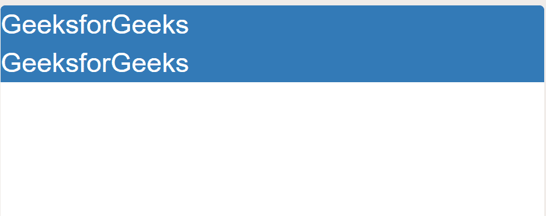

# 在引导程序中显示属性并举例

> 原文:[https://www . geeksforgeeks . org/display-property-in-bootstrap-with-examples/](https://www.geeksforgeeks.org/display-property-in-bootstrap-with-examples/)

引导中的**显示属性**用于设置元素的显示属性。诸如 block、inline 等实用程序用于设置元素的显示属性。

bootstrap 的显示属性类有助于直接设置元素的 [CSS 显示属性](https://www.geeksforgeeks.org/css-display-property/)。

可用的类别有:

*   **。d-block** :这个类和一个元素一起使用时，设置它**显示**属性为 *block* 。将这个类与一个元素一起使用相当于下面的样式:

    ```
    style = "display: block;"

    ```

*   **。d-inline** :这个类和一个元素一起使用时，设置它**显示**属性为 *inline* 。将这个类与一个元素一起使用相当于下面的样式:

    ```
    style = "display: inline;"

    ```

*   **。d-内联块**:这个类和一个元素一起使用时，设置它**显示**属性为*内联块*。将这个类与一个元素一起使用相当于下面的样式:

    ```
    style = "display: inline-block;"

    ```

**语法:**

> *   inline//used for inline display
> *   block//is used for block display.
> *   inline block//is used for inline block display.

以下示例说明了引导的显示属性类的使用:

**例 1:**

```
<!DOCTYPE html>
<html>

<head>
    <style>
        div{ font-size: 30px; }
    </style>

    <!-- Include Bootstrap CSS and JS -->
    <link rel="stylesheet" href="https://maxcdn.bootstrapcdn.com/bootstrap/3.3.7/css/bootstrap.min.css">
    <script src="https://ajax.googleapis.com/ajax/libs/jquery/3.3.1/jquery.min.js"></script>
    <script src="https://maxcdn.bootstrapcdn.com/bootstrap/3.3.7/js/bootstrap.min.js"></script>

    <title>Webpage</title>
</head>

<body>
    <div class="d-block bg-primary">
        GeeksforGeeks
    </div>  

    <div class="d-block bg-primary">
        GeeksforGeeks
    </div>  
</body>
</html>
```

**输出:**


**例 2:**

```
<!DOCTYPE html>
<html>

<head>
    <style>
        div{ font-size: 30px; }
    </style>

    <!-- Add Bootstrap CSS and JS -->
    <link rel="stylesheet" href="https://maxcdn.bootstrapcdn.com/bootstrap/4.0.0/css/bootstrap.min.css" integrity="sha384-Gn5384xqQ1aoWXA+058RXPxPg6fy4IWvTNh0E263XmFcJlSAwiGgFAW/dAiS6JXm" crossorigin="anonymous">

    <script src="https://code.jquery.com/jquery-3.2.1.slim.min.js" integrity="sha384-KJ3o2DKtIkvYIK3UENzmM7KCkRr/rE9/Qpg6aAZGJwFDMVNA/GpGFF93hXpG5KkN" crossorigin="anonymous"></script>
    <script src="https://cdnjs.cloudflare.com/ajax/libs/popper.js/1.12.9/umd/popper.min.js" integrity="sha384-ApNbgh9B+Y1QKtv3Rn7W3mgPxhU9K/ScQsAP7hUibX39j7fakFPskvXusvfa0b4Q" crossorigin="anonymous"></script>
    <script src="https://maxcdn.bootstrapcdn.com/bootstrap/4.0.0/js/bootstrap.min.js" integrity="sha384-JZR6Spejh4U02d8jOt6vLEHfe/JQGiRRSQQxSfFWpi1MquVdAyjUar5+76PVCmYl" crossorigin="anonymous"></script>

    <title>Webpage</title>
</head>

<body>
    <div class="d-inline bg-success">
        GeeksforGeeks
    </div> 

    <div class="d-inline bg-success">
        GeeksforGeeks
    </div> 
</body>
</html>
```

**输出:**


**例 3:**

```
<!DOCTYPE html>
<html>

<head>
    <style>
        body{ font-size: 75px; }
    </style>

    <!-- Add Bootstrap CSS and JS -->
    <link rel="stylesheet" href="https://maxcdn.bootstrapcdn.com/bootstrap/4.0.0/css/bootstrap.min.css" integrity="sha384-Gn5384xqQ1aoWXA+058RXPxPg6fy4IWvTNh0E263XmFcJlSAwiGgFAW/dAiS6JXm" crossorigin="anonymous">

    <script src="https://code.jquery.com/jquery-3.2.1.slim.min.js" integrity="sha384-KJ3o2DKtIkvYIK3UENzmM7KCkRr/rE9/Qpg6aAZGJwFDMVNA/GpGFF93hXpG5KkN" crossorigin="anonymous"></script>
    <script src="https://cdnjs.cloudflare.com/ajax/libs/popper.js/1.12.9/umd/popper.min.js" integrity="sha384-ApNbgh9B+Y1QKtv3Rn7W3mgPxhU9K/ScQsAP7hUibX39j7fakFPskvXusvfa0b4Q" crossorigin="anonymous"></script>
    <script src="https://maxcdn.bootstrapcdn.com/bootstrap/4.0.0/js/bootstrap.min.js" integrity="sha384-JZR6Spejh4U02d8jOt6vLEHfe/JQGiRRSQQxSfFWpi1MquVdAyjUar5+76PVCmYl" crossorigin="anonymous"></script>

    <title>Webpage</title>
</head>

<body>
    <div class="d-inline-block bg-warning">  
        GeeksforGeeks
    </div>

    <div class="d-inline-block bg-warning">  
        GeeksforGeeks
    </div>
</body>
</html>
```

**输出:**
