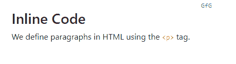
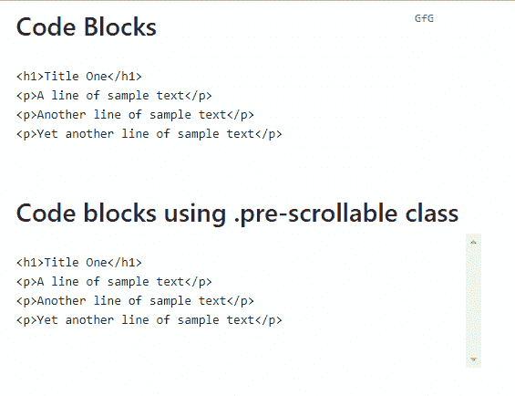
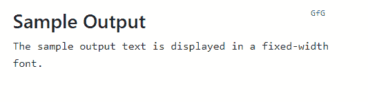
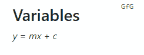
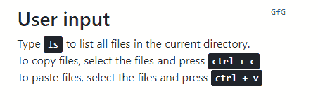

# 使用引导显示内联和多行代码块

> 原文:[https://www . geesforgeks . org/displaying-inline-and-multiline-block-of-code-use-bootstrap/](https://www.geeksforgeeks.org/displaying-inline-and-multiline-blocks-of-code-using-bootstrap/)

Bootstrap 提供了许多用于显示内联和多行代码块的类。

**显示内联代码**:内联代码应该包裹在 **<代码>** 标签中。生成的文本将以固定宽度的字体显示，并呈现红色字体。
**注**:标签`<``>`应替换为**&lt；**和**&gt；**分别为。

下面是一个在 Bootstrap 中使用 **<代码>** 标签显示内联代码的示例:

```html
<!DOCTYPE html>
<html>
<head>
    <!-- Include Bootstrap CSS -->
    <link rel="stylesheet" href="https://maxcdn.bootstrapcdn.com/bootstrap/4.0.0/css/bootstrap.min.css">

    <title>Displaying Inline Code</title>
</head>
<body>
    <div class="container">
        <h3>Inline Code</h3>
        <p>
            We define paragraphs in HTML using the 
            <code><p></code> tag.
        </p>
    </div>
</body>
</html>                    
```

**输出:**


**显示多行代码块**:多行代码应该包装在`<pre>`标签中。生成的文本将以固定宽度的字体显示，并保留空格和换行符。

可以选择添加`.pre-scrollable`类，将元素的最大高度设置为 350px，并添加一个垂直滚动条。

下面是显示代码块的示例:

```html
<!DOCTYPE html>
<html>
<head>
    <!-- Add Bootstrap CSS -->
    <link rel="stylesheet" href="https://maxcdn.bootstrapcdn.com/bootstrap/4.0.0/css/bootstrap.min.css">

    <title>Bootstrap Playground</title>
</head>

<body>
    <div class="container">

    <h3>Code Blocks</h3>
    <!-- This block is not scrollable -->
    <pre>
        <code>
            <!-- Lines of code starts -->
            <h1>Title One</h1>
            <p>A line of sample text</p>
            <p>Another line of sample text</p>
            <p>Yet another line of sample text</p>
            <!-- Lines of code ends -->
        </code>
    </pre>

    <h3>Code blocks using .pre-scrollable class</h3>

    <!-- This block is vertically scrollable -->
    <pre class="pre-scrollable">
        <code>
            <!-- Lines of Code Starts -->
            <h1>Title One</h1>
            <p>A line of sample text</p>
            <p>Another line of sample text</p>
            <p>Yet another line of sample text</p>
            <!-- Lines of code ends -->
        </code>
    </pre>
    </div>
</body>
</html>                    
```

**输出:**


**指示样本输出**:如果需要显示任何编译程序的输出，在这种情况下，为了指示程序的输出，可以使用`<samp>`标签包装输出。

```html
<!DOCTYPE html>
<html>
<head>
    <!-- Add Bootstrap CSS -->
    <link rel="stylesheet" href="https://maxcdn.bootstrapcdn.com/bootstrap/4.0.0/css/bootstrap.min.css">

    <title>Bootstrap Playground!</title>
</head>
<body>
    <div class="container">
        <h3>Sample Output</h3>

        <!-- Below is a sample output text displayed 
            using the samp tags -->
        <samp>
            The sample output text is displayed 
            in a fixed-width font.
        </samp>
    </div>
</body>
</html>                    
```

**输出:**


**表示变量**:变量可以用`<var>`标记来表示。

```html
<!DOCTYPE html>
<html>
<head>
    <!-- ADD Bootstrap CSS -->
    <link rel="stylesheet" href="https://maxcdn.bootstrapcdn.com/bootstrap/4.0.0/css/bootstrap.min.css">

    <title>Bootstrap Playground</title>
</head>

<body>
    <div class="container">
        <h3>Variables</h3>
        <var>y</var> = <var>m</var><var>x</var> 
                        + <var>c</var>
    </div>
</body>
</html>                    
```

**输出:**


**用户输入**:用户输入可以使用如下程序所示的`<kbd>`标签进行设置。

```html
<!DOCTYPE html>
<html>
<head>
    <!-- ADD Bootstrap CSS -->
    <link rel="stylesheet" href="https://maxcdn.bootstrapcdn.com/bootstrap/4.0.0/css/bootstrap.min.css">

    <title>Hello, world!</title>
</head>

<body>
    <div class="container">
        <h3>User input</h3>

        <!-- In the below tags kbd tags is used to 
              highlight inputs -->
        Type <kbd>ls</kbd> to list all files in the 
        current directory. <br>
        To copy files, select the files and 
        press <kbd><kbd>ctrl</kbd> + <kbd>c</kbd></kbd><br>
        To paste files, select the files and 
        press <kbd><kbd>ctrl</kbd> + <kbd>v</kbd></kbd><br>
    </div>
</body>
</html>                    
```

**输出:**
