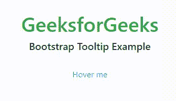

# 解释引导工具提示

> 原文:[https://www.geeksforgeeks.org/explain-bootstrap-tooltip/](https://www.geeksforgeeks.org/explain-bootstrap-tooltip/)

在 Bootstrap Framework 中，Tooltip 是一个插件，当用户将鼠标指针悬停在元素上时，它会显示一个小弹出框。例如，当用户指向链接或按钮等时。一个带有提示或元素信息的小弹出窗口正在悬停。当我们想要在网页上显示每个组件的用途时，通常使用这个工具提示插件，只需将鼠标指针移动到组件上。

为了实现工具提示，我们需要在元素中添加 *data-toggle=“工具提示”*属性，标题属性用于在悬停时显示文本。我们必须使用 *tooltip()* 方法初始化 tooltip 以触发通过 JavaScript 的 Tooltip，该方法在 JavaScript 代码中指定目标元素的 id、类或任何 CSS 选择器。在本文中，我们将了解 Bootstrap 中的工具提示及其配置&实现。详情请参考[引导 4 |工具提示](https://www.geeksforgeeks.org/bootstrap-4-tooltip/)文章。

**设置引导工具提示插件的步骤:**

**包括 Bootstrap 和 jQuery CDN 进入** [**<头部>标签**](https://www.geeksforgeeks.org/html-head-tag/)**–**

> <src = " https://Ajax . Google APIs . com/Ajax/libs/jquery/3 . 5 . 1/jquery . min . js "></script><src = " https://maxcdn . bootstracdn . com/bootstrap/3 . 4 . 1/脚本

**在 HTML 元素中添加工具提示标记–**

```html
<a href="#" data-toggle="tooltip" 
    title="Some Information or Hint">
    Hover over me
</a>
```

**将 jQuery 添加到** [**<脚本>标记**](https://www.geeksforgeeks.org/html-script-tag/) **以触发工具提示–**

```html
<script>
    $(document).ready(function () {
          $('[data-toggle="tooltip"]').tooltip();
    });
</script>
```

**定位工具提示(可选)–**

默认情况下，引导工具提示插件总是出现在元素的顶部。但是我们可以使用数据放置属性来改变工具提示插件的位置，这样我们就可以将工具提示放置在元素的顶部、底部、左侧或右侧。

```html
<a href="#" data-toggle="tooltip" 
    data-placement="top" 
    title="Tooltip on top">
    Tooltip on top
</a>

<a href="#" data-toggle="tooltip" 
    data-placement="bottom" 
    title="Tooltip on bottom">
    Tooltip on bottom
</a>

<a href="#" data-toggle="tooltip" 
    data-placement="left" 
    title="Tooltip on left">
    Tooltip on left
</a>

<a href="#" data-toggle="tooltip" 
    data-placement="right" 
    title="Tooltip on right">
    Tooltip on right
</a>
```

我们还可以通过 JavaScript 定位工具提示:

```html
<script>
    $(document).ready(function () {

        //.tooltip-**** is the class 
        // specified in the html element
        $(".tooltip-top").tooltip({ placement: "top" });
        $(".tooltip-right").tooltip({ placement: "right" });
        $(".tooltip-bottom").tooltip({ placement: "bottom" });
        $(".tooltip-left").tooltip({ placement: "left" });
    });
</script>
```

在这个阶段，我们已经成功地配置了工具提示来开始工作。

**示例:**

## 超文本标记语言

```html
<!DOCTYPE html>
<html>

<head>
    <title>Bootstrap Tooltip Example</title>
    <meta charset="utf-8" />
    <meta name="viewport" content=
        "width=device-width, initial-scale=1" />
    <link rel="stylesheet" href=
"https://maxcdn.bootstrapcdn.com/bootstrap/4.5.2/css/bootstrap.min.css" />
</head>

<body>
    <div class="container">
        <h1 class="text-success">
            GeeksforGeeks
        </h1>

        <h5>Bootstrap Tooltip Example</h5>
        <br />

        <a href="#" data-toggle="mytooltip" 
            title="A Computer Science portal for geeks">
            Hover me
        </a>
    </div>

    <script>

        // Add below code to trigger tooltip
        $(document).ready(function () {
            $('[data-toggle="mytooltip"]').tooltip();
        });
    </script>
</body>

</html>
```

**输出:**

