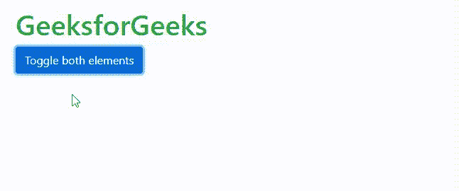

# 解释 Bootstrap 的折叠元素

> 原文:[https://www . geeksforgeeks . org/explain-bootstraps-collapsing-elements/](https://www.geeksforgeeks.org/explain-bootstraps-collapsing-elements/)

在本文中，我们将看到如何使用 Bootstrap 类创建一个折叠元素，还将看到它们的不同属性，并通过示例了解它们的实现。

**自举折叠元素:**

折叠元素是当用户单击或悬停在数据上时向用户显示数据的元素。这是一种帮助我们向用户显示大量数据的现代方法。它保持网站整洁，当用户悬停或点击退出时，它会关闭或再次折叠。我们可以使用基本的 HTML、CSS 和 JavaScript 来制作自己的折叠元素。但是 Bootstrap 有助于在其组件中折叠元素属性。

**工作[自举折叠](https://www.geeksforgeeks.org/bootstrap-4-collapse/)元素:**

引导折叠用于显示或隐藏内容。按钮或锚点用于触发请求，它们被映射到需要折叠的特定元素。在 Bootstrap 中，折叠元素将元素的高度从当前高度动画化为 0。

用于折叠元素的类:

*   **。折叠:**此类隐藏内容。
*   **。折叠:**此类在过渡期间使用。
*   **。折叠-显示:**此类显示内容。

详情请参考[引导 4 折叠](https://www.geeksforgeeks.org/bootstrap-4-collapse/)一文。

通常，折叠元素是使用按钮完成的。这里，我们将使用一个按钮来显示可折叠元素的工作方式。

**语法:**

```html
<button type="button" 
        data-bs-toggle="collapse" 
        data-bs-target="#collapseExample">Button 
</button>
```

这两个属性与按钮一起使用，如下所示:

*   **data-bs-target:** 此属性保存需要隐藏或在按钮点击时显示的元素的 id。
*   **数据-bs-toggle:** 该属性始终设置为“折叠”。

从下面的示例中，我们可以看到一个按钮，其属性“data-bs-toggle”设置为“collapse”，而“data-bs-target”的值设置为“#”collapse example，即应该被折叠的 div 元素的 id。“div”被赋予类“collapse”以使其可折叠。

**示例**:本示例描述了折叠元素。

## 超文本标记语言

```html
<!DOCTYPE html>
<html lang="en">

<head>
    <meta charset="UTF-8">
    <meta http-equiv="X-UA-Compatible" 
          content="IE=edge">
    <meta name="viewport" 
          content="width=device-width, 
                   initial-scale=1.0">
    <link rel="stylesheet" 
          href=
"https://cdn.jsdelivr.net/npm/bootstrap@4.6.0/dist/css/bootstrap.min.css"
          integrity=
"sha384-B0vP5xmATw1+K9KRQjQERJvTumQW0nPEzvF6L/Z6nronJ3oUOFUFpCjEUQouq2+l" 
          crossorigin="anonymous">
    <script src=
"https://cdn.jsdelivr.net/npm/bootstrap@5.1.3/dist/js/bootstrap.bundle.min.js" 
            integrity=
"sha384-ka7Sk0Gln4gmtz2MlQnikT1wXgYsOg+OMhuP+IlRH9sENBO0LRn5q+8nbTov4+1p" 
            crossorigin="anonymous">
    </script>
    <title>Document</title>
</head>

<body>
    <h1 class=text-success>GeeksforGeeks</h1>
    <p>
        <button class="btn btn-primary" 
                type="button" 
                data-bs-toggle="collapse" 
                data-bs-target="#collapseExample" 
                aria-expanded="false" 
                aria-controls="collapseExample">
            Button of Collapsing Element 
        </button>
    </p>

    <div class="collapse" id="collapseExample">
        <div class="card card-body">
            This text is shown when the above button 
            is clicked and hides when user clicks on it again. 
        </div>
    </div>
</body>

</html>
```

**输出:**


自举中的简单折叠元素

**水平折叠元素:**

我们也可以制作水平折叠元素。这里，元素将水平折叠，而不是垂直折叠。要制作一个水平折叠元素，我们需要向要折叠的元素添加类“折叠-水平”。我们需要使用内嵌 CSS 或者仅使用 width-utilities 来提及子元素的宽度。

**语法:**

```html
<div class="collapse collapse-horizontal"></div>
```

**示例**:本示例描述了水平折叠元素。

## 超文本标记语言

```html
<!DOCTYPE html>
<html lang="en">

<head>
    <meta charset="UTF-8">
    <meta http-equiv="X-UA-Compatible" 
          content="IE=edge">
    <meta name="viewport" 
          content="width=device-width, 
                   initial-scale=1.0">
    <link rel="stylesheet" 
          href=
"https://cdn.jsdelivr.net/npm/bootstrap@4.6.0/dist/css/bootstrap.min.css"
          integrity=
"sha384-B0vP5xmATw1+K9KRQjQERJvTumQW0nPEzvF6L/Z6nronJ3oUOFUFpCjEUQouq2+l" 
          crossorigin="anonymous">
    <script src=
"https://cdn.jsdelivr.net/npm/bootstrap@5.1.3/dist/js/bootstrap.bundle.min.js" 
            integrity=
"sha384-ka7Sk0Gln4gmtz2MlQnikT1wXgYsOg+OMhuP+IlRH9sENBO0LRn5q+8nbTov4+1p" 
            crossorigin="anonymous">
    </script>
    <title>Document</title>
</head>

<body>
    <h1 class=text-success>GeeksforGeeks</h1>
    <p>
        <button class="btn btn-primary" 
                type="button" 
                data-bs-toggle="collapse" 
                data-bs-target="#collapseExample" 
                aria-expanded="false" 
                aria-controls="collapseExample">
                    Button of Collapsing Element 
        </button>
    </p>

    <div>
        <div class="collapse collapse-horizontal" 
             id="collapseExample">
            <div class="card card-body" 
                 style="width: 500px;">
                 This text is shown when the above 
                 button is clicked and hides when 
                 user clicks on it again. 
             </div>
        </div>
    </div>

</body>

</html>
```

**输出:**


以水平方式折叠元素

**多个可折叠:**

我们还可以制作一个按钮来同时控制多个可折叠元素。这个想法很简单，这里我们必须用相同的类名创建多个元素，并将该类名添加到“data-bs-target”中。

**注意**:我们这里用的类名不是 id，因为 id 对于 HTML 中的每个元素都是唯一的。

**语法:**

```html
<div class="collapse multi-collapse"></div>
```

**示例**:本示例描述了多重可折叠元素。

## 超文本标记语言

```html
<!DOCTYPE html>
<html lang="en">

<head>
    <meta charset="UTF-8">
    <meta http-equiv="X-UA-Compatible" 
          content="IE=edge">
    <meta name="viewport" 
          content="width=device-width, 
                   initial-scale=1.0">
    <link rel="stylesheet" 
          href=
"https://cdn.jsdelivr.net/npm/bootstrap@4.6.0/dist/css/bootstrap.min.css"
          integrity=
"sha384-B0vP5xmATw1+K9KRQjQERJvTumQW0nPEzvF6L/Z6nronJ3oUOFUFpCjEUQouq2+l" 
          crossorigin="anonymous">
    <script src=
"https://cdn.jsdelivr.net/npm/bootstrap@5.1.3/dist/js/bootstrap.bundle.min.js" 
            integrity=
"sha384-ka7Sk0Gln4gmtz2MlQnikT1wXgYsOg+OMhuP+IlRH9sENBO0LRn5q+8nbTov4+1p" 
            crossorigin="anonymous">
    </script>
    <title>Document</title>
</head>

<body>
    <h1 class=text-success>GeeksforGeeks</h1>
    <button class="btn btn-primary" 
            type="button" 
            data-bs-toggle="collapse" 
            data-bs-target=".collapse" 
            aria-expanded="false" 
            aria-controls="multiCollapseExample1 multiCollapseExample2">
        Toggle both elements
     </button>

    <div class="row">
        <div class="col">
            <div class="collapse multi-collapse" 
                 id="multiCollapseExample1">
                <div class="card card-body">
                    This text is shown when the above 
                    button is clicked and hides when 
                    user clicks on it again. 
                </div>
            </div>
        </div>
        <div class="col">
            <div class="collapse multi-collapse" 
                 id="multiCollapseExample2">
                <div class="card card-body"> 
                    This text is shown when the above 
                    button is clicked and hides when 
                    user clicks on it again. 
                </div>
            </div>
        </div>
    </div>

</body>

</html>
```

**输出:**



引导中的多个可折叠

在上述代码中，按钮的“data-bs-target”属性被赋予了“类名”的值。“折叠”,因此按钮现在可以同时在两个可折叠元素上工作。

**注意** ***:*** 我们也可以通过使用它们的“id”将以上元素分配给单独的按钮，使它们单独显示内容。

**支持的浏览器:**

*   谷歌 Chrome
*   微软边缘
*   Internet Explorer 10+
*   歌剧
*   旅行队
*   火狐浏览器