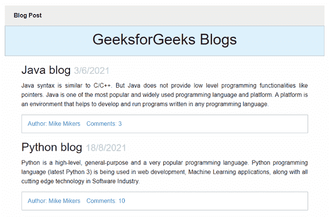

# 解释 CSS 中 Bootstrap 和 Foundation 框架的区别

> 原文:[https://www . geesforgeks . org/explain-bootstrap-and-foundation-framework-in-CSS/](https://www.geeksforgeeks.org/explain-difference-between-bootstrap-and-foundation-frameworks-in-css/)

在本文中，我们将了解 CSS 中的 Foundation & Bootstrap 框架，还将通过示例了解它们的实现，并讨论它们之间的主要区别。

**Foundation 6:**A**Foundation**是由 **ZURB** 在【2011 年 9 月构建的开源&响应前端框架，可以轻松设计出外观惊艳&的精美响应网站、应用和邮件，任何设备都可以访问。它被许多公司使用，如脸书、易贝、Mozilla、Adobe，甚至迪士尼。该框架建立在类似 Saas 的引导之上。它更加复杂、灵活，并且易于定制。它还带有命令行界面，因此很容易与模块捆绑器一起使用。它提供了 Fastclick.js 工具，可以在移动设备上更快地呈现。

与其他框架相比，基金会的界面稍微高级一些。响应式菜单是其重要属性之一。菜单在功能上是不可思议的，也可以用 CSS 自由洗礼。这种响应性架构允许设计者通过添加自己设计的方法来创建优雅的网站。

**语法:**

```html
<section class="callout large primary">
    <h1>Hello Geeks</h1>
</section>
```

**特征:**

*   **包括 XY 网格:**Foundation 中的默认网格系统允许开发人员基于水平和垂直位置控制布局。
*   **平滑滚动注意:**该功能包含内置的 JavaScript 代码，以便将“平滑滚动”属性添加到网页内部存在的特定或任何链接。
*   **更容易的原型制作:**它促进了内置功能，有助于加快原型制作过程。

**注:**

*   基金会的网格使用*框大小:边框*属性对列应用檐槽，但是该属性&和 ES5 功能不受 Internet Explorer v8 的支持。
*   浏览器将不支持*媒体查询*属性来显示网站的移动风格。

**示例:**这个示例说明了使用 CSS Foundation 的类来制作博客网页。

## 超文本标记语言

```html
<!DOCTYPE html>
<html class="no-js" lang="en">

<head>
    <meta charset="utf-8" />
    <meta name="viewport" content=
        "width=device-width, initial-scale=1.0" />

    <link rel="stylesheet" href=
"https://dhbhdrzi4tiry.cloudfront.net/cdn/sites/foundation.min.css" />
</head>

<body>

    <!-- Start Top Bar -->
    <div class="top-bar">
        <div class="top-bar-left">
            <ul class="menu">
                <li class="menu-text">Blog Post</li>
            </ul>
        </div>
    </div>
    <!-- End Top Bar -->

    <div class="callout small primary">
        <div class="row column text-center">
            <h2>GeeksforGeeks Blogs</h2>
        </div>
    </div>

    <div class="row" id="content">
        <div class="medium-8 columns">
            <div class="blog-post">
                <h3>Java blog <small>3/6/2021</small></h3>

<p>
                    Java syntax is similar to C/C++. But
                    Java does not provide low level
                    programming functionalities like
                    pointers. Java is one of the most
                    popular and widely used programming
                    language and platform. A platform
                    is an environment that helps to
                    develop and run programs written
                    in any programming language.
                </p>

                <div class="callout">
                    <ul class="menu simple">
                        <li><a href="#">
                            Author: Mike Mikers
                        </a></li>
                        <li><a href="#">Comments: 3</a></li>
                    </ul>
                </div>

                <div class="blog-post">
                    <h3>Python blog <small>18/8/2021</small></h3>

<p>
                        Python is a high-level, general-purpose
                        and a very popular programming language.
                        Python programming language (latest Python
                        3) is being used in web development,
                        Machine Learning applications, along with
                        all cutting edge technology in Software
                        Industry.
                    </p>

                    <div class="callout">
                        <ul class="menu simple">
                            <li><a href="#">Author: Mike Mikers</a></li>
                            <li><a href="#">Comments: 10</a></li>
                        </ul>
                    </div>
                </div>
            </div>
        </div>

        <script src=
    "https://code.jquery.com/jquery-2.1.4.min.js">
        </script>
        <script src=
"https://dhbhdrzi4tiry.cloudfront.net/cdn/sites/foundation.js">
        </script>

        <script>
            $(document).foundation();
        </script>
    </div>
</body>

</html>
```

**输出:**



**Foundation 的自定义菜单:**使用 Foundation 自定义菜单有多种方式，如基本菜单、对齐菜单、垂直菜单、简单菜单、嵌套菜单等，在使其成为通用导航组件的同时，也证明了灵活性。

**示例:**这个示例说明了 CSS Foundation 如何使用菜单的自定义列。

## 超文本标记语言

```html
<!DOCTYPE html>
<html class="no-js" lang="en">

<head>
    <meta charset="utf-8" />
    <meta name="viewport" content="width=device-width,
                   initial-scale=1.0" />

    <link rel="stylesheet" href=
"https://dhbhdrzi4tiry.cloudfront.net/cdn/sites/foundation.min.css" />
</head>

<body>
    <style>
        .row {
            padding: 1rem 0;
        }

        .singleline {
            padding-right: 1rem;
        }
    </style>
    <div class="row">
        <h2>Customize Menu using Foundation</h2>

        <!--Basic Menu-->
        <div class="columns">
            <h4>Basic Menu</h4>
        </div>
    </div>
    <div class="row">
        <div class="columns">
            <ul class="menu">
                <li><a href="#">
                    Programming Language
                </a></li>
                <li><a href="#">Articles</a></li>
                <li><a href="#">Blogs</a></li>
                <li><a href="#">DSA</a></li>
            </ul>
        </div>
    </div>

    <!--Alignment Menu-->
    <div class="row">
        <div class="columns">
            <h4>Alignment Menu</h4>
            <ul class="menu align-right">
                <li><a href="#">
                    Programming Language
                </a></li>
                <li><a href="#">Articles</a></li>
                <li><a href="#">Blogs</a></li>
                <li><a href="#">DSA</a></li>
            </ul>
            <div>
                <ul class="menu expanded">
                    <li><a href="#">Articles</a></li>
                </ul>
                <ul class="menu expanded">
                    <li><a href="#">Blogs</a></li>
                    <li><a href="#">DSA</a></li>
                </ul>
                <ul class="menu expanded">
                    <li><a href="#">
                        Programming Language
                    </a></li>
                    <li><a href="#">Blogs</a></li>
                    <li><a href="#">DSA</a></li>
                </ul>
                <ul class="menu expanded">
                    <li><a href="#">
                        Programming Language
                    </a></li>
                    <li><a href="#">Articles</a></li>
                    <li><a href="#">Blogs</a></li>
                    <li><a href="#">DSA</a></li>
                </ul>
            </div>
        </div>
    </div>

    <!--Vertical Menu-->
    <div class="row">
        <div class="column">
            <h4>Vertical Menu</h4>
            <ul class="vertical menu">
                <li><a href="#">
                    Programming Language
                </a></li>
                <li><a href="#">Articles</a></li>
                <li><a href="#">Blogs</a></li>
                <li><a href="#">DSA</a></li>
            </ul>
        </div>
    </div>

    <!--Simple Style-->
    <div class="row">
        <div class="column">
            <h4>Simple Style</h4>
            <ul class="menu simple">
                <li class="singleline">
                    <a href="#">DSA</a>
                </li>
                <li><a href="#">
                    Programming Language
                </a></li>
                <li><a href="#">Articles</a></li>
                <li><a href="#">Blogs</a></li>
            </ul>
        </div>
    </div>

    <!--Nested Style-->
    <div class="row">
        <div class="column">
            <h4>Nested Style</h4>
            <ul class="vertical menu">
                <li>
                    <a href="#">DSA</a>
                    <ul class="nested vertical menu">
                        <li><a href="#">Contribute</a></li>
                        <li><a href="#">
                            Programming Language
                        </a></li>
                        <li><a href="#">Articles</a></li>
                        <li><a href="#">Blogs</a></li>
                    </ul>
                </li>
                <li><a href="#">Programming Language</a></li>
                <li><a href="#">DSA</a></li>
                <li><a href="#">Blogs</a></li>
            </ul>
        </div>
    </div>

    <script src="https://code.jquery.com/jquery-2.1.4.min.js">
    </script>
    <script src=
"https://dhbhdrzi4tiry.cloudfront.net/cdn/sites/foundation.js">
    </script>
    <script>
        $(document).foundation();
    </script>
</body>

</html>
```