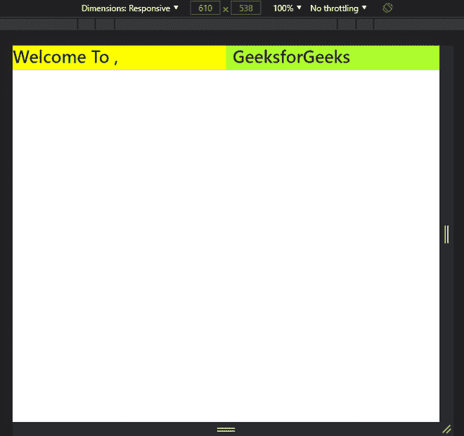
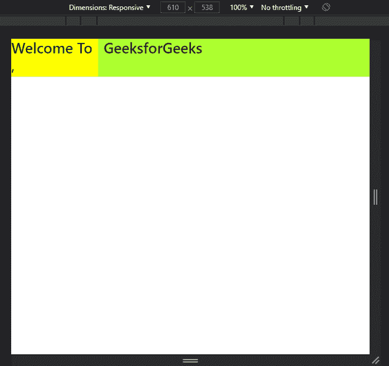

# 解释自举

中 md-grid 类的功能

> 原文:[https://www . geesforgeks . org/explain-of-function-of-MD-grid-in-class-bootstrap/](https://www.geeksforgeeks.org/explain-function-of-the-md-grid-class-in-bootstrap/)

**Bootstrap 的网格系统:**Bootstrap 网格系统在设计响应应用程序或网站时非常有用，在这些应用程序或网站中，列将根据屏幕大小重新排列。它允许页面中最多有 12 列。您可以单独使用它们中的每一个，也可以将它们合并在一起用于更宽的列。可以使用总和为 12 的所有值组合。它为所有设备提供最佳体验。借助引导网格系统，我们可以为小尺寸屏幕宽度、中等尺寸屏幕宽度和大尺寸屏幕宽度设计和定制屏幕宽度。Bootstrap 网格系统提供的一些类是针对超小型的 xs 网格类、针对小型的 sm 网格类、针对中型的 md 网格类以及针对大型的 lg 网格类。

**网格类:** Bootstrap 网格系统包含 5 个类，如下所示:

*   **。col:** 用于超小屏设备(屏幕宽度小于 576px)。
*   **。col-sm:** 用于小屏设备(屏幕宽度大于等于 576px)。
*   **。col-md:** 用于中等屏幕尺寸的设备(屏幕宽度大于等于 768px)。
*   **。col-lg:** 用于大屏幕尺寸设备(屏幕宽度大于等于 992px)。
*   **。col-xl:** 用于 xl 大屏幕尺寸设备(屏幕宽度等于或大于 1200px)。

**电网系统组成:**

*   **容器:** Bootstrap 需要一个包含元素来包装网格系统中的站点内容。单词**容器**用于包含行元素和包含列元素的行元素。
*   **排:**排必须放置在**容器**或**容器-流体**内，以便正确对齐和填充。行用于创建水平的列组。
*   **列:**网格列是通过指定您希望跨越的十二个可用列的数量来创建的。例如，三个相等的列将使用三个列 lg-4。

**。md-grid 类:**它是 Bootstrap 的网格系统提供的一个类，将帮助为屏幕宽度等于或接近 992px 的小尺寸设备屏幕设计网站或应用的界面。

**语法:**

```
<div class="col-md-x">Content</div>
```

*   **列**:用于将行划分为列。
*   **md** :此类仅适用于屏幕宽度中等的设备。
*   **x** :总共有 12 个网格列，类‘col-MD-x’的容器将有 x 个网格列。

**属性:**

*   为了使用这个类，我们需要添加“*”。col-md-* ”作为类中的前缀。
*   此类用于为宽度等于或大于 992px 的小型设备屏幕开发响应性前端。
*   页面上最多有 12 个网格列，但是我们可以通过合并这些列来自定义屏幕。
*   此类容器的宽度约为 970 像素。

**示例 1:** 在此示例中，“col-mid-6”表示中型屏幕设备的整个页面宽度的 50%，因为它将从 12 个网格列中获取 6 个网格列。

## 超文本标记语言

```
<!DOCTYPE html>
<html lang="en">

<head>

    <!-- Bootstrap CSS -->
    <link rel="stylesheet" href=
"https://cdn.jsdelivr.net/npm/bootstrap@4.6.0/dist/css/bootstrap.min.css" />

    <!--Bootstrap Icons CSS -->
    <link rel="stylesheet" href=
"https://cdn.jsdelivr.net/npm/bootstrap-icons@1.5.0/font/bootstrap-icons.css" />
</head>

<body>
    <!-- Row is class used for displaying 
        partition of columns in a row  -->
    <div class="row">

        <!-- First partion of 50% width -->
        <div class="col-md-6" 
            style="background-color: yellow">
            <h1>Welcome To ,</h1>
        </div>

        <!-- Second partion of 50% width -->
        <div class="col-md-6" 
            style="background-color: greenyellow">
            <h1>GeeksforGeeks</h1>
        </div>
    </div>
</body>

</html>
```

**输出:**



显示在“col-md-6”帮助下获得的 50%宽度的输出页面。

**示例 2:** 在此示例中，“col-mid-3”表示整个页面宽度的 25%，因为它将从 12 个网格列中获取 3 个网格列。而“col-mid-9”表示整个页面宽度的 75%,因为它将获得中等尺寸屏幕设备的 12 个网格列中的 9 个网格列。

## 超文本标记语言

```
<!DOCTYPE html>
<html lang="en">

<head>

    <!-- Bootstrap CSS -->
    <link rel="stylesheet" href=
"https://cdn.jsdelivr.net/npm/bootstrap@4.6.0/dist/css/bootstrap.min.css" />

    <!--Bootstrap Icons CSS -->
    <link rel="stylesheet" href=
"https://cdn.jsdelivr.net/npm/bootstrap-icons@1.5.0/font/bootstrap-icons.css" />
</head>

<body>

    <!-- Row is class used for displaying 
        partition of columns in a row  -->
    <div class="row">

        <!-- First partion of 50% width -->
        <div class="col-md-3" style=
            "background-color: yellow">
            <h1>Welcome To,</h1>
        </div>

        <!-- Second partion of 50% width -->
        <div class="col-md-9" style=
            "background-color: greenyellow">
            <h1>GeeksforGeeks</h1>
        </div>
    </div>
</body>

</html>
```

**输出:**



输出页面显示分别在“col-md-3”和 col-md-6 的帮助下获得的 25%和 75%的宽度。