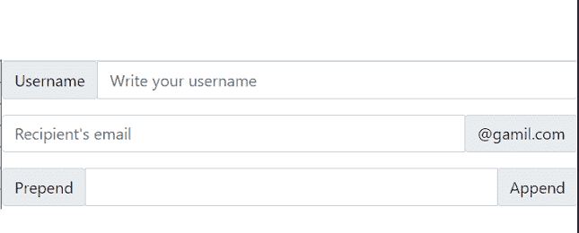
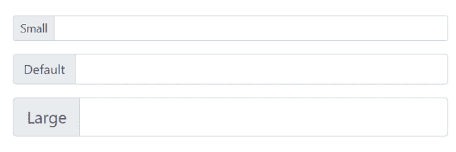

# 解释引导开发中的输入组

> 原文:[https://www . geesforgeks . org/explain-input-group-in-bootstrap-development/](https://www.geeksforgeeks.org/explain-input-groups-in-bootstrap-development/)

输入组在收集用户信息、他们的好恶、反馈等方面发挥着重要作用。在这个在线商务的时代，它已经成为任何网站与客户打交道不可或缺的一部分。普通表单很酷，但是添加定制的输入组使它更酷、更具交互性、更方便用户。

在本文中，我们将在引导程序中了解 [**输入组**](https://www.geeksforgeeks.org/input-groups-in-bootstrap-with-examples/) 。它扩展了[自举](https://www.geeksforgeeks.org/bootstrap-tutorials/)的表单控件组件，增加了更多的功能，如文本、按钮组等。它使我们能够轻松地在用户的输入字段中添加按钮或文本。它的类容器通过添加文本、按钮和按钮组来增强前端。

**方法:**将输入组元素添加到表单控件的基本步骤如下。

*   将子组件包裹在 ***内。**输入-组*类。
*   在输入的一侧或两侧应用一个按钮或附加按钮。
*   将按钮或附加按钮包装在**内。** ***输入-分组-前置*** 类如果放在输入之前，使用 ***。如果要放在最后，输入-分组-追加*** 类。

**第一步:**在 HTML [<头>](https://www.geeksforgeeks.org/html-head-tag/) 部分包含 Bootstrap CSS 来加载样式表。

> <link rel="”stylesheet”" href="”https://stackpath.bootstrapcdn.com/bootstrap/4.2.1/css/bootstrap.min.css”" integrity="”sha384-GJzZqFGwb1QTTN6wy59ffF1BuGJpLSa9DkKMp0DgiMDm4iYMj70gZWKYbI706tWS”" crossorigin="”anonymous”">

添加引导 JavaScript 插件和依赖项。

> <src = " https://cdnjs . cloudflare . com/Ajax/libs/popper . js/1 . 14 . 6/UMD/popper . min . js "完整性= " sha 384-whaiffermfy 6i5 srxvfocbuqy 1 xhdj/yoi 7 frnxmrbu 5 whdzyzyu 1 ha 6 zobl good " cross origin = " anonymous "]

**步骤 2:** 我们可以直接复制[官方引导文档](https://getbootstrap.com/docs/4.0/getting-started/introduction/)中给出的引导启动器模板。

## 超文本标记语言

```html
<!doctype html>
<html lang="en">
   <head>
      <!-- Required meta tags -->
      <meta charset="utf-8">
      <meta name="viewport" content=         
         "width=device-width, initial-scale=1, shrink-to-fit=no">
      <!-- Bootstrap CSS -->
      <link rel="stylesheet" href=
"https://stackpath.bootstrapcdn.com/bootstrap/4.2.1/css/bootstrap.min.css"
         integrity=
"sha384-GJzZqFGwb1QTTN6wy59ffF1BuGJpLSa9DkKMp0DgiMDm4iYMj70gZWKYbI706tWS"
         crossorigin="anonymous">
   </head>
   <body>
      <h1>Hello, world!</h1>
      <!-- Optional JavaScript -->
      <!-- jQuery first, then Popper.js, then Bootstrap JS -->
      <script src=
"https://code.jquery.com/jquery-3.3.1.slim.min.js"
         integrity=
"sha384-q8i/X+965DzO0rT7abK41JStQIAqVgRVzpbzo5smXKp4YfRvH+8abtTE1Pi6jizo"
         crossorigin="anonymous"></script>
      <script src=
"https://cdnjs.cloudflare.com/ajax/libs/popper.js/1.14.6/umd/popper.min.js"
         integrity=
"sha384-wHAiFfRlMFy6i5SRaxvfOCifBUQy1xHdJ/yoi7FRNXMRBu5WHdZYu1hA6ZOblgut"
         crossorigin="anonymous"></script>
      <script src=
"https://stackpath.bootstrapcdn.com/bootstrap/4.2.1/js/bootstrap.min.js"
         integrity=
"sha384-B0UglyR+jN6CkvvICOB2joaf5I4l3gm9GU6Hc1og6Ls7i6U/mkkaduKaBhlAXv9k"
         crossorigin="anonymous"></script>
   </body>
</html>
```

**第三步:**增加 ***。输入-组类*** 内的 HTML [<体>](https://www.geeksforgeeks.org/html-body-tag/) 中的代码。在这个 HTML [< div >](https://www.geeksforgeeks.org/div-tag-html/) 部分，我们可以根据自己的选择添加插件和输入字段。

```html
<div class="input-group mb-3">
  <input type="text" class="form-control" 
          placeholder="Recipient's email" 
          aria-label="Recipient's username" 
          aria-describedby="2nd-addon">
     <div class="input-group-append">
          <span class="input-group-text" 
          id="2nd-addon">@gamil.com
          </span>
     </div>
</div>
```

**注意:**添加<正文>标签**内的所有输入组内容。**

**示例 1:** 下面的示例展示了我们如何在输入的两侧添加一个基本的附加按钮。它演示了*T3 的用法。输入-分组-前置* 和 ***。输入-分组-在 ***内追加*** 类。输入-组*** 类。

## 超文本标记语言

```html
<!doctype html>
<html lang="en">

<head>
    <!-- Required meta tags -->
    <meta charset="utf-8">
    <meta name="viewport" content="width=device-width,
            initial-scale=1, shrink-to-fit=no">

    <!-- Bootstrap CSS -->
    <link rel="stylesheet" href=
"https://maxcdn.bootstrapcdn.com/bootstrap/4.0.0/css/bootstrap.min.css"
        integrity=
"sha384-Gn5384xqQ1aoWXA+058RXPxPg6fy4IWvTNh0E263XmFcJlSAwiGgFAW/dAiS6JXm"
        crossorigin="anonymous">
</head>

<body>
    <div class="input-group mb-3">
        <div class="input-group-prepend">
            <span class="input-group-text"
                id="first-addon1">
                Username
            </span>
        </div>
        <input type="text" class="form-control"
            placeholder="Write your username"
            aria-label="Username"
            aria-describedby="first-addon1">
    </div>

    <div class="input-group mb-3">
        <input type="text" class="form-control"
            placeholder="Recipient's email"
            aria-label="Recipient's username"
            aria-describedby="2nd-addon">

        <div class="input-group-append">
            <span class="input-group-text" id="2nd-addon">
                @gamil.com
            </span>
        </div>
    </div>
    <div class="input-group mb-3">
        <div class="input-group-prepend">
            <span class="input-group-text"
                id="3rd-addon">
                Prepend
            </span>
        </div>

        <input type="text" class="form-control"
            aria-label="Amount (to the nearest dollar)">
        <div class="input-group-append">
            <span class="input-group-text"
                id="4th-addon">
                Append
            </span>
        </div>
    </div>
    <script src="https://code.jquery.com/jquery-3.3.1.slim.min.js"
        integrity=
"sha384-q8i/X+965DzO0rT7abK41JStQIAqVgRVzpbzo5smXKp4YfRvH+8abtTE1Pi6jizo"
        crossorigin="anonymous">
    </script>

    <script src=
"https://cdnjs.cloudflare.com/ajax/libs/popper.js/1.14.6/umd/popper.min.js"
        integrity=
"sha384-wHAiFfRlMFy6i5SRaxvfOCifBUQy1xHdJ/yoi7FRNXMRBu5WHdZYu1hA6ZOblgut"
        crossorigin="anonymous">
    </script>

    <script src=
"https://stackpath.bootstrapcdn.com/bootstrap/4.2.1/js/bootstrap.min.js"
        integrity=
"sha384-B0UglyR+jN6CkvvICOB2joaf5I4l3gm9GU6Hc1og6Ls7i6U/mkkaduKaBhlAXv9k"
        crossorigin="anonymous">
    </script>
</body>

</html>
```

**输出:**



**示例 2:** 我们可以将 bootstrap 的相对表单大小类添加到*中。**输入-组*** 类喜欢。 ***输入-组-lg*** 、 ***输入-组-sm、*** 等，即可自动调整内容大小。 ***。输入-组*** 类返回默认大小。

## 超文本标记语言

```html
<!doctype html>
<html lang="en">

<head>
    <!-- Required meta tags -->
    <meta charset="utf-8">
    <meta name="viewport" content=
        "width=device-width, initial-scale=1">

    <!-- Bootstrap CSS -->
    <link href=
"https://cdn.jsdelivr.net/npm/bootstrap@5.0.2/dist/css/bootstrap.min.css"
        rel="stylesheet" integrity=
"sha384-EVSTQN3/azprG1Anm3QDgpJLIm9Nao0Yz1ztcQTwFspd3yD65VohhpuuCOmLASjC"
        crossorigin="anonymous">
</head>

<body>
    <div class="input-group input-group-sm mb-3">
        <div class="input-group-prepend">
            <span class="input-group-text"
                id="Small-Size">
                Small
            </span>
        </div>

        <input type="text" class="form-control"
            aria-label="Small"
            aria-describedby="Small-Size">
    </div>

    <div class="input-group mb-3">
        <div class="input-group-prepend">
            <span class="input-group-text"
                id="Default-Size">
                Default
            </span>
        </div>

        <input type="text" class="form-control"
            aria-label="Default"
            aria-describedby="Default-Size">
    </div>

    <div class="input-group input-group-lg">
        <div class="input-group-prepend">
            <span class="input-group-text"
                id="Large-Size">
                Large
            </span>
        </div>

        <input type="text" class="form-control"
            aria-label="Large"
            aria-describedby="Large-Size">
    </div>

    <script src="https://code.jquery.com/jquery-3.3.1.slim.min.js"
        integrity=
"sha384-q8i/X+965DzO0rT7abK41JStQIAqVgRVzpbzo5smXKp4YfRvH+8abtTE1Pi6jizo"
        crossorigin="anonymous">
    </script>

    <script src=
"https://cdnjs.cloudflare.com/ajax/libs/popper.js/1.14.6/umd/popper.min.js"
        integrity=
"sha384-wHAiFfRlMFy6i5SRaxvfOCifBUQy1xHdJ/yoi7FRNXMRBu5WHdZYu1hA6ZOblgut"
        crossorigin="anonymous">
    </script>

    <script src=
"https://stackpath.bootstrapcdn.com/bootstrap/4.2.1/js/bootstrap.min.js"
        integrity=
"sha384-B0UglyR+jN6CkvvICOB2joaf5I4l3gm9GU6Hc1og6Ls7i6U/mkkaduKaBhlAXv9k"
        crossorigin="anonymous">
    </script>
</body>

</html>
```

**输出:**



**示例 3:** 下面的代码显示了带有复选框和单选按钮的输入组。除了文本，我们还可以在*T3 的插件中添加单选按钮或复选框。输入组 T5 类只需通过使用输入类型作为 **'** ***复选框'*** 或 **'** ***单选'*** 。*

## 超文本标记语言

```html
<!doctype html>
<html lang="en">

<head>
    <!-- Required meta tags -->
    <meta charset="utf-8">
    <meta name="viewport" content=
        "width=device-width, initial-scale=1">

    <!-- Bootstrap CSS -->
    <link href=
"https://cdn.jsdelivr.net/npm/bootstrap@5.0.2/dist/css/bootstrap.min.css"
        rel="stylesheet" integrity=
"sha384-EVSTQN3/azprG1Anm3QDgpJLIm9Nao0Yz1ztcQTwFspd3yD65VohhpuuCOmLASjC"
        crossorigin="anonymous">
</head>

<body>
    <div class="input-group mb-3">
        <div class="input-group-prepend">
            <div class="input-group-text">
                <input type="checkbox"
                    aria-label="Checkbox Option">
            </div>
        </div>

        <input type="text" class="form-control"
            aria-label="Text input field for checkbox">
    </div>

    <div class="input-group">
        <div class="input-group-prepend">
            <div class="input-group-text">
                <input type="radio"
                    aria-label="Radio button Option">
            </div>
        </div>

        <input type="text" class="form-control"
            aria-label="Text input field for radio button">
    </div>
    <script src="https://code.jquery.com/jquery-3.3.1.slim.min.js"
        integrity=
"sha384-q8i/X+965DzO0rT7abK41JStQIAqVgRVzpbzo5smXKp4YfRvH+8abtTE1Pi6jizo"
        crossorigin="anonymous">
    </script>

    <script src=
"https://cdnjs.cloudflare.com/ajax/libs/popper.js/1.14.6/umd/popper.min.js"
        integrity=
"sha384-wHAiFfRlMFy6i5SRaxvfOCifBUQy1xHdJ/yoi7FRNXMRBu5WHdZYu1hA6ZOblgut"
        crossorigin="anonymous">
    </script>

    <script src=
"https://stackpath.bootstrapcdn.com/bootstrap/4.2.1/js/bootstrap.min.js"
        integrity=
"sha384-B0UglyR+jN6CkvvICOB2joaf5I4l3gm9GU6Hc1og6Ls7i6U/mkkaduKaBhlAXv9k"
        crossorigin="anonymous">
    </script>
</body>

</html>
```