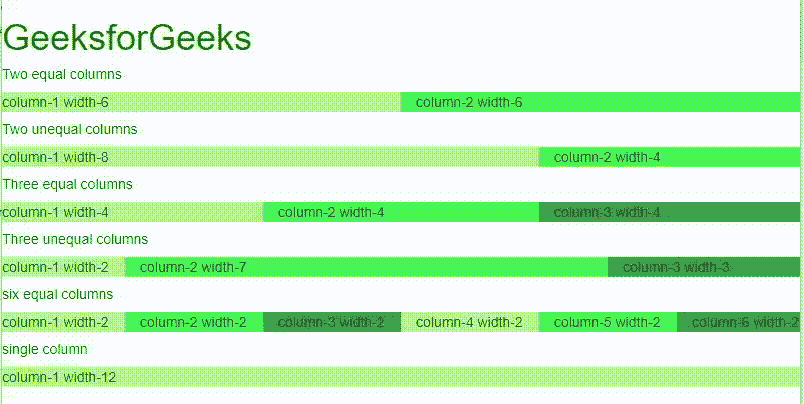

# 在 Bootstrap

中解释基本的网格结构

> 原文:[https://www . geesforgeks . org/explain-the-basic-grid-structure-in-bootstrap/](https://www.geeksforgeeks.org/explain-the-basic-grid-structure-in-bootstrap/)

**Bootstrap grid** 是由 [Flexbox](https://www.geeksforgeeks.org/css-flexbox-and-its-properties/) 组成的非常强大的工具，创建网站开发更容易。它完全响应，还可以根据设备宽度调整容器中的物品。**班级。需要容器**通过包装网格的所有元素来使网格正常工作。引导网格中有 12 列，虽然没有必要使用所有的列，但是总和不能超过 12。它们也可以根据喜好合并成更宽的列。

根据设备或浏览器的宽度，引导网格系统具有以下类别。

<figure class="table">浏览器宽度等于或大于 576px 的设备

| kind | Equipment size |  |
| --- | --- | --- |
| **栏** | Device with browser width less than 576px | For small devices |
| T25【col-sm】 | For small devices |
| **col-MD** | A device with a browser width equal to or greater than 768px. | For medium-sized equipment |
| **col-LG** | A device with a screen width equal to or greater than 992px. | For large equipment |
| **col-XL** | Equipment with screen width equal to or greater than 1200px | For very large equipment |

</figure>

*sm、md、lg* 和 *xl* 分别表示器件尺寸，即小型、中型、大型和超大型。

**对于 3 个等宽的等列，即 4 个横跨网页–**

```html
<div class="container">
 <div class="row">
     <div class="col-sm-4">Col-1 width-4</div>
     <div class="col-sm-4">Col-2 width-4</div>
     <div class="col-sm-4">Col-3 width-4</div>
 </div>
</div>
```

**输出:**


**对于网页上宽度不等的 3 列–**

```html
<div class="container">
    <div class="row">
          <div class="col-sm-4">Col-1 width-4</div>
          <div class="col-sm-6">Col-2 width-6</div>
         <div class="col-sm-2">Col-3 width-2</div>
    </div>
</div>
```

**输出:**


**示例:**以下示例描述了各种列大小的 Bootstrap 的网格结构。

## 超文本标记语言

```html
<!DOCTYPE html>
<html>

<head>
    <link rel="stylesheet" href=
"https://maxcdn.bootstrapcdn.com/bootstrap/3.4.1/css/bootstrap.min.css">
</head>

<body>
    <h1 style="color:green;">
        GeeksforGeeks
    </h1>

    <h5>Two equal columns</h5>

    <div class="row">
        <div class="col-sm-6" style=
            "background-color:rgb(173, 248, 164);">
            column-1 width-6
        </div>

        <div class="col-sm-6" style=
            "background-color:rgb(71, 240, 121);">
            column-2 width-6
        </div>
    </div>

    <h5>Two unequal columns</h5>

    <div class="row">
        <div class="col-sm-8" style=
            "background-color:rgb(173, 248, 164);">
            column-1 width-8
        </div>

        <div class="col-sm-4" style=
            "background-color:rgb(71, 240, 121);">
            column-2 width-4
        </div>
    </div>

    <h5>Three equal columns</h5>

    <div class="row">
        <div class="col-sm-4" style=
            "background-color:rgb(173, 248, 164);">
            column-1 width-4
        </div>

        <div class="col-sm-4" style=
            "background-color:rgb(71, 240, 121);">
            column-2 width-4
        </div>

        <div class="col-sm-4" style=
            "background-color:rgb(55, 165, 70);">
            column-3 width-4
        </div>
    </div>

    <h5>Three unequal columns</h5>

    <div class="row">
        <div class="col-sm-2" style=
            "background-color:rgb(173, 248, 164);">
            column-1 width-2
        </div>

        <div class="col-sm-7" style=
            "background-color:rgb(71, 240, 121);">
            column-2 width-7
        </div>

        <div class="col-sm-3" style=
            "background-color:rgb(55, 165, 70);">
            column-3 width-3
        </div>
    </div>

    <h5>six equal columns</h5>

    <div class="row">
        <div class="col-sm-2" style=
            "background-color:rgb(173, 248, 164);">
            column-1 width-2
        </div>

        <div class="col-sm-2" style=
            "background-color:rgb(71, 240, 121);">
            column-2 width-2
        </div>

        <div class="col-sm-2" style=
            "background-color:rgb(55, 165, 70);">
            column-3 width-2
        </div>

        <div class="col-sm-2" style=
            "background-color:rgb(173, 248, 164);">
            column-4 width-2
        </div>

        <div class="col-sm-2" style=
            "background-color:rgb(71, 240, 121);">
            column-5 width-2
        </div>

        <div class="col-sm-2" style=
            "background-color:rgb(55, 165, 70);">
            column-6 width-2
        </div>
    </div>

    <h5>single column</h5>

    <div class="row">
        <div class="col-sm-12" style=
            "background-color:rgb(173, 248, 164);">
            column-1 width-12
        </div>
    </div>
</body>

</html>
```

**输出:**

