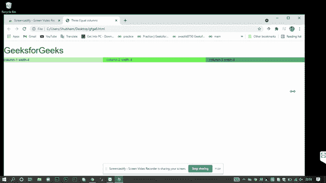

# 解释引导网格的基本结构

> 原文:[https://www . geesforgeks . org/explain-bootstrap-grid 的基本结构/](https://www.geeksforgeeks.org/explain-the-basic-structure-of-the-bootstrap-grid/)

**Bootstrap 网格**是一个非常强大的工具，让开发网站变得更加容易。它由 flexbox 制成，因此完全响应，并根据设备宽度调整容器中的项目。容器是一个包装元素，用于包装网页上的所有其他项目和内容。CSS 需要这个包装元素来使网格正常工作。那个。容器类是我们在代码中使用 bootstrap 时通常使用的类，因为它还提供了一些额外的选项，如将对齐设置为中心和水平填充内容。

引导网格中有 12 列，虽然没有必要使用所有的列，但是总和不能超过 12。它们也可以根据喜好合并成更宽的列。

**。排**和**。col** 类可用于分别创建和操作网格的行和列。

根据设备或浏览器的宽度，引导网格系统有以下**五个等级**–

*   **对于小型设备**
    *   **col:** 它的浏览器宽度小于 576px。
    *   **col-sm:** 浏览器宽度等于或大于 576px。
*   **对于中型设备**
    *   **col-md:** 浏览器宽度等于或大于 768px。
*   **对于大型和超大型设备**
    *   **col-lg:** 屏幕宽度等于或大于 992px。
    *   **col-xl:** 屏幕宽度等于或大于 1200 像素

**注:**此处 **sm** 、 **md** 、 **lg** 、 **xl** 表示器件尺寸，即小、中、大、超大。

**基本结构:**

```html
<div class="container">
    <div class="row">
        <div class="col-lg">
            column-1
        </div>

        <div class="col-lg">
            Column-2
        </div>
    </div>
</div>
```

这将创建 2 个等宽的居中对齐的列。类容器包装网格的所有行、列和内容。类行用于创建行，类 col-lg 表示设备宽度大。

**示例:**创建 3 个等宽的等列。

## 超文本标记语言

```html
<!DOCTYPE html>
<html>

<head>
    <title>Three Equal columns</title>

    <link rel="stylesheet" href=
"https://maxcdn.bootstrapcdn.com/bootstrap/3.4.1/css/bootstrap.min.css">
</head>

<body>
    <h1 style="color: green;">
        GeeksforGeeks
    </h1>

    <div class="container">
        <div class="row">
            <div class="col-sm-4" style=
                "background-color:rgb(185, 240, 178);">
                column-1 width-4
            </div>
            <div class="col-sm-4" style=
                "background-color:rgb(112, 243, 86);">
                column-2 width-4
            </div>
            <div class="col-sm-4" style=
                "background-color:rgb(51, 179, 89);">
                column-3 width-4
            </div>
        </div>
    </div>
</body>

</html>
```

**输出:**



正如您在输出中看到的，在整个网页上创建了 3 个等宽的列，列宽根据浏览器的宽度进行调整，使其具有响应性。