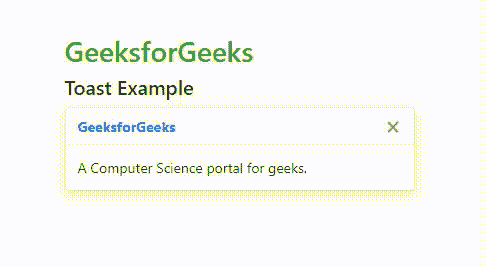

# 解释 Bootstrap 的组成部分

> 原文:[https://www . geeksforgeeks . org/explain-of-components-of-bootstrap/](https://www.geeksforgeeks.org/explain-the-components-of-bootstrap/)

Bootstrap 4 提供了各种可定制和可重用的组件，这使得开发更快、更容易。它们在很大程度上基于 ***基本修改器命名法*** ，即基类有许多组共享属性，而修改器类有一组单独的样式。例如，。btn 是一个*基类*和。BTN-主要或。btn-success 是一个*修改器类*。引导组件的范围从警报、按钮、徽章、卡片到各种其他组件。


**组件列表:**

1.  [](https://www.geeksforgeeks.org/bootstrap-4-jumbotron/)**:它只是通过使特定内容或信息变得更大、更醒目来额外关注它。**
2.  **[](https://www.geeksforgeeks.org/bootstrap-4-alerts/)**:这是一个带有预定义消息的弹出窗口，出现在特定操作之后。****
3.  ****[**按钮**](https://www.geeksforgeeks.org/bootstrap-4-buttons/) :是自定义按钮，用于在表单、对话框等中执行动作。它们有多种状态、大小和预定义的样式。****
4.  ****[**按钮组**](https://www.geeksforgeeks.org/bootstrap-4-button-groups/) :是一组排成一行的按钮，可以垂直排列，也可以水平排列。****
5.  ****[**徽章**](https://www.geeksforgeeks.org/bootstrap-4-badges/) :是用于添加附加信息的标注组件。****
6.  ****[**【进度条】**](https://www.geeksforgeeks.org/bootstrap-4-progress-bars/) :用于通过自定义进度条显示特定操作的进度。它们有文本标签、堆叠条和动画背景。****
7.  ****[**微调器**](https://www.geeksforgeeks.org/bootstrap-4-spinners/) :微调器显示网站或项目的加载状态。它们是用 HTML、CSS 构建的，不需要任何 JavaScript。****
8.  ****[**Scrollspy**](https://www.geeksforgeeks.org/bootstrap-4-scrollspy/) :根据视口中的滚动位置，不断更新导航栏到当前活动的链接。****
9.  ****[**列表组**](https://www.geeksforgeeks.org/bootstrap-4-list-groups/) :用于以适当的方式显示一系列无序的内容。****
10.  ****[**卡**](https://www.geeksforgeeks.org/bootstrap-4-cards/) :提供了可定制、可扩展、灵活的内容容器。****
11.  ****[**下拉菜单**](https://www.geeksforgeeks.org/bootstrap-4-dropdowns/) :用于以链接列表的形式下拉菜单，它们是上下文相关且可叠加的。****
12.  ****[**Navs**](https://www.geeksforgeeks.org/bootstrap-4-navs/) :用来创建一个带有. nav 基类的基本简单的导航菜单。****
13.  ****[**导航栏**](https://www.geeksforgeeks.org/bootstrap-4-navigation-bar/) :导航栏是网站或网页顶部的标题。****
14.  ****[**表单**](https://www.geeksforgeeks.org/bootstrap-4-forms/) :表单用于一次从用户处获取多个输入。Bootstrap 有两种布局，即堆叠布局和内嵌布局。****
15.  ****[**输入组**](https://www.geeksforgeeks.org/bootstrap-4-input-groups/) :它们通过在输入的两侧添加按钮、按钮组或文本来扩展表单控件。****
16.  ****[**【面包屑】**](https://www.geeksforgeeks.org/bootstrap-badges-and-breadcrumbs/) :它提供了当前页面在导航层次结构中的位置，还通过 CSS 添加了分隔符。****
17.  ****[**【旋转木马】**](https://www.geeksforgeeks.org/bootstrap-4-carousel/) :是用 CSS 3D 和 JavaScript 构建的图像或文本内容的幻灯片。****
18.  ****[**吐司**](https://www.geeksforgeeks.org/bootstrap-4-toast/) :显示消息的时间很短，几秒钟。它们是警报消息，旨在模仿桌面和移动系统中流行的推送通知。****
19.  ****[**工具提示**](https://www.geeksforgeeks.org/bootstrap-4-tooltip/) :鼠标悬停在元素上时，提供元素/链接的小信息。****
20.  ****[**Popovers**](https://www.geeksforgeeks.org/bootstrap-4-popover/) :点击时显示元素/链接的额外信息。****
21.  ****[**折叠**](https://www.geeksforgeeks.org/bootstrap-4-collapse/) :是一个用来显示或者隐藏内容的 JavaScript 插件。****
22.  ****[](https://www.geeksforgeeks.org/bootstrap-4-modal/)**:这是一个位于实际窗口上方的小弹窗。******
23.  ******[**分页**](https://www.geeksforgeeks.org/bootstrap-4-pagination/) :用于在不同页面之间轻松导航，使用一大块连接链接使其可访问。******
24.  ****[**媒体对象**](https://www.geeksforgeeks.org/bootstrap-4-media-objects/) **:** 媒体对象用于重复和复杂的组件，如推文或博客。图像或视频被放置/对齐到内容的左侧或右侧。****

******示例 1:** 在本例中，我们将使用列表中的几个组件。****

## ****超文本标记语言****

```html
**<!DOCTYPE html>
<html>
  <head>
    <title>Components of BootStrap 4</title>

    <meta charset="utf-8" />
    <meta name="viewport" content="width=device-width, initial-scale=1"/>

    <link rel="stylesheet" href=
"https://maxcdn.bootstrapcdn.com/bootstrap/4.3.1/css/bootstrap.min.css"/>

    <script src=
"https://ajax.googleapis.com/ajax/libs/jquery/3.3.1/jquery.min.js">
    </script>
    <script src=
"https://cdnjs.cloudflare.com/ajax/libs/popper.js/1.14.7/umd/popper.min.js">
    </script>
    <script src=
"https://maxcdn.bootstrapcdn.com/bootstrap/4.3.1/js/bootstrap.min.js">
    </script>
  </head>

  <!-- A nav code-->
  <br />
  <h3>Nav:</h3>
  <ul class="nav">
    <li class="nav-item">
      <a class="nav-link active"
             href="#">Active link</a>
    </li>
    <li class="nav-item">
      <a class="nav-link"
         href="#provide link url here">
         First link
      </a>
    </li>
    <li class="nav-item">
      <a class="nav-link"
         href="#provide link url here">
         second link
      </a>
    </li>
    <li class="nav-item">
      <a
        class="nav-link disabled"
        href="#provide link url here"
        tabindex="-1"
        aria-disabled="true"
        >Disabled</a>
    </li>
  </ul>

  <!-- A nav code-->

  <!-- A small alert code-->
  <h3>Alert:</h3>
  <div class="alert alert-info"
       role="alert">
       A simple alert!
  </div>

  <!-- A small alert code-->
  <h3>Modal:</h3>

  <!-- Button trigger modal-->
  <button
    type="button"
    class="btn btn-success"
    data-toggle="modal"
    data-target="#exampleModal">
    geeksforgeeks
  </button>

  <!-- Modal -->
  <div
    class="modal fade"
    id="exampleModal"
    tabindex="-1"
    aria-labelledby="exampleModalLabel"
    aria-hidden="true">
    <div class="modal-dialog">
      <div class="modal-content">
        <div class="modal-header">
          <h5 class="modal-title"
            id="exampleModalLabel">
            geeksforgeeks
          </h5>
          <button
            type="button"
            class="close"
            data-dismiss="modal"
            aria-label="Close">
            <span aria-hidden="true">×</span>
          </button>
        </div>
        <div class="modal-body">
          Hello, thanks for checking
          out geeksforgeeks!
        </div>
        <div class="modal-footer">
          <button type="button"
            class="btn btn-secondary"
            data-dismiss="modal">
            Close
          </button>
          <button type="button"
            class="btn btn-primary">
            Save
          </button>
        </div>
      </div>
    </div>
  </div>

  <!-- A button trigger modal-->
</html>**
```

******输出:******

********

******例 2:** 这个例子说明了 Bootstrap 冗屏的使用。****

## ****超文本标记语言****

```html
**<!DOCTYPE html>
<html lang="en">
  <head>
    <title>Bootstrap Example</title>
    <meta charset="utf-8" />
    <meta name="viewport" content=
          "width=device-width, initial-scale=1" />
    <link
      rel="stylesheet" href=
"https://maxcdn.bootstrapcdn.com/bootstrap/4.5.2/css/bootstrap.min.css" />
  </head>
  <body>
    <div class="container">
      <div class="jumbotron">
        <h1 class="text-center text-success">
          GeeksforGeeks
        </h1>

        <h3>Bootstrap Jumbotron Tutorial</h3>

<p>
          Bootstrap is a free and open-source
          tool collection for creating responsive
          websites and web applications. It is
          the most popular HTML, CSS, and
          JavaScript framework for developing
          responsive, mobile-first websites.
        </p>

      </div>
    </div>
  </body>
</html>**
```

******输出:******

****

自举大屏幕**** 

******示例 3:** 此示例说明了 Bootstrap 吐司的使用。****

## ****超文本标记语言****

```html
**<!DOCTYPE html>
<html lang="en">
  <head>
    <title>Bootstrap Toast Example</title>
    <meta charset="utf-8" />
    <meta name="viewport" content="width=device-width, initial-scale=1" />
    <link rel="stylesheet" href=
"https://maxcdn.bootstrapcdn.com/bootstrap/4.5.2/css/bootstrap.min.css" />
    <script src=
"https://ajax.googleapis.com/ajax/libs/jquery/3.5.1/jquery.min.js">
    </script>
    <script src=
"https://cdnjs.cloudflare.com/ajax/libs/popper.js/1.16.0/umd/popper.min.js">
    </script>
    <script src=
"https://maxcdn.bootstrapcdn.com/bootstrap/4.5.2/js/bootstrap.min.js">
    </script>
  </head>

  <body>
    <div class="container">
      <h3 class="text-success">GeeksforGeeks</h3>
      <h5>Toast Example</h5>
      <div class="toast" data-autohide="false">
        <div class="toast-header">
          <strong class="mr-auto text-primary">
            GeeksforGeeks
          </strong>
          <button type="button"
              class="ml-2 mb-1 close"
              data-dismiss="toast">
            ×
          </button>
        </div>
        <div class="toast-body">
          A Computer Science portal for geeks.
        </div>
      </div>
    </div>

    <script>
      $(document).ready(function () {
        $(".toast").toast("show");
      });
    </script>
  </body>
</html>**
```

******输出**:****

****

自举吐司****