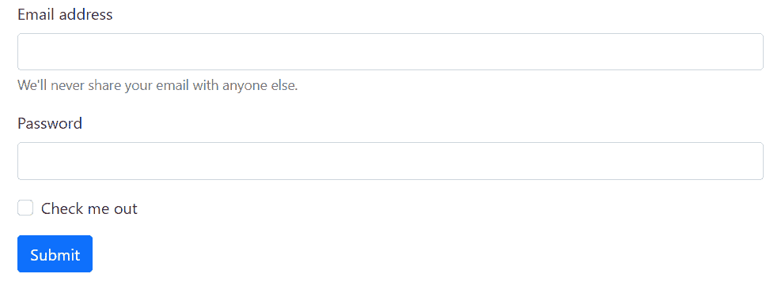

# 解释使用 Bootstrap

创建基本或垂直表单的步骤

> 原文:[https://www . geeksforgeeks . org/解释使用引导程序创建基本或垂直表单的步骤/](https://www.geeksforgeeks.org/explain-the-steps-for-creating-basic-or-vertical-forms-using-bootstrap/)

Bootstrap 是一个开源的 CSS 框架，用于构建响应性网站。它有 HTML，CSS，JS 框架来开发用户友好和响应迅速的网站。截至 2021 年 8 月，Bootstrap 是 Github 上第十大最具明星效应的项目。网站提供了现成的模板和输出，这样我们就可以根据需要选择模板。这个开源是由马克·奥托和雅各布·桑顿开创的，最初被称为推特蓝图。因此，bootstrap 使 web 开发人员的生活变得容易，因为所有主要的 bootstrap 集合都准备好使用基本模板。

**Bootstrap 中的表单:**表单是每个网站最需要的模板和不可分割的一部分，用于注册、登录、反馈等。因此，bootstrap 中表单模板的可用性使得它变得容易，我们可以直接使用 bootstrap 中的表单模板。两个最新版本的 bootstrap 都包含表单模板。两个版本之间的主要区别是 bootstrap 5 有专用的表单部分，而在版本 4 中，表单包含在组件部分。因此强烈建议使用版本 5。

**示例 1:** 在本例中，我们将看到如何使用 [Bootstrap 4](https://www.geeksforgeeks.org/bootstrap-4-introduction/) 创建垂直表单。

**步骤 1:** 在代码中包含以下 CDN 链接，以便使用 Bootstrap 4。

> <链接 href = " https://cdn . jsdelivr . net/NPM/bootstrap @ 5 . 1 . 1/dist/CSS/bootstrap . min . CSS " rel = " style sheet "完整性= " sha 384-F3 w7 MX 95 pdgytmzmecchangqb83 dfgtwi 0 imjiwavhan 4 fjkjbyhzmi 3 ahiu " cross origin = " anonymous ">
> 
> <src = " https://cdn . jsdelivr . net/NPM/bootstrap @ 5 . 1 . 1/dist/js/bootstrap . bundle . min . js " integrity =
> sha 384/bq dsth/da 6 PKI 1 MST/rwkfnjcp 5 gbsy 4 sebbt 38 q/9 rbh 9 ah 40 zeog 7 hlz " cross origin = " anonymous "]t

**第 2 步:**现在我们将使用 bootstrap 4 表单，在 body 标签内的表单中输入我们想要的字段。

## index.html

```html
<!doctype html>
<html lang="en">
   <head>
      <!-- Required meta tags -->
      <meta charset="utf-8">
      <meta name="viewport" content="width=device-width, initial-scale=1">
      <!-- Bootstrap CSS -->
      <link href=
 "https://cdn.jsdelivr.net/npm/bootstrap@5.1.1/dist/css/bootstrap.min.css"
         rel="stylesheet" 
         integrity=
 "sha384-F3w7mX95PdgyTmZZMECAngseQB83DfGTowi0iMjiWaeVhAn4FJkqJByhZMI3AhiU" 
         crossorigin="anonymous">
      <!-- Optional JavaScript; choose one of the two! -->
      <!-- Option 1: Bootstrap Bundle with Popper -->
      <script src=
 "https://cdn.jsdelivr.net/npm/bootstrap@5.1.1/dist/js/bootstrap.bundle.min.js" 
         integrity=
 "sha384-/bQdsTh/da6pkI1MST/rWKFNjaCP5gBSY4sEBT38Q/9RBh9AH40zEOg7Hlq2THRZ" 
         crossorigin="anonymous"></script>
      <!-- Option 2: Separate Popper and Bootstrap JS -->
      <script src=
 "https://cdn.jsdelivr.net/npm/@popperjs/core@2.9.3/dist/umd/popper.min.js" 
         integrity=
 "sha384-W8fXfP3gkOKtndU4JGtKDvXbO53Wy8SZCQHczT5FMiiqmQfUpWbYdTil/SxwZgAN"
         crossorigin="anonymous"></script>
      <script src=
 "https://cdn.jsdelivr.net/npm/bootstrap@5.1.1/dist/js/bootstrap.min.js" 
         integrity=
 "sha384-skAcpIdS7UcVUC05LJ9Dxay8AXcDYfBJqt1CJ85S/CFujBsIzCIv+l9liuYLaMQ/" 
         crossorigin="anonymous"></script>
      <title>gfg</title>
   </head>
   <body>
      <!-- code for the form-->
      <form>
         <div class="form-group">
            <label for="exampleInputEmail1">Email address</label>
            <input type="email" 
                   class="form-control" 
                   id="exampleInputEmail1" 
                   aria-describedby="emailHelp">
            <small id="emailHelp" class="form-text text-muted">
            We'll never share your email with anyone else.</small>
         </div>
         <div class="form-group">
            <label for="exampleInputPassword1">
              Password
           </label>
            <input type="password" 
                   class="form-control" 
                   id="exampleInputPassword1">
         </div>
         <div class="form-group form-check">
            <input type="checkbox" 
                   class="form-check-input"
                   id="exampleCheck1">
            <label class="form-check-label" for="exampleCheck1">
              Check me out
           </label>
         </div>
         <button type="submit" class="btn btn-primary">Submit</button>
      </form>
   </body>
</html>
```

**输出:**



输出格式

**示例 2:** 在此示例中，生成了类似的形式，或者可以在输出中看到类似于自举 4 的形式，但是某些步骤会有所不同。现在我们将使用[自举 5](https://www.geeksforgeeks.org/bootstrap-5-introduction/) 。表单可以输入电子邮件和密码，还可以看到提交按钮。我们将从 starter 模板开始，将表单代码放入 body 标签中，可以看到输出。

## index.html

```html
<!doctype html>
<html lang="en">
   <head>
      <!-- Required meta tags -->
      <meta charset="utf-8">
      <meta name="viewport" content="width=device-width, initial-scale=1">
      <!-- Bootstrap CSS -->
      <link href=
"https://cdn.jsdelivr.net/npm/bootstrap@5.0.2/dist/css/bootstrap.min.css" 
         rel="stylesheet" 
         integrity=
"sha384-EVSTQN3/azprG1Anm3QDgpJLIm9Nao0Yz1ztcQTwFspd3yD65VohhpuuCOmLASjC"
         crossorigin="anonymous">
      <!-- Optional JavaScript; choose one of the two! -->
      <!-- Option 1: Bootstrap Bundle with Popper -->
      <script src=
"https://cdn.jsdelivr.net/npm/bootstrap@5.0.2/dist/js/bootstrap.bundle.min.js"
         integrity=
"sha384-MrcW6ZMFYlzcLA8Nl+NtUVF0sA7MsXsP1UyJoMp4YLEuNSfAP+JcXn/tWtIaxVXM" 
         crossorigin="anonymous"></script>
      <!-- Option 2: Separate Popper and Bootstrap JS -->
      <script src=
"https://cdn.jsdelivr.net/npm/@popperjs/core@2.9.2/dist/umd/popper.min.js" 
         integrity=
"sha384-IQsoLXl5PILFhosVNubq5LC7Qb9DXgDA9i+tQ8Zj3iwWAwPtgFTxbJ8NT4GN1R8p" 
         crossorigin="anonymous"></script>
      <script src=
"https://cdn.jsdelivr.net/npm/bootstrap@5.0.2/dist/js/bootstrap.min.js" 
         integrity=
"sha384-cVKIPhGWiC2Al4u+LWgxfKTRIcfu0JTxR+EQDz/bgldoEyl4H0zUF0QKbrJ0EcQF" 
         crossorigin="anonymous"></script>
      <title>gfg</title>
   </head>
   <body>
      <!--code for the form-->
      <form>
         <div class="mb-3">
            <label for="exampleInputEmail1" class="form-label">
              Email address
           </label>
            <input type="email"
                   class="form-control"
                   id="exampleInputEmail1" 
                   aria-describedby="emailHelp">
            <div id="emailHelp" class="form-text">
               We'll never share your email with anyone else.
            </div>
         </div>
         <div class="mb-3">
            <label for="exampleInputPassword1" class="form-label">
              Password
           </label>
           <input type="password" 
                  class="form-control" 
                  id="exampleInputPassword1">
         </div>
         <div class="mb-3 form-check">
            <input type="checkbox" 
                   class="form-check-input" 
                   id="exampleCheck1">
            <label class="form-check-label" for="exampleCheck1">
              Check me out
           </label>
         </div>
         <button type="submit" class="btn btn-primary">Submit</button>
      </form>
   </body>
</html>
```

**输出:**

