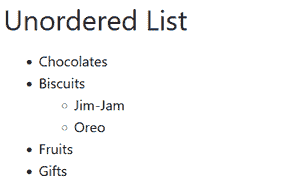
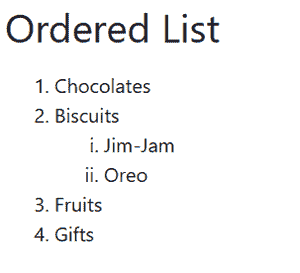
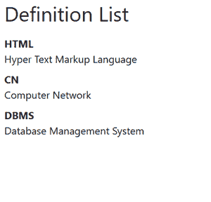

# 解释 Bootstrap 支持的列表类型

> 原文:[https://www . geesforgeks . org/explain-bootstrap 支持的列表类型/](https://www.geeksforgeeks.org/explain-the-types-of-lists-supported-by-bootstrap/)

列表是一种信息记录，使使用项目符号查找项目变得容易。

**Bootstrap 支持的列表有 3 种类型，分别是:**

*   **无序列表:**在无序列表中，项目用项目符号标记。
*   **有序列表:**在有序列表中，项目用数字项目符号标记，如 1、2、I、ii 等。
*   **定义列表:**在定义列表中，项目通过其描述进行定义。

让我们看看上面列表的实现。

**示例 1:** 在本例中，我们将使用无序列表。在无序列表中，项目用项目符号标记。使用< ul >标签创建无序列表，然后使用< li >标签列出项目。

## 超文本标记语言

```html
<!DOCTYPE html>
<html lang="en">

<head>
    <meta charset="utf-8">
    <meta name="viewport" content=
        "width=device-width, initial-scale=1">

    <title>Bootstrap 4 Unstyled List</title>

    <link rel="stylesheet" href=
"https://cdn.jsdelivr.net/npm/bootstrap@4.6.0/dist/css/bootstrap.min.css">
    <script src="https://code.jquery.com/jquery-3.5.1.min.js">
    </script>
    <script src=
"https://cdn.jsdelivr.net/npm/bootstrap@4.6.0/dist/js/bootstrap.bundle.min.js">
    </script>
</head>

<body>
    <h2 class="mb-3">Unordered List</h2>
    <ul>
        <li>Chocolates</li>
        <li>Biscuits</li>
        <ul>
            <li>Jim-Jam</li>
            <li>Oreo</li>
        </ul>
        <li>Fruits</li>
        <li>Gifts</li>
    </ul>
</body>

</html>
```

**输出:**



**说明:**在上面的例子中，创建了一个无序列表，并用项目符号来标记项目。黑色小圆圈项目(圆盘项目符号)为无序列表项目，圆圈项目为饼干项目。因此，我们也可以在列表中创建列表。

**示例 2:** 在本例中，我们将使用有序列表。在有序列表中，项目用数字项目符号标记，如 1、2、1、2。使用< ol >标签创建有序列表，列表项目以< li >标签开始。

## 超文本标记语言

```html
<!DOCTYPE html>
<html lang="en">

<head>
    <meta charset="utf-8">
    <meta name="viewport" content=
        "width=device-width, initial-scale=1">

    <title>Bootstrap 4 Unstyled List</title>

    <link rel="stylesheet" href=
"https://cdn.jsdelivr.net/npm/bootstrap@4.6.0/dist/css/bootstrap.min.css">
    <script src="https://code.jquery.com/jquery-3.5.1.min.js">
    </script>
    <script src=
"https://cdn.jsdelivr.net/npm/bootstrap@4.6.0/dist/js/bootstrap.bundle.min.js">
    </script>
</head>

<body>
    <h2 class="mb-3">Ordered List</h2>
    <ol>
        <li>Chocolates</li>
        <li>Biscuits</li>
        <ol type="i">
            <li>Jim-Jam</li>
            <li>Oreo</li>
        </ol>
        <li>Fruits</li>
        <li>Gifts</li>
    </ol>
</body>

</html>
```

**输出:**



**说明:**在上面的示例中，创建了有序列表，并使用数字项目符号标记项目。标有 1、2、3 的物品为订购单，标有 I、ii 的物品为饼干。因此，我们可以在列表中列出。

**例 3:** 在本例中，我们将使用用于对列表项进行具体描述的定义列表 is。在定义列表中，项目是用其描述来定义的。使用< dl >标签创建定义列表。

*   指定列表描述的标签。

*   定义描述细节的标签。

## 超文本标记语言

```html
<!DOCTYPE html>
<html lang="en">

<head>
    <meta charset="utf-8">
    <meta name="viewport" content=
        "width=device-width, initial-scale=1">

    <title>Bootstrap 4 Unstyled List</title>

    <link rel="stylesheet" href=
"https://cdn.jsdelivr.net/npm/bootstrap@4.6.0/dist/css/bootstrap.min.css">
    <script src="https://code.jquery.com/jquery-3.5.1.min.js">
    </script>
    <script src=
"https://cdn.jsdelivr.net/npm/bootstrap@4.6.0/dist/js/bootstrap.bundle.min.js">
    </script>
</head>

<body>
    <h2 class="mb-3">Definition List</h2>
    <dl>
        <dt>HTML</dt>
        <dd>Hyper Text Markup Language</dd>
        <dt>CN</dt>
        <dd>Computer Network</dd>
        <dt>DBMS</dt>
        <dd>Database Management System</dd>
    </dl>
</body>

</html>
```

**输出:**



**说明:**在上面的示例中，创建了定义列表，其中项目用其定义进行指定。这里，HTML 是一个项目，超文本标记语言是它的描述。