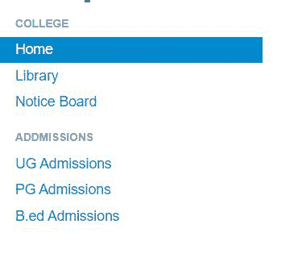
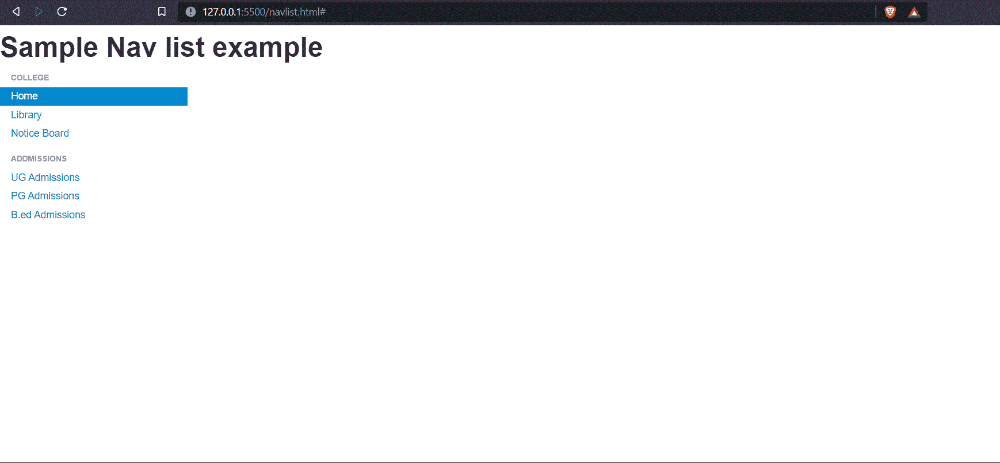

# 解释导航列表在引导

中的使用

> 原文:[https://www . geesforgeks . org/explain-of-nav-nav-list-in-bootstrap/](https://www.geeksforgeeks.org/explain-the-use-of-nav-nav-list-in-bootstrap/)

nav-list 类有助于在网页中创建 nav 列表以及可选的标题。它在引导数据库版本 2 中提供。在本文中，我们将了解导航列表类的工作原理，并了解如何使用 Bootstrap 中的“导航列表”类创建导航列表，并通过示例了解其实现。

简而言之，导航列表可以称为侧面导航栏，它使用标题分成几个部分。下面给出的是一个导航列表的例子，我们可以在许多网站上看到。



导航列表示例

上面的例子显示了一个 nav 列表，显示了我们可以在许多学院和大学网站上看到的不同页面的重要链接。

让我们看看如何通过使用引导框架和“导航列表”类来制作一个这样的导航列表。

**使用引导框架创建导航列表:**

**第一步:**从官方 [Bootstrap 网站下载 Bootstrap 框架。](https://getbootstrap.com/2.3.2/)

**步骤 2:** 使用下面给出的代码将引导 CSS 链接到 Html 文件:

> <link href="”/bootstrap/css/bootstrap.min.css”" rel="”stylesheet”" media="”screen”">

**注意:**引导文件夹和 Html 文件应该在同一个文件夹中。

**步骤 3:** 使用下面给出的命令将引导 JS 文件链接到 Html 文件:

```html
<script src="https://code.jquery.com/jquery.js"></script>
<script src="/bootstrap/js/bootstrap.min.js"></script>
```

**第 4 步:**现在，用类名“nav”和“nav-list”创建一个< ul > < /ul >标签。

**语法:**

```html
<ul class="nav nav-list"></ul>
```

**第 5 步:**在< ul >标签内，添加列表项< li >并为您想要提及的标题添加类名“导航标题”。下面给出了语法:

```html
<ul class="nav nav-list">
    <li class="nav-header">List header</li>
    <li class="active"><a href="#">Home</a></li>
    <li><a href="#">Library</a></li>
    <li><a href="#">Notice Board</a></li>
</ul>
```

**示例:**该示例描述了引导中导航列表类的使用。

## 超文本标记语言

```html
<!DOCTYPE html>
<html>

<head>
    <title>Bootstrap 101 Template</title>
    <meta name="viewport" 
          content="width=device-width, 
                   initial-scale=1.0">

    <!-- Bootstrap CSS -->
    <link href="/bootstrap/css/bootstrap.min.css" 
          rel="stylesheet" 
          media="screen">
    <style>
        .nav {
            width: 15vw;
        }
    </style>
</head>

<body>
    <h1>Nav list</h1>
    <ul class="nav nav-list">
        <li class="nav-header">College</li>
        <li class="active"><a href="#">Home</a></li>
        <li><a href="#">Library</a></li>
        <li><a href="#">Notice Board</a></li>
        <li class="nav-header">Addmissions</li>
        <li><a href="#">UG Admissions</a></li>
        <li><a href="#">PG Admissions</a></li>
        <li><a href="#">B.ed Admissions</a></li>
    </ul>

    <!-- Bootstrap JS -->
    <script src="https://code.jquery.com/jquery.js"></script>
    <script src="/bootstrap/js/bootstrap.min.js"></script>
</body>

</html>
```

**输出:**从输出中，我们可以看到包含项目列表的导航列表。*导航列表仅适用于 Bootstrap v2。*



引导导航列表

nav-list 类有助于按顺序排列项目，并为它们添加一些样式。导航列表组件在网站中非常有用，这些网站有很多不同的选项，不同的用户想要访问网站的不同部分。导航列表使用户非常容易导航到他们的特定页面。

**注:**

1.  ****“导航列表”类支持 Bootstrap v2** 。v3、v4 和 v5 *不支持里面的**导航列表类*。**
2.  **这里，在上面的代码示例中，我们已经通过提到“nav”类的宽度为其添加了 CSS 样式，如果我们没有提到宽度，那么默认情况下，nav-list 将采用全屏宽度。**