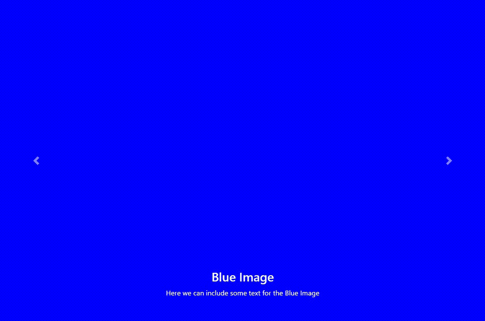

# 解释轮播插件在引导

中的使用

> 原文:[https://www . geesforgeks . org/explain-the-use-of-carousel-plugin-in-bootstrap/](https://www.geeksforgeeks.org/explain-the-uses-of-carousel-plugin-in-bootstrap/)

[Bootstrap](https://www.geeksforgeeks.org/bootstrap-tutorials/) 是一个免费的开源工具集合，用于创建响应性网站和网络应用程序。它是最流行的 HTML、CSS 和 JavaScript 框架，用于开发响应迅速、移动优先的网站。它解决了我们曾经遇到的许多问题，包括跨浏览器兼容性问题。

轮播是 bootstrap 的幻灯片显示组件，广泛用于幻灯片显示或循环浏览 HTML 文档的不同元素，尤其是图像容器或文本。

**bootstrap CDN 链接:**要了解 Bootstrap 轮播的用途，我们必须将 Bootstrap 和 jQuery CDN 库文件包含到 HTML 代码中。

> < 链接 rel="stylesheet" href="https://stackpath.bootstrapcdn.com/bootstrap/4.1.3/css/bootstrap.min.css" >
> 
> <脚本 src = " https://code . jquery . com/jquery-3 . 3 . 1 . slim . min . js "></脚本>
> 
> <src = " https://cdnjs . cloudflare . com/Ajax/libs/popper . js/1 . 14 . 3/UMD/popper . min . js "></script>
> 
> <脚本 src = " https://stack path . bootstrapcdn . com/bootstrap/4 . 1 . 3/js/bootstrap . min . js "></脚本>

**用途:**轮播插件的主要用途是实现一个滑块或一个图像幻灯片。包含图像的 HTML [分区](https://www.geeksforgeeks.org/div-tag-html/)也可以包含文本。在这一节中，我们将使用以下步骤，在 Bootstrap carousel 插件的帮助下制作一个图像幻灯片。

*   用类“旋转木马”创建一个 HTML div 元素。如果你想自动放映幻灯片，那么也可以添加一个“幻灯片”类。
*   给 div 元素赋予一个 id“carousel examples controls”来控制带有按钮的幻灯片显示。
*   添加“数据传输”属性作为触发 JavaScript 操作的“转盘”。
*   在 div 中创建另一个嵌套 div，类为“carousel-inner”。这个 div 将包含除了用于控制转盘的按钮之外的所有转盘元素。
*   在该分区内，创建另一个分区“转盘项目”。将“活动”类添加到默认轮播幻灯片中添加轮播幻灯片的图像和标题。根据需要添加任意数量的转盘项目。
*   在上一个和下一个幻灯片链接中分别添加“转盘-控制-上一个”和“转盘-控制-下一个”类。
*   为转盘的上一个和下一个图标添加“数据幻灯片”属性作为“上一个”和“下一个”。

**示例:**

## 超文本标记语言

```html
<!DOCTYPE html>
<html lang="en">

<head>
    <meta charset="UTF-8">
    <meta http-equiv="X-UA-Compatible" content="IE=edge">
    <meta name="viewport" content=
        "width=device-width, initial-scale=1.0">

    <!--Bootstrap CSS-->
    <link rel="stylesheet" href=
"https://stackpath.bootstrapcdn.com/bootstrap/4.1.3/css/bootstrap.min.css">

    <!--JQUERY, Proper.js and Bootstrap Javascript-->
    <script src="https://code.jquery.com/jquery-3.3.1.slim.min.js">
    </script>
    <script src=
"https://cdnjs.cloudflare.com/ajax/libs/popper.js/1.14.3/umd/popper.min.js">
    </script>
    <script src=
"https://stackpath.bootstrapcdn.com/bootstrap/4.1.3/js/bootstrap.min.js">
    </script>

    <style>
        img {
            display: block;
            width: 100%;
        }
    </style>
</head>

<body>
    <div class="container">
        <div id="carouselExampleControls" 
            class="carousel slide" 
            data-ride="carousel">

            <div class="carousel-inner">
                <div class="carousel-item active">
                    
                    <div class="carousel-caption">
                        <h3>Red Image</h3>

                        <p>
                            Here we can include some 
                            text for the Red Image
                        </p>
                    </div>
                </div>

                <div class="carousel-item">
                    
                    <div class="carousel-caption">
                        <h3>Blue Image</h3>

                        <p>
                            Here we can include some 
                            text for the Blue Image
                        </p>
                    </div>
                </div>

                <div class="carousel-item">
                    
                    <div class="carousel-caption">
                        <h3>Green Image</h3>

                        <p>
                            Here we can include some 
                            text for the Green Image
                        </p>
                    </div>
                </div>
            </div>

            <a class="carousel-control-prev" 
                href="#carouselExampleControls" 
                role="button" data-slide="prev">

                <span class="carousel-control-prev-icon"
                    aria-hidden="true">
                </span>
            </a>

            <a class="carousel-control-next" 
                href="#carouselExampleControls" 
                role="button" data-slide="next">

                <span class="carousel-control-next-icon"
                    aria-hidden="true">
                </span>
            </a>
        </div>
    </div>
</body>

</html>
```

**输出:**

