# bootstrap 中的 Flexbox 实用程序示例

> 原文:[https://www . geeksforgeeks . org/flexbox-utilities-in-bootstrap-with-examples/](https://www.geeksforgeeks.org/flexbox-utilities-in-bootstrap-with-examples/)

bootstrap 中的**柔性盒布局模块**用于设计柔性响应的布局结构。它用在引导程序 4 中。

*   ***d-flex*** 类用于创建一个简单的 flexbox 容器
    **语法:**

```html
<div class="d-flex p-2"></div>
```

*   ***d-inline-flex*** 类用于创建一个 inline flexbox 容器
    **语法:**

```html
<div class="d-inline-flex p-2"></div>
```

*   ***。*** **和** ***。d-inline-flex*** 可以用于所有断点(sm、md、lg、xl)等。d-sm-flex，。d-sm-inline-flex 等。
    **语法:**

```html
<div class="d-sm-flex p-2"></div>

<div class="d-sm-inline-flex p-2"></div>
```

**例 1:**

## 超文本标记语言

```html
<!DOCTYPE html>
<html lang="en">

<head>
    <meta charset="utf-8">
    <meta name="viewport"
          content="width=device-width, initial-scale=1, shrink-to-fit=no">
    <link rel="stylesheet"
          href="https://stackpath.bootstrapcdn.com/bootstrap/4.2.1/css/bootstrap.min.css">
    <title>GeeksForGeeks Bootstrap Example</title>
</head>

<body>

    <div class="container mt-3">
        <h2>Flex</h2>
        <div class="d-flex p-3 bg-success text-white">
            <div class="p-2 bg-success">Geeks 1</div>
            <div class="p-2 bg-success ">Geeks 2</div>
            <div class="p-2 bg-success">Geeks 3</div>
        </div>
    </div>
    <script src="https://code.jquery.com/jquery-3.3.1.slim.min.js"></script>
    <script src="https://cdnjs.cloudflare.com/ajax/libs/popper.js/1.14.6/umd/popper.min.js"></script>
    <script src="https://stackpath.bootstrapcdn.com/bootstrap/4.2.1/js/bootstrap.min.js"></script>

</body>

</html>
```

**输出:**

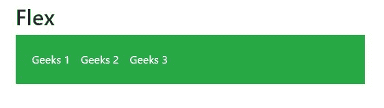

**例 2:**

## 超文本标记语言

```html
<!DOCTYPE html>
<html lang="en">

<head>
    <meta charset="utf-8">
    <meta name="viewport"
          content="width=device-width, initial-scale=1, shrink-to-fit=no">
    <link rel="stylesheet"
          href="https://stackpath.bootstrapcdn.com/bootstrap/4.2.1/css/bootstrap.min.css">
    <title>GeeksForGeeks Bootstrap Example</title>
</head>

<body>

    <div class="container mt-3">
        <h2>Inline Flex</h2>
        <div class="d-inline-flex p-3 bg-success text-white">
            <div class="p-2 bg-success">Geeks 1</div>
            <div class="p-2 bg-success ">Geeks 2</div>
            <div class="p-2 bg-success">Geeks 3</div>
        </div>
    </div>
    <script src="https://code.jquery.com/jquery-3.3.1.slim.min.js"></script>
    <script src="https://cdnjs.cloudflare.com/ajax/libs/popper.js/1.14.6/umd/popper.min.js"></script>
    <script src="https://stackpath.bootstrapcdn.com/bootstrap/4.2.1/js/bootstrap.min.js"></script>

</body>

</html>
```

**输出:**

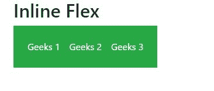

**挠性箱的水平和垂直方向:**

柔性物品的方向可以定位在柔性容器中。

*   要设置水平方向(浏览器默认)，请使用*。伸缩排*。
    **语法:**

```html
<div class="d-flex flex-row"></div>
```

*   使用*从对面开始水平方向。弯曲-行-反向*。
    **语法:**

```html
<div class="d-flex flex-row-reverse"></div>
```

*   使用*设定垂直方向。伸缩柱*。
    **语法:**

```html
<div class="d-flex flex-column"></div>
```

*   使用*从对面开始垂直方向。柔性柱-反向*。
    **语法:**

```html
<div class="d-flex flex-column-reverse"></div>
```

*   Flex-direction 可以用于所有断点(sm、md、lg、xl)等。flex-sm-row、flex-sm-row-reverse 等。
    **语法:**

```html
<div class="d-flex flex-column-reverse"></div>

<div class="d-flex flex-column"></div>
```

**例 3:**

## 超文本标记语言

```html
<!DOCTYPE html>
<html lang="en">

<head>
    <meta charset="utf-8">
    <meta name="viewport"
          content="width=device-width, initial-scale=1, shrink-to-fit=no">
    <link rel="stylesheet"
          href="https://stackpath.bootstrapcdn.com/bootstrap/4.2.1/css/bootstrap.min.css">
    <title>GeeksForGeeks Bootstrap Example</title>
</head>

<body>

    <div class="container mt-3">
        <h2>Horizontal Direction Flex</h2>
        <br>
        <div class="d-flex flex-row bg-success mb-3 text-white">
            <div class="p-2 bg-success">Geeks 1</div>
            <div class="p-2 bg-success ">Geeks 2</div>
            <div class="p-2 bg-success">Geeks 3</div>
        </div>
        <br>
        <div class="d-flex flex-row-reverse bg-success text-white">
            <div class="p-2 bg-success">Geeks 1</div>
            <div class="p-2 bg-success">Geeks 2</div>
            <div class="p-2 bg-success">Geeks 3</div>
        </div>
    </div>
    <script src="https://code.jquery.com/jquery-3.3.1.slim.min.js"></script>
    <script src="https://cdnjs.cloudflare.com/ajax/libs/popper.js/1.14.6/umd/popper.min.js"></script>
    <script src="https://stackpath.bootstrapcdn.com/bootstrap/4.2.1/js/bootstrap.min.js"></script>

</body>

</html>
```

**输出:**

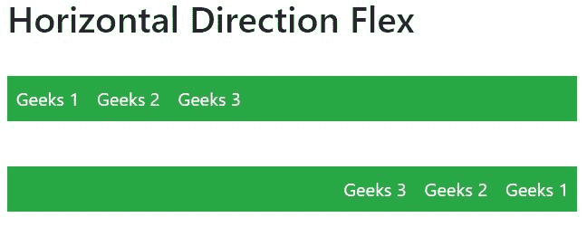

**例 4:**

## 超文本标记语言

```html
<!DOCTYPE html>
<html lang="en">

<head>
    <meta charset="utf-8">
    <meta name="viewport"
          content="width=device-width, initial-scale=1, shrink-to-fit=no">
    <link rel="stylesheet"
          href="https://stackpath.bootstrapcdn.com/bootstrap/4.2.1/css/bootstrap.min.css">
    <title>GeeksForGeeks Bootstrap Example</title>
</head>

<body>

    <div class="container mt-3">
        <h2>Vertical Direction Flex</h2>
        <br>
        <div class="d-flex flex-column bg-success mb-3 text-white">
            <div class="p-2 bg-success">Geeks 1</div>
            <div class="p-2 bg-success ">Geeks 2</div>
            <div class="p-2 bg-success">Geeks 3</div>
        </div>
        <br>
        <div class="d-flex flex-column-reverse bg-success text-white">
            <div class="p-2 bg-success">Geeks 1</div>
            <div class="p-2 bg-success">Geeks 2</div>
            <div class="p-2 bg-success">Geeks 3</div>
        </div>
    </div>
    <script src="https://code.jquery.com/jquery-3.3.1.slim.min.js"></script>
    <script src="https://cdnjs.cloudflare.com/ajax/libs/popper.js/1.14.6/umd/popper.min.js"></script>
    <script src="https://stackpath.bootstrapcdn.com/bootstrap/4.2.1/js/bootstrap.min.js"></script>

</body>

</html>
```

**输出:**

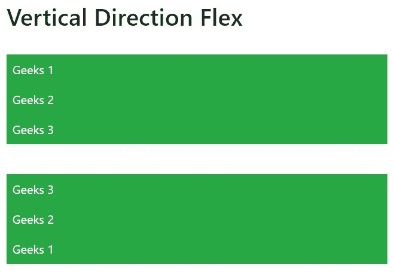

**调整内容:**

要改变伸缩项的对齐方式，可以使用*。证明-内容-** 类。
*可以是其中任意一个*的起点(默认)、终点、中心、中间或周围*。
类似的调整内容可以用于所有断点(sm、md、lg、xl)等。证明-内容-sm-开始，。证明-内容-sm-end 等。

*   **语法:**

```html
<div class="d-flex justify-content-start"></div>
```

**例 5:**

## 超文本标记语言

```html
<!DOCTYPE html>
<html lang="en">

<head>
    <meta charset="utf-8">
    <meta name="viewport"
          content="width=device-width, initial-scale=1, shrink-to-fit=no">
    <link rel="stylesheet"
          href="https://stackpath.bootstrapcdn.com/bootstrap/4.2.1/css/bootstrap.min.css">
    <title>GeeksForGeeks Bootstrap Example</title>
</head>

<body>

    <div class="container mt-3">
        <h2>Justify Content</h2>
        <br>
        <div class="d-flex justify-content-start bg-success mb-3 text-white">
            <div class="p-2 bg-success">Geeks 1</div>
            <div class="p-2 bg-success ">Geeks 2</div>
            <div class="p-2 bg-success">Geeks 3</div>
        </div>
        <div class="d-flex justify-content-end bg-success text-white">
            <div class="p-2 bg-success">Geeks 1</div>
            <div class="p-2 bg-success">Geeks 2</div>
            <div class="p-2 bg-success">Geeks 3</div>
        </div>
        <br>
        <div class="d-flex justify-content-center bg-success text-white">
            <div class="p-2 bg-success">Geeks 1</div>
            <div class="p-2 bg-success">Geeks 2</div>
            <div class="p-2 bg-success">Geeks 3</div>
        </div>
        <br>
        <div class="d-flex justify-content-between bg-success text-white">
            <div class="p-2 bg-success">Geeks 1</div>
            <div class="p-2 bg-success">Geeks 2</div>
            <div class="p-2 bg-success">Geeks 3</div>
        </div>
        <br>
        <div class="d-flex justify-content-around bg-success text-white">
            <div class="p-2 bg-success">Geeks 1</div>
            <div class="p-2 bg-success">Geeks 2</div>
            <div class="p-2 bg-success">Geeks 3</div>
        </div>
    </div>
    <script src="https://code.jquery.com/jquery-3.3.1.slim.min.js"></script>
    <script src="https://cdnjs.cloudflare.com/ajax/libs/popper.js/1.14.6/umd/popper.min.js"></script>
    <script src="https://stackpath.bootstrapcdn.com/bootstrap/4.2.1/js/bootstrap.min.js"></script>

</body>

</html>
```

**输出:**

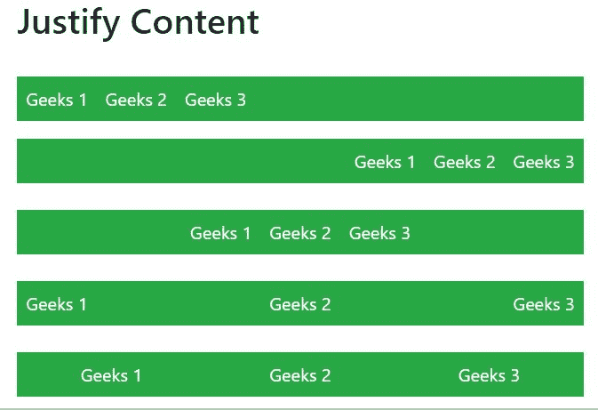

**填充柔性物品的宽度:**

使用*可以将伸缩项强制成相等的宽度。柔性填充*类。
。flex-fill 可以用于所有断点(sm、md、lg、xl)。flex-sm-fill 等。

*   **语法:**

```html
<div class="p-2 flex-fill"></div>
```

**例 6:**

## 超文本标记语言

```html
<!DOCTYPE html>
<html lang="en">

<head>
    <meta charset="utf-8">
    <meta name="viewport"
          content="width=device-width, initial-scale=1, shrink-to-fit=no">
    <link rel="stylesheet"
          href="https://stackpath.bootstrapcdn.com/bootstrap/4.2.1/css/bootstrap.min.css">
    <title>GeeksForGeeks Bootstrap Example</title>
</head>

<body>
    <div class="container mt-3">
        <h2>Fill / Equal Widths</h2>

<p>Use .flex-fill on flex items to force them into equal widths:</p>

        <div class="d-flex bg-success mb-3 text-white">
            <div class="p-2 flex-fill bg-success">Geeks 1</div>
            <div class="p-2 flex-fill bg-success">Geeks 2</div>
            <div class="p-2 flex-fill bg-success">Geeks 3</div>
        </div>

<p>Example without .flex-fill:</p>

        <div class="d-flex bg-success mb-3 text-white">
            <div class="p-2 bg-success">Geeks 1</div>
            <div class="p-2 bg-success">Geeks 2</div>
            <div class="p-2 bg-success">Geeks 3</div>
        </div>
    </div>
    <script src="https://code.jquery.com/jquery-3.3.1.slim.min.js"></script>
    <script src="https://cdnjs.cloudflare.com/ajax/libs/popper.js/1.14.6/umd/popper.min.js"></script>
    <script src="https://stackpath.bootstrapcdn.com/bootstrap/4.2.1/js/bootstrap.min.js"></script>

</body>

</html>
```

**输出:**

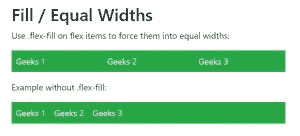

**顺序:**

*。order* 类用于更改弹性项的可视化顺序。
订购数量从 0 到 12。
0 优先级最高。
。order 可以用于所有断点(sm、md、lg、xl)等。订单-sm-0 至。订单-sm-12 等。

*   **语法:**

```html
<div class="p-2 order-4"></div>
```

**例 7:**

## 超文本标记语言

```html
<!DOCTYPE html>
<html lang="en">

<head>
    <meta charset="utf-8">
    <meta name="viewport"
          content="width=device-width, initial-scale=1, shrink-to-fit=no">
    <link rel="stylesheet"
          href="https://stackpath.bootstrapcdn.com/bootstrap/4.2.1/css/bootstrap.min.css">
    <title>GeeksForGeeks Bootstrap Example</title>
</head>

<body>
    <div class="container mt-3">
        <h2>Order</h2>
        <div class="d-flex  mb-3 text-white">
            <div class="p-2 order-3 bg-success">Geeks 1</div>
            <div class="p-2 order-2 bg-success">Geeks 2</div>
            <div class="p-2 order-1 bg-success">Geeks 3</div>
        </div>
    </div>
    <script src="https://code.jquery.com/jquery-3.3.1.slim.min.js"></script>
    <script src="https://cdnjs.cloudflare.com/ajax/libs/popper.js/1.14.6/umd/popper.min.js"></script>
    <script src="https://stackpath.bootstrapcdn.com/bootstrap/4.2.1/js/bootstrap.min.js"></script>

</body>

</html>
```

**输出:**

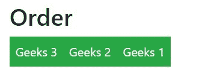

**利润自动化:**

*   *。mr-auto* 用于向右推送物品。
*   *。ml-auto* 用于向左推送项目
*   **语法:**

```html
<div class="p-2 mr-auto"></div>
```

。
**例 8:**

## 超文本标记语言

```html
<!DOCTYPE html>
<html lang="en">

<head>
    <meta charset="utf-8">
    <meta name="viewport"
          content="width=device-width, initial-scale=1, shrink-to-fit=no">
    <link rel="stylesheet"
          href="https://stackpath.bootstrapcdn.com/bootstrap/4.2.1/css/bootstrap.min.css">
    <title>GeeksForGeeks Bootstrap Example</title>
</head>

<body>
    <div class="container mt-3">
        <h2>Auto Margins</h2>
        <div class="d-flex  mb-3  bg-success text-white">
            <div class="p-2 mr-auto bg-success">Geeks 1</div>
            <div class="p-2  bg-success">Geeks 2</div>
            <div class="p-2  bg-success">Geeks 3</div>
        </div>
        <div class="d-flex  mb-3  bg-success text-white">
            <div class="p-2  bg-success">Geeks 1</div>
            <div class="p-2  bg-success">Geeks 2</div>
            <div class="p-2  ml-auto bg-success">Geeks 3</div>
        </div>
    </div>
    <script src="https://code.jquery.com/jquery-3.3.1.slim.min.js"></script>
    <script src="https://cdnjs.cloudflare.com/ajax/libs/popper.js/1.14.6/umd/popper.min.js"></script>
    <script src="https://stackpath.bootstrapcdn.com/bootstrap/4.2.1/js/bootstrap.min.js"></script>

</body>

</html>
```

**输出:**

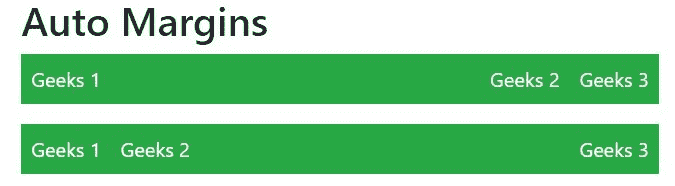

**柔性物品的包装:**

*。flex-nowrap(默认)，。软包和。柔性包装-翻转*用于将柔性物品包装在柔性容器中。
。flex-wrap 可以用于所有断点(sm、md、lg、xl)。flex-sm-nowrap。柔性缠绕等。

*   **语法:**

```html
<div class="p-2 border"></div>
```

**例 9:**

## 超文本标记语言

```html
<!DOCTYPE html>
<html lang="en">

<head>
    <meta charset="utf-8">
    <meta name="viewport"
          content="width=device-width, initial-scale=1, shrink-to-fit=no">
    <link rel="stylesheet"
          href="https://stackpath.bootstrapcdn.com/bootstrap/4.2.1/css/bootstrap.min.css">
    <title>GeeksForGeeks Bootstrap Example</title>
</head>

<body>
    <div class="container mt-3">
        <h2>Wrap</h2>

<p><code>.flex-wrap:</code></p>

        <div class="d-flex flex-wrap text-white bg-light">
            <div class="p-2 border bg-success">Geeks 1</div>
            <div class="p-2 border bg-success">Geeks 2</div>
            <div class="p-2 border bg-success">Geeks 3</div>
            <div class="p-2 border bg-success">Geeks 4</div>
            <div class="p-2 border bg-success">Geeks 5</div>
            <div class="p-2 border bg-success">Geeks 6</div>
            <div class="p-2 border bg-success">Geeks 7</div>
            <div class="p-2 border bg-success">Geeks 8</div>
            <div class="p-2 border bg-success">Geeks 9</div>
        </div>
        <br>

<p><code>.flex-wrap-reverse:</code></p>

        <div class="d-flex flex-wrap-reverse text-white bg-light">
            <div class="p-2 border bg-success">Geeks 1</div>
            <div class="p-2 border bg-success">Geeks 2</div>
            <div class="p-2 border bg-success">Geeks 3</div>
            <div class="p-2 border bg-success">Geeks 4</div>
            <div class="p-2 border bg-success">Geeks 5</div>
            <div class="p-2 border bg-success">Geeks 6</div>
            <div class="p-2 border bg-success">Geeks 7</div>
            <div class="p-2 border bg-success">Geeks 8</div>
            <div class="p-2 border bg-success">Geeks 9</div>
        </div>
        <br>

<p><code>.flex-nowrap:</code></p>

        <div class="d-flex flex-nowrap text-white bg-light">
            <div class="p-2 border bg-success">Geeks 1</div>
            <div class="p-2 border bg-success">Geeks 2</div>
            <div class="p-2 border bg-success">Geeks 3</div>
            <div class="p-2 border bg-success">Geeks 4</div>
            <div class="p-2 border bg-success">Geeks 5</div>
            <div class="p-2 border bg-success">Geeks 6</div>
            <div class="p-2 border bg-success">Geeks 7</div>
            <div class="p-2 border bg-success">Geeks 8</div>
            <div class="p-2 border bg-success">Geeks 9</div>
        </div>
        <br>
    </div>
    <script src="https://code.jquery.com/jquery-3.3.1.slim.min.js"></script>
    <script src="https://cdnjs.cloudflare.com/ajax/libs/popper.js/1.14.6/umd/popper.min.js"></script>
    <script src="https://stackpath.bootstrapcdn.com/bootstrap/4.2.1/js/bootstrap.min.js"></script>

</body>

</html>
```

**输出:**

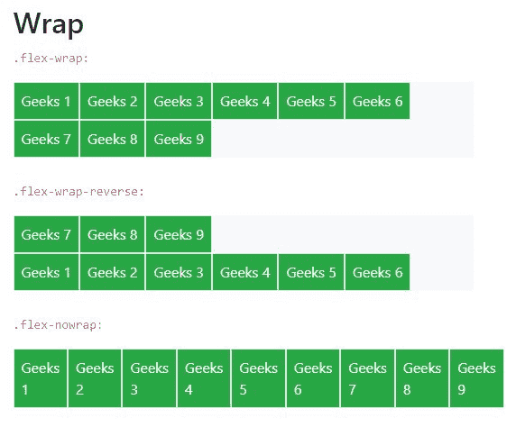

**对齐内容**

基本上，它用于伸缩项的垂直对齐。
*align-content* 可以通过多种方式实现。

*   。对齐-内容-开始

*   。对齐-内容-结束

*   。对齐-资源中心
*   。围绕内容对齐
*   。对齐-内容-拉伸
*   。对齐-内容-sm-开始
*   sm、md、lg、xl 也是如此
*   **语法:**

```html
<div class="p-2 align-content-start"></div>
```

**例 10:**

## 超文本标记语言

```html
<!DOCTYPE html>
<html lang="en">

<head>
    <meta charset="utf-8">
    <meta name="viewport"
          content="width=device-width, initial-scale=1, shrink-to-fit=no">
    <link rel="stylesheet"
          href="https://stackpath.bootstrapcdn.com/bootstrap/4.2.1/css/bootstrap.min.css">
    <title>GeeksForGeeks Bootstrap Example</title>
</head>

<body>
    <div class="container mt-3">
        <h2>Align Content</h2>

<p><code>.align-content-start (default):</code></p>

        <div class="d-flex flex-wrap align-content-start bg-light"
             style="height:100px">
            <div class="p-2 border bg-success">Geeks 1</div>
            <div class="p-2 border bg-success">Geeks 2</div>
            <div class="p-2 border bg-success">Geeks 3</div>
            <div class="p-2 border bg-success">Geeks 4</div>
            <div class="p-2 border bg-success">Geeks 5</div>
            <div class="p-2 border bg-success">Geeks 6</div>
            <div class="p-2 border bg-success">Geeks 7</div>
            <div class="p-2 border bg-success">Geeks 8</div>
            <div class="p-2 border bg-success">Geeks 9</div>
        </div>

<p><code>.align-content-around:</code></p>

        <div class="d-flex flex-wrap align-content-around bg-light"
             style="height:100px">
            <div class="p-2 border bg-success">Geeks 1</div>
            <div class="p-2 border bg-success">Geeks 2</div>
            <div class="p-2 border bg-success">Geeks 3</div>
            <div class="p-2 border bg-success">Geeks 4</div>
            <div class="p-2 border bg-success">Geeks 5</div>
            <div class="p-2 border bg-success">Geeks 6</div>
            <div class="p-2 border bg-success">Geeks 7</div>
            <div class="p-2 border bg-success">Geeks 8</div>
            <div class="p-2 border bg-success">Geeks 9</div>
        </div>

<p><code>.align-content-stretch:</code></p>

        <div class="d-flex flex-wrap align-content-stretch bg-light"
             style="height:100px">
            <div class="p-2 border bg-success">Geeks 1</div>
            <div class="p-2 border bg-success">Geeks 2</div>
            <div class="p-2 border bg-success">Geeks 3</div>
            <div class="p-2 border bg-success">Geeks 4</div>
            <div class="p-2 border bg-success">Geeks 5</div>
            <div class="p-2 border bg-success">Geeks 6</div>
            <div class="p-2 border bg-success">Geeks 7</div>
            <div class="p-2 border bg-success">Geeks 8</div>
            <div class="p-2 border bg-success">Geeks 9</div>
        </div>
        <br>
    </div>
    <script src="https://code.jquery.com/jquery-3.3.1.slim.min.js"></script>
    <script src="https://cdnjs.cloudflare.com/ajax/libs/popper.js/1.14.6/umd/popper.min.js"></script>
    <script src="https://stackpath.bootstrapcdn.com/bootstrap/4.2.1/js/bootstrap.min.js"></script>

</body>

</html>
```

**输出:**

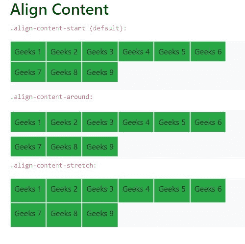

**对齐项目**

使用*对齐-项目*类来更改伸缩项目在横轴上的对齐。
*align-items* 可以通过多种方式实现。

*   。对齐-项目-开始

*   。对齐-项目-结束

*   。对齐-项目-居中
*   。对齐-项目-基线
*   。对齐-项目-拉伸
*   。对齐-项目-sm-开始
*   sm、md、lg、xl 也是如此
*   **语法:**

```html
<div class="p-2 align-items-start"></div>
```

**例 11:**

## 超文本标记语言

```html
<!DOCTYPE html>
<html lang="en">

<head>
    <meta charset="utf-8">
    <meta name="viewport" items="width=device-width, initial-scale=1, shrink-to-fit=no">
    <link rel="stylesheet" href="https://stackpath.bootstrapcdn.com/bootstrap/4.2.1/css/bootstrap.min.css">
    <title>GeeksForGeeks Bootstrap Example</title>
</head>

<body>
    <div class="container mt-3">
        <h2>Align items</h2>

<p><code>.align-items-start:</code></p>

        <div class="d-flex flex-wrap align-items-start bg-light" style="height:70px">
            <div class="p-2 border bg-success">Geeks 1</div>
            <div class="p-2 border bg-success">Geeks 2</div>
            <div class="p-2 border bg-success">Geeks 3</div>
        </div>

<p><code>.align-items-end:</code></p>

        <div class="d-flex flex-wrap align-items-end bg-light" style="height:70px">
            <div class="p-2 border bg-success">Geeks 1</div>
            <div class="p-2 border bg-success">Geeks 2</div>
            <div class="p-2 border bg-success">Geeks 3</div>
        </div>

<p><code>.align-items-center:</code></p>

        <div class="d-flex flex-wrap align-items-center bg-light" style="height:70px">
            <div class="p-2 border bg-success">Geeks 1</div>
            <div class="p-2 border bg-success">Geeks 2</div>
            <div class="p-2 border bg-success">Geeks 3</div>
        </div>

<p><code>.align-items-baseline:</code></p>

        <div class="d-flex flex-wrap align-items-around bg-light" style="height:70px">
            <div class="p-2 border bg-success">Geeks 1</div>
            <div class="p-2 border bg-success">Geeks 2</div>
            <div class="p-2 border bg-success">Geeks 3</div>
        </div>

<p><code>.align-items-stretch(default):</code></p>

        <div class="d-flex flex-wrap align-items-stretch bg-light" style="height:70px">
            <div class="p-2 border bg-success">Geeks 1</div>
            <div class="p-2 border bg-success">Geeks 2</div>
            <div class="p-2 border bg-success">Geeks 3</div>
        </div>
        <br>
    </div>
    <script src="https://code.jquery.com/jquery-3.3.1.slim.min.js"></script>
    <script src="https://cdnjs.cloudflare.com/ajax/libs/popper.js/1.14.6/umd/popper.min.js"></script>
    <script src="https://stackpath.bootstrapcdn.com/bootstrap/4.2.1/js/bootstrap.min.js"></script>

</body>

</html>
```

**输出:**

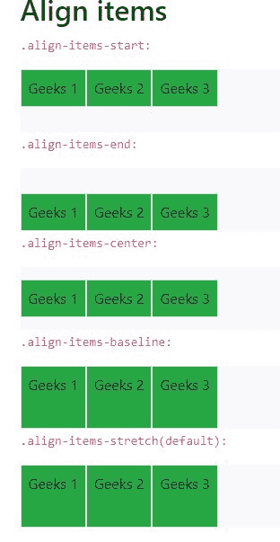

**自对准**

*align-self* 类可用于更改横轴上的对齐。
*align-self* 可以通过多种方式来实现。

*   。对齐-自启动

*   。对齐-自结束

*   。对齐-自动居中
*   。对齐-自动环绕
*   。对齐-自拉伸
*   。校准-自校准-开始
*   sm、md、lg、xl 也是如此
*   **语法:**

```html
<div class="p-2 align-self-center"></div>
```

**例 12:**

## 超文本标记语言

```html
<!DOCTYPE html>
<html lang="en">

<head>
    <meta charset="utf-8">
    <meta name="viewport" self="width=device-width, initial-scale=1, shrink-to-fit=no">
    <link rel="stylesheet" href="https://stackpath.bootstrapcdn.com/bootstrap/4.2.1/css/bootstrap.min.css">
    <title>GeeksForGeeks Bootstrap Example</title>
</head>

<body>
    <div class="container mt-3">
        <h2>Align self</h2>

<p><code>.align-self-start:</code></p>

        <div class="d-flex bg-light" style="height:80px">
            <div class="p-2 border bg-success">Geeks 1</div>
            <div class="p-2 border align-self-start bg-success">Geeks 2</div>
            <div class="p-2 border bg-success">Geeks 3</div>
        </div>

<p><code>.align-self-end:</code></p>

        <div class="d-flex bg-light" style="height:80px">
            <div class="p-2 border bg-success">Geeks 1</div>
            <div class="p-2 border align-self-end bg-success">Geeks 2</div>
            <div class="p-2 border bg-success">Geeks 3</div>
        </div>

<p><code>.align-self-center:</code></p>

        <div class="d-flex bg-light" style="height:80px">
            <div class="p-2 border bg-success">Geeks 1</div>
            <div class="p-2 border align-self-center bg-success">Geeks 2</div>
            <div class="p-2 border bg-success">Geeks 3</div>
        </div>

<p><code>.align-self-baseline:</code></p>

        <div class="d-flex bg-light" style="height:80px">
            <div class="p-2 border bg-success">Geeks 1</div>
            <div class="p-2 border align-self-baseline bg-success">Geeks 2</div>
            <div class="p-2 border bg-success">Geeks 3</div>
        </div>

<p><code>.align-self-stretch(default):</code></p>

        <div class="d-flex bg-light" style="height:80px">
            <div class="p-2 border bg-success">Geeks 1</div>
            <div class="p-2 border align-self-stretch bg-success">Geeks 2</div>
            <div class="p-2 border bg-success">Geeks 3</div>
        </div>
        <br>
    </div>
    <script src="https://code.jquery.com/jquery-3.3.1.slim.min.js"></script>
    <script src="https://cdnjs.cloudflare.com/ajax/libs/popper.js/1.14.6/umd/popper.min.js"></script>
    <script src="https://stackpath.bootstrapcdn.com/bootstrap/4.2.1/js/bootstrap.min.js"></script>
</body>

</html>
```

**输出:**

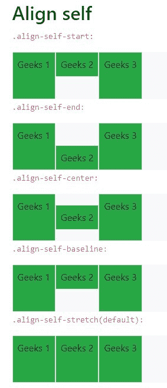

**可用空间的增长和收缩**

*。flex-grow-** 用于增长 flex 项以填充可用空间。
*。伸缩-收缩-** 用于收缩伸缩项。
*伸缩*可以简化如下。

*   。flex-{增长|收缩}-0
*   。flex-{增长|收缩}-1
*   sm、md、lg、xl 也是如此
*   **语法:**

```html
<div class="p-2 flex grow-1"></div>
```

**例 13:**

## 超文本标记语言

```html
<!DOCTYPE html>
<html lang="en">

<head>
    <meta charset="utf-8">
    <meta name="viewport" self="width=device-width, initial-scale=1, shrink-to-fit=no">
    <link rel="stylesheet" href="https://stackpath.bootstrapcdn.com/bootstrap/4.2.1/css/bootstrap.min.css">
    <title>GeeksForGeeks Bootstrap Example</title>
</head>

<body>
    <div class="container mt-3">
        <h2>Grow</h2>

<p>Use <code>.flex-grow-1</code> on a Geeks to take up the rest of the space:</p>

        <div class="d-flex mb-3">
            <div class="p-2 bg-success">Geeks 1</div>
            <div class="p-2 bg-success">Geeks 2</div>
            <div class="p-2 flex-grow-1 bg-success">Geeks 3</div>
        </div>

<p>Example without <code>.flex-grow-1</code>:</p>

        <div class="d-flex mb-3">
            <div class="p-2 bg-success">Geeks 1</div>
            <div class="p-2 bg-success">Geeks 2</div>
            <div class="p-2 bg-success">Geeks 3</div>

        </div>
        <script src="https://code.jquery.com/jquery-3.3.1.slim.min.js"></script>
        <script src="https://cdnjs.cloudflare.com/ajax/libs/popper.js/1.14.6/umd/popper.min.js"></script>
        <script src="https://stackpath.bootstrapcdn.com/bootstrap/4.2.1/js/bootstrap.min.js"></script>
</body>

</html>
```

**输出:**

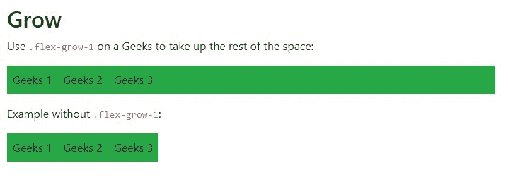

**支持的浏览器:**

*   谷歌 Chrome
*   微软公司出品的 web 浏览器
*   火狐浏览器
*   歌剧
*   旅行队